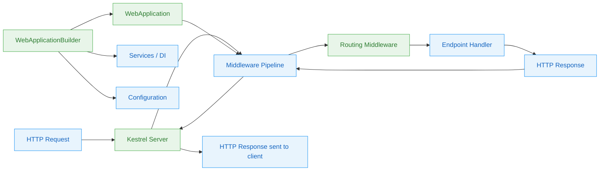

# Level 1: Foundations — ASP.NET Core

> 🎯 **Target profile:** Developers new to ASP.NET Core or coming from another web framework
> ⏱️ **Estimated effort:** 12-15 hours
> 📋 **Prerequisites:** Basic C# knowledge (variables, classes, async/await syntax), basic HTTP understanding (what is a URL, what is a browser request)
> 🌐 [Versión en español](../es/01-foundations-aspnet-core.md)

---

## Learning Objectives

After completing this module, you will be able to:

1. **Explain** the role of the web server (Kestrel), the middleware pipeline, and the routing system in handling an HTTP request
2. **Create** a new ASP.NET Core application using `dotnet new web` and identify the purpose of each line in `Program.cs`
3. **Describe** how middleware components form a pipeline and how a request flows through it
4. **Map** a URL to a handler using both minimal API endpoints and basic routing
5. **Register** and resolve services using dependency injection in `Program.cs`
6. **Configure** application settings using `appsettings.json` and environment variables
7. **Run** and debug a basic ASP.NET Core application using `dotnet run` and `dotnet watch`

---

## Concept Map



**How to read this diagram:** Blue nodes are concepts you'll learn. Green nodes link to real source files in this repository that implement those concepts. Follow the arrows to trace how an HTTP request travels through the system.

---

## Curriculum

### Lesson 1.1: HTTP — The Language of the Web

**Concept:** Every web application, regardless of the framework, does exactly one thing: it receives an HTTP request and produces an HTTP response. Before we write any ASP.NET Core code, let's make sure we understand what HTTP actually looks like.

An HTTP request has four parts:
- **Method** — what you want to do (`GET`, `POST`, `PUT`, `DELETE`)
- **Path** — which resource you want (`/products`, `/users/42`)
- **Headers** — metadata (content type, authorization, cookies)
- **Body** — data you're sending (for `POST`/`PUT` requests)

An HTTP response has three parts:
- **Status code** — what happened (`200 OK`, `404 Not Found`, `500 Internal Server Error`)
- **Headers** — metadata about the response (content type, caching)
- **Body** — the data being returned (HTML, JSON, etc.)

**📖 Source code connection:**

Open [`src/Http/Http.Abstractions/src/HttpRequest.cs`](../../src/Http/Http.Abstractions/src/HttpRequest.cs) and look at the abstract properties. You'll see ASP.NET Core models a request with exactly the parts we just described:

```csharp
// From src/Http/Http.Abstractions/src/HttpRequest.cs
public abstract class HttpRequest
{
    public abstract string Method { get; set; }
    public abstract PathString Path { get; set; }
    public abstract IHeaderDictionary Headers { get; }
    public abstract Stream Body { get; set; }
    // ... and more like QueryString, ContentType, Cookies
}
```

Every time your code runs inside ASP.NET Core, it's working with an `HttpRequest` object that has these properties populated from the raw bytes that arrived over the network.

Similarly, open [`src/Http/Http.Abstractions/src/HttpResponse.cs`](../../src/Http/Http.Abstractions/src/HttpResponse.cs):

```csharp
// From src/Http/Http.Abstractions/src/HttpResponse.cs
public abstract class HttpResponse
{
    public abstract int StatusCode { get; set; }
    public abstract IHeaderDictionary Headers { get; }
    public abstract Stream Body { get; set; }
}
```

Your job as a developer is to read from the request and write to the response.

**🛠️ Exercise: Inspect real HTTP traffic**

1. Open a terminal and run:
   ```bash
   curl -v https://httpbin.org/get
   ```
2. Look at the lines starting with `>` (what you sent) and `<` (what you received).
3. Identify the method, path, headers, status code, and response body.
4. Try with different options:
   ```bash
   curl -v -X POST https://httpbin.org/post -H "Content-Type: application/json" -d '{"name":"learner"}'
   ```

Alternatively, open your browser's Developer Tools (F12), go to the **Network** tab, visit any website, and click on a request to see the same information.

**💡 Key takeaway:** Every web framework is ultimately about receiving HTTP requests and producing HTTP responses. ASP.NET Core just gives you a structured, powerful way to do that.

---

### Lesson 1.2: Your First ASP.NET Core Application

**Concept:** Let's create an ASP.NET Core application and understand every single line. The `dotnet new web` template generates the smallest possible web application — just a few lines of C# in `Program.cs`.

**What `dotnet new web` creates:**

```csharp
// Program.cs — the entire application
var builder = WebApplication.CreateBuilder(args);  // 1. Create the builder
var app = builder.Build();                          // 2. Build the app

app.MapGet("/", () => "Hello World!");              // 3. Define an endpoint

app.Run();                                          // 4. Start listening
```

Let's break down what each line does:

| Line | What it does | Why |
|------|-------------|-----|
| `WebApplication.CreateBuilder(args)` | Creates a builder with default configuration, logging, DI container | Sets up all the "plumbing" your app needs |
| `builder.Build()` | Finalizes configuration and creates the `WebApplication` | Locks in your service registrations and configuration |
| `app.MapGet("/", ...)` | Registers a handler for `GET /` requests | Tells the routing system what code to run for this URL |
| `app.Run()` | Starts the Kestrel web server and begins listening | Your app is now accepting HTTP requests |

**📖 Source code connection:**

Open [`src/DefaultBuilder/src/WebApplicationBuilder.cs`](../../src/DefaultBuilder/src/WebApplicationBuilder.cs) — this is the class that `WebApplication.CreateBuilder()` returns. Look at its constructor to see all the things it sets up for you: configuration, logging, dependency injection, and more. You don't have to configure any of this yourself for a basic app, but it's all there when you need it.

Open [`src/DefaultBuilder/src/WebApplication.cs`](../../src/DefaultBuilder/src/WebApplication.cs) — this is what `builder.Build()` returns. Notice it implements several interfaces:

```csharp
// From src/DefaultBuilder/src/WebApplication.cs
public sealed class WebApplication : IHost, IApplicationBuilder, IEndpointRouteBuilder, IAsyncDisposable
```

This is why you can call `app.MapGet()` (from `IEndpointRouteBuilder`), `app.Use()` (from `IApplicationBuilder`), and `app.Run()` (from `IHost`) all on the same object. The `WebApplication` class ties together the entire framework.

**🛠️ Exercise: Create and modify your first app**

1. Create a new project:
   ```bash
   dotnet new web -o MyFirstApp
   cd MyFirstApp
   ```
2. Run it:
   ```bash
   dotnet run
   ```
3. Visit `http://localhost:5000` in your browser (check the console output for the exact port).
4. Now modify `Program.cs` to return JSON:
   ```csharp
   var builder = WebApplication.CreateBuilder(args);
   var app = builder.Build();

   app.MapGet("/", () => new { Message = "Hello World!", Timestamp = DateTime.UtcNow });

   app.Run();
   ```
5. Run again and notice the browser now shows JSON with the correct `Content-Type: application/json` header. ASP.NET Core automatically serialized your anonymous object.

**💡 Key takeaway:** `Program.cs` is where you configure services (what your app needs) and middleware (how requests are processed). It's the single entry point that ties everything together.

**⚠️ Common misconception:** *"Program.cs replaced Startup.cs"* — Actually, the builder pattern in .NET 6+ merged the two concepts. The old `Startup.cs` had `ConfigureServices()` and `Configure()` as separate methods. Now, `builder.Services` is where you register services (the old `ConfigureServices`), and the code after `builder.Build()` is where you set up middleware (the old `Configure`). It's the same two phases, just in one file.

---

### Lesson 1.3: The Middleware Pipeline

**Concept:** Middleware is the heart of ASP.NET Core's request processing. Every HTTP request passes through a pipeline of middleware components. Each middleware can:

1. Do something with the request (log it, check authentication, etc.)
2. Call the **next** middleware in the pipeline
3. Do something with the response on the way back

Think of it like Russian nesting dolls — each middleware wraps around the next one:

```
Request  →  [Logging]  →  [Auth]  →  [Routing]  →  [Endpoint]
Response ←  [Logging]  ←  [Auth]  ←  [Routing]  ←  [Endpoint]
```

The fundamental type behind all middleware is `RequestDelegate`:

```csharp
// A function that takes an HttpContext and returns a Task
public delegate Task RequestDelegate(HttpContext context);
```

Every middleware is essentially: *"Given an HTTP context and the next delegate to call, do your work."*

**📖 Source code connection:**

Open [`src/Http/Http.Abstractions/src/IApplicationBuilder.cs`](../../src/Http/Http.Abstractions/src/IApplicationBuilder.cs) and look at the `Use` method:

```csharp
// From src/Http/Http.Abstractions/src/IApplicationBuilder.cs
public interface IApplicationBuilder
{
    IApplicationBuilder Use(Func<RequestDelegate, RequestDelegate> middleware);
    RequestDelegate Build();
    // ...
}
```

The `Use` method takes a function that receives the *next* middleware (`RequestDelegate`) and returns a *new* middleware (`RequestDelegate`) that wraps around it. The `Build()` method chains them all together into a single `RequestDelegate` — the compiled pipeline.

For simpler inline middleware, look at [`src/Http/Http.Abstractions/src/Extensions/UseExtensions.cs`](../../src/Http/Http.Abstractions/src/Extensions/UseExtensions.cs), which provides the friendlier `app.Use(async (context, next) => { ... })` syntax.

For class-based middleware, see [`src/Http/Http.Abstractions/src/Extensions/UseMiddlewareExtensions.cs`](../../src/Http/Http.Abstractions/src/Extensions/UseMiddlewareExtensions.cs), which uses reflection to wire up middleware classes with the conventional `InvokeAsync(HttpContext)` pattern.

**🛠️ Exercise: See the pipeline in action**

Create a new app and add three inline middleware components to prove the ordering:

```csharp
var builder = WebApplication.CreateBuilder(args);
var app = builder.Build();

app.Use(async (context, next) =>
{
    Console.WriteLine("Before 1");
    await next(context);
    Console.WriteLine("After 1");
});

app.Use(async (context, next) =>
{
    Console.WriteLine("Before 2");
    await next(context);
    Console.WriteLine("After 2");
});

app.Use(async (context, next) =>
{
    Console.WriteLine("Before 3");
    await next(context);
    Console.WriteLine("After 3");
});

app.MapGet("/", () => "Hello from the endpoint!");

app.Run();
```

Run the app and make a request. Check the console output:

```
Before 1
Before 2
Before 3
After 3
After 2
After 1
```

Notice how the "Before" messages go in order (1, 2, 3) but the "After" messages go in reverse (3, 2, 1). This is the nesting in action — each middleware wraps the next one.

**💡 Key takeaway:** Middleware executes in the order it's registered. Each piece can modify the request, call the next middleware, and then modify the response on the way back. The order you add middleware matters enormously.

---

### Lesson 1.4: Routing — Mapping URLs to Code

**Concept:** Routing is the process of matching an incoming HTTP request's URL and method to a specific piece of code (called an **endpoint**) that should handle it. In ASP.NET Core, routing is implemented as middleware — it sits in the pipeline like everything else.

Route templates let you define patterns with parameters:

| Template | Matches | Parameters |
|----------|---------|------------|
| `/products` | `GET /products` | None |
| `/products/{id}` | `GET /products/42` | `id = "42"` |
| `/products/{id:int}` | `GET /products/42` but not `/products/abc` | `id = 42` |
| `/files/{**path}` | `GET /files/docs/readme.md` | `path = "docs/readme.md"` |

Minimal APIs (`MapGet`, `MapPost`, etc.) are the simplest way to define endpoints:

```csharp
app.MapGet("/products/{id}", (int id) => $"Product {id}");
```

ASP.NET Core automatically parses the `{id}` from the URL and passes it as the `int id` parameter.

**📖 Source code connection:**

Open [`src/Http/Routing/src/EndpointRoutingMiddleware.cs`](../../src/Http/Routing/src/EndpointRoutingMiddleware.cs) — this is the middleware that examines each incoming request URL and selects the best matching endpoint. It runs early in the pipeline so that later middleware (like authorization) knows which endpoint was selected.

Open [`src/Http/Routing/src/Builder/EndpointRouteBuilderExtensions.cs`](../../src/Http/Routing/src/Builder/EndpointRouteBuilderExtensions.cs) — this is where `MapGet()`, `MapPost()`, `MapPut()`, `MapDelete()`, and `Map()` are defined. These extension methods create endpoint registrations that the routing middleware uses to match requests.

**🛠️ Exercise: Build a mini REST API**

Create an app with five endpoints for a products resource:

```csharp
var builder = WebApplication.CreateBuilder(args);
var app = builder.Build();

var products = new List<string> { "Laptop", "Phone", "Tablet" };

// GET /products — list all products
app.MapGet("/products", () => products);

// GET /products/{id} — get one product
app.MapGet("/products/{id:int}", (int id) =>
    id >= 0 && id < products.Count
        ? Results.Ok(products[id])
        : Results.NotFound(new { error = $"Product {id} not found" }));

// POST /products — add a product
app.MapPost("/products", (string name) =>
{
    products.Add(name);
    return Results.Created($"/products/{products.Count - 1}", name);
});

// PUT /products/{id} — update a product
app.MapPut("/products/{id:int}", (int id, string name) =>
{
    if (id < 0 || id >= products.Count)
        return Results.NotFound();
    products[id] = name;
    return Results.Ok(products[id]);
});

// DELETE /products/{id} — delete a product
app.MapDelete("/products/{id:int}", (int id) =>
{
    if (id < 0 || id >= products.Count)
        return Results.NotFound();
    products.RemoveAt(id);
    return Results.NoContent();
});

app.Run();
```

Test with curl:

```bash
curl http://localhost:5000/products
curl http://localhost:5000/products/0
curl -X POST http://localhost:5000/products -H "Content-Type: application/json" -d '"Monitor"'
```

**💡 Key takeaway:** Routing is just middleware that examines the URL and selects which handler to execute. The `MapGet`/`MapPost` methods are convenient shortcuts for registering endpoints with specific HTTP method and route template combinations.

---

### Lesson 1.5: Dependency Injection — Services On Demand

**Concept:** Dependency Injection (DI) is a pattern where your code **asks for the things it needs** instead of creating them itself. Instead of writing `new EmailService()` inside your handler, you declare that you *need* an `IEmailService`, and the framework provides one.

Why does this matter?
- **Testability** — You can swap a real email service for a fake one in tests.
- **Flexibility** — You can change implementations without modifying consumers.
- **Lifetime management** — The framework controls when objects are created and disposed.

ASP.NET Core has DI built into its core. You register services with `builder.Services`, and the framework injects them wherever needed.

The three service lifetimes:

| Lifetime | Created | Shared | Use when |
|----------|---------|--------|----------|
| **Singleton** | Once | Across all requests | Stateless services, caches |
| **Scoped** | Once per request | Within a single request | Database contexts, per-request state |
| **Transient** | Every time requested | Never | Lightweight, stateless services |

**📖 Source code connection:**

Open [`src/DefaultBuilder/src/WebApplicationBuilder.cs`](../../src/DefaultBuilder/src/WebApplicationBuilder.cs) and look at the `Services` property. This is the `IServiceCollection` where all service registrations go. When you write `builder.Services.AddSingleton<IMyService, MyService>()`, you're adding an entry to this collection that tells the DI container: *"Whenever someone asks for `IMyService`, give them a `MyService` instance."*

The `WebApplicationBuilder` itself uses DI extensively — logging, configuration, routing, and all the built-in services are registered through the same mechanism you use for your own services.

**🛠️ Exercise: Wire up your first service**

```csharp
var builder = WebApplication.CreateBuilder(args);

// 1. Define an interface and implementation
// (In a real app, these would be in separate files)

builder.Services.AddSingleton<IGreetingService, GreetingService>();

var app = builder.Build();

// 3. Inject the service into an endpoint
app.MapGet("/greet/{name}", (string name, IGreetingService greeter) =>
    greeter.Greet(name));

app.Run();

// Service definitions (put these at the bottom of Program.cs for this exercise)
public interface IGreetingService
{
    string Greet(string name);
}

public class GreetingService : IGreetingService
{
    public string Greet(string name) => $"Hello, {name}! Welcome to ASP.NET Core.";
}
```

Notice that the endpoint handler declares `IGreetingService greeter` as a parameter. ASP.NET Core's DI container sees this, looks up the registration, and provides an instance automatically. You never write `new GreetingService()`.

**💡 Key takeaway:** DI lets your code depend on abstractions (interfaces) rather than concrete implementations, making it easier to test and modify.

**⚠️ Common misconception:** *"DI is just for testing"* — Actually, DI is the backbone of ASP.NET Core. The framework itself uses DI to provide logging, configuration, routing, and virtually every other service. Even in the simplest app, `ILogger`, `IConfiguration`, and `IWebHostEnvironment` are all available through DI. You're already using DI — you just might not realize it.

---

### Lesson 1.6: Configuration and Environments

**Concept:** Real applications need settings — database connection strings, API keys, feature flags. ASP.NET Core's configuration system is **layered**: you can define settings in multiple sources, and later sources override earlier ones.

The default configuration sources (in order of precedence, lowest to highest):

1. `appsettings.json` — base settings
2. `appsettings.{Environment}.json` — environment-specific overrides (e.g., `appsettings.Development.json`)
3. Environment variables
4. Command-line arguments

This means you can put default values in `appsettings.json`, override them for development in `appsettings.Development.json`, and override again with environment variables in production — without changing any code.

The `ASPNETCORE_ENVIRONMENT` variable controls which environment your app runs in. Common values:
- `Development` — detailed errors, hot reload, developer tools
- `Staging` — production-like but for testing
- `Production` — optimized, minimal error details (the default)

**📖 Source code connection:**

Open [`src/DefaultBuilder/src/WebApplicationBuilder.cs`](../../src/DefaultBuilder/src/WebApplicationBuilder.cs) and look at how it sets up configuration sources. The builder adds `appsettings.json`, `appsettings.{Environment}.json`, environment variables, and command-line args in a specific order. This is the layered system in action — each source can override values from previous sources.

The `Configuration` property on `WebApplicationBuilder` gives you access to all configured values through the `IConfiguration` interface.

**🛠️ Exercise: Configuration layering in action**

1. Create `appsettings.json`:
   ```json
   {
     "AppSettings": {
       "Greeting": "Hello from appsettings.json",
       "MaxItems": 100
     }
   }
   ```

2. Create `appsettings.Development.json`:
   ```json
   {
     "AppSettings": {
       "Greeting": "Hello from Development!"
     }
   }
   ```

3. Read the configuration in `Program.cs`:
   ```csharp
   var builder = WebApplication.CreateBuilder(args);
   var app = builder.Build();

   app.MapGet("/config", (IConfiguration config) => new
   {
       Greeting = config["AppSettings:Greeting"],
       MaxItems = config["AppSettings:MaxItems"],
       Environment = app.Environment.EnvironmentName
   });

   app.Run();
   ```

4. Run the app (default environment is `Development`):
   ```bash
   dotnet run
   ```
   Visit `/config` — you'll see `"Hello from Development!"` (overridden) and `MaxItems: 100` (from base).

5. Now override with an environment variable:
   ```bash
   # Windows PowerShell
   $env:AppSettings__Greeting = "Hello from env var!"
   dotnet run
   ```
   Visit `/config` again — the environment variable wins.

   > **Note:** Environment variables use `__` (double underscore) as a section separator instead of `:`.

**💡 Key takeaway:** Configuration in ASP.NET Core is layered — later sources override earlier ones, and environment variables always win. This lets you keep secrets out of source code and customize behavior per environment without code changes.

---

## Source Code Reading Guide

Read these files in order to build a mental model of how ASP.NET Core works. Start with the simplest abstractions and work your way up to the implementations.

| Order | File | What to focus on | Difficulty |
|-------|------|-------------------|------------|
| 1 | [`src/Http/Http.Abstractions/src/HttpContext.cs`](../../src/Http/Http.Abstractions/src/HttpContext.cs) | Properties that model an HTTP exchange — `Request`, `Response`, `Connection`, `User` | ⭐ |
| 2 | [`src/Http/Http.Abstractions/src/HttpRequest.cs`](../../src/Http/Http.Abstractions/src/HttpRequest.cs) | How an incoming request is represented — `Method`, `Path`, `Headers`, `Body` | ⭐ |
| 3 | [`src/Http/Http.Abstractions/src/HttpResponse.cs`](../../src/Http/Http.Abstractions/src/HttpResponse.cs) | How an outgoing response is represented — `StatusCode`, `Headers`, `Body` | ⭐ |
| 4 | [`src/DefaultBuilder/src/WebApplication.cs`](../../src/DefaultBuilder/src/WebApplication.cs) | How `Run()`, `MapGet()` etc. work — notice it implements `IHost`, `IApplicationBuilder`, and `IEndpointRouteBuilder` | ⭐⭐ |
| 5 | [`src/DefaultBuilder/src/WebApplicationBuilder.cs`](../../src/DefaultBuilder/src/WebApplicationBuilder.cs) | How the builder configures services, configuration, logging — the `CreateBuilder()` entry point | ⭐⭐ |
| 6 | [`src/Http/Http.Abstractions/src/IApplicationBuilder.cs`](../../src/Http/Http.Abstractions/src/IApplicationBuilder.cs) | The `Use()` method that adds middleware to the pipeline | ⭐⭐ |
| 7 | [`src/Http/Routing/src/Builder/EndpointRouteBuilderExtensions.cs`](../../src/Http/Routing/src/Builder/EndpointRouteBuilderExtensions.cs) | Where `MapGet()`, `MapPost()`, etc. are defined | ⭐⭐ |

**Reading tips:**
- Don't try to understand every line. Focus on the *public surface* — the properties, methods, and interfaces.
- Use your IDE's "Go to Definition" (F12) to jump from the abstract classes to their implementations when you're curious.
- Star ratings: ⭐ = read the property/method names and doc comments. ⭐⭐ = read some implementation details.

---

## Diagnostic Tools and Commands

These are the tools you'll use daily when developing ASP.NET Core applications:

| Command / Tool | What it does | When to use |
|----------------|-------------|-------------|
| `dotnet new web` | Scaffolds a minimal ASP.NET Core project | Starting a new project |
| `dotnet run` | Builds and runs the application | Testing your changes after editing code |
| `dotnet watch` | Runs with hot reload — restarts on file changes | Iterative development (edit → save → see results) |
| `dotnet build` | Compiles without running | Checking for compilation errors |
| Browser Developer Tools (F12) | Request/response details, headers, timing, network tab | Understanding HTTP exchanges, debugging responses |
| `curl -v http://localhost:5000/` | Raw HTTP request/response in the terminal | Seeing exactly what headers/status the server sends |

**Pro tip:** During development, use `dotnet watch` instead of `dotnet run`. It watches for file changes and automatically rebuilds and restarts your app:

```bash
dotnet watch --project MyFirstApp
```

---

## Self-Assessment

Test your understanding of the foundations. Try to answer each question before expanding the answer.

### Knowledge Checks

<details>
<summary>1. What are the four parts of an HTTP request?</summary>

**Method**, **path**, **headers**, and **body**. You can see these modeled as properties in [`src/Http/Http.Abstractions/src/HttpRequest.cs`](../../src/Http/Http.Abstractions/src/HttpRequest.cs): `Method`, `Path`, `Headers`, and `Body`.

</details>

<details>
<summary>2. What is the difference between <code>builder.Services</code> and the code after <code>builder.Build()</code>?</summary>

`builder.Services` is where you **register services** with the dependency injection container (the old `ConfigureServices`). The code after `builder.Build()` is where you **configure the middleware pipeline** — the order in which request processing happens (the old `Configure`). You can see the `Services` property in [`src/DefaultBuilder/src/WebApplicationBuilder.cs`](../../src/DefaultBuilder/src/WebApplicationBuilder.cs).

</details>

<details>
<summary>3. If you add three middleware components A, B, and C (in that order), what is the execution order for a request?</summary>

**Request:** A → B → C → Endpoint
**Response:** Endpoint → C → B → A

Each middleware calls `next()` to pass control forward, and code after `await next()` runs on the way back. This is the "Russian nesting doll" pattern. The `Use()` method in [`src/Http/Http.Abstractions/src/IApplicationBuilder.cs`](../../src/Http/Http.Abstractions/src/IApplicationBuilder.cs) is what chains them together.

</details>

<details>
<summary>4. What does the route template <code>/products/{id:int}</code> mean?</summary>

It matches URLs like `/products/42` where `{id}` is an integer route parameter. The `:int` is a **route constraint** that rejects non-integer values (e.g., `/products/abc` would return 404). Route matching is performed by [`EndpointRoutingMiddleware`](../../src/Http/Routing/src/EndpointRoutingMiddleware.cs).

</details>

<details>
<summary>5. What is the difference between Singleton, Scoped, and Transient service lifetimes?</summary>

- **Singleton** — one instance for the entire application lifetime (shared across all requests)
- **Scoped** — one instance per HTTP request (shared within that request, disposed at the end)
- **Transient** — a new instance every time it's requested from the container

A common mistake is registering a Scoped service but injecting it into a Singleton — the Scoped service effectively becomes a Singleton, which can cause bugs with shared state. ASP.NET Core validates this in Development and throws an `InvalidOperationException`.

</details>

<details>
<summary>6. Why do environment variables use <code>__</code> (double underscore) instead of <code>:</code> for section separators?</summary>

Because the colon `:` is not a valid character in environment variable names on some operating systems (notably Linux). The double underscore `__` is a cross-platform convention that ASP.NET Core's configuration system automatically converts to `:` when reading values. So `AppSettings__Greeting` maps to `AppSettings:Greeting` in configuration.

</details>

### Practical Challenge (30-60 minutes)

**Build a "Quote of the Day" API**

Create an ASP.NET Core minimal API application that:

1. Has a `QuoteService` registered with DI that returns random quotes from a hardcoded list
2. Has a `/quote` endpoint that returns a random quote as JSON
3. Has a `/quotes` endpoint that returns all quotes
4. Has a `/quote/{id}` endpoint that returns a specific quote by index
5. Reads the application name from `appsettings.json` and includes it in every response
6. Has a custom middleware that logs the request method and path to the console for every request

**Success criteria:**
- `curl http://localhost:5000/quote` returns a random quote as JSON
- `curl http://localhost:5000/quotes` returns all quotes
- `curl http://localhost:5000/quote/0` returns the first quote
- Every request prints a log line to the console

---

## Connections

| Direction | Link |
|-----------|------|
| ⬆️ **Next** | **Level 2: Practitioner** — Building real applications with controllers, authentication/authorization, Entity Framework Core, and API design patterns |
| ↔️ **Related** | Level 1 modules in the dotnet/runtime learning path for C# and .NET fundamentals (async/await, LINQ, collections) |

---

## Glossary

| Term (EN) | Término (ES) | Definition |
|-----------|--------------|------------|
| **Middleware** | Middleware | A component in the request pipeline that processes HTTP requests and responses. Each middleware can inspect, modify, or short-circuit the request before passing it to the next component. |
| **Pipeline** | Canalización | The ordered sequence of middleware components that every HTTP request passes through. Defined by the order of `app.Use()` / `app.Map*()` calls in `Program.cs`. |
| **Routing** | Enrutamiento | The process of matching an incoming request's URL and HTTP method to a specific endpoint handler. Implemented by `EndpointRoutingMiddleware`. |
| **Endpoint** | Punto de conexión | A unit of request-handling logic associated with a URL pattern and HTTP method. Created by `MapGet()`, `MapPost()`, etc. |
| **Dependency Injection (DI)** | Inyección de dependencias | A design pattern where objects receive their dependencies from an external source (the DI container) rather than creating them internally. Central to ASP.NET Core's architecture. |
| **Service Lifetime** | Tiempo de vida del servicio | Controls how long a DI-registered service instance lives: Singleton (app lifetime), Scoped (per request), or Transient (per resolution). |
| **Kestrel** | Kestrel | The cross-platform HTTP server built into ASP.NET Core. It's what listens for network connections and converts raw bytes into `HttpContext` objects. |
| **HttpContext** | HttpContext | The object that encapsulates all information about an individual HTTP request and its response. Passed through the middleware pipeline. See `src/Http/Http.Abstractions/src/HttpContext.cs`. |
| **RequestDelegate** | RequestDelegate | A function signature (`Func<HttpContext, Task>`) that represents a middleware component or the compiled middleware pipeline. |
| **WebApplicationBuilder** | WebApplicationBuilder | The builder object that configures services, configuration sources, and logging before creating the `WebApplication`. See `src/DefaultBuilder/src/WebApplicationBuilder.cs`. |

---

## References

| Resource | Type | Why it's useful |
|----------|------|-----------------|
| [ASP.NET Core Fundamentals](https://learn.microsoft.com/aspnet/core/fundamentals/) | Documentation | Official overview of middleware, routing, DI, configuration, and hosting |
| [Tutorial: Create a minimal API](https://learn.microsoft.com/aspnet/core/tutorials/min-web-api) | Tutorial | Step-by-step guide to building a minimal API with ASP.NET Core |
| [ASP.NET Core Middleware](https://learn.microsoft.com/aspnet/core/fundamentals/middleware/) | Documentation | Deep dive into how the middleware pipeline works |
| [Dependency Injection in ASP.NET Core](https://learn.microsoft.com/aspnet/core/fundamentals/dependency-injection) | Documentation | Complete guide to the built-in DI container |
| [Configuration in ASP.NET Core](https://learn.microsoft.com/aspnet/core/fundamentals/configuration/) | Documentation | How configuration sources, providers, and the options pattern work |
| [David Fowler's Minimal API samples](https://github.com/davidfowl/CommunityStandUpMinimalAPI) | Code samples | Practical examples from one of ASP.NET Core's architects |
| [dotnet/aspnetcore repository](https://github.com/dotnet/aspnetcore) | Source code | The source code you've been reading throughout this module |
