# Level 2: Practitioner — ASP.NET Core

> 🎯 **Target profile:** Developers who build ASP.NET Core apps daily but want to go beyond tutorials
> ⏱️ **Estimated effort:** 15–18 hours
> 📋 **Prerequisites:** Level 1 Foundations, comfortable with C# async/await, basic understanding of HTTP
> 🌐 [Versión en español](../es/02-practitioner-aspnet-core.md)

---

## Learning Objectives

After completing this module, you will be able to:

1. **Compare Controllers vs Minimal APIs** and choose the right model for a given scenario based on trade-offs, not opinion.
2. **Implement model binding** from query strings, route values, headers, and request body, and apply validation attributes to reject bad input automatically.
3. **Write a custom middleware class** that handles cross-cutting concerns (timing, custom headers, request logging) using the `InvokeAsync` pattern.
4. **Configure JWT Bearer authentication** and policy-based authorization for API endpoints.
5. **Implement proper error handling** using exception middleware, `ProblemDetails`, and status code pages.
6. **Integrate Entity Framework Core** with proper service lifetime management (Scoped `DbContext`).
7. **Write unit tests** for controllers and middleware using dependency injection and mocking.
8. **Use logging effectively** with structured logging, log levels, and log scopes for production diagnostics.

---

## Concept Map

```mermaid
graph LR
    WAB["WebApplicationBuilder<br/>(configure services)"]
    SVC["Services / DI Container"]
    MW["Middleware Pipeline"]
    AUTH["AuthN Middleware"]
    ROUT["Routing Middleware"]
    AUTHZ["AuthZ Middleware"]
    EP["Endpoint Execution"]
    CTRL["Controller / Minimal API"]
    MB["Model Binding"]
    FILT["Action Filters"]
    RESP["HTTP Response"]

    WAB -->|registers| SVC
    WAB -->|builds| MW
    MW --> AUTH
    AUTH --> ROUT
    ROUT --> AUTHZ
    AUTHZ --> EP
    EP --> CTRL
    CTRL --> MB
    MB --> FILT
    FILT --> RESP

    classDef concept fill:#e0f0ff,stroke:#1a73e8,color:#000
    classDef source fill:#fff3e0,stroke:#e65100,color:#000
    classDef tool fill:#e8f5e9,stroke:#2e7d32,color:#000

    class WAB,SVC,MW source
    class AUTH,ROUT,AUTHZ,EP,CTRL,MB,FILT concept
    class RESP tool
```



**Reading the map:** A request enters the middleware pipeline and flows through Authentication, Routing, and Authorization before reaching the selected endpoint. Whether that endpoint is a controller action or a minimal API handler, the same routing system dispatches it. Model binding and filters wrap the execution.

---

## Curriculum

### Lesson 2.1: Controllers vs Minimal APIs — Two Roads to the Same Destination

**Concept:** In Level 1 you learned that every request passes through a middleware pipeline and hits an endpoint. ASP.NET Core offers two programming models for defining those endpoints: **MVC controllers** (convention-based, feature-rich) and **minimal APIs** (explicit, lightweight). Understanding how both register into the same routing system lets you pick the right tool instead of following cargo-cult advice.

#### 📂 Source Code Connection

| File | What to look for |
|---|---|
| [`src/Mvc/Mvc.Core/src/Infrastructure/ControllerActionInvoker.cs`](../../src/Mvc/Mvc.Core/src/Infrastructure/ControllerActionInvoker.cs) | How a controller action gets invoked — follow the `InvokeAsync` chain to see model binding, filters, and action execution |
| [`src/Http/Routing/src/Builder/EndpointRouteBuilderExtensions.cs`](../../src/Http/Routing/src/Builder/EndpointRouteBuilderExtensions.cs) | How `MapGet`, `MapPost`, etc. register `RouteEndpoint` objects into the routing table — the same table controllers use |
| [`src/Mvc/Mvc.Core/src/Infrastructure/ResourceInvoker.cs`](../../src/Mvc/Mvc.Core/src/Infrastructure/ResourceInvoker.cs) | The base invoker that `ControllerActionInvoker` extends — contains the filter pipeline (authorization, resource, action, result filters) |

#### 🛠️ Exercise: Build the Same API Twice

Build a simple Products CRUD API **twice** — once with controllers, once with minimal APIs:

**Controller version:**

```csharp
[ApiController]
[Route("api/[controller]")]
public class ProductsController : ControllerBase
{
    private static readonly List<Product> _products = [];

    [HttpGet]
    public IActionResult GetAll() => Ok(_products);

    [HttpGet("{id:int}")]
    public IActionResult GetById(int id)
    {
        var product = _products.FirstOrDefault(p => p.Id == id);
        return product is null ? NotFound() : Ok(product);
    }

    [HttpPost]
    public IActionResult Create(Product product)
    {
        _products.Add(product);
        return CreatedAtAction(nameof(GetById), new { id = product.Id }, product);
    }
}
```

**Minimal API version:**

```csharp
var products = new List<Product>();

app.MapGet("/api/products", () => Results.Ok(products));

app.MapGet("/api/products/{id:int}", (int id) =>
{
    var product = products.FirstOrDefault(p => p.Id == id);
    return product is null ? Results.NotFound() : Results.Ok(product);
});

app.MapPost("/api/products", (Product product) =>
{
    products.Add(product);
    return Results.Created($"/api/products/{product.Id}", product);
});
```

Test both with the same HTTP requests. The responses are identical — because both models produce endpoints in the same routing system.

#### 💡 Key Takeaway

Both controllers and minimal APIs register endpoints into the **same routing table**. Controllers add conventions automatically (model binding, filters, content negotiation); minimal APIs give you explicit control over each behavior. The choice is convention vs explicit configuration, not big app vs small app.

> 🚫 **Common Misconception:** "Minimal APIs are just for small apps." — Minimal APIs are production-ready and used in high-performance microservices. They support filters, validation, OpenAPI metadata, and DI. The difference is in how much the framework does by convention vs what you wire up explicitly.

---

### Lesson 2.2: Model Binding and Validation — HTTP Data to C# Objects

**Concept:** Every HTTP request carries data in different places — route segments, query strings, headers, cookies, and the body. **Model binding** is the ASP.NET Core feature that reads these sources and maps values to your method parameters automatically. **Validation** then checks those values against rules before your code runs.

#### 📂 Source Code Connection

| File | What to look for |
|---|---|
| [`src/Mvc/Mvc.Core/src/Infrastructure/ControllerActionInvoker.cs`](../../src/Mvc/Mvc.Core/src/Infrastructure/ControllerActionInvoker.cs) | Search for `BindArgumentsAsync` — this is where model binding executes in the controller pipeline, before your action method runs |
| [`src/Http/Http.Abstractions/src/HttpContext.cs`](../../src/Http/Http.Abstractions/src/HttpContext.cs) | The `HttpContext` that carries `Request.Query`, `Request.RouteValues`, `Request.Headers`, and `Request.Body` — all the sources model binding reads from |

#### Binding Source Attributes

```csharp
[HttpGet("search")]
public IActionResult Search(
    [FromQuery] string term,          // ?term=laptop
    [FromHeader] string acceptLanguage, // Accept-Language header
    [FromRoute] int categoryId)        // /categories/{categoryId}/search
{
    // All parameters populated automatically from different HTTP sources
}

[HttpPost]
public IActionResult Create(
    [FromBody] CreateProductRequest request)  // JSON body → C# object
{
    // request.Name, request.Price, etc. are deserialized from the body
}
```

#### Adding Validation

```csharp
public class CreateProductRequest
{
    [Required]
    [StringLength(100, MinimumLength = 1)]
    public string Name { get; set; } = string.Empty;

    [Range(0.01, 99999.99)]
    public decimal Price { get; set; }

    [Url]
    public string? ImageUrl { get; set; }
}
```

When `[ApiController]` is applied, ASP.NET Core automatically returns a `400 Bad Request` with validation error details if the model is invalid — your action method never runs.

#### 🛠️ Exercise: Validate Everything

Create an endpoint that accepts a `CreateOrderRequest` with nested objects and validation:

1. Add `[Required]`, `[Range]`, `[StringLength]`, and `[EmailAddress]` attributes
2. Send valid data — verify a `201` response
3. Send invalid data — observe the automatic `400` response with field-level error messages
4. Try sending data in the wrong source (body data in query string) — understand why it fails

#### 💡 Key Takeaway

Model binding saves you from manually parsing HTTP data. The framework reads the right source based on conventions (body for complex types, route/query for simple types) and attributes (`[FromBody]`, `[FromQuery]`). Validation runs **before** your code, so you can trust that parameters meet your rules.

---

### Lesson 2.3: Writing Custom Middleware

**Concept:** In Level 1 you learned that middleware runs in order, forming a pipeline. Now let's write our own. A **middleware class** receives dependency injection in its constructor and processes each request in its `InvokeAsync` method. Understanding this pattern — and its lifetime implications — is essential for adding cross-cutting concerns like timing, logging, or custom headers.

#### 📂 Source Code Connection

| File | What to look for |
|---|---|
| [`src/Http/Http.Abstractions/src/Extensions/UseMiddlewareExtensions.cs`](../../src/Http/Http.Abstractions/src/Extensions/UseMiddlewareExtensions.cs) | How `UseMiddleware<T>()` discovers your class — it looks for an `InvokeAsync` or `Invoke` method, wraps it into a `RequestDelegate`, and inserts it into the pipeline |
| [`src/Middleware/HttpsPolicy/src/HttpsRedirectionMiddleware.cs`](../../src/Middleware/HttpsPolicy/src/HttpsRedirectionMiddleware.cs) | A real, production middleware class — notice the constructor takes `RequestDelegate next` and `IOptions<T>`, while `Invoke` takes `HttpContext` |
| [`src/Middleware/StaticFiles/src/StaticFileMiddleware.cs`](../../src/Middleware/StaticFiles/src/StaticFileMiddleware.cs) | A more complex middleware that may short-circuit the pipeline (serve a file and skip `_next`) |

#### The Middleware Class Pattern

```csharp
public class RequestTimingMiddleware
{
    private readonly RequestDelegate _next;
    private readonly ILogger<RequestTimingMiddleware> _logger;

    // Constructor: runs ONCE when the middleware is registered (singleton-like)
    public RequestTimingMiddleware(RequestDelegate next, ILogger<RequestTimingMiddleware> logger)
    {
        _next = next;
        _logger = logger;
    }

    // InvokeAsync: runs on EVERY request
    public async Task InvokeAsync(HttpContext context)
    {
        var stopwatch = Stopwatch.StartNew();

        // Add a response header before calling next
        context.Response.OnStarting(() =>
        {
            context.Response.Headers["X-Response-Time-Ms"] = stopwatch.ElapsedMilliseconds.ToString();
            return Task.CompletedTask;
        });

        await _next(context);  // Call the next middleware

        stopwatch.Stop();
        _logger.LogInformation(
            "Request {Method} {Path} completed in {ElapsedMs}ms with status {StatusCode}",
            context.Request.Method,
            context.Request.Path,
            stopwatch.ElapsedMilliseconds,
            context.Response.StatusCode);
    }
}
```

Register it in `Program.cs`:

```csharp
app.UseMiddleware<RequestTimingMiddleware>();
// Or create an extension method:
// app.UseRequestTiming();
```

#### 🛠️ Exercise: Build `RequestTimingMiddleware`

1. Create the middleware class shown above
2. Register it **before** `UseRouting()` so it wraps the entire pipeline
3. Send requests and check the `X-Response-Time-Ms` response header
4. Add a slow endpoint (`await Task.Delay(500)`) and verify the timing is accurate
5. Set a breakpoint in the constructor and in `InvokeAsync` — confirm the constructor runs once, `InvokeAsync` runs per-request

#### 💡 Key Takeaway

Middleware classes get DI in the constructor (singleton-like) and per-request data through `InvokeAsync` parameters. If you need scoped services (like `DbContext`) inside middleware, inject them as `InvokeAsync` parameters, not constructor parameters.

> 🚫 **Common Misconception:** "Middleware constructors run per-request." — No! The middleware instance is created **once** when the pipeline is built (like a singleton). Only `InvokeAsync` runs per-request. This matters for service lifetimes — if you inject a scoped service in the constructor, you'll get a captive dependency bug.

Open `UseMiddlewareExtensions.cs` and find where it creates the middleware instance — you'll see it uses `ActivatorUtilities.CreateInstance`, which runs once during startup.

---

### Lesson 2.4: Authentication and Authorization Fundamentals

**Concept:** **Authentication (AuthN)** answers "who are you?" — it sets `HttpContext.User`. **Authorization (AuthZ)** answers "are you allowed?" — it checks the user's claims against requirements. These are separate middleware that run at different points in the pipeline, and understanding their ordering is critical.

#### 📂 Source Code Connection

| File | What to look for |
|---|---|
| [`src/Security/Authentication/Core/src/AuthenticationMiddleware.cs`](../../src/Security/Authentication/Core/src/AuthenticationMiddleware.cs) | The `Invoke` method calls `context.AuthenticateAsync()` to set `HttpContext.User` — this runs **before** routing selects an endpoint |
| [`src/Security/Authentication/Core/src/AuthenticationHandler.cs`](../../src/Security/Authentication/Core/src/AuthenticationHandler.cs) | Base class for authentication scheme handlers (JWT, Cookie, etc.) — see `AuthenticateAsync` and `HandleChallengeAsync` |
| [`src/Security/Authorization/Core/src/DefaultAuthorizationService.cs`](../../src/Security/Authorization/Core/src/DefaultAuthorizationService.cs) | The `AuthorizeAsync` method evaluates policies against the current user's claims — this runs **after** routing |
| [`src/Security/Authorization/Core/src/AuthorizationHandler.cs`](../../src/Security/Authorization/Core/src/AuthorizationHandler.cs) | Base class for writing custom authorization handlers that check specific requirements |

#### Pipeline Order Matters

```
Request → AuthN Middleware → Routing → AuthZ Middleware → Endpoint
              │                                │
              ▼                                ▼
         Sets HttpContext.User           Checks [Authorize] policies
         (who are you?)                  (are you allowed?)
```

#### Configuring JWT Authentication

```csharp
// In Program.cs — service registration
builder.Services.AddAuthentication(JwtBearerDefaults.AuthenticationScheme)
    .AddJwtBearer(options =>
    {
        options.TokenValidationParameters = new TokenValidationParameters
        {
            ValidateIssuer = true,
            ValidateAudience = true,
            ValidateLifetime = true,
            ValidateIssuerSigningKey = true,
            ValidIssuer = builder.Configuration["Jwt:Issuer"],
            ValidAudience = builder.Configuration["Jwt:Audience"],
            IssuerSigningKey = new SymmetricSecurityKey(
                Encoding.UTF8.GetBytes(builder.Configuration["Jwt:Key"]!))
        };
    });

builder.Services.AddAuthorization(options =>
{
    options.AddPolicy("AdminOnly", policy =>
        policy.RequireClaim("role", "admin"));
});

// In Program.cs — middleware pipeline (ORDER MATTERS)
app.UseAuthentication();  // Must come before UseAuthorization
app.UseAuthorization();
```

#### Protecting Endpoints

```csharp
// Controller
[Authorize]
[ApiController]
[Route("api/[controller]")]
public class OrdersController : ControllerBase
{
    [HttpGet]
    public IActionResult GetOrders() => Ok(/* ... */);

    [Authorize(Policy = "AdminOnly")]
    [HttpDelete("{id}")]
    public IActionResult Delete(int id) => NoContent();
}

// Minimal API
app.MapGet("/api/orders", () => Results.Ok(/* ... */))
    .RequireAuthorization();

app.MapDelete("/api/orders/{id}", (int id) => Results.NoContent())
    .RequireAuthorization("AdminOnly");
```

#### 🛠️ Exercise: Secure Your API

1. Add JWT Bearer authentication to your Products API from Lesson 2.1
2. Create a `/api/auth/login` endpoint that validates credentials and returns a JWT token with claims
3. Protect the `GET` endpoints with `[Authorize]`
4. Create an `"AdminOnly"` policy and protect the `DELETE` endpoint with it
5. Test with no token (expect `401`), with a regular user token on DELETE (expect `403`), and with an admin token (expect `200`)

#### 💡 Key Takeaway

Authentication middleware runs early in the pipeline to set the user identity (`HttpContext.User`). Authorization runs later, **after routing** has selected an endpoint, to check if the user satisfies the endpoint's requirements. Reversing this order breaks authorization because routing hasn't selected an endpoint yet.

---

### Lesson 2.5: Error Handling and Logging

**Concept:** Production APIs need structured error responses, not stack traces. ASP.NET Core provides **exception handler middleware** that wraps the entire pipeline and converts unhandled exceptions to proper HTTP responses. Combined with **`ProblemDetails`** (RFC 9457), you get standardized, machine-readable error responses. **Structured logging** with `ILogger<T>` completes the picture by making errors diagnosable in production.

#### 📂 Source Code Connection

| File | What to look for |
|---|---|
| [`src/Middleware/Diagnostics/src/ExceptionHandler/ExceptionHandlerMiddleware.cs`](../../src/Middleware/Diagnostics/src/ExceptionHandler/ExceptionHandlerMiddleware.cs) | How unhandled exceptions are caught — the `Invoke` method wraps `_next(context)` in a try/catch and re-executes the pipeline with an error handler path |
| [`src/Http/Http.Abstractions/src/ProblemDetails/ProblemDetails.cs`](../../src/Http/Http.Abstractions/src/ProblemDetails/ProblemDetails.cs) | The standardized error response class — `Status`, `Title`, `Detail`, `Type`, and `Extensions` properties |

#### Configuring Global Error Handling

```csharp
// In Program.cs
builder.Services.AddProblemDetails();

var app = builder.Build();

if (!app.Environment.IsDevelopment())
{
    app.UseExceptionHandler();  // Catches unhandled exceptions
}

app.UseStatusCodePages();  // Handles non-exception errors like 404s
```

#### Custom ProblemDetails Responses

```csharp
builder.Services.AddProblemDetails(options =>
{
    options.CustomizeProblemDetails = context =>
    {
        context.ProblemDetails.Instance = context.HttpContext.Request.Path;
        context.ProblemDetails.Extensions["traceId"] =
            context.HttpContext.TraceIdentifier;
    };
});
```

#### Structured Logging

```csharp
public class OrderService
{
    private readonly ILogger<OrderService> _logger;

    public OrderService(ILogger<OrderService> logger)
    {
        _logger = logger;
    }

    public async Task<Order?> GetOrderAsync(int orderId)
    {
        _logger.LogInformation("Retrieving order {OrderId}", orderId);

        // Use log scopes for contextual information
        using (_logger.BeginScope("OrderProcessing: {OrderId}", orderId))
        {
            var order = await FindOrderAsync(orderId);

            if (order is null)
            {
                _logger.LogWarning("Order {OrderId} not found", orderId);
                return null;
            }

            _logger.LogDebug("Order {OrderId} has {ItemCount} items",
                orderId, order.Items.Count);

            return order;
        }
    }
}
```

> ⚠️ **Important:** Always use structured logging placeholders (`{OrderId}`) instead of string interpolation (`$"{orderId}"`). Placeholders create searchable, indexable fields in log aggregation systems. String interpolation creates unique strings that can't be grouped or queried.

#### 🛠️ Exercise: Global Error Handling

1. Configure `AddProblemDetails()` and `UseExceptionHandler()` in your API
2. Create an endpoint that intentionally throws an exception
3. Verify the response is a `ProblemDetails` JSON object (not a stack trace)
4. Add structured logging to your CRUD operations from Lesson 2.1
5. Set different log levels (`Information`, `Warning`, `Error`) and configure `appsettings.json` to filter them:

```json
{
  "Logging": {
    "LogLevel": {
      "Default": "Information",
      "Microsoft.AspNetCore": "Warning",
      "YourApp.Services": "Debug"
    }
  }
}
```

#### 💡 Key Takeaway

Never let raw exceptions leak to clients. The exception handler middleware wraps the entire pipeline and converts unhandled exceptions into proper HTTP responses. Use `ProblemDetails` for standardized API errors and structured logging to make those errors diagnosable in production.

---

### Lesson 2.6: Entity Framework Core Integration

**Concept:** Entity Framework Core (EF Core) is the most common data access layer in ASP.NET Core apps. Integrating it properly means understanding **service lifetimes** — specifically why `DbContext` must be **Scoped** (one instance per request), not Singleton. This lesson connects EF Core to the DI concepts from Level 1 and the request pipeline from earlier lessons.

#### 📂 Source Code Connection

| File | What to look for |
|---|---|
| [`src/DefaultBuilder/src/WebApplicationBuilder.cs`](../../src/DefaultBuilder/src/WebApplicationBuilder.cs) | How `WebApplicationBuilder` exposes `Services` (the `IServiceCollection`) where you register `DbContext` and other services |

#### Registering a DbContext

```csharp
// In Program.cs
builder.Services.AddDbContext<ProductDbContext>(options =>
    options.UseSqlite(builder.Configuration.GetConnectionString("Products")));
```

This single line registers `ProductDbContext` as a **Scoped** service. Each HTTP request gets its own `DbContext` instance — a fresh unit of work with clean change tracking.

#### The DbContext Class

```csharp
public class ProductDbContext : DbContext
{
    public ProductDbContext(DbContextOptions<ProductDbContext> options)
        : base(options)
    {
    }

    public DbSet<Product> Products => Set<Product>();

    protected override void OnModelCreating(ModelBuilder modelBuilder)
    {
        modelBuilder.Entity<Product>(entity =>
        {
            entity.HasKey(e => e.Id);
            entity.Property(e => e.Name).IsRequired().HasMaxLength(100);
            entity.Property(e => e.Price).HasPrecision(18, 2);
        });
    }
}
```

#### Using DbContext in a Controller

```csharp
[ApiController]
[Route("api/[controller]")]
public class ProductsController : ControllerBase
{
    private readonly ProductDbContext _context;

    public ProductsController(ProductDbContext context)
    {
        _context = context;  // Scoped: fresh instance per request
    }

    [HttpGet]
    public async Task<IActionResult> GetAll()
    {
        var products = await _context.Products.ToListAsync();
        return Ok(products);
    }

    [HttpPost]
    public async Task<IActionResult> Create(Product product)
    {
        _context.Products.Add(product);
        await _context.SaveChangesAsync();
        return CreatedAtAction(nameof(GetAll), new { id = product.Id }, product);
    }
}
```

#### Why Scoped, Not Singleton?

```
Request A  ──────────────────────────────────────>
  DbContext #1: tracks changes for Request A only
  SaveChanges() commits Request A's changes
  Disposed at end of Request A

Request B  ──────────────────────────────────────>
  DbContext #2: clean slate, no stale data
  SaveChanges() commits Request B's changes
  Disposed at end of Request B
```

If `DbContext` were Singleton, **all requests would share one instance**:
- Change tracking would accumulate entities across requests (memory leak)
- Concurrent requests would cause thread-safety exceptions (`DbContext` is not thread-safe)
- Saved changes from one request could include accidental modifications from another

#### 🛠️ Exercise: Data-Driven CRUD

1. Add a `ProductDbContext` using the in-memory database provider (`UseInMemoryDatabase("Products")`)
2. Inject it into your controller or minimal API endpoints from Lesson 2.1
3. Implement full CRUD with `SaveChangesAsync()`
4. Add `ILogger<T>` to your `DbContext` constructor and log when it's created — verify you see one creation per request
5. Try injecting `DbContext` into a singleton service — observe the runtime error explaining the captive dependency

#### 💡 Key Takeaway

`DbContext` is registered as Scoped because it represents a **unit of work** tied to a single request. Each request gets a clean context with fresh change tracking. Never inject it into a Singleton service — you'll get a captive dependency that causes data corruption and threading bugs.

> 🚫 **Common Misconception:** "I should make DbContext singleton for performance." — The opposite is true. Scoped `DbContext` instances are lightweight to create (connection pooling handles the expensive part), and the clean-slate-per-request model prevents the hardest-to-debug concurrency issues.

---

## Source Code Reading Guide

Read these files to deepen your understanding. Start with ⭐⭐ files (shorter, more focused) before tackling ⭐⭐⭐ files (longer, more complex).

| # | File | Why Read It | Difficulty |
|---|---|---|---|
| 1 | [`src/Http/Http.Abstractions/src/Extensions/UseMiddlewareExtensions.cs`](../../src/Http/Http.Abstractions/src/Extensions/UseMiddlewareExtensions.cs) | Understand how `UseMiddleware<T>()` discovers your middleware class, creates it via DI, and wraps it into the pipeline | ⭐⭐ |
| 2 | [`src/Middleware/HttpsPolicy/src/HttpsRedirectionMiddleware.cs`](../../src/Middleware/HttpsPolicy/src/HttpsRedirectionMiddleware.cs) | A clean, production middleware — study the constructor/Invoke pattern and how it short-circuits the pipeline | ⭐⭐ |
| 3 | [`src/Security/Authentication/Core/src/AuthenticationMiddleware.cs`](../../src/Security/Authentication/Core/src/AuthenticationMiddleware.cs) | See how the authentication middleware calls `AuthenticateAsync` and sets `HttpContext.User` for downstream middleware | ⭐⭐ |
| 4 | [`src/Http/Routing/src/Builder/EndpointRouteBuilderExtensions.cs`](../../src/Http/Routing/src/Builder/EndpointRouteBuilderExtensions.cs) | How `MapGet`/`MapPost` register `RouteEndpoint` objects — the same table controllers populate | ⭐⭐ |
| 5 | [`src/Security/Authorization/Core/src/DefaultAuthorizationService.cs`](../../src/Security/Authorization/Core/src/DefaultAuthorizationService.cs) | The authorization decision engine — follow `AuthorizeAsync` to see how policies, requirements, and handlers interact | ⭐⭐⭐ |
| 6 | [`src/Mvc/Mvc.Core/src/Infrastructure/ControllerActionInvoker.cs`](../../src/Mvc/Mvc.Core/src/Infrastructure/ControllerActionInvoker.cs) | The full controller execution pipeline — model binding, filters, action invocation, result execution | ⭐⭐⭐ |

**Reading strategy:** For each file, start by finding the main `Invoke`/`InvokeAsync` method. That's the entry point. Then trace what it calls. Don't try to understand every line — focus on the **flow**.

---

## Diagnostic Tools

| Tool | What It Does | When to Use It |
|---|---|---|
| `dotnet user-secrets` | Manages per-developer secrets outside of source control | Storing connection strings, API keys, and JWT signing keys during development — never hardcode these |
| Swagger / OpenAPI (`AddEndpointsApiExplorer` + Swashbuckle) | Generates interactive API documentation | Testing API endpoints manually, sharing API contracts with frontend teams |
| Visual Studio breakpoints in middleware | Step through the pipeline request by request | Understanding execution order, debugging why a middleware short-circuits |
| `ILogger<T>` with structured logging | Writes searchable, structured log entries | Debugging production issues by correlating logs across requests using `traceId` |
| `dotnet ef migrations` | Generates database schema migration files from model changes | Evolving your database schema as your models change — `dotnet ef migrations add <Name>` then `dotnet ef database update` |

---

## Self-Assessment

Test your understanding before moving to Level 3. Try answering before expanding the solution.

### Knowledge Checks

**1. What is the key difference between how controllers and minimal APIs define endpoints?**

<details>
<summary>Show answer</summary>

Controllers use **conventions** — attribute routes, `[ApiController]` behavior, automatic model binding, and filters are applied by the framework based on class structure. Minimal APIs use **explicit configuration** — you call `MapGet()`, chain `.RequireAuthorization()`, and pass parameters directly. Both models register endpoints in the same `EndpointDataSource` routing table. The difference is convention vs explicit configuration, not capability.
</details>

**2. Where does model binding happen in the controller pipeline, and what triggers automatic validation?**

<details>
<summary>Show answer</summary>

Model binding happens in `ControllerActionInvoker.BindArgumentsAsync()`, **before** the action method executes. The `[ApiController]` attribute enables automatic model state validation — if `ModelState.IsValid` is `false`, the framework returns a `400 Bad Request` with a `ValidationProblemDetails` response without calling your action method. Without `[ApiController]`, you must check `ModelState.IsValid` manually.
</details>

**3. Why does middleware constructor injection act like a singleton, and how do you safely use scoped services in middleware?**

<details>
<summary>Show answer</summary>

`UseMiddleware<T>()` creates the middleware instance **once** during pipeline construction using `ActivatorUtilities.CreateInstance`. The instance is reused for every request, so constructor-injected services have the same lifetime as the middleware (effectively singleton). To use scoped services like `DbContext`, inject them as **parameters of `InvokeAsync`** — ASP.NET Core resolves these from the per-request service scope.

```csharp
// Safe: DbContext resolved per-request
public async Task InvokeAsync(HttpContext context, MyDbContext db)
```
</details>

**4. Why must `UseAuthentication()` come before `UseAuthorization()` in the pipeline?**

<details>
<summary>Show answer</summary>

`UseAuthentication()` sets `HttpContext.User` by running the configured authentication handler (e.g., JWT Bearer validation). `UseAuthorization()` reads `HttpContext.User` to check if the user satisfies the endpoint's `[Authorize]` requirements. If authorization runs first, `HttpContext.User` is anonymous, and all authenticated endpoints will be denied — even for valid tokens.
</details>

**5. What is the difference between string interpolation and structured logging placeholders, and why does it matter?**

<details>
<summary>Show answer</summary>

String interpolation (`$"Order {orderId} not found"`) creates a unique string for every call. Structured logging placeholders (`"Order {OrderId} not found", orderId`) create a **message template** with named properties. Log aggregation systems (Seq, Application Insights, ELK) can:
- Group all "Order not found" messages together regardless of the order ID
- Query by property: `OrderId = 42`
- Create alerts based on message templates

With interpolation, every log entry is a unique string, making it impossible to group or query.
</details>

**6. What happens if you register `DbContext` as Singleton instead of Scoped?**

<details>
<summary>Show answer</summary>

Three problems occur:
1. **Thread-safety violations** — `DbContext` is not thread-safe, so concurrent requests cause exceptions or data corruption.
2. **Memory leaks** — Change tracking accumulates entities from all requests and never clears them.
3. **Stale data** — Cached entities from previous requests don't reflect database changes.

`AddDbContext<T>()` registers as Scoped by default, giving each request a clean, isolated unit of work.
</details>

### 🏗️ Practical Challenge

Build a **Task Management API** that combines all the concepts from this level:

1. **Two endpoint styles** — Implement task CRUD with both a controller (`/api/tasks`) and minimal API (`/api/v2/tasks`)
2. **Model binding and validation** — `CreateTaskRequest` with `[Required]` title, `[Range]` priority (1–5), optional `[StringLength]` description
3. **Custom middleware** — `RequestTimingMiddleware` that logs request duration and adds `X-Response-Time-Ms` header
4. **Authentication** — JWT Bearer authentication with a login endpoint
5. **Authorization** — `"AdminOnly"` policy on DELETE endpoints
6. **Error handling** — Global exception handler returning `ProblemDetails`
7. **EF Core** — `TaskDbContext` with in-memory database
8. **Structured logging** — Log all CRUD operations with task IDs and user claims

When complete, you should be able to:
- Register, log in, and receive a JWT token
- Create, read, update, and delete tasks (with proper auth)
- See timing headers on every response
- Get `ProblemDetails` JSON when errors occur
- See structured logs correlating requests to operations

---

## Connections

| Direction | Level | Focus |
|---|---|---|
| ⬇️ Previous | [Level 1: Foundations](01-foundations-aspnet-core.md) | DI basics, middleware pipeline concept, `WebApplication` startup |
| ⬆️ Next | [Level 3: Advanced](03-advanced-aspnet-core.md) | Middleware ordering edge cases, routing internals, DI scope validation, performance optimization, custom authorization handlers |
| ↔️ Related | [Entity Framework Core docs](https://learn.microsoft.com/ef/core/) | Deep dive into EF Core migrations, relationships, and query optimization |
| ↔️ Related | [ASP.NET Core security docs](https://learn.microsoft.com/aspnet/core/security/) | OAuth 2.0, OpenID Connect, Identity, data protection |

---

## Glossary

| Term | Definition |
|---|---|
| **Controller** | A class inheriting `ControllerBase` that groups related action methods under a route prefix. Uses conventions for model binding, filters, and content negotiation. |
| **Minimal API** | A pattern for defining endpoints directly in `Program.cs` using `MapGet()`, `MapPost()`, etc. — without controllers. Explicit and lightweight. |
| **Model Binding** | The process of reading HTTP request data (route, query, headers, body) and mapping it to C# method parameters or objects. |
| **Validation** | Checking model-bound data against rules (`[Required]`, `[Range]`, etc.) before the action method executes. |
| **Claims** | Key-value pairs attached to an identity (e.g., `role=admin`, `email=user@example.com`). Used by authorization to make access decisions. |
| **JWT (JSON Web Token)** | A compact, URL-safe token format that carries claims as a signed JSON payload. Used for stateless API authentication. |
| **Bearer Token** | An HTTP authentication scheme where the client sends a token in the `Authorization: Bearer <token>` header. |
| **Authorization Policy** | A named set of requirements (e.g., "must have admin role") that endpoints can reference via `[Authorize(Policy = "...")]`. |
| **ProblemDetails** | A standardized JSON error response format (RFC 9457) with `status`, `title`, `detail`, and `type` fields. |
| **DbContext** | The EF Core class representing a session with the database — tracks changes, manages connections, and provides `DbSet<T>` for querying. |
| **Scoped Service** | A service created once per request (or per DI scope). `DbContext` is the canonical example — each request gets a clean instance. |
| **Structured Logging** | Logging with message templates and named properties (`{OrderId}`) instead of interpolated strings, enabling log aggregation and querying. |

---

## References

- [Tutorial: Create a controller-based web API](https://learn.microsoft.com/aspnet/core/tutorials/first-web-api) — Microsoft Learn
- [Minimal APIs overview](https://learn.microsoft.com/aspnet/core/fundamentals/minimal-apis/overview) — Microsoft Learn
- [Model binding in ASP.NET Core](https://learn.microsoft.com/aspnet/core/mvc/models/model-binding) — Microsoft Learn
- [ASP.NET Core Middleware](https://learn.microsoft.com/aspnet/core/fundamentals/middleware/) — Microsoft Learn
- [Authentication and Authorization in ASP.NET Core](https://learn.microsoft.com/aspnet/core/security/) — Microsoft Learn
- [Handle errors in ASP.NET Core](https://learn.microsoft.com/aspnet/core/fundamentals/error-handling) — Microsoft Learn
- [Entity Framework Core with ASP.NET Core](https://learn.microsoft.com/aspnet/core/data/ef-rp/intro) — Microsoft Learn
- [Logging in .NET Core and ASP.NET Core](https://learn.microsoft.com/aspnet/core/fundamentals/logging/) — Microsoft Learn
- [Andrew Lock — .NET Escapades](https://andrewlock.net/) — In-depth ASP.NET Core blog covering middleware, configuration, and DI patterns
- [RFC 9457 — Problem Details for HTTP APIs](https://www.rfc-editor.org/rfc/rfc9457) — The standard behind `ProblemDetails`
