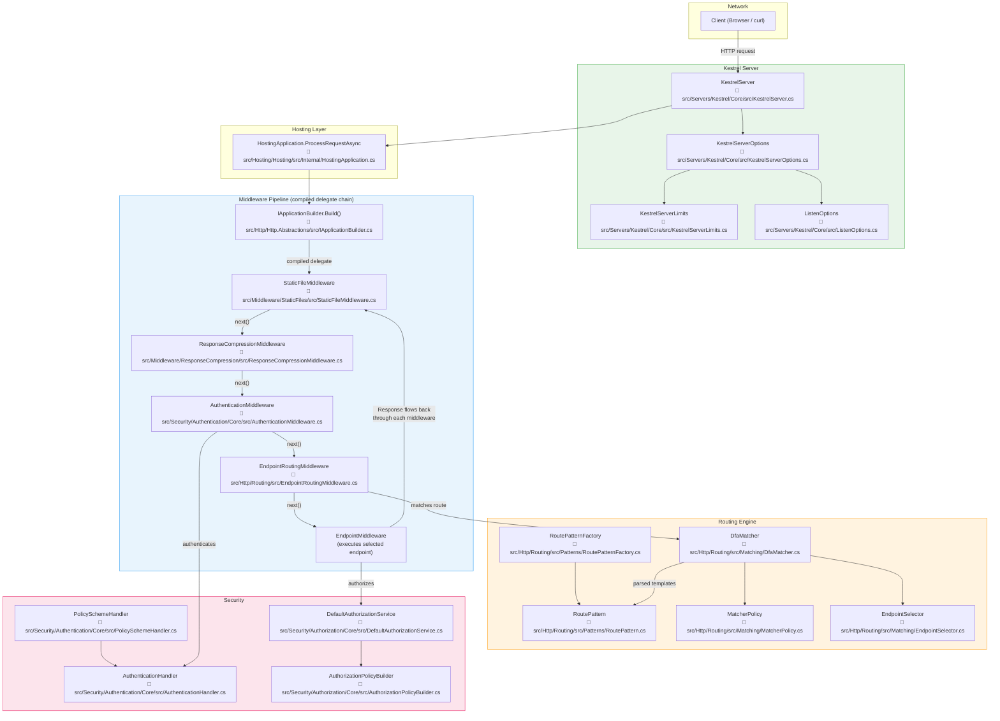

# Level 3: Advanced — ASP.NET Core

> 🎯 **Target profile:** Developers who want to optimize, debug deep issues, and understand what the framework does internally
> ⏱️ **Estimated effort:** 15–18 hours
> 📋 **Prerequisites:** Level 2 Practitioner, experience building production ASP.NET Core apps, comfortable reading C# source code
> 🌐 [Versión en español](../es/03-advanced-aspnet-core.md)

---

## Learning Objectives

After completing this module, you will be able to:

1. **Diagnose middleware ordering bugs** by tracing request flow through the pipeline
2. **Explain how the routing engine** parses route templates into `RoutePattern` objects and matches them against incoming URLs
3. **Identify and fix service lifetime mismatches** (the captive dependency problem) and explain why injecting Scoped into Singleton fails
4. **Configure Kestrel server limits**, HTTPS, and protocols for production deployment
5. **Profile request performance** using `dotnet-trace` and identify hot paths in the middleware pipeline
6. **Implement advanced authentication patterns** including multi-scheme auth and claims transformation
7. **Use short-circuiting middleware effectively** and explain its performance implications

---

## Concept Map

This diagram traces a request from the network through the compiled middleware pipeline, into routing, endpoint selection, and back out through the response path. Each node links to real source code in this repository.



> **Reading this diagram:** Follow the arrows from top to bottom for the request path. Each middleware calls `next()` to pass control to the next one. On the way back up (response path), each middleware gets a chance to modify the response. This is the "Russian nesting doll" pattern you saw in Level 1 — now you can see exactly which classes implement it.

---

## Curriculum

### Lesson 3.1: Middleware Pipeline Deep Dive

**Driving question:** *How does middleware ordering create different behaviors — and how do I debug when it goes wrong?*

**Estimated effort:** 3 hours

#### Concepts

In Level 2, you wrote middleware as a class implementing `IMiddleware` and registered it with `app.UseMiddleware<T>()`. Now let's understand what happens when you call `app.Build()` and how the order of your `Use*()` calls gets locked in.

The middleware pipeline is built at startup by `IApplicationBuilder.Build()`. This method walks through every registered middleware delegate in reverse order and composes them into a single `RequestDelegate` — one nested function call that handles every request. Once built, this chain is immutable. You cannot add, remove, or reorder middleware per-request.

**Key behaviors to understand:**

- **Ordering matters because each middleware wraps the next one.** `UseAuthentication()` must come before `UseAuthorization()` because authorization depends on the identity that authentication establishes. If you reverse them, authorization runs against an unauthenticated user — every request fails.

- **Short-circuiting** happens when a middleware does *not* call `next()`. `UseStaticFiles()` short-circuits when it finds a matching file — it writes the response and never calls the next middleware. This means any middleware registered *after* `UseStaticFiles()` never runs for static file requests.

- **Branching** with `Map()`, `MapWhen()`, and `UseWhen()` creates separate pipeline branches. `Map("/api")` creates a completely new pipeline for requests starting with `/api`. `UseWhen()` conditionally adds middleware but rejoins the main pipeline.

#### 📄 Source Code

| File | What to look for |
|------|-----------------|
| [`src/Http/Http.Abstractions/src/IApplicationBuilder.cs`](../../src/Http/Http.Abstractions/src/IApplicationBuilder.cs) | The `Build()` method that compiles all registered middleware into a single `RequestDelegate`. Notice how it iterates in reverse. |
| [`src/Hosting/Hosting/src/Internal/HostingApplication.cs`](../../src/Hosting/Hosting/src/Internal/HostingApplication.cs) | `ProcessRequestAsync` — where Kestrel hands off each incoming request to the compiled middleware delegate. This is the entry point for every HTTP request. |
| [`src/Http/Http.Abstractions/src/Extensions/UseMiddlewareExtensions.cs`](../../src/Http/Http.Abstractions/src/Extensions/UseMiddlewareExtensions.cs) | How `UseMiddleware<T>()` discovers your middleware's `InvokeAsync` method via reflection and wires it into the pipeline. |
| [`src/Http/Http.Abstractions/src/Extensions/UseExtensions.cs`](../../src/Http/Http.Abstractions/src/Extensions/UseExtensions.cs) | The simpler inline `app.Use(async (context, next) => { ... })` registration. |
| [`src/Middleware/StaticFiles/src/StaticFileMiddleware.cs`](../../src/Middleware/StaticFiles/src/StaticFileMiddleware.cs) | A real middleware that short-circuits — look for where it returns *without* calling `_next(context)`. |

#### 🏋️ Exercise

1. Create a new ASP.NET Core app with this pipeline:

   ```csharp
   app.UseStaticFiles();
   app.UseRouting();
   app.MapGet("/", () => "Hello!");
   ```

   Add a static file to `wwwroot/hello.txt`. Request `/hello.txt` — observe that `UseRouting` never runs. Now move `UseStaticFiles()` to *after* `UseRouting()`. Request `/hello.txt` again — what changes?

2. Add a `Map` branch:

   ```csharp
   app.Map("/api", apiApp =>
   {
       apiApp.UseMiddleware<ApiLoggingMiddleware>();
       apiApp.UseRouting();
       apiApp.UseEndpoints(endpoints =>
       {
           endpoints.MapGet("/status", () => "API OK");
       });
   });
   ```

   Verify that `ApiLoggingMiddleware` only runs for `/api/*` requests.

3. Write a short-circuiting middleware that returns `403 Forbidden` for any request containing `X-Block: true` in the headers. Place it at different positions in the pipeline and observe which middleware still executes.

#### 💡 Key Takeaway

The middleware pipeline is compiled into a single delegate chain at startup. The order you call `app.Use*()` is the order they execute — this is locked in and cannot change per-request. Short-circuiting (not calling `next()`) stops the chain. Once you internalize this, middleware ordering bugs become easy to diagnose.

#### ⚠️ Common Misconception

**"Middleware runs in parallel."** No. The pipeline is sequential. Each middleware `await`s the next one. The entire pipeline is a nested chain of async function calls — like Russian nesting dolls. Concurrency happens *across* requests (Kestrel processes many requests simultaneously), but within a single request, middleware executes in strict order.

---

### Lesson 3.2: Routing Engine Internals

**Driving question:** *How does ASP.NET Core match URLs to endpoints efficiently — even with hundreds of routes?*

**Estimated effort:** 3 hours

#### Concepts

In Level 1, you learned that routing maps URLs to code. Now let's understand *how* it does this so efficiently.

When your app starts, the routing system parses every route template (like `"/users/{id:int}"`) into a `RoutePattern` object. A `RoutePattern` is the fully parsed, structured representation of a route — it knows about literal segments, parameters, constraints, defaults, and policies. The `RoutePatternFactory` is responsible for creating these objects.

The real magic is the `DfaMatcher`. At startup, it takes all registered `RoutePattern` objects and compiles them into a **Deterministic Finite Automaton (DFA)** — a state machine. When a request comes in, the matcher walks through the URL segment by segment, transitioning between states. The cost of matching is **O(number of path segments)**, not O(number of routes). This means adding 1,000 routes doesn't slow down matching — it's always proportional to the URL length.

After the DFA identifies candidate endpoints, `MatcherPolicy` implementations (like `HttpMethodMatcherPolicy`) narrow down the list based on metadata (HTTP method, host, etc.). Finally, the `EndpointSelector` picks the single best match.

#### 📄 Source Code

| File | What to look for |
|------|-----------------|
| [`src/Http/Routing/src/Patterns/RoutePattern.cs`](../../src/Http/Routing/src/Patterns/RoutePattern.cs) | The parsed representation of a route template. Look at `PathSegments`, `Parameters`, and how constraints are stored. |
| [`src/Http/Routing/src/Patterns/RoutePatternFactory.cs`](../../src/Http/Routing/src/Patterns/RoutePatternFactory.cs) | How route template strings become `RoutePattern` objects. |
| [`src/Http/Routing/src/EndpointRoutingMiddleware.cs`](../../src/Http/Routing/src/EndpointRoutingMiddleware.cs) | Where route matching happens per-request. Look at how `SetEndpoint` stores the matched endpoint on `HttpContext`. |
| [`src/Http/Routing/src/Matching/DfaMatcher.cs`](../../src/Http/Routing/src/Matching/DfaMatcher.cs) | ⚠️ **Complex code.** The DFA construction and traversal logic. Focus on `MatchAsync` first — that's the per-request hot path. The DFA building logic (`BuildDfa`) is startup-only and very dense. |
| [`src/Http/Routing/src/Matching/MatcherPolicy.cs`](../../src/Http/Routing/src/Matching/MatcherPolicy.cs) | The base class for policies that filter endpoints after DFA matching. |
| [`src/Http/Routing/src/Matching/EndpointSelector.cs`](../../src/Http/Routing/src/Matching/EndpointSelector.cs) | How the final endpoint is selected from candidates. |

#### 🏋️ Exercise

1. Register 20+ routes with overlapping patterns:

   ```csharp
   app.MapGet("/products", () => "all products");
   app.MapGet("/products/{id:int}", (int id) => $"product {id}");
   app.MapGet("/products/{slug}", (string slug) => $"product by slug: {slug}");
   app.MapGet("/products/{id:int}/reviews", (int id) => $"reviews for {id}");
   app.MapGet("/products/featured", () => "featured products");
   // ... add more overlapping patterns
   ```

2. Enable routing logging:

   ```csharp
   builder.Logging.AddFilter("Microsoft.AspNetCore.Routing", LogLevel.Debug);
   ```

3. Make requests to different URLs and read the logs. Observe:
   - Which routes are considered candidates
   - How constraints (`{id:int}`) disambiguate matches
   - What happens when two routes match equally (try creating an ambiguous match)

4. Try requesting `/products/featured` — does it match the literal route or `{slug}`? Read the `DfaMatcher` logs to understand why.

#### 💡 Key Takeaway

ASP.NET Core compiles all routes into a DFA at startup, so matching is O(number of path segments), not O(number of routes). This is why adding more routes doesn't slow down matching. The DFA is one of the framework's most sophisticated performance optimizations.

#### ⚠️ Common Misconception

**"Route matching is first-match-wins."** Not since endpoint routing was introduced in ASP.NET Core 3.0. All matching endpoints are evaluated, then policies and metadata determine the best match. Literal segments beat parameters, more-specific templates beat less-specific ones. If there's genuine ambiguity (two routes score equally), you get an `AmbiguousMatchException` instead of silent wrong behavior.

---

### Lesson 3.3: DI Scopes and Service Lifetimes

**Driving question:** *Why do lifetime mismatches cause bugs, and how do I fix them?*

**Estimated effort:** 2 hours

#### Concepts

In Level 1, you learned about `Transient`, `Scoped`, and `Singleton` lifetimes. In Level 2, you registered services and used DI in controllers and middleware. Now let's talk about the subtle bug that catches almost every team at least once: **the captive dependency problem**.

A **captive dependency** happens when a longer-lived service captures a shorter-lived one. The most common case: a `Singleton` service receives a `Scoped` service through its constructor. The Scoped service was meant to live for one request, but the Singleton holds onto it forever. Now every request shares the same `DbContext` instance, the same unit of work, the same state. Data leaks between requests. It's non-deterministic — sometimes it works, sometimes you get stale data, sometimes you get `ObjectDisposedException`.

ASP.NET Core has a safety net: **scope validation**. When `ASPNETCORE_ENVIRONMENT` is `Development`, the DI container checks for captive dependencies at resolution time and throws an `InvalidOperationException` instead of silently creating the bug. This is why it's critical to always test in Development mode.

The fix? If a `Singleton` needs access to a `Scoped` service, inject `IServiceScopeFactory` instead and create a scope manually:

```csharp
public class MySingleton(IServiceScopeFactory scopeFactory)
{
    public async Task DoWork()
    {
        using var scope = scopeFactory.CreateScope();
        var dbContext = scope.ServiceProvider.GetRequiredService<MyDbContext>();
        // dbContext is scoped to this block, not to the singleton's lifetime
    }
}
```

#### 📄 Source Code

| File | What to look for |
|------|-----------------|
| [`src/DefaultBuilder/src/WebApplicationBuilder.cs`](../../src/DefaultBuilder/src/WebApplicationBuilder.cs) | Where `ValidateScopes` and `ValidateOnBuild` are configured. Search for `ServiceProviderOptions`. In Development, scope validation is enabled by default. |

#### 🏋️ Exercise

1. **Create a captive dependency:**

   ```csharp
   builder.Services.AddScoped<MyScopedService>();
   builder.Services.AddSingleton<MySingletonService>();
   
   // MySingletonService takes MyScopedService in its constructor
   ```

   Run in Development mode. Observe the exception. Read the exception message carefully — it tells you exactly what's wrong.

2. **Fix it with `IServiceScopeFactory`:**

   Refactor `MySingletonService` to accept `IServiceScopeFactory` and create a scope in its methods instead of capturing the scoped service directly.

3. **Demonstrate the real-world consequence:** Disable scope validation temporarily. Register a `Scoped` service that increments a counter. Inject it into a `Singleton`. Make 10 requests. Observe that the counter keeps incrementing across requests (it should reset to 0 each request).

4. **Explore keyed services (.NET 8+):**

   ```csharp
   builder.Services.AddKeyedScoped<ICache, RedisCache>("redis");
   builder.Services.AddKeyedScoped<ICache, MemoryCache>("memory");
   ```

   Inject with `[FromKeyedServices("redis")] ICache cache`. Understand how keyed services interact with lifetime scoping.

#### 💡 Key Takeaway

Service scopes exist to give certain services a bounded lifetime — like one `DbContext` per request. Scope validation catches lifetime mismatches at startup in Development, not at runtime when they'd cause subtle, hard-to-reproduce bugs. Always run with scope validation enabled during development.

#### ⚠️ Common Misconception

**"Scoped means one instance per request."** Almost — but not exactly. Scoped means one instance per *scope*. A request creates one scope, but you can create additional scopes manually with `IServiceScopeFactory`. Background services, for example, have no request scope and must create their own. If you forget, you're resolving from the root scope, which behaves like Singleton.

---

### Lesson 3.4: Kestrel Server Configuration

**Driving question:** *How do I configure the web server for production?*

**Estimated effort:** 2 hours

#### Concepts

In Level 2, you used Kestrel implicitly — `dotnet run` starts it with defaults. Now let's configure it explicitly for production.

Kestrel is the default, cross-platform, high-performance HTTP server for ASP.NET Core. It's not just a development convenience — it's designed for production use. Netflix, Stack Overflow, and Microsoft themselves run Kestrel in production. But the defaults are intentionally conservative. For production, you'll want to tune:

- **Listen endpoints:** Which addresses and ports to bind to, including Unix sockets
- **HTTPS:** Certificate selection, TLS protocols, cipher suites
- **Request limits:** Maximum request body size (default 30 MB), header count, connection count, request header timeout
- **Protocols:** HTTP/1.1, HTTP/2, HTTP/3 (QUIC)

These settings live in `KestrelServerOptions`, which delegates to `KestrelServerLimits` for the numerical constraints and `ListenOptions` for per-endpoint configuration.

#### 📄 Source Code

| File | What to look for |
|------|-----------------|
| [`src/Servers/Kestrel/Core/src/KestrelServer.cs`](../../src/Servers/Kestrel/Core/src/KestrelServer.cs) | The main server class. Look at `StartAsync` to see how it binds to configured endpoints. |
| [`src/Servers/Kestrel/Core/src/KestrelServerOptions.cs`](../../src/Servers/Kestrel/Core/src/KestrelServerOptions.cs) | The full configuration API. `Listen()`, `ListenAnyIP()`, `ConfigureEndpointDefaults()`, `ConfigureHttpsDefaults()`. |
| [`src/Servers/Kestrel/Core/src/KestrelServerLimits.cs`](../../src/Servers/Kestrel/Core/src/KestrelServerLimits.cs) | Every limit Kestrel enforces: `MaxRequestBodySize`, `MaxRequestHeaderCount`, `MaxConcurrentConnections`, `RequestHeadersTimeout`, and more. Read the XML doc comments — they explain the defaults and trade-offs. |
| [`src/Servers/Kestrel/Core/src/ListenOptions.cs`](../../src/Servers/Kestrel/Core/src/ListenOptions.cs) | Per-endpoint configuration: protocols, HTTPS options, connection middleware. |

#### 🏋️ Exercise

1. **Configure explicit listen endpoints:**

   ```csharp
   builder.WebHost.ConfigureKestrel(options =>
   {
       options.ListenLocalhost(5000); // HTTP
       options.ListenLocalhost(5001, listenOptions =>
       {
           listenOptions.UseHttps(); // HTTPS with dev cert
       });
   });
   ```

2. **Set request limits and test them:**

   ```csharp
   builder.WebHost.ConfigureKestrel(options =>
   {
       options.Limits.MaxRequestBodySize = 1024; // 1 KB max body
       options.Limits.MaxRequestHeaderCount = 10;
   });
   ```

   Try sending a request with a body larger than 1 KB using `curl`:
   ```bash
   curl -X POST -d @largefile.txt http://localhost:5000/upload
   ```
   Observe the `413 Payload Too Large` response.

3. **Enable HTTP/2:**

   ```csharp
   options.ListenLocalhost(5001, listenOptions =>
   {
       listenOptions.Protocols = HttpProtocols.Http1AndHttp2;
       listenOptions.UseHttps();
   });
   ```

   Verify with `curl --http2 https://localhost:5001/`.

4. **Enable connection logging** to see low-level connection events:

   ```csharp
   builder.WebHost.ConfigureKestrel(options =>
   {
       options.ConfigureEndpointDefaults(listenOptions =>
       {
           // Connection-level logging requires Microsoft.AspNetCore.Server.Kestrel
           // at Debug level
       });
   });
   builder.Logging.AddFilter("Microsoft.AspNetCore.Server.Kestrel", LogLevel.Debug);
   ```

#### 💡 Key Takeaway

Kestrel is not just a development server — it's production-ready and highly configurable. Understanding its limits prevents production surprises like rejected uploads (body too large), dropped connections (concurrent connection limits), or protocol mismatches (HTTP/2 requiring HTTPS in most scenarios). Review `KestrelServerLimits.cs` — every property is a knob you can turn.

#### ⚠️ Common Misconception

**"You need IIS or nginx in front of Kestrel in production."** Not necessarily. Kestrel can serve as an edge server directly. A reverse proxy adds features like load balancing, URL rewriting, and TLS offloading — but Kestrel handles HTTPS, HTTP/2, and rate limiting on its own. Choose based on your architecture needs, not a belief that Kestrel "isn't ready for production."

---

### Lesson 3.5: Performance Optimization

**Driving question:** *Where are the hot paths and how do I optimize them?*

**Estimated effort:** 3 hours

#### Concepts

Performance optimization starts with **measurement**, not intuition. ASP.NET Core provides diagnostic tools that let you see exactly where time is spent:

- **`dotnet-counters`** — Live, real-time metrics: requests/sec, active connections, queue length, GC collections. Useful for dashboards and alerting.
- **`dotnet-trace`** — Captures detailed traces that you can analyze in SpeedScope or PerfView. Shows you which methods take the most time.
- **`dotnet-dump`** — Captures heap snapshots for analyzing memory leaks and object retention.

The framework also provides **built-in performance middleware:**

- **Response Caching Middleware** — HTTP-level caching based on `Cache-Control` headers. The server stores responses and serves them directly for matching requests.
- **Output Caching (.NET 7+)** — Server-side caching that doesn't depend on client cache headers. More control, more flexibility.
- **Response Compression Middleware** — Gzip/Brotli compression of responses. Reduces bandwidth but adds CPU overhead — profile to verify it's a net win.

Most performance issues in ASP.NET Core apps are in **application code**, not the framework. Database queries, JSON serialization of large objects, synchronous I/O blocking thread pool threads — these are the usual culprits. The framework's own hot paths (routing, middleware dispatch, Kestrel I/O) are already heavily optimized.

#### 📄 Source Code

| File | What to look for |
|------|-----------------|
| [`src/Middleware/ResponseCompression/src/ResponseCompressionMiddleware.cs`](../../src/Middleware/ResponseCompression/src/ResponseCompressionMiddleware.cs) | A real performance middleware. Notice how it wraps the response stream to compress on-the-fly. Look at how it checks `Content-Type` and `Content-Encoding` to decide whether to compress. |

#### 🏋️ Exercise

1. **Profile a slow endpoint:**

   Create an endpoint that simulates a slow database query:
   ```csharp
   app.MapGet("/slow", async () =>
   {
       await Task.Delay(500); // Simulated slow query
       return Results.Ok(new { data = Enumerable.Range(1, 1000).ToList() });
   });
   ```

2. **Collect a trace:**
   ```bash
   dotnet-counters monitor --process-id <PID> --counters Microsoft.AspNetCore.Hosting
   dotnet-trace collect --process-id <PID> --providers Microsoft-AspNetCore-Server-Kestrel
   ```

3. **Analyze the trace** in [SpeedScope](https://www.speedscope.app/) — upload the `.nettrace` file and identify the hot path.

4. **Apply output caching:**
   ```csharp
   builder.Services.AddOutputCache();
   app.UseOutputCache();

   app.MapGet("/slow", async () =>
   {
       await Task.Delay(500);
       return Results.Ok(new { data = Enumerable.Range(1, 1000).ToList() });
   }).CacheOutput(p => p.Expire(TimeSpan.FromSeconds(30)));
   ```

   Measure the difference: first request takes 500 ms, subsequent requests are near-instant.

5. **Add response compression:**
   ```csharp
   builder.Services.AddResponseCompression(options =>
   {
       options.EnableForHttps = true;
   });
   app.UseResponseCompression();
   ```

   Compare response sizes with and without compression using `curl -H "Accept-Encoding: gzip" -v`.

#### 💡 Key Takeaway

Profile before optimizing. Most performance issues are in application code (database queries, serialization, synchronous blocking), not in the framework. The framework's hot paths are already heavily optimized. Use `dotnet-counters` for live monitoring, `dotnet-trace` for deep profiling, and built-in caching/compression middleware for the common wins.

#### ⚠️ Common Misconception

**"Async makes my code faster."** Async makes your code *more scalable*, not faster. An async database query takes the same wall-clock time as a synchronous one. The difference is that async frees the thread pool thread to handle other requests while waiting for I/O, instead of blocking it. If you have low concurrency, async adds overhead for no benefit. If you have high concurrency, async prevents thread pool starvation.

---

### Lesson 3.6: Advanced Authentication Patterns

**Driving question:** *How do policy schemes, claims transformation, and multi-scheme auth work?*

**Estimated effort:** 2 hours

#### Concepts

In Level 2, you set up basic cookie or JWT authentication. Now let's handle the real-world patterns that production apps need.

**Multi-scheme authentication:** Many apps need to support both cookies (for browser users) and JWT tokens (for API clients). ASP.NET Core supports registering multiple authentication schemes and choosing between them per-request.

**Policy schemes:** A `PolicySchemeHandler` is a meta-scheme that delegates to other schemes based on the request. For example: "If the request has an `Authorization: Bearer` header, use JWT. Otherwise, use cookies." This avoids duplicating `[Authorize]` attributes with explicit scheme names on every endpoint.

**Claims transformation:** After authentication establishes an identity, you often need to enrich it. `IClaimsTransformation` runs after authentication and can add claims from your database — roles, permissions, tenant IDs — before authorization evaluates them. This keeps your JWT tokens small while still having rich authorization data.

#### 📄 Source Code

| File | What to look for |
|------|-----------------|
| [`src/Security/Authentication/Core/src/AuthenticationMiddleware.cs`](../../src/Security/Authentication/Core/src/AuthenticationMiddleware.cs) | How the default scheme is resolved and `AuthenticateAsync` is called. This runs before authorization. |
| [`src/Security/Authentication/Core/src/AuthenticationHandler.cs`](../../src/Security/Authentication/Core/src/AuthenticationHandler.cs) | The base class for all authentication handlers. Look at `AuthenticateAsync`, `ChallengeAsync`, and `ForbidAsync`. |
| [`src/Security/Authentication/Core/src/PolicySchemeHandler.cs`](../../src/Security/Authentication/Core/src/PolicySchemeHandler.cs) | How policy schemes delegate to other schemes. Look at how it reads `PolicySchemeOptions` to decide which scheme to forward to. This is the key to multi-scheme auth. |
| [`src/Security/Authorization/Core/src/DefaultAuthorizationService.cs`](../../src/Security/Authorization/Core/src/DefaultAuthorizationService.cs) | How authorization evaluates policies against the authenticated user. |
| [`src/Security/Authorization/Core/src/AuthorizationPolicyBuilder.cs`](../../src/Security/Authorization/Core/src/AuthorizationPolicyBuilder.cs) | Building complex policies with `RequireClaim`, `RequireRole`, `AddRequirements`, and combining multiple requirements. |

#### 🏋️ Exercise

1. **Set up multi-scheme authentication:**

   ```csharp
   builder.Services.AddAuthentication("MultiScheme")
       .AddCookie("Cookies", options => { /* cookie config */ })
       .AddJwtBearer("Bearer", options => { /* JWT config */ })
       .AddPolicyScheme("MultiScheme", "Cookie or JWT", options =>
       {
           options.ForwardDefaultSelector = context =>
           {
               var authHeader = context.Request.Headers.Authorization.FirstOrDefault();
               return authHeader?.StartsWith("Bearer ") == true ? "Bearer" : "Cookies";
           };
       });
   ```

2. **Test both paths:** Send a request with a JWT token (`Authorization: Bearer <token>`) and verify JWT auth runs. Send a request with a cookie and verify cookie auth runs.

3. **Implement claims transformation:**

   ```csharp
   public class DatabaseClaimsTransformation(IServiceScopeFactory scopeFactory)
       : IClaimsTransformation
   {
       public async Task<ClaimsPrincipal> TransformAsync(ClaimsPrincipal principal)
       {
           using var scope = scopeFactory.CreateScope();
           // Look up user roles/permissions from database
           // Add them as claims to the principal
           var identity = (ClaimsIdentity)principal.Identity!;
           identity.AddClaim(new Claim("tenant", "acme-corp"));
           return principal;
       }
   }

   builder.Services.AddTransient<IClaimsTransformation, DatabaseClaimsTransformation>();
   ```

4. **Build a custom authorization requirement:**

   ```csharp
   public class MinimumAgeRequirement(int minimumAge) : IAuthorizationRequirement
   {
       public int MinimumAge => minimumAge;
   }

   public class MinimumAgeHandler : AuthorizationHandler<MinimumAgeRequirement>
   {
       protected override Task HandleRequirementAsync(
           AuthorizationHandlerContext context,
           MinimumAgeRequirement requirement)
       {
           var birthDateClaim = context.User.FindFirst("birthdate");
           // ... validate age against requirement.MinimumAge
       }
   }
   ```

#### 💡 Key Takeaway

Authentication schemes are composable. Policy schemes let you pick the right scheme per-request without scattering scheme names across your codebase. Claims transformation lets you enrich identity data after authentication but before authorization runs — keeping tokens small and authorization data fresh from your database.

#### ⚠️ Common Misconception

**"I should put all permissions in the JWT token."** This makes tokens large, impossible to revoke mid-session, and stale (the user's permissions might change after the token was issued). Use the JWT for identity (who you are), and use claims transformation or a policy-based approach to load permissions at request time from your database.

---

## Source Code Reading Guide

These files are ordered from approachable to complex. Start at the top and work down. The star rating reflects code complexity, not importance.

| # | File | What You'll Learn | Complexity |
|---|------|-------------------|:----------:|
| 1 | [`src/Http/Http.Abstractions/src/IApplicationBuilder.cs`](../../src/Http/Http.Abstractions/src/IApplicationBuilder.cs) | How `Build()` compiles the middleware pipeline into a single delegate | ⭐⭐ |
| 2 | [`src/Hosting/Hosting/src/Internal/HostingApplication.cs`](../../src/Hosting/Hosting/src/Internal/HostingApplication.cs) | The entry point for every HTTP request — `ProcessRequestAsync` | ⭐⭐⭐ |
| 3 | [`src/Http/Routing/src/Patterns/RoutePattern.cs`](../../src/Http/Routing/src/Patterns/RoutePattern.cs) | The structured representation of parsed route templates | ⭐⭐⭐ |
| 4 | [`src/Http/Routing/src/EndpointRoutingMiddleware.cs`](../../src/Http/Routing/src/EndpointRoutingMiddleware.cs) | Per-request route matching — where routing happens in the pipeline | ⭐⭐⭐ |
| 5 | [`src/Http/Routing/src/Matching/DfaMatcher.cs`](../../src/Http/Routing/src/Matching/DfaMatcher.cs) | The DFA state machine for high-performance route matching | ⭐⭐⭐⭐ |
| 6 | [`src/Servers/Kestrel/Core/src/KestrelServerOptions.cs`](../../src/Servers/Kestrel/Core/src/KestrelServerOptions.cs) | The full Kestrel configuration API — every knob you can turn | ⭐⭐ |
| 7 | [`src/Security/Authentication/Core/src/PolicySchemeHandler.cs`](../../src/Security/Authentication/Core/src/PolicySchemeHandler.cs) | How policy schemes delegate authentication to other schemes | ⭐⭐⭐ |

> **Tip:** Don't try to read `DfaMatcher.cs` line by line on your first pass. Start with `MatchAsync` (the per-request method), understand the flow, then explore `BuildDfa` (the startup-time construction) later. This is one of the most complex files in the repository.

---

## Diagnostic Tools

| Tool | Command | What It Shows | When to Use |
|------|---------|---------------|-------------|
| `dotnet-counters` | `dotnet-counters monitor --process-id <PID> --counters Microsoft.AspNetCore.Hosting` | Live request rate, active connections, queue length, GC stats | Real-time performance monitoring in production or load testing |
| `dotnet-trace` | `dotnet-trace collect --process-id <PID> --providers Microsoft-AspNetCore` | Detailed per-request traces with timing | Profiling request pipelines, finding slow middleware or handlers |
| `dotnet-dump` | `dotnet-dump collect --process-id <PID>` then `dotnet-dump analyze <dump>` | Heap state, object retention, GC roots | Diagnosing memory leaks or excessive allocations |
| Kestrel connection logging | `builder.Logging.AddFilter("Microsoft.AspNetCore.Server.Kestrel", LogLevel.Debug)` | Connection lifecycle events, protocol negotiation | Debugging HTTPS/TLS issues, protocol mismatches |
| Routing debug logging | `builder.Logging.AddFilter("Microsoft.AspNetCore.Routing", LogLevel.Debug)` | Matched/rejected routes, constraint evaluation, ambiguity | Debugging routing mismatches and unexpected 404s |

> **Install diagnostic tools** if you haven't already:
> ```bash
> dotnet tool install --global dotnet-counters
> dotnet tool install --global dotnet-trace
> dotnet tool install --global dotnet-dump
> ```

---

## Self-Assessment

### Knowledge Checks

Test your understanding before moving on. If you can't answer confidently, revisit the relevant lesson.

**1. Middleware ordering:** You have `UseAuthentication()`, `UseAuthorization()`, and `UseStaticFiles()` in your pipeline. A user requests `/logo.png` (a static file). In what order should you place these three middleware calls so that static files are served *without* requiring authentication? What happens if you put `UseStaticFiles()` last?

<details>
<summary>Verify your answer</summary>

Place `UseStaticFiles()` before `UseAuthentication()` and `UseAuthorization()`. This way, static file requests short-circuit before authentication runs. If `UseStaticFiles()` is last, every static file request goes through authentication and authorization first — failing for unauthenticated users or adding unnecessary overhead for authenticated ones.
</details>

**2. Routing:** You register these two routes:
```csharp
app.MapGet("/users/{id}", (string id) => $"User: {id}");
app.MapGet("/users/me", () => "Current user");
```
A request comes in for `/users/me`. Which route matches and why?

<details>
<summary>Verify your answer</summary>

`/users/me` matches. The DFA matcher considers literal segments more specific than parameter segments. The literal "me" in the second route takes precedence over the `{id}` parameter in the first. This is not first-match-wins — the routing engine evaluates both and chooses the more specific match.
</details>

**3. DI lifetimes:** A `Singleton` service has a constructor that accepts a `Scoped` `DbContext`. What happens in Development mode? What happens in Production mode? Which is more dangerous?

<details>
<summary>Verify your answer</summary>

In Development mode, scope validation throws an `InvalidOperationException` at resolution time — the app crashes with a clear error message. In Production mode, scope validation is disabled by default, so the `DbContext` is silently captured by the Singleton and shared across all requests. Production is more dangerous because the bug is silent and manifests as stale data, race conditions, or `ObjectDisposedException` under load.
</details>

**4. Kestrel:** What is the default maximum request body size in Kestrel? How would you increase it to 100 MB for a file upload endpoint without changing the global limit?

<details>
<summary>Verify your answer</summary>

The default is ~30 MB (`30_000_000` bytes). To increase it for a single endpoint without changing the global limit, use `[RequestSizeLimit(104857600)]` attribute on a controller action, or `[DisableRequestSizeLimit]` to remove the limit entirely. For minimal APIs: `.WithMetadata(new RequestSizeLimitAttribute(104857600))`.
</details>

**5. Performance:** You run `dotnet-counters` and see that `gen-0-gc-count` is very high (hundreds per second) but `requests-per-second` is low. What does this suggest, and what's your first debugging step?

<details>
<summary>Verify your answer</summary>

High Gen 0 GC with low request throughput suggests excessive short-lived allocations — the app is creating many small objects that die quickly, causing garbage collection pressure. First step: capture a `dotnet-trace` with the `GC` provider and analyze which methods are allocating the most. Common culprits: string concatenation in loops, LINQ allocations, boxing value types, or large temporary collections.
</details>

### Practical Challenge

**Build a production-ready middleware pipeline with diagnostics:**

1. Create an ASP.NET Core app with:
   - Static files served without authentication (short-circuit)
   - JWT and cookie authentication via a policy scheme
   - Output caching on GET endpoints
   - Response compression
   - Custom request timing middleware that logs how long each request takes
   - Kestrel configured with explicit limits (1 MB body, HTTP/2 enabled)

2. Write a load test (even a simple `for` loop with `HttpClient`) and use `dotnet-counters` to monitor request throughput, GC pressure, and active connections.

3. Intentionally introduce a captive dependency. Verify that scope validation catches it. Fix it.

4. Enable routing debug logging, request several overlapping routes, and explain the matcher's decisions.

**Success criteria:** You can explain *why* each middleware is in its position, *what* would break if you reordered them, and *how* you'd diagnose any issues using the diagnostic tools covered in this module.

---

## Connections

| Direction | Link | Description |
|-----------|------|-------------|
| ⬇️ Previous | [Level 2 — Practitioner](02-practitioner-aspnet-core.md) | Building APIs, writing middleware, basic auth and DI |
| ⬆️ Next | [Level 4 — Internals](04-internals-aspnet-core.md) | Deep into `IApplicationBuilder` compilation, DFA matcher state machine, `ResourceInvoker` filter pipeline |
| ↔️ Related | [Kestrel documentation](https://learn.microsoft.com/aspnet/core/fundamentals/servers/kestrel) | Official Kestrel configuration reference |
| ↔️ Related | [dotnet diagnostic tools](https://learn.microsoft.com/dotnet/core/diagnostics/) | `dotnet-trace`, `dotnet-counters`, `dotnet-dump` guides |
| ↔️ Related | [ASP.NET Core performance best practices](https://learn.microsoft.com/aspnet/core/performance/overview) | Official performance guidance |

---

## Glossary

| Term | Definition |
|------|-----------|
| **DFA Matcher** | Deterministic Finite Automaton — a state machine that the routing engine builds at startup from all registered route patterns. It enables O(path-segments) matching regardless of the number of routes. See [`DfaMatcher.cs`](../../src/Http/Routing/src/Matching/DfaMatcher.cs). |
| **RoutePattern** | The parsed, structured representation of a route template string (e.g., `"/users/{id:int}"`). Contains segments, parameters, constraints, and defaults. See [`RoutePattern.cs`](../../src/Http/Routing/src/Patterns/RoutePattern.cs). |
| **Endpoint Metadata** | Arbitrary data attached to an endpoint (like `[Authorize]`, `[HttpGet]`, or custom attributes). Used by `MatcherPolicy` implementations and the authorization system to make decisions about how to handle requests. |
| **Captive Dependency** | A bug where a long-lived service (e.g., Singleton) captures a short-lived service (e.g., Scoped) through its constructor. The short-lived service now lives as long as the long-lived one, breaking its intended lifecycle. |
| **Scope Validation** | A DI container feature that detects captive dependencies at resolution time. Enabled by default in Development mode. Throws `InvalidOperationException` instead of silently creating the bug. |
| **Short-Circuit** | When a middleware handles the request and returns a response *without* calling `next()`, preventing all downstream middleware from executing. `UseStaticFiles()` short-circuits when it finds a matching file. |
| **Policy Scheme** | An authentication scheme that doesn't authenticate directly but delegates to other schemes based on request properties. Enables multi-scheme auth (e.g., "use JWT if Bearer header present, otherwise use cookies"). See [`PolicySchemeHandler.cs`](../../src/Security/Authentication/Core/src/PolicySchemeHandler.cs). |
| **Claims Transformation** | The process of enriching a `ClaimsPrincipal` after authentication but before authorization. Implemented via `IClaimsTransformation`. Useful for adding database-sourced claims (roles, permissions) without bloating tokens. |
| **Output Caching** | Server-side response caching introduced in .NET 7. Unlike Response Caching (which respects HTTP `Cache-Control` headers), Output Caching gives the server full control over what gets cached and for how long. |
| **Response Compression** | Middleware that compresses HTTP responses using gzip or Brotli. Reduces bandwidth at the cost of CPU. Configured via `ResponseCompressionMiddleware`. See [`ResponseCompressionMiddleware.cs`](../../src/Middleware/ResponseCompression/src/ResponseCompressionMiddleware.cs). |

---

## References

### Source Code (in this repository)

- [`src/Http/Http.Abstractions/src/IApplicationBuilder.cs`](../../src/Http/Http.Abstractions/src/IApplicationBuilder.cs) — Pipeline builder interface
- [`src/Http/Http.Abstractions/src/Extensions/UseMiddlewareExtensions.cs`](../../src/Http/Http.Abstractions/src/Extensions/UseMiddlewareExtensions.cs) — Middleware registration internals
- [`src/Http/Http.Abstractions/src/Extensions/UseExtensions.cs`](../../src/Http/Http.Abstractions/src/Extensions/UseExtensions.cs) — Inline middleware
- [`src/Hosting/Hosting/src/Internal/HostingApplication.cs`](../../src/Hosting/Hosting/src/Internal/HostingApplication.cs) — Core HTTP application entry point
- [`src/Middleware/StaticFiles/src/StaticFileMiddleware.cs`](../../src/Middleware/StaticFiles/src/StaticFileMiddleware.cs) — Static files middleware
- [`src/Middleware/ResponseCompression/src/ResponseCompressionMiddleware.cs`](../../src/Middleware/ResponseCompression/src/ResponseCompressionMiddleware.cs) — Response compression middleware
- [`src/Http/Routing/src/Patterns/RoutePattern.cs`](../../src/Http/Routing/src/Patterns/RoutePattern.cs) — Parsed route template representation
- [`src/Http/Routing/src/Patterns/RoutePatternFactory.cs`](../../src/Http/Routing/src/Patterns/RoutePatternFactory.cs) — Route pattern creation
- [`src/Http/Routing/src/EndpointRoutingMiddleware.cs`](../../src/Http/Routing/src/EndpointRoutingMiddleware.cs) — Route matching middleware
- [`src/Http/Routing/src/Matching/DfaMatcher.cs`](../../src/Http/Routing/src/Matching/DfaMatcher.cs) — DFA-based route matcher
- [`src/Http/Routing/src/Matching/MatcherPolicy.cs`](../../src/Http/Routing/src/Matching/MatcherPolicy.cs) — Endpoint matching policies
- [`src/Http/Routing/src/Matching/EndpointSelector.cs`](../../src/Http/Routing/src/Matching/EndpointSelector.cs) — Final endpoint selection
- [`src/DefaultBuilder/src/WebApplicationBuilder.cs`](../../src/DefaultBuilder/src/WebApplicationBuilder.cs) — Default service configuration
- [`src/Security/Authentication/Core/src/AuthenticationMiddleware.cs`](../../src/Security/Authentication/Core/src/AuthenticationMiddleware.cs) — Authentication pipeline
- [`src/Security/Authentication/Core/src/AuthenticationHandler.cs`](../../src/Security/Authentication/Core/src/AuthenticationHandler.cs) — Authentication handler base class
- [`src/Security/Authentication/Core/src/PolicySchemeHandler.cs`](../../src/Security/Authentication/Core/src/PolicySchemeHandler.cs) — Policy scheme delegation
- [`src/Security/Authorization/Core/src/DefaultAuthorizationService.cs`](../../src/Security/Authorization/Core/src/DefaultAuthorizationService.cs) — Authorization engine
- [`src/Security/Authorization/Core/src/AuthorizationPolicyBuilder.cs`](../../src/Security/Authorization/Core/src/AuthorizationPolicyBuilder.cs) — Authorization policy builder
- [`src/Servers/Kestrel/Core/src/KestrelServer.cs`](../../src/Servers/Kestrel/Core/src/KestrelServer.cs) — Kestrel server
- [`src/Servers/Kestrel/Core/src/KestrelServerOptions.cs`](../../src/Servers/Kestrel/Core/src/KestrelServerOptions.cs) — Server configuration
- [`src/Servers/Kestrel/Core/src/KestrelServerLimits.cs`](../../src/Servers/Kestrel/Core/src/KestrelServerLimits.cs) — Server limits
- [`src/Servers/Kestrel/Core/src/ListenOptions.cs`](../../src/Servers/Kestrel/Core/src/ListenOptions.cs) — Endpoint configuration

### Official Documentation

- [ASP.NET Core Middleware](https://learn.microsoft.com/aspnet/core/fundamentals/middleware/) — Official middleware guide
- [Routing in ASP.NET Core](https://learn.microsoft.com/aspnet/core/fundamentals/routing) — Routing concepts and configuration
- [Dependency Injection in ASP.NET Core](https://learn.microsoft.com/aspnet/core/fundamentals/dependency-injection) — DI lifetimes and best practices
- [Kestrel web server](https://learn.microsoft.com/aspnet/core/fundamentals/servers/kestrel) — Kestrel configuration reference
- [ASP.NET Core Performance Best Practices](https://learn.microsoft.com/aspnet/core/performance/overview) — Performance guidance
- [Authentication in ASP.NET Core](https://learn.microsoft.com/aspnet/core/security/authentication/) — Authentication schemes and handlers
- [Policy-based Authorization](https://learn.microsoft.com/aspnet/core/security/authorization/policies) — Custom authorization requirements
- [.NET Diagnostic Tools](https://learn.microsoft.com/dotnet/core/diagnostics/) — `dotnet-trace`, `dotnet-counters`, `dotnet-dump`
- [Output Caching Middleware](https://learn.microsoft.com/aspnet/core/performance/caching/output) — Server-side caching (.NET 7+)
