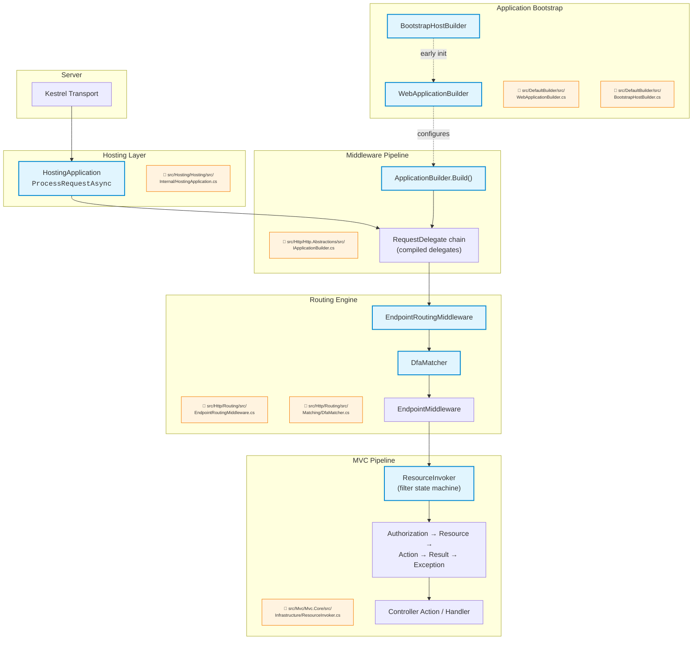

# Level 4: Internals — ASP.NET Core

> 🎯 **Target profile:** Developers who want to understand framework mechanics at the source-code level
> ⏱️ **Estimated effort:** 20–25 hours
> 📋 **Prerequisites:** Level 3 Advanced, comfortable reading complex C# code, familiarity with design patterns (decorator, strategy, factory)
> 🌐 [Versión en español](../es/04-internals-aspnet-core.md)

---

## Learning Objectives

After completing this module, you will be able to:

1. **Trace how `IApplicationBuilder.Build()` compiles middleware delegates** into a single `RequestDelegate` chain — and explain why the construction order is reversed.
2. **Explain how the DFA matcher constructs a state machine** from route patterns at startup and traverses it per-request in O(path-segments) time.
3. **Walk through the complete `ResourceInvoker` filter pipeline** — authorization, resource, action, exception, and result filters — and describe the state machine that drives it.
4. **Describe how `ServiceProvider` resolves a service graph** including scoped, transient, and singleton lifetimes, and why first-resolution is slower than subsequent ones.
5. **Explain the features pattern** and how `HttpContext` abstracts different server implementations through `IFeatureCollection`.
6. **Trace a request end-to-end** from Kestrel acceptance through `HostingApplication.ProcessRequestAsync` to endpoint execution and response.
7. **Identify how `WebApplicationBuilder` composes** hosting, DI, configuration, and middleware setup — and what defaults it wires in.

---

## Concept Map

The following diagram shows how a request flows through ASP.NET Core's internal architecture, from the server to your code. Each node references the source file where the logic lives.



---

## Curriculum

### Lesson 4.1: IApplicationBuilder and Pipeline Construction

**Est. effort: 3 hours**

> In Level 1, you learned that middleware forms a pipeline. In Level 2, you wrote your own middleware. In Level 3, you studied ordering and branching. Now let's open the hood and see how the pipeline is actually **compiled**.

#### Core concepts

The middleware pipeline is not a list that gets iterated at runtime — it's a **compile-time artifact**. When `IApplicationBuilder.Build()` is called during startup, it takes every middleware registration and folds them into a single nested `RequestDelegate`. Understanding this construction is key to understanding why middleware ordering matters and why the pipeline is so fast.

**How `Use()` works:** Each call to `Use()` adds a `Func<RequestDelegate, RequestDelegate>` to an internal list. This is a function that takes "the rest of the pipeline" and returns "the rest of the pipeline with my logic wrapped around it." That's the decorator pattern at work.

**How `Build()` compiles the chain:** `Build()` iterates the middleware list **in reverse order**, threading each `RequestDelegate` through the next factory. The result is a single delegate where the first-registered middleware wraps the outermost layer:

```csharp
// Simplified version of what Build() does internally
// (see IApplicationBuilder.cs for the real implementation)
RequestDelegate pipeline = context =>
{
    context.Response.StatusCode = 404;
    return Task.CompletedTask;
};

// Walk backwards through registered middleware
for (var i = _components.Count - 1; i >= 0; i--)
{
    pipeline = _components[i](pipeline);
}

return pipeline;
```

The terminal middleware (the innermost layer) returns 404 — if no middleware writes a response, you get a 404. This is why you'll sometimes see unexpected 404s when middleware doesn't call `next()`.

**How `UseMiddleware<T>()` discovers `InvokeAsync`:** `UseMiddlewareExtensions` uses reflection to find the `Invoke` or `InvokeAsync` method on your middleware class. If the method accepts parameters beyond `HttpContext`, it builds an **expression tree** that resolves those parameters from DI at request time. This is why convention-based middleware supports injecting services directly into `InvokeAsync` — each call gets a fresh set of scoped services.

#### Source files to read

| File | What to look for |
|------|-----------------|
| [`src/Http/Http.Abstractions/src/IApplicationBuilder.cs`](../../src/Http/Http.Abstractions/src/IApplicationBuilder.cs) | The `Use()` method signature and the `Build()` method that compiles the pipeline |
| [`src/Http/Http.Abstractions/src/Extensions/UseMiddlewareExtensions.cs`](../../src/Http/Http.Abstractions/src/Extensions/UseMiddlewareExtensions.cs) | Reflection-based middleware discovery, the compiled expression tree for parameter injection, and the `InvokeAsync` signature requirements |
| [`src/Hosting/Hosting/src/Builder/ApplicationBuilderFactory.cs`](../../src/Hosting/Hosting/src/Builder/ApplicationBuilderFactory.cs) | How the `ApplicationBuilder` instance is created from the DI container |

#### Exercise

1. Open `UseMiddlewareExtensions.cs` and trace the logic path for a middleware class that has an `InvokeAsync(HttpContext, ILogger)` signature. How does the extension method discover `InvokeAsync`? How does it create a factory delegate that resolves `ILogger` from the request's service provider?
2. Write a middleware class with two injected parameters in `InvokeAsync`. Set a breakpoint in `UseMiddlewareExtensions` and step through to see the expression tree being built.
3. Look at the `Build()` method. Explain to yourself (or a colleague) why iterating in reverse produces the correct execution order.

#### Key takeaway

> The middleware pipeline is a **compile-time artifact**. `Build()` creates a chain of delegates where each one wraps the next. The order is inverted during construction — the last middleware registered wraps first, but executes last. After `Build()` completes, there's no list, no iteration, no dictionary lookup — just a single delegate to invoke per request.

---

### Lesson 4.2: DFA Matcher and Endpoint Selection

**Est. effort: 4 hours**

> In Level 3, you learned that `EndpointRoutingMiddleware` and `EndpointMiddleware` cooperate to match and execute endpoints. Now we're going to look at *how* the matching actually works — and it's one of the most sophisticated algorithms in the entire framework.

#### Core concepts

ASP.NET Core's routing engine uses a **Deterministic Finite Automaton (DFA)** to match incoming URL paths against registered route patterns. This is not a simple "loop through all routes and check each one" approach — it's a compiled state machine that processes each path segment exactly once, regardless of how many routes are registered.

**What is a DFA in this context?** Think of it as a tree of states. Each state represents "I've consumed this many path segments and these routes are still candidates." Transitions between states correspond to path segments — either literal matches, parameter captures, or catch-alls. The DFA is built at startup and traversed at request time.

**Why a DFA?** A naive routing implementation would be O(n × m) — for each of n registered routes, check m path segments. The DFA turns this into O(m) — traverse m segments through the state machine, and the set of matching candidates falls out at the end. This is why ASP.NET Core handles hundreds of routes without measurable routing overhead.

**How `MatcherPolicy` extends matching:** After the DFA narrows candidates, `MatcherPolicy` implementations can further filter or sort them. For example, `HttpMethodMatcherPolicy` filters by HTTP verb, and `HostMatcherPolicy` filters by host header. This is the strategy pattern — the matcher delegates policy-specific decisions to pluggable components.

**How `EndpointSelector` handles ambiguity:** If multiple endpoints match a request, `EndpointSelector` decides what to do. The default implementation throws an `AmbiguousMatchException` — it won't silently pick one. You can replace it with a custom selector if you need different behavior.

#### Source files to read

| File | What to look for |
|------|-----------------|
| [`src/Http/Routing/src/Matching/DfaMatcher.cs`](../../src/Http/Routing/src/Matching/DfaMatcher.cs) | The `MatchAsync` method — follow the state machine traversal. Look for how it handles literal segments, parameters, and catch-alls. |
| [`src/Http/Routing/src/Matching/MatcherPolicy.cs`](../../src/Http/Routing/src/Matching/MatcherPolicy.cs) | The abstract base for matching policies — `AppliesToEndpoints`, `ApplyAsync` |
| [`src/Http/Routing/src/Matching/EndpointSelector.cs`](../../src/Http/Routing/src/Matching/EndpointSelector.cs) | The default selection strategy and ambiguity handling |
| [`src/Http/Routing/src/Patterns/RoutePatternMatcher.cs`](../../src/Http/Routing/src/Patterns/RoutePatternMatcher.cs) | Individual pattern matching — how a single route pattern validates against a path |
| [`src/Http/Routing/src/EndpointRoutingMiddleware.cs`](../../src/Http/Routing/src/EndpointRoutingMiddleware.cs) | How the middleware invokes the matcher and stores the result in `HttpContext` |

> ⚠️ **Honest difficulty warning:** `DfaMatcher.cs` is one of the most complex files in the repository. Don't try to understand every line on your first read. Focus on the `MatchAsync` method and trace the state transitions. The construction logic (how the DFA is built from route patterns) is a separate, even more complex, piece — save that for a second pass.

#### Exercise

1. Register 5+ routes with overlapping patterns (e.g., `/products/{id}`, `/products/featured`, `/products/{category}/{id}`). Add logging middleware before routing and after endpoint execution. Trace through `DfaMatcher.MatchAsync` mentally or with a debugger to understand which DFA states are visited for `/products/featured`.
2. Register two routes that conflict (e.g., `/items/{id}` and `/items/{name}`). Observe the `AmbiguousMatchException`. Then create a custom `MatcherPolicy` that resolves the ambiguity based on whether the segment is numeric.
3. Look at how `EndpointRoutingMiddleware` stores the matched endpoint. What `HttpContext` feature does it use? How does `EndpointMiddleware` retrieve it?

#### Key takeaway

> The DFA matcher is one of ASP.NET Core's most sophisticated algorithms. It turns an O(n × m) problem (n routes × m segments) into an O(m) traversal. Understanding it explains why routing "just works" even with hundreds of routes — and why you should never try to implement your own URL matching logic when the built-in system will almost certainly outperform it.

---

### Lesson 4.3: MVC Action Execution Pipeline (ResourceInvoker)

**Est. effort: 4 hours**

> In Level 2, you learned to use filters like `[Authorize]` and `IActionFilter`. In Level 3, you studied how filter ordering works. Now let's look at the machinery that actually runs them — and it's not a simple loop.

#### Core concepts

When an MVC endpoint is matched by routing, the request enters the MVC filter pipeline. The `ResourceInvoker` class orchestrates this pipeline as a **state machine** — not a linear sequence of calls. Understanding why it's a state machine (rather than a simple foreach loop over filters) reveals how ASP.NET Core handles complex scenarios like short-circuiting, exception handling, and result overriding.

**The filter execution order:**
1. **Authorization filters** — run first, can short-circuit the entire pipeline
2. **Resource filters** — wrap everything else, good for caching
3. **Model binding** — happens between resource filters and action filters
4. **Action filters** — run immediately before and after the action method
5. **The action method itself** — your controller code
6. **Result filters** — run before and after the action result executes
7. **Exception filters** — catch exceptions from action execution

**Why a state machine?** Each filter type has different short-circuiting semantics. Authorization filters can reject a request before model binding happens. Resource filters can return a cached result without ever calling the action. Exception filters need to catch errors from action execution but not from result execution. A simple loop can't express these relationships cleanly — a state machine can.

**How caching works:** `ControllerActionInvokerCache` builds the filter pipeline once per action and caches it. Subsequent requests for the same action skip the pipeline construction entirely. The cache stores the ordered filter list and the compiled invoker delegate.

#### Source files to read

| File | What to look for |
|------|-----------------|
| [`src/Mvc/Mvc.Core/src/Infrastructure/ResourceInvoker.cs`](../../src/Mvc/Mvc.Core/src/Infrastructure/ResourceInvoker.cs) | The `InvokeAsync` entry point, `InvokeFilterPipelineAsync`, the `State` enum, and the `Next` method that drives the state machine. This is the heart of MVC execution. |
| [`src/Mvc/Mvc.Core/src/Infrastructure/ControllerActionInvoker.cs`](../../src/Mvc/Mvc.Core/src/Infrastructure/ControllerActionInvoker.cs) | Controller-specific extension of `ResourceInvoker` — how it invokes the action method and handles `IActionResult` |
| [`src/Mvc/Mvc.Core/src/Infrastructure/ControllerActionInvokerCache.cs`](../../src/Mvc/Mvc.Core/src/Infrastructure/ControllerActionInvokerCache.cs) | How the filter pipeline is cached per-action to avoid rebuilding it on every request |

> ⚠️ **Honest difficulty warning:** `ResourceInvoker.cs` is large and dense. The state machine uses a `State` enum and a `Next` method with a switch statement that implements the transitions. It's not intuitive on first read. Start by mapping the `State` enum values to the filter pipeline stages listed above, then trace a single happy-path request through the `Next` method.

#### Exercise

1. Open `ResourceInvoker.cs`. Find the `State` enum and list all the states. Map each state to the filter pipeline stage it represents (authorization, resource, model binding, action, result, exception).
2. Trace the `InvokeFilterPipelineAsync` method for a request with one `[Authorize]` attribute and one `IActionFilter`. Write down each `State` transition.
3. Now trace what happens when an `IAuthorizationFilter` short-circuits (sets a result without calling `next`). Which states get skipped?
4. Look at `ControllerActionInvokerCache`. How does it determine the cache key? What happens when a new action is encountered for the first time?

#### Key takeaway

> `ResourceInvoker` is a state machine, not a simple linear pipeline. This design allows it to handle complex filter interactions — short-circuiting, exception handling, result overriding — while maintaining a clear, deterministic execution order. The cache ensures this complex pipeline is built once and reused, making the per-request overhead minimal.

---

### Lesson 4.4: ServiceProvider Resolution Mechanics

**Est. effort: 3 hours**

> In Level 1, you learned what DI is. In Level 2, you registered services. In Level 3, you debugged lifetime issues. Now let's understand how the container actually resolves a service — what happens inside that black box.

#### Core concepts

The default DI container in .NET (`Microsoft.Extensions.DependencyInjection`) is more sophisticated than most developers realize. It doesn't just `new` up objects — it builds a **call site tree**, compiles it, and caches the result. Understanding this explains several observable behaviors: why first-request is slower, why certain registration patterns are faster, and why captive dependencies are dangerous.

**The call site chain:** When you resolve a service for the first time, the container walks its registrations to build a tree of "call sites" — nodes that describe how to create each service in the dependency graph. A call site for `MyService` might reference call sites for `ILogger<MyService>` and `IRepository`, each of which references their own dependencies, and so on. This tree captures the entire resolution strategy.

**Compiled vs. interpreted resolution:** On first resolution, the container interprets the call site tree to create the service. For services that will be resolved frequently (singletons, repeated scoped resolutions), it then **compiles the tree to IL** — actual .NET intermediate language that bypasses reflection on subsequent calls. This is why the first resolution of a complex graph is noticeably slower.

**Scoped resolution:** `IServiceScopeFactory.CreateScope()` creates a new scope that shares the singleton root but has its own instance cache for scoped services. In ASP.NET Core, each HTTP request gets its own scope — that's why scoped services are per-request. The scope is created in `HostingApplication.ProcessRequestAsync` before your middleware runs.

**Where the code lives:** The `ServiceProvider` implementation itself lives in `dotnet/runtime` (under `src/libraries/Microsoft.Extensions.DependencyInjection/`), not in this repository. However, `WebApplicationBuilder` configures it, and understanding how ASP.NET Core interacts with the container is essential.

#### Source files to read

| File | What to look for |
|------|-----------------|
| [`src/DefaultBuilder/src/WebApplicationBuilder.cs`](../../src/DefaultBuilder/src/WebApplicationBuilder.cs) | How `Services` (the `IServiceCollection`) is exposed and how the container is built during `Build()` |
| [`src/Hosting/Hosting/src/Internal/HostingApplication.cs`](../../src/Hosting/Hosting/src/Internal/HostingApplication.cs) | How `ProcessRequestAsync` creates the request scope — look for `IServiceScopeFactory` usage |
| **External:** [`dotnet/runtime` — `ServiceProvider.cs`](https://github.com/dotnet/runtime/tree/main/src/libraries/Microsoft.Extensions.DependencyInjection) | The actual resolution engine — call site visitors, IL compilation, scope management |

#### Exercise

1. Enable DI diagnostic logging by calling `services.AddLogging()` and setting `Microsoft.Extensions.DependencyInjection` to `Debug` level. Register a service graph with 3+ levels of nesting (e.g., `Controller → Service → Repository → DbContext`) with mixed lifetimes. Observe the resolution log output.
2. In `HostingApplication.cs`, find where the request scope is created. What happens to scoped services when the request ends? How does disposal work?
3. Register the same interface with both a singleton and a scoped implementation. Resolve `IEnumerable<IMyService>` and observe which instances you get. Then resolve the interface directly — which registration wins?
4. Read the `dotnet/runtime` source for `CallSiteFactory` — trace how it builds the call site tree for a service with three dependencies.

#### Key takeaway

> The DI container builds a "call site" tree at first resolution time, then compiles it to IL for subsequent calls. Understanding this explains why first-request is slower (tree construction + interpretation), why some DI patterns are more performant than others (flat graphs compile better), and why the container is fast enough that you almost never need to worry about DI overhead in production.

---

### Lesson 4.5: HttpContext and the Features Pattern

**Est. effort: 3 hours**

> In Level 1, you used `HttpContext.Request` and `HttpContext.Response` without thinking much about where they come from. In Level 3, you configured Kestrel. Now let's understand how `HttpContext` works as an abstraction layer over different servers — and why the "features" pattern is central to that design.

#### Core concepts

`HttpContext` is not a concrete class that directly owns request/response data. It's an **abstraction layer** that delegates to a collection of **features** — interfaces that each server implementation provides. This design lets ASP.NET Core run on Kestrel, IIS (via the ASP.NET Core Module), TestServer, or any custom server without coupling the middleware pipeline to a specific implementation.

**The features pattern:** `IFeatureCollection` is a property bag keyed by interface type. A server like Kestrel populates it with implementations of `IHttpRequestFeature`, `IHttpResponseFeature`, `IHttpConnectionFeature`, and others. `HttpContext` then wraps these features with a developer-friendly API. When you read `HttpContext.Request.Path`, you're really reading from the `IHttpRequestFeature` that Kestrel placed in the collection.

**Why features instead of a simpler abstraction?** Because different servers support different capabilities. Kestrel supports HTTP/2 server push (via `IHttpResponseBodyFeature`), IIS supports Windows Authentication (via `IHttpAuthenticationFeature`), and TestServer supports direct in-memory communication. The feature collection lets each server expose exactly what it supports, and middleware can query for specific features at runtime.

**HttpContext pooling:** `DefaultHttpContext` instances are pooled and reused across requests. The `DefaultHttpContext` class (in this repository) resets its state between requests rather than allocating a new instance each time. This is a significant performance optimization for high-throughput scenarios.

> **Note:** `IFeatureCollection` and `DefaultHttpContextFactory` have moved to `dotnet/runtime`. The feature *interfaces* remain in `src/Http/Http.Features/src/`, and the `DefaultHttpContext` implementation is in `src/Http/Http/src/DefaultHttpContext.cs`.

#### Source files to read

| File | What to look for |
|------|-----------------|
| [`src/Http/Http.Abstractions/src/HttpContext.cs`](../../src/Http/Http.Abstractions/src/HttpContext.cs) | The abstract base class — note how `Request`, `Response`, `Features` are abstract. This is pure abstraction, no implementation. |
| [`src/Http/Http/src/DefaultHttpContext.cs`](../../src/Http/Http/src/DefaultHttpContext.cs) | The concrete implementation — trace how it wraps feature interfaces to implement `Request`, `Response`, and other properties |
| [`src/Http/Http.Features/src/IHttpRequestFeature.cs`](../../src/Http/Http.Features/src/IHttpRequestFeature.cs) | A typical feature interface — the raw HTTP request data that a server provides |
| [`src/Http/Http.Features/src/IHttpConnectionFeature.cs`](../../src/Http/Http.Features/src/IHttpConnectionFeature.cs) | Connection-level details — IP addresses, ports, connection ID |
| [`src/Http/Http/src/Features/RequestServicesFeature.cs`](../../src/Http/Http/src/Features/RequestServicesFeature.cs) | How the request's DI scope is exposed as a feature |

#### Exercise

1. Write middleware that accesses low-level features directly:
   ```csharp
   app.Use(async (context, next) =>
   {
       var connectionFeature = context.Features.Get<IHttpConnectionFeature>();
       if (connectionFeature is not null)
       {
           Console.WriteLine($"Remote IP: {connectionFeature.RemoteIpAddress}");
           Console.WriteLine($"Local port: {connectionFeature.LocalPort}");
       }
       await next(context);
   });
   ```
2. Open `DefaultHttpContext.cs` and trace how `Request.Path` is implemented. Follow the chain from the property getter to the underlying feature interface.
3. Use `TestServer` from `Microsoft.AspNetCore.TestHost` and compare which features are available versus a real Kestrel server. Which features are missing? Which are simulated?
4. Find `RequestServicesFeature.cs` — how does it lazily create the request-scoped `IServiceProvider`? What happens when the feature is disposed?

#### Key takeaway

> The features pattern lets ASP.NET Core work with any server without coupling to a specific implementation. `HttpContext` is a convenience wrapper — the real power is in the feature collection. When you need access to server-specific capabilities (connection details, HTTP/2 features, WebSockets), you go through `Features.Get<T>()` directly. This architecture is what makes ASP.NET Core genuinely server-agnostic.

---

### Lesson 4.6: WebApplicationBuilder Internals

**Est. effort: 3 hours**

> In Level 1, you called `WebApplication.CreateBuilder(args)` and didn't think much about it. In Level 3, you customized Kestrel and logging. Now let's read the builder itself — every default it sets up, every sub-builder it composes, and how `Build()` creates the final application.

#### Core concepts

`WebApplicationBuilder` is a **composition root** — it doesn't do much work itself but orchestrates multiple sub-builders that each handle a piece of the application setup. Understanding this composition reveals every default that ASP.NET Core configures and how to override any of them.

**The builder hierarchy:**

1. **`BootstrapHostBuilder`** — runs first during `CreateBuilder()`. It captures the initial configuration actions (logging, host configuration) so they can be replayed later. This exists because `WebApplicationBuilder` needs to read configuration (like Kestrel settings) before the host is fully built.

2. **`ConfigureHostBuilder`** — exposed as `builder.Host`. Lets you configure host-level concerns (lifetime, environment). Actions registered here are deferred — they run during `Build()`, not when you call them.

3. **`ConfigureWebHostBuilder`** — exposed as `builder.WebHost`. Lets you configure web-specific concerns (Kestrel, server URLs). Also deferred.

4. **`WebApplicationBuilder` itself** — exposes `Services`, `Configuration`, `Logging`, and `Environment` directly. These are the "immediate" APIs — they modify the builder state right away.

**What `CreateBuilder()` sets up by default:**
- Configuration from `appsettings.json`, environment variables, command-line args, and user secrets (in Development)
- Logging to console, debug, and event source
- Kestrel as the default server
- Routing services
- The generic host infrastructure

**What `Build()` does:**
- Replays all deferred configuration actions
- Builds the `IServiceProvider` from the accumulated service registrations
- Creates the `IHost` and wraps it in a `WebApplication`
- The `WebApplication` itself implements `IApplicationBuilder`, `IEndpointRouteBuilder`, and `IHost` — it's a composite that unifies all these concerns

#### Source files to read

| File | What to look for |
|------|-----------------|
| [`src/DefaultBuilder/src/WebApplicationBuilder.cs`](../../src/DefaultBuilder/src/WebApplicationBuilder.cs) | The constructor (what defaults are set up), the `Build()` method (how the host is assembled), and the `Services`, `Configuration`, `Logging` properties |
| [`src/DefaultBuilder/src/BootstrapHostBuilder.cs`](../../src/DefaultBuilder/src/BootstrapHostBuilder.cs) | How early-stage configuration is captured and deferred — look for the lists of `Action<>` that get replayed later |
| [`src/DefaultBuilder/src/ConfigureHostBuilder.cs`](../../src/DefaultBuilder/src/ConfigureHostBuilder.cs) | The `builder.Host` API — how host-level actions are collected but not yet applied |
| [`src/DefaultBuilder/src/WebApplication.cs`](../../src/DefaultBuilder/src/WebApplication.cs) | The `WebApplication` class — trace how it implements `IApplicationBuilder`, `IEndpointRouteBuilder`, and `IHost`. Understand the `Run()` and `RunAsync()` methods. |
| [`src/Hosting/Hosting/src/GenericHost/GenericWebHostBuilder.cs`](../../src/Hosting/Hosting/src/GenericHost/GenericWebHostBuilder.cs) | The underlying generic host integration — how Kestrel, routing, and other services are wired into the host |

#### Exercise

1. Read `WebApplicationBuilder.cs` from top to bottom. List every service and configuration source that `CreateBuilder(args)` registers by default. Count them — the list is longer than most developers expect.
2. Trace what happens when you write:
   ```csharp
   var builder = WebApplication.CreateBuilder(args);
   builder.Services.AddControllers();
   var app = builder.Build();
   ```
   At what point does `AddControllers()` actually run? When are the MVC services available?
3. Open `BootstrapHostBuilder.cs`. Why does this class exist? What problem does it solve that `ConfigureHostBuilder` alone can't?
4. Look at `WebApplication.cs`. Find where it implements `IApplicationBuilder.Build()`. How does calling `app.MapGet(...)` eventually compile into the middleware pipeline?

#### Key takeaway

> `WebApplicationBuilder` is a composition root that wires together multiple sub-builders. Understanding it reveals every default that ASP.NET Core sets up — and how to override any of them. The deferred-action pattern (`BootstrapHostBuilder`, `ConfigureHostBuilder`) exists to solve a real bootstrapping problem: you need configuration to set up services, but you need services to read configuration. The builder hierarchy resolves this chicken-and-egg problem elegantly.

---

## Source Code Reading Guide

These files are the most important internals to read, in suggested order. The ⭐ rating indicates complexity, not importance — a ⭐⭐⭐ file might be just as critical to understand as a ⭐⭐⭐⭐ file, but easier to read.

| Order | File | What you'll learn | Complexity |
|:-----:|------|------------------|:----------:|
| 1 | [`src/Http/Http.Abstractions/src/IApplicationBuilder.cs`](../../src/Http/Http.Abstractions/src/IApplicationBuilder.cs) | `Build()` compiles the middleware pipeline | ⭐⭐⭐ |
| 2 | [`src/Http/Http.Abstractions/src/Extensions/UseMiddlewareExtensions.cs`](../../src/Http/Http.Abstractions/src/Extensions/UseMiddlewareExtensions.cs) | Reflection, expression trees, DI integration | ⭐⭐⭐⭐ |
| 3 | [`src/Hosting/Hosting/src/Internal/HostingApplication.cs`](../../src/Hosting/Hosting/src/Internal/HostingApplication.cs) | Request entry point, scope creation, diagnostics | ⭐⭐⭐⭐ |
| 4 | [`src/DefaultBuilder/src/WebApplicationBuilder.cs`](../../src/DefaultBuilder/src/WebApplicationBuilder.cs) | Builder composition, defaults, `Build()` | ⭐⭐⭐ |
| 5 | [`src/Http/Http/src/DefaultHttpContext.cs`](../../src/Http/Http/src/DefaultHttpContext.cs) | HttpContext ↔ feature collection mapping | ⭐⭐⭐ |
| 6 | [`src/Http/Routing/src/Matching/DfaMatcher.cs`](../../src/Http/Routing/src/Matching/DfaMatcher.cs) | DFA construction and traversal | ⭐⭐⭐⭐ |
| 7 | [`src/Mvc/Mvc.Core/src/Infrastructure/ResourceInvoker.cs`](../../src/Mvc/Mvc.Core/src/Infrastructure/ResourceInvoker.cs) | Filter state machine, pipeline orchestration | ⭐⭐⭐⭐ |

---

## Diagnostic Tools

These tools help you explore and verify the internals covered in this module.

| Tool | Purpose | When to use |
|------|---------|------------|
| **Source Link / decompilation** (JetBrains dotPeek, ILSpy) | Navigate framework source code with debug symbols | Reading framework internals that live outside this repo (e.g., `dotnet/runtime` DI code) |
| **Visual Studio "Go to Implementation"** (Ctrl+F12) | Jump from interface to concrete implementation | Following call chains from `IApplicationBuilder` to `ApplicationBuilder`, etc. |
| **`dotnet-trace`** with `Microsoft-AspNetCore-Hosting` provider | Capture internal framework events | Tracing pipeline execution timing, request lifecycle events |
| **BenchmarkDotNet** | Micro-benchmarks for framework hot paths | Measuring middleware overhead, routing cost, DI resolution time |
| **`DiagnosticSource` listeners** | Subscribe to framework diagnostic events | Observing internal events like `Microsoft.AspNetCore.Hosting.BeginRequest` |
| **`ASPNETCORE_DETAILEDERRORS=true`** | Enable detailed error pages with full stack traces | Seeing framework stack traces during development to understand call chains |

**Example: tracing request timing with `dotnet-trace`**

```bash
# Install the tool
dotnet tool install -g dotnet-trace

# Collect a trace with ASP.NET Core events
dotnet-trace collect --process-id <PID> \
    --providers Microsoft-AspNetCore-Hosting

# Analyze the .nettrace file in PerfView or Visual Studio
```

---

## Self-Assessment

Use these checks to verify your understanding. If you can answer all of them confidently, you've internalized this module.

### Knowledge checks

- [ ] **Pipeline compilation:** Can you explain why `IApplicationBuilder.Build()` iterates middleware in reverse order? What would happen if it iterated forward instead?
- [ ] **UseMiddleware reflection:** Can you describe how `UseMiddlewareExtensions` discovers `InvokeAsync` and creates a factory delegate for DI parameter injection?
- [ ] **DFA matching:** Can you sketch (on paper or whiteboard) the DFA states that would be generated for these three routes: `/api/users`, `/api/users/{id}`, `/api/{controller}/{action}`?
- [ ] **Filter state machine:** Can you list the `ResourceInvoker` states in order and explain which filter types execute in each state?
- [ ] **Service resolution:** Can you explain the difference between the call site tree being "interpreted" versus "compiled to IL" — and when each happens?
- [ ] **Features pattern:** Can you explain why `HttpContext.Request.Path` goes through a feature interface rather than being a direct property?
- [ ] **Builder composition:** Can you explain what `BootstrapHostBuilder` does that `ConfigureHostBuilder` cannot?

### Challenge

**Full request trace:** Starting from `HostingApplication.ProcessRequestAsync`, trace a request to `GET /api/products/42` through:
1. Scope creation
2. `RequestDelegate` invocation (the compiled pipeline)
3. `EndpointRoutingMiddleware` → `DfaMatcher.MatchAsync`
4. `EndpointMiddleware` → `ResourceInvoker.InvokeAsync`
5. Authorization filters → resource filters → model binding → action filters → action → result filters
6. Response writing and scope disposal

Write down the source file and approximate line number for each transition. This exercise ties together everything in this module.

---

## Connections

| Direction | Link |
|-----------|------|
| ⬇️ Previous | [Level 3 — Advanced](03-advanced-aspnet-core.md) — production configuration, performance, advanced patterns |
| ⬆️ Next | [Level 5 — Expert / Contributor](05-expert-aspnet-core.md) — building from source, contributing, extending the framework |
| ↔️ Related | [`dotnet/runtime` — DI internals](https://github.com/dotnet/runtime/tree/main/src/libraries/Microsoft.Extensions.DependencyInjection) — the actual `ServiceProvider` implementation |
| ↔️ Related | [`dotnet/runtime` — Kestrel transport layer](https://github.com/dotnet/runtime) — the I/O pipeline beneath the hosting layer |

---

## Glossary

| Term | Definition |
|------|-----------|
| **RequestDelegate** | A delegate (`Func<HttpContext, Task>`) that represents a single unit of HTTP processing. The compiled middleware pipeline is a single `RequestDelegate`. |
| **DFA (Deterministic Finite Automaton)** | A state machine where each state has exactly one transition per input symbol. In ASP.NET Core routing, the "input symbols" are URL path segments and the states represent sets of candidate endpoints. |
| **MatcherPolicy** | An abstract class that lets you extend the routing matcher with custom logic. Implementations can filter, sort, or reject endpoint candidates after the DFA narrows the initial set. |
| **ResourceInvoker** | The MVC class that orchestrates the filter pipeline as a state machine. It manages the execution of authorization, resource, action, result, and exception filters. |
| **Call Site** | An internal DI concept representing a node in the service resolution tree. Each call site describes how to create one service, referencing child call sites for its dependencies. |
| **Features Pattern** | An architectural pattern where capabilities are exposed as interfaces in a property bag (`IFeatureCollection`), allowing different implementations to provide different capabilities without a common base class. |
| **IFeatureCollection** | A collection keyed by `Type` that holds feature interfaces. Each server implementation populates it with its own feature objects. Defined in `dotnet/runtime`. |
| **BootstrapHostBuilder** | An internal builder that captures host configuration actions during `WebApplicationBuilder` construction. It exists to solve the bootstrapping problem of needing configuration before the host is built. |
| **Pipeline Compilation** | The process by which `IApplicationBuilder.Build()` folds middleware registrations into a single nested `RequestDelegate`. After compilation, there is no list or dictionary — just a delegate chain. |

---

## References

### ASP.NET Core source (this repository)
- [`src/Http/Http.Abstractions/src/IApplicationBuilder.cs`](../../src/Http/Http.Abstractions/src/IApplicationBuilder.cs)
- [`src/Http/Http.Abstractions/src/Extensions/UseMiddlewareExtensions.cs`](../../src/Http/Http.Abstractions/src/Extensions/UseMiddlewareExtensions.cs)
- [`src/Http/Routing/src/Matching/DfaMatcher.cs`](../../src/Http/Routing/src/Matching/DfaMatcher.cs)
- [`src/Mvc/Mvc.Core/src/Infrastructure/ResourceInvoker.cs`](../../src/Mvc/Mvc.Core/src/Infrastructure/ResourceInvoker.cs)
- [`src/DefaultBuilder/src/WebApplicationBuilder.cs`](../../src/DefaultBuilder/src/WebApplicationBuilder.cs)
- [`src/Hosting/Hosting/src/Internal/HostingApplication.cs`](../../src/Hosting/Hosting/src/Internal/HostingApplication.cs)
- [`src/Http/Http/src/DefaultHttpContext.cs`](../../src/Http/Http/src/DefaultHttpContext.cs)

### .NET runtime source (external)
- [Microsoft.Extensions.DependencyInjection — `dotnet/runtime`](https://github.com/dotnet/runtime/tree/main/src/libraries/Microsoft.Extensions.DependencyInjection)

### Official documentation
- [ASP.NET Core Middleware](https://learn.microsoft.com/aspnet/core/fundamentals/middleware/)
- [Routing in ASP.NET Core](https://learn.microsoft.com/aspnet/core/fundamentals/routing)
- [Filters in ASP.NET Core](https://learn.microsoft.com/aspnet/core/mvc/controllers/filters)
- [Dependency injection in ASP.NET Core](https://learn.microsoft.com/aspnet/core/fundamentals/dependency-injection)
- [ASP.NET Core request features](https://learn.microsoft.com/aspnet/core/fundamentals/request-features)

### Deep-dive articles
- [Andrew Lock — Behind the scenes of minimal APIs](https://andrewlock.net/series/behind-the-scenes-of-minimal-apis/)
- [Steve Gordon — ASP.NET Core Anatomy](https://www.stevejgordon.co.uk/aspnet-core-anatomy-how-does-usestartup-work)
- [David Fowler — ASP.NET Core Architecture](https://github.com/davidfowl/AspNetCoreDiagnosticScenarios)
