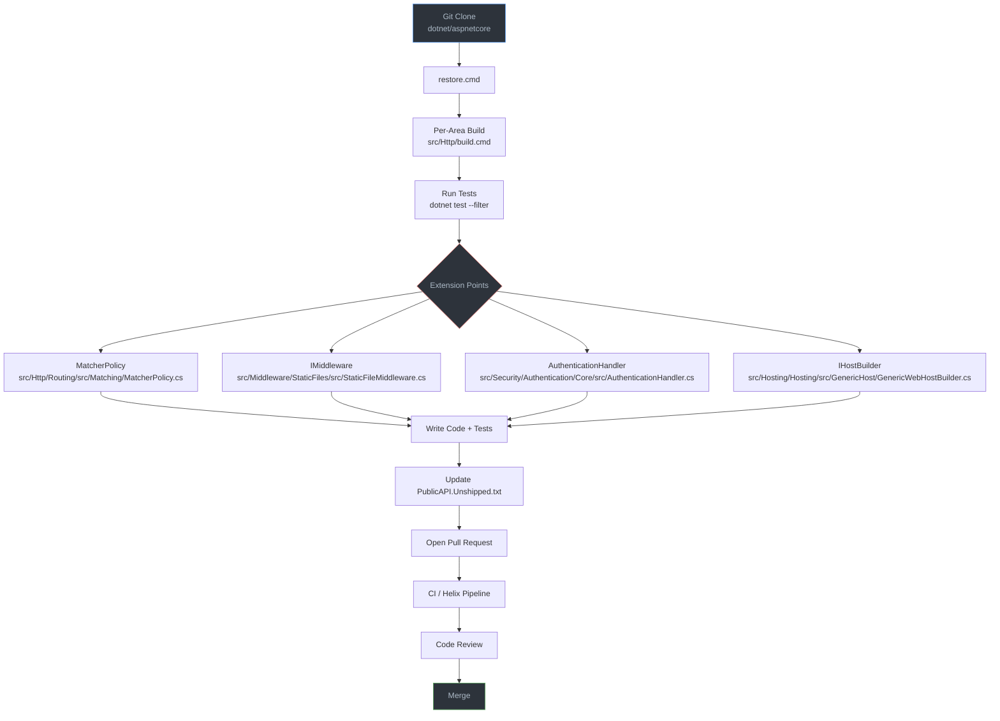

# Level 5: Expert / Contributor — ASP.NET Core

> 🎯 **Target profile:** Developers who want to contribute to the framework, extend its core, or build custom hosting solutions
> ⏱️ **Estimated effort:** 20–25 hours
> 📋 **Prerequisites:** Level 4 Internals, experience with large C# codebases, familiarity with build systems, git workflow
> 🌐 [Versión en español](../es/05-expert-aspnet-core.md)

---

## Learning Objectives

After completing this module, you will be able to:

1. Clone, build, and run the ASP.NET Core test suite from source
2. Navigate the monorepo structure and locate relevant code for any framework feature
3. Implement a custom `MatcherPolicy` that adds new routing capabilities
4. Write framework-quality middleware following internal conventions (constructor injection, testability, options pattern)
5. Implement a complete custom authentication handler with challenge/forbid semantics
6. Submit a pull request to `dotnet/aspnetcore` following the contribution workflow
7. Update `PublicAPI.Unshipped.txt` and understand public API tracking conventions
8. Design a custom hosting model for non-HTTP scenarios using the generic host

---

## Concept Map



---

## Curriculum

### Lesson 5.1: Building ASP.NET Core from Source

**Estimated time: 4 hours**

> **Driving question:** How do I clone, build, and test the framework locally?

#### Concepts

The ASP.NET Core repository is a monorepo — every framework component lives in a single Git repository under `src/`. This sounds intimidating, but it's organized around a critical insight: **you never build the whole thing**. Each area (`src/Http/`, `src/Mvc/`, `src/Security/`, etc.) is self-contained with its own build script. The Arcade SDK from `dotnet/arcade` provides the shared build infrastructure that ties everything together.

The build system has several layers you need to understand:

- **`global.json`** pins the exact .NET SDK version the repo expects. The repo includes its own locally-installed SDK — you activate it with `activate.ps1` (Windows) or `source activate.sh` (Linux/Mac) before running any `dotnet` command.
- **`Directory.Build.props`** and **`Directory.Build.targets`** set global MSBuild properties and targets that apply to every project in the repo.
- **`eng/Versions.props`** centralizes all package versions. You never specify a version in a `.csproj` — it comes from here.
- **`eng/Dependencies.props`** lists every allowed package reference. If it's not in this file, you can't reference it.
- **`eng/targets/ResolveReferences.targets`** is where the magic happens — it resolves `<Reference>` elements to the correct `<ProjectReference>` or `<PackageReference>` automatically. This is why most `.csproj` files in the repo use `<Reference>` instead of `<ProjectReference>`.

Understanding this layered build system is prerequisite to everything else in this level. If you don't know how the build works, you can't contribute effectively.

#### Source Files

| File | Purpose |
|------|---------|
| [`eng/build.cmd`](../../eng/build.cmd) | Main build script (whole-repo, rarely needed) |
| [`eng/Versions.props`](../../eng/Versions.props) | Centralized version management |
| [`eng/Dependencies.props`](../../eng/Dependencies.props) | Allowed package references |
| [`eng/targets/ResolveReferences.targets`](../../eng/targets/ResolveReferences.targets) | Reference resolution logic |
| [`Directory.Build.props`](../../Directory.Build.props) | Global MSBuild properties |
| [`Directory.Build.targets`](../../Directory.Build.targets) | Global MSBuild targets |
| [`global.json`](../../global.json) | SDK version pinning |
| [`CONTRIBUTING.md`](../../CONTRIBUTING.md) | Official contribution guidelines |

#### Exercise 5.1: Your First Build from Source

Clone the repository and build the HTTP area:

```bash
# Clone the repo
git clone https://github.com/dotnet/aspnetcore.git
cd aspnetcore

# Restore dependencies (required before first build)
./restore.cmd                          # Windows
./restore.sh                           # Linux/Mac

# Activate the local .NET SDK
. ./activate.ps1                       # Windows PowerShell
source ./activate.sh                   # Linux/Mac

# Build only the Http area
./src/Http/build.cmd                   # Windows
./src/Http/build.sh                    # Linux/Mac

# Run specific routing tests
dotnet test src/Http/Routing/test/UnitTests/Microsoft.AspNetCore.Routing.Tests.csproj \
  --filter "FullyQualifiedName~DfaMatcherTest"
```

After the build succeeds, explore what happened:

1. Open `eng/Versions.props` and find three package versions — note how they're declared as MSBuild properties.
2. Open any `.csproj` under `src/Http/Routing/src/` and notice the `<Reference>` elements (not `<ProjectReference>`).
3. Open `eng/targets/ResolveReferences.targets` and trace how those `<Reference>` elements get resolved. This is the build system's core trick.

#### Key Takeaway

The repo builds per-area, not as a monolith. Each `src/<Area>/` has its own build script. Start there. The `restore.cmd` step needs to run only once (or after changing dependencies). After that, area-level builds are fast.

#### Common Misconception

> *"I need to build the entire repo to work on a feature."*

Never do this. Building the entire repo takes a very long time and is rarely necessary. Even the CI pipeline builds per-area. Run `src/<Area>/build.cmd` for the area you're changing, and use `dotnet test` with `--filter` to run just the tests you care about.

---

### Lesson 5.2: Extending the Routing System

**Estimated time: 4 hours**

> **Driving question:** How do I write a custom `MatcherPolicy` that adds new routing capabilities?

#### Concepts

In Level 4, you traced how `DfaMatcher` builds a state machine and walks it to select endpoints. Now you'll extend that system. The primary extension point is `MatcherPolicy` — an abstract class that lets you participate in endpoint selection without replacing the routing engine.

A `MatcherPolicy` can do three things:

1. **Filter endpoints** after the DFA narrows the candidates — implement `IEndpointSelectorPolicy` to inspect metadata and reject endpoints that don't match your custom criteria.
2. **Sort endpoints** — override `GetComparer()` to define ordering between endpoints that share the same route template.
3. **Integrate with the DFA** — implement `INodeBuilderPolicy` to add custom branches into the DFA state machine itself (advanced).

The key insight is that routing is a pipeline. The DFA handles URL matching, then policies run in order (controlled by `Order`) to further narrow the candidate set. `EndpointSelector` picks the final winner from whatever candidates remain.

You can also extend routing with:

- **`IRouteConstraint`** — custom parameter constraints (e.g., `{id:myconstraint}`)
- **`IOutboundParameterTransformer`** — transform route values during link generation (e.g., `PascalCase` → `kebab-case`)

#### Source Files

| File | Purpose |
|------|---------|
| [`src/Http/Routing/src/Matching/MatcherPolicy.cs`](../../src/Http/Routing/src/Matching/MatcherPolicy.cs) | Base class and extension point |
| [`src/Http/Routing/src/Matching/DfaMatcher.cs`](../../src/Http/Routing/src/Matching/DfaMatcher.cs) | How policies integrate with the DFA |
| [`src/Http/Routing/src/Matching/EndpointSelector.cs`](../../src/Http/Routing/src/Matching/EndpointSelector.cs) | Default endpoint selection |
| [`src/Http/Routing/src/Builder/EndpointRouteBuilderExtensions.cs`](../../src/Http/Routing/src/Builder/EndpointRouteBuilderExtensions.cs) | Route builder extensions |

#### Exercise 5.2: Version-Based Endpoint Selection

Implement a `VersionMatcherPolicy` that selects endpoints based on an `api-version` header:

```csharp
// Step 1: Define a metadata attribute for endpoints
[AttributeUsage(AttributeTargets.Method | AttributeTargets.Class)]
public class ApiVersionAttribute : Attribute, IApiVersionMetadata
{
    public ApiVersionAttribute(string version) => Version = version;
    public string Version { get; }
}

public interface IApiVersionMetadata
{
    string Version { get; }
}

// Step 2: Implement the MatcherPolicy
public class VersionMatcherPolicy : MatcherPolicy, IEndpointSelectorPolicy
{
    public override int Order => 100; // Run after built-in policies

    public bool AppliesToEndpoints(IReadOnlyList<Endpoint> endpoints)
    {
        // Only run if at least one endpoint has version metadata
        return endpoints.Any(e => e.Metadata.GetMetadata<IApiVersionMetadata>() is not null);
    }

    public Task ApplyAsync(
        HttpContext httpContext,
        CandidateSet candidates)
    {
        var requestedVersion = httpContext.Request.Headers["api-version"].FirstOrDefault();

        for (var i = 0; i < candidates.Count; i++)
        {
            if (!candidates.IsValidCandidate(i))
            {
                continue;
            }

            var metadata = candidates[i].Endpoint
                .Metadata.GetMetadata<IApiVersionMetadata>();

            if (metadata is not null &&
                !string.Equals(metadata.Version, requestedVersion, StringComparison.OrdinalIgnoreCase))
            {
                candidates.SetValidity(i, false);
            }
        }

        return Task.CompletedTask;
    }
}

// Step 3: Register and use
builder.Services.AddSingleton<MatcherPolicy, VersionMatcherPolicy>();

app.MapGet("/api/products", [ApiVersion("1.0")] () => "v1 products");
app.MapGet("/api/products", [ApiVersion("2.0")] () => "v2 products");
```

Write tests using `TestServer` to verify:
- A request with `api-version: 1.0` hits the v1 endpoint
- A request with `api-version: 2.0` hits the v2 endpoint
- A request with no header returns 404 or the default behavior you defined

#### Key Takeaway

`MatcherPolicy` is the primary extension point for routing. It lets you add custom selection logic — API versioning, feature flags, A/B testing — without replacing the routing engine. The framework's own HTTP method and CORS policies use this exact mechanism.

#### Callback to Level 4

In Level 4, Lesson 4.2, you traced how `DfaMatcher` builds jump tables and walks the DFA to produce a `CandidateSet`. Now you're writing code that receives that candidate set and makes decisions. You're participating in the same pipeline you read about — just from the extension side.

---

### Lesson 5.3: Writing Framework-Quality Middleware

**Estimated time: 3 hours**

> **Driving question:** What patterns does the framework use internally for middleware?

#### Concepts

You've written middleware before. But framework-level middleware follows stricter conventions because it needs to work in every ASP.NET Core application on the planet. Reading the framework's own middleware reveals patterns you won't find in tutorials:

**Constructor injection, not `app.Use()` closures.** Framework middleware uses the class-based pattern with constructor-injected dependencies. The constructor receives `RequestDelegate next` plus any services. This makes middleware testable and allows DI to manage lifetimes.

**The options pattern.** Configuration comes through `IOptions<TOptions>`, never through constructor parameters or static state. This integrates with the configuration system and allows named options, validation, and post-configuration.

**Feature detection.** Good middleware checks for server capabilities through `HttpContext.Features` rather than assuming they exist. See `ResponseCompressionMiddleware` for an example — it checks for `IHttpResponseBodyFeature` before attempting compression.

**Minimal allocations on the hot path.** Framework middleware avoids allocating on every request. Look at how `StaticFileMiddleware` reuses `PathString` comparisons and short-circuits early. The `Invoke` method is called on every request — every allocation there multiplies by millions.

**Exception handling that doesn't swallow.** Framework middleware catches specific exceptions it knows how to handle and lets everything else propagate. It never catches `Exception` broadly unless it's specifically designed for error handling (like `ExceptionHandlerMiddleware`).

#### Source Files

| File | Purpose |
|------|---------|
| [`src/Middleware/StaticFiles/src/StaticFileMiddleware.cs`](../../src/Middleware/StaticFiles/src/StaticFileMiddleware.cs) | Well-structured, complete middleware |
| [`src/Middleware/ResponseCompression/src/ResponseCompressionMiddleware.cs`](../../src/Middleware/ResponseCompression/src/ResponseCompressionMiddleware.cs) | Feature detection, stream wrapping |
| [`src/Middleware/HttpsPolicy/src/HttpsRedirectionMiddleware.cs`](../../src/Middleware/HttpsPolicy/src/HttpsRedirectionMiddleware.cs) | Simple but complete example |

#### Exercise 5.3: Rate-Limiting Middleware (Framework-Style)

Build a `RequestThrottlingMiddleware` following framework conventions:

```csharp
// Options class with validation
public class RequestThrottlingOptions
{
    /// <summary>
    /// Maximum number of concurrent requests allowed.
    /// </summary>
    public int MaxConcurrentRequests { get; set; } = 100;

    /// <summary>
    /// Status code to return when the limit is exceeded.
    /// </summary>
    public int RejectionStatusCode { get; set; } = StatusCodes.Status503ServiceUnavailable;
}

// Middleware following framework conventions
public class RequestThrottlingMiddleware
{
    private readonly RequestDelegate _next;
    private readonly ILogger<RequestThrottlingMiddleware> _logger;
    private readonly RequestThrottlingOptions _options;
    private readonly SemaphoreSlim _semaphore;

    public RequestThrottlingMiddleware(
        RequestDelegate next,
        ILoggerFactory loggerFactory,
        IOptions<RequestThrottlingOptions> options)
    {
        ArgumentNullException.ThrowIfNull(next);
        ArgumentNullException.ThrowIfNull(loggerFactory);
        ArgumentNullException.ThrowIfNull(options);

        _next = next;
        _logger = loggerFactory.CreateLogger<RequestThrottlingMiddleware>();
        _options = options.Value;

        if (_options.MaxConcurrentRequests <= 0)
        {
            throw new ArgumentOutOfRangeException(
                nameof(options),
                _options.MaxConcurrentRequests,
                "MaxConcurrentRequests must be a positive number.");
        }

        _semaphore = new SemaphoreSlim(_options.MaxConcurrentRequests);
    }

    public async Task Invoke(HttpContext context)
    {
        if (!_semaphore.Wait(0))
        {
            _logger.LogWarning(
                "Max concurrent request limit of {Limit} reached. Rejecting request.",
                _options.MaxConcurrentRequests);

            context.Response.StatusCode = _options.RejectionStatusCode;
            return;
        }

        try
        {
            await _next(context);
        }
        finally
        {
            _semaphore.Release();
        }
    }
}

// Extension method following the Add/Use convention
public static class RequestThrottlingExtensions
{
    public static IServiceCollection AddRequestThrottling(
        this IServiceCollection services,
        Action<RequestThrottlingOptions> configureOptions)
    {
        ArgumentNullException.ThrowIfNull(services);
        ArgumentNullException.ThrowIfNull(configureOptions);

        services.Configure(configureOptions);
        return services;
    }

    public static IApplicationBuilder UseRequestThrottling(
        this IApplicationBuilder app)
    {
        ArgumentNullException.ThrowIfNull(app);
        return app.UseMiddleware<RequestThrottlingMiddleware>();
    }
}
```

Write tests using `TestServer`:

```csharp
[Fact]
public async Task RejectsRequestsOverLimit()
{
    using var host = new HostBuilder()
        .ConfigureWebHost(webBuilder =>
        {
            webBuilder.UseTestServer()
                .ConfigureServices(services =>
                {
                    services.AddRequestThrottling(options =>
                    {
                        options.MaxConcurrentRequests = 1;
                        options.RejectionStatusCode = 503;
                    });
                })
                .Configure(app =>
                {
                    app.UseRequestThrottling();
                    app.Run(async context =>
                    {
                        await Task.Delay(1000); // Simulate slow work
                        await context.Response.WriteAsync("OK");
                    });
                });
        }).Build();

    await host.StartAsync();
    var client = host.GetTestClient();

    // Send two requests concurrently — only one should succeed
    var tasks = new[] { client.GetAsync("/"), client.GetAsync("/") };
    var responses = await Task.WhenAll(tasks);

    Assert.Contains(responses, r => r.StatusCode == System.Net.HttpStatusCode.OK);
    Assert.Contains(responses, r => r.StatusCode == System.Net.HttpStatusCode.ServiceUnavailable);
}
```

Compare your implementation against `StaticFileMiddleware`. Notice the patterns: constructor validation, `ILoggerFactory` (not `ILogger<T>` directly), early returns, and the `try/finally` resource management.

#### Key Takeaway

Framework middleware is written for extreme reuse — it handles edge cases, uses the options pattern for configuration, and is always testable in isolation. The conventions (constructor `RequestDelegate`, `ILoggerFactory`, `IOptions<T>`, extension methods) aren't arbitrary — they enable DI integration, named configuration, and clean `TestServer`-based testing.

#### Callback to Level 2

In Level 2, Lesson 2.3, you wrote your first middleware using `app.Use()` and the `IMiddleware` interface. Those patterns work fine for application code. But framework middleware goes further — the options pattern, logger factory injection, and argument validation reflect the higher bar of code that ships to millions of developers.

---

### Lesson 5.4: Custom Authentication Handlers

**Estimated time: 3 hours**

> **Driving question:** How do I implement a custom authentication scheme from scratch?

#### Concepts

ASP.NET Core's authentication system is designed around the concept of *schemes*. Each scheme has a handler that knows how to authenticate, challenge, and forbid. The framework ships handlers for cookies, JWT, OAuth, and OpenID Connect — but the system is built so you can plug in your own.

The key class is `AuthenticationHandler<TOptions>`. When you extend it, you implement three logical operations:

- **`HandleAuthenticateAsync()`** — inspect the request, determine if the caller is authenticated, and return an `AuthenticateResult` with a `ClaimsPrincipal` on success.
- **`HandleChallengeAsync()`** — respond when an unauthenticated caller tries to access a protected resource. For APIs, this typically means returning a `401`. For web apps, it might redirect to a login page.
- **`HandleForbidAsync()`** — respond when an authenticated caller lacks the required permissions. Usually a `403`.

The handler works in concert with:

- **`AuthenticationSchemeOptions`** (or your subclass) — strongly-typed configuration for the scheme.
- **`AuthenticationBuilder`** — the fluent API for registering schemes in `Program.cs`.
- **Extension methods** — the `Add<YourScheme>()` method that wraps the registration.

For remote authentication (OAuth, OIDC), there's `RemoteAuthenticationHandler<TOptions>` which adds redirect-based flows. For this exercise, we'll focus on local authentication (inspecting the request directly), which is the right base class for API key, certificate, or custom token authentication.

#### Source Files

| File | Purpose |
|------|---------|
| [`src/Security/Authentication/Core/src/AuthenticationHandler.cs`](../../src/Security/Authentication/Core/src/AuthenticationHandler.cs) | Base class — the one you'll extend |
| [`src/Security/Authentication/Core/src/RemoteAuthenticationHandler.cs`](../../src/Security/Authentication/Core/src/RemoteAuthenticationHandler.cs) | Remote auth base (OAuth, OIDC) |
| [`src/Security/Authentication/Core/src/AuthenticationBuilder.cs`](../../src/Security/Authentication/Core/src/AuthenticationBuilder.cs) | Scheme registration builder |

#### Exercise 5.4: API Key Authentication Handler

Implement a complete API key authentication scheme:

```csharp
// Options
public class ApiKeyAuthenticationOptions : AuthenticationSchemeOptions
{
    /// <summary>
    /// The header name to check for the API key.
    /// </summary>
    public string HeaderName { get; set; } = "X-API-Key";

    /// <summary>
    /// The set of valid API keys mapped to their owner identities.
    /// In production, this would come from a database or secret store.
    /// </summary>
    public IDictionary<string, string> ApiKeys { get; set; }
        = new Dictionary<string, string>();
}

// Handler
public class ApiKeyAuthenticationHandler
    : AuthenticationHandler<ApiKeyAuthenticationOptions>
{
    public ApiKeyAuthenticationHandler(
        IOptionsMonitor<ApiKeyAuthenticationOptions> options,
        ILoggerFactory logger,
        UrlEncoder encoder)
        : base(options, logger, encoder) { }

    protected override Task<AuthenticateResult> HandleAuthenticateAsync()
    {
        if (!Request.Headers.TryGetValue(Options.HeaderName, out var headerValue))
        {
            return Task.FromResult(AuthenticateResult.NoResult());
        }

        var apiKey = headerValue.ToString();

        if (!Options.ApiKeys.TryGetValue(apiKey, out var ownerName))
        {
            return Task.FromResult(
                AuthenticateResult.Fail("Invalid API key."));
        }

        var claims = new[]
        {
            new Claim(ClaimTypes.Name, ownerName),
            new Claim("api-key", apiKey),
        };

        var identity = new ClaimsIdentity(claims, Scheme.Name);
        var principal = new ClaimsPrincipal(identity);
        var ticket = new AuthenticationTicket(principal, Scheme.Name);

        return Task.FromResult(AuthenticateResult.Success(ticket));
    }

    protected override Task HandleChallengeAsync(
        AuthenticationProperties properties)
    {
        Response.StatusCode = StatusCodes.Status401Unauthorized;
        Response.Headers.Append("WWW-Authenticate", $"ApiKey header=\"{Options.HeaderName}\"");
        return Task.CompletedTask;
    }

    protected override Task HandleForbidAsync(
        AuthenticationProperties properties)
    {
        Response.StatusCode = StatusCodes.Status403Forbidden;
        return Task.CompletedTask;
    }
}

// Builder extension method
public static class ApiKeyAuthenticationExtensions
{
    public const string DefaultScheme = "ApiKey";

    public static AuthenticationBuilder AddApiKey(
        this AuthenticationBuilder builder,
        Action<ApiKeyAuthenticationOptions> configureOptions)
    {
        return builder.AddApiKey(DefaultScheme, configureOptions);
    }

    public static AuthenticationBuilder AddApiKey(
        this AuthenticationBuilder builder,
        string authenticationScheme,
        Action<ApiKeyAuthenticationOptions> configureOptions)
    {
        return builder.AddScheme<ApiKeyAuthenticationOptions,
            ApiKeyAuthenticationHandler>(authenticationScheme, configureOptions);
    }
}
```

Registration:

```csharp
builder.Services.AddAuthentication(ApiKeyAuthenticationExtensions.DefaultScheme)
    .AddApiKey(options =>
    {
        options.HeaderName = "X-API-Key";
        options.ApiKeys["secret-key-1"] = "Service A";
        options.ApiKeys["secret-key-2"] = "Service B";
    });

builder.Services.AddAuthorization();

app.UseAuthentication();
app.UseAuthorization();

app.MapGet("/secure", () => "Protected resource")
    .RequireAuthorization();
```

Write tests:

```csharp
[Fact]
public async Task ValidApiKey_ReturnsOk()
{
    using var host = CreateHost();
    await host.StartAsync();
    var client = host.GetTestClient();

    client.DefaultRequestHeaders.Add("X-API-Key", "test-key");
    var response = await client.GetAsync("/secure");

    Assert.Equal(HttpStatusCode.OK, response.StatusCode);
}

[Fact]
public async Task MissingApiKey_Returns401WithWwwAuthenticate()
{
    using var host = CreateHost();
    await host.StartAsync();
    var client = host.GetTestClient();

    var response = await client.GetAsync("/secure");

    Assert.Equal(HttpStatusCode.Unauthorized, response.StatusCode);
    Assert.Contains("ApiKey", response.Headers.WwwAuthenticate.ToString());
}
```

#### Key Takeaway

Authentication handlers are the mechanism for adding new authentication methods to ASP.NET Core. The framework's JWT, Cookie, and OAuth handlers all follow this same pattern — options class, handler that implements authenticate/challenge/forbid, and a builder extension method. Once you understand the pattern, you can implement authentication for any protocol.

#### Callback to Level 3

In Level 3, Lesson 3.6, you worked with policy schemes, claims transformation, and multi-scheme auth. Those features compose on top of handlers. Now you're building the handlers themselves — the layer that makes `[Authorize]`, policies, and claims transformations possible.

---

### Lesson 5.5: Contributing to dotnet/aspnetcore

**Estimated time: 3 hours**

> **Driving question:** What's the contribution workflow, test infrastructure, and review process?

#### Concepts

Contributing to a framework used by millions requires discipline. The ASP.NET Core team has built processes to maintain quality at scale. Understanding these processes is as important as writing good code.

**The workflow:**

1. **Find an issue.** Look for issues labeled [`good first issue`](https://github.com/dotnet/aspnetcore/labels/good%20first%20issue) or [`help wanted`](https://github.com/dotnet/aspnetcore/labels/help%20wanted). Comment on the issue to indicate you're working on it.
2. **Fork and branch.** Fork the repo, create a feature branch from `main`.
3. **Make your change.** Build and test the specific area you're changing (`src/<Area>/build.cmd -test`).
4. **Update public API tracking.** If you added or changed any public APIs, update `PublicAPI.Unshipped.txt` in the affected project. The build will fail if you forget this.
5. **Run tests.** Use `dotnet test` with `--filter` for fast iteration, then run the full area build with `-test` before pushing.
6. **Open a PR.** Write a clear description. Reference the issue number. Explain *why*, not just *what*.
7. **CI pipeline.** The CI runs on Azure DevOps and Helix. It builds all platforms and runs tests across multiple operating systems. Expect it to take a while.
8. **Code review.** A team member will review your PR. They may ask for changes. This is normal and expected.

**Public API tracking:**

Every project that ships as part of the shared framework has two files:

- `PublicAPI.Shipped.txt` — APIs that have already shipped. **Never edit this file.**
- `PublicAPI.Unshipped.txt` — APIs added since the last release. **Add your new APIs here.**

The format is one API signature per line. The build enforces that every public API is tracked. If you add a public method and don't add it to `PublicAPI.Unshipped.txt`, the build will fail with a diagnostic telling you exactly what to add.

**Adding new projects:**

If you create a new project, run `eng/scripts/GenerateProjectList.ps1` to regenerate `eng/ProjectReferences.props`, `eng/SharedFramework.Local.props`, and `eng/TrimmableProjects.props`. If the project is part of the shared framework, set `<IsAspNetCoreApp>true</IsAspNetCoreApp>` in the `.csproj` before running the script.

**Test infrastructure:**

- Tests use xUnit SDK v3.
- Test projects are identified by naming convention — names ending in `Tests`, `.Test`, or `.FunctionalTest`.
- Use `<ProjectReference>` (not `<Reference>`) in test projects.
- Integration tests often use `TestServer` from `Microsoft.AspNetCore.TestHost`.
- CI runs on Helix, a distributed test execution system. Tests run across Windows, Linux, and macOS.

#### Source Files

| File | Purpose |
|------|---------|
| [`CONTRIBUTING.md`](../../CONTRIBUTING.md) | Official contribution guidelines |
| `PublicAPI.Shipped.txt` / `PublicAPI.Unshipped.txt` | API tracking (in each shipping project) |
| [`eng/scripts/GenerateProjectList.ps1`](../../eng/scripts/GenerateProjectList.ps1) | Regenerate project references |
| [`eng/Versions.props`](../../eng/Versions.props) | Version management for new dependencies |
| [`eng/Dependencies.props`](../../eng/Dependencies.props) | Allowed package references |

#### Exercise 5.5: Prepare a Contribution

This exercise walks through the full contribution workflow without requiring you to actually submit a PR (though you're encouraged to):

1. **Find a "good first issue"** on [github.com/dotnet/aspnetcore/issues](https://github.com/dotnet/aspnetcore/issues?q=is%3Aopen+label%3A%22good+first+issue%22).
2. **Clone and set up the repo:**
   ```bash
   git clone https://github.com/dotnet/aspnetcore.git
   cd aspnetcore
   ./restore.cmd
   . ./activate.ps1
   ```
3. **Identify the area.** Look at the issue labels — they often indicate the area (e.g., `area-mvc`, `area-networking`).
4. **Build the area and run its tests:**
   ```bash
   ./src/<Area>/build.cmd -test
   ```
5. **Make your change.** Follow the coding standards in `.editorconfig`.
6. **Check for public API changes.** If you added or changed public APIs, add entries to `PublicAPI.Unshipped.txt`:
   ```
   MyNamespace.MyClass.MyNewMethod(string param) -> void
   ```
7. **Run the area tests again** to confirm your change doesn't break anything.
8. **Write a PR description** that includes:
   - A reference to the issue (e.g., `Fixes #12345`)
   - A summary of what you changed and why
   - Any design decisions you made

#### Key Takeaway

Contributing to a major framework is about process as much as code. Understanding the conventions — API tracking, test patterns, area-specific builds, the `<Reference>` system — makes your PR much more likely to be accepted. The bar is high, but the team has built tooling to help you meet it.

---

### Lesson 5.6: Designing Custom Hosting Models

**Estimated time: 3 hours**

> **Driving question:** How do I create specialized hosts for non-HTTP scenarios?

#### Concepts

Here's a secret about ASP.NET Core: the web server is just one hosted service. The real foundation is the **generic host** (`IHostBuilder` / `IHost`), which provides:

- Dependency injection
- Configuration
- Logging
- Lifetime management (`IHostApplicationLifetime`)
- Hosted services (`IHostedService`)

`WebApplicationBuilder` and `GenericWebHostBuilder` sit *on top* of the generic host and add web-specific services (Kestrel, routing, middleware). But you can use the generic host directly for any long-running process: queue processors, gRPC servers, background schedulers, or hybrid applications that combine web APIs with background work.

The key abstraction is `IHostedService`:

```csharp
public interface IHostedService
{
    Task StartAsync(CancellationToken cancellationToken);
    Task StopAsync(CancellationToken cancellationToken);
}
```

For long-running background work, extend `BackgroundService` instead — it wraps `IHostedService` with a simpler `ExecuteAsync` method that runs until cancellation.

The power of this model is composition. A single `IHost` can run multiple hosted services sharing the same DI container, configuration, and logging. Your web API and your background processor can share services, access the same database context, and shut down gracefully together.

#### Source Files

| File | Purpose |
|------|---------|
| [`src/Hosting/Hosting/src/GenericHost/GenericWebHostBuilder.cs`](../../src/Hosting/Hosting/src/GenericHost/GenericWebHostBuilder.cs) | How web hosting composes on top of generic hosting |
| [`src/DefaultBuilder/src/WebApplicationBuilder.cs`](../../src/DefaultBuilder/src/WebApplicationBuilder.cs) | How `WebApplicationBuilder` assembles the host |

#### Exercise 5.6: Hybrid Web + Background Host

Create an application that runs both a web API and a background queue processor in a single host:

```csharp
// Shared service — used by both the API and the background processor
public class WorkQueue
{
    private readonly Channel<WorkItem> _channel =
        Channel.CreateBounded<WorkItem>(capacity: 100);

    public ValueTask EnqueueAsync(WorkItem item, CancellationToken ct = default)
        => _channel.Writer.WriteAsync(item, ct);

    public IAsyncEnumerable<WorkItem> DequeueAllAsync(CancellationToken ct)
        => _channel.Reader.ReadAllAsync(ct);
}

public record WorkItem(string Id, string Payload, DateTimeOffset CreatedAt);

// Background processor
public class QueueProcessorService : BackgroundService
{
    private readonly WorkQueue _queue;
    private readonly ILogger<QueueProcessorService> _logger;

    public QueueProcessorService(WorkQueue queue, ILogger<QueueProcessorService> logger)
    {
        _queue = queue;
        _logger = logger;
    }

    protected override async Task ExecuteAsync(CancellationToken stoppingToken)
    {
        _logger.LogInformation("Queue processor started.");

        await foreach (var item in _queue.DequeueAllAsync(stoppingToken))
        {
            _logger.LogInformation(
                "Processing work item {Id}: {Payload}",
                item.Id, item.Payload);

            // Simulate processing
            await Task.Delay(100, stoppingToken);

            _logger.LogInformation("Completed work item {Id}.", item.Id);
        }
    }
}

// Program.cs — compose the hybrid host
var builder = WebApplication.CreateBuilder(args);

// Shared service: singleton because both the API and the processor use it
builder.Services.AddSingleton<WorkQueue>();

// Register the background processor
builder.Services.AddHostedService<QueueProcessorService>();

var app = builder.Build();

// Web API endpoint that enqueues work
app.MapPost("/work", async (WorkQueue queue) =>
{
    var item = new WorkItem(
        Guid.NewGuid().ToString("N"),
        $"Work created at {DateTimeOffset.UtcNow}",
        DateTimeOffset.UtcNow);

    await queue.EnqueueAsync(item);

    return Results.Accepted($"/work/{item.Id}", item);
});

app.Run();
```

Test that:
- The web API and background processor start together
- Posting to `/work` enqueues an item that the processor picks up
- Graceful shutdown (`Ctrl+C`) stops both the web server and the processor

Then read `GenericWebHostBuilder.cs` to understand how Kestrel itself is registered as a hosted service, confirming that your queue processor and Kestrel are peers in the same hosting model.

#### Key Takeaway

ASP.NET Core's web server is just one hosted service. The generic host is the real foundation, and you can compose multiple services — web, background, gRPC — in a single application sharing the same DI container, configuration, and lifetime management.

#### Callback to Level 4

In Level 4, Lesson 4.6, you read `WebApplicationBuilder` to understand how it composes the host. Now you're composing your own hosts. The builder pattern you traced — configuring services, building the host, running hosted services — is the same pattern you're using here, just with your own services alongside (or instead of) Kestrel.

---

## Source Code Reading Guide

Read these files in order. The difficulty rating (⭐) indicates how much context you need to understand the code.

| # | File | Why Read It | Difficulty |
|---|------|-------------|:----------:|
| 1 | [`CONTRIBUTING.md`](../../CONTRIBUTING.md) | Contribution process and expectations | ⭐ |
| 2 | [`eng/Versions.props`](../../eng/Versions.props) | How package versions are centralized | ⭐⭐ |
| 3 | [`eng/targets/ResolveReferences.targets`](../../eng/targets/ResolveReferences.targets) | The build system's reference resolution magic | ⭐⭐⭐ |
| 4 | [`src/Http/Routing/src/Matching/MatcherPolicy.cs`](../../src/Http/Routing/src/Matching/MatcherPolicy.cs) | Primary routing extension point | ⭐⭐⭐ |
| 5 | [`src/Security/Authentication/Core/src/AuthenticationHandler.cs`](../../src/Security/Authentication/Core/src/AuthenticationHandler.cs) | Authentication handler base class | ⭐⭐⭐ |
| 6 | [`src/Middleware/StaticFiles/src/StaticFileMiddleware.cs`](../../src/Middleware/StaticFiles/src/StaticFileMiddleware.cs) | Framework middleware conventions | ⭐⭐⭐ |
| 7 | [`src/Hosting/Hosting/src/GenericHost/GenericWebHostBuilder.cs`](../../src/Hosting/Hosting/src/GenericHost/GenericWebHostBuilder.cs) | How web hosting composes on the generic host | ⭐⭐⭐⭐ |

**Reading strategy:** Start with `CONTRIBUTING.md` — it's the only non-code file here and orients you to the project's expectations. Then work through the build system files to understand *how* the repo is structured. Finally, read the three extension point files (`MatcherPolicy`, `AuthenticationHandler`, `StaticFileMiddleware`) — these are the patterns you'll follow when extending the framework.

---

## Diagnostic Tools

| Tool / Command | Purpose | When to Use |
|----------------|---------|-------------|
| `git log --oneline src/Http/Routing/` | Area change history | Understanding how a component evolved over time |
| `dotnet test --filter "FullyQualifiedName~ClassName"` | Run specific tests | Fast iteration while developing changes |
| `src/<Area>/build.cmd -test` | Per-area build + test | Local CI validation before pushing |
| GitHub Actions / Helix | CI pipeline | Understanding test infrastructure and diagnosing CI failures |
| `eng/scripts/GenerateProjectList.ps1` | Regenerate project lists | After adding new projects to the repo |
| `git diff --name-only HEAD~1` | Recent file changes | Identifying what a recent commit touched |
| `grep -r "PublicAPI" --include="*.txt"` | Find API tracking files | Locating `PublicAPI.Unshipped.txt` in a project |

---

## Self-Assessment

### Knowledge Checks

**Check 1:** You've added a new public method to a class in `src/Http/Routing/src/`. The build fails with a diagnostic about an untracked API. What file do you need to update, and what format does the entry take?

<details>
<summary>Answer</summary>

Update `PublicAPI.Unshipped.txt` in the project directory. Add one line per API in the format: `Namespace.ClassName.MethodName(ParamType param) -> ReturnType`. Never edit `PublicAPI.Shipped.txt` — that tracks already-released APIs.
</details>

**Check 2:** You want to add a NuGet package dependency to a project. What three files might you need to update?

<details>
<summary>Answer</summary>

1. `eng/Dependencies.props` — add a `<LatestPackageReference>` entry to whitelist the package.
2. `eng/Versions.props` — add a version property for the package.
3. The `.csproj` file — add a `<Reference>` element (not `<PackageReference>` — the build system resolves it).

For packages from partner teams that need automatic updates, also add an entry to `eng/Version.Details.xml`.
</details>

**Check 3:** Explain the difference between `AuthenticateResult.NoResult()`, `AuthenticateResult.Fail()`, and `AuthenticateResult.Success()`. When would you return each from `HandleAuthenticateAsync()`?

<details>
<summary>Answer</summary>

- **`NoResult()`** — the handler doesn't have enough information to make a decision (e.g., the expected header isn't present). Other schemes may still authenticate the request.
- **`Fail(message)`** — the handler found credentials but they're invalid (e.g., an API key that doesn't match). Authentication fails for this scheme.
- **`Success(ticket)`** — the handler successfully authenticated the caller. The `AuthenticationTicket` contains the `ClaimsPrincipal` with the caller's identity.
</details>

**Check 4:** Why does framework middleware inject `ILoggerFactory` in the constructor instead of `ILogger<T>` directly?

<details>
<summary>Answer</summary>

Framework middleware is instantiated once (singleton lifetime) and must create its logger during construction. Using `ILoggerFactory` allows the middleware to create a logger with the correct category name. Some framework middleware creates multiple loggers for different sub-components. This pattern also avoids potential issues with DI lifetime mismatches — `ILogger<T>` registration could vary, but `ILoggerFactory` is always singleton.
</details>

**Check 5:** You've created a new project under `src/Security/`. What command do you need to run, and what files does it update?

<details>
<summary>Answer</summary>

Run `eng/scripts/GenerateProjectList.ps1`. It updates:
- `eng/ProjectReferences.props` — the list of all projects for reference resolution
- `eng/SharedFramework.Local.props` — projects included in the shared framework
- `eng/TrimmableProjects.props` — projects that support trimming

If the project should be part of the shared framework, set `<IsAspNetCoreApp>true</IsAspNetCoreApp>` in the `.csproj` before running the script.
</details>

### Practical Challenge: Contribute to the Framework

This is the capstone for the entire learning path. It's not a simulation — it's the real thing.

1. Browse [dotnet/aspnetcore issues](https://github.com/dotnet/aspnetcore/issues?q=is%3Aopen+label%3A%22good+first+issue%22) and find a `good first issue` that interests you.
2. Comment on the issue to claim it.
3. Fork the repo, create a branch, and implement the fix.
4. Follow the conventions from this module: area-level builds, test coverage, public API tracking.
5. Open a pull request with a clear description that references the issue.
6. Respond to code review feedback.

You've traced the code in Level 4. You've built extensions in Lessons 5.2–5.4. You understand the build system from Lesson 5.1 and the process from Lesson 5.5. You're ready.

---

## Connections

| Direction | Link | Relationship |
|-----------|------|-------------|
| ⬇️ Previous | Level 4 — Internals | The knowledge foundation for contribution. Level 4 taught you to read the code; Level 5 teaches you to write it. |
| ↔️ Related | [dotnet/runtime contribution guide](https://github.com/dotnet/runtime/blob/main/CONTRIBUTING.md) | The runtime repo follows similar conventions. Many skills transfer. |
| ↔️ Related | [Arcade SDK documentation](https://github.com/dotnet/arcade/blob/main/Documentation/Overview.md) | Deep dive into the build system used by all dotnet repos. |
| ↔️ Related | [ASP.NET Core docs: Write custom middleware](https://learn.microsoft.com/aspnet/core/fundamentals/middleware/write) | Official documentation for middleware authoring. |
| ↔️ Related | [ASP.NET Core docs: Custom authentication](https://learn.microsoft.com/aspnet/core/security/authentication/custom) | Official documentation for custom authentication handlers. |

---

## Glossary

| Term | Definition |
|------|-----------|
| **Arcade SDK** | The shared build infrastructure used by all `dotnet/*` repositories. Provides standard targets, versioning, signing, and CI integration. See `eng/` in any dotnet repo. |
| **PublicAPI tracking** | A convention using `PublicAPI.Shipped.txt` and `PublicAPI.Unshipped.txt` files to track the public API surface of each shipping assembly. Build enforcement prevents accidental API changes. |
| **MatcherPolicy** | An abstract class in the routing system (`src/Http/Routing/src/Matching/MatcherPolicy.cs`) that lets you add custom endpoint selection logic. Implement `IEndpointSelectorPolicy` or `INodeBuilderPolicy` to participate in routing decisions. |
| **AuthenticationHandler** | The base class for all authentication schemes (`src/Security/Authentication/Core/src/AuthenticationHandler.cs`). Defines the authenticate/challenge/forbid contract that every scheme implements. |
| **IHostedService** | An interface for services managed by the generic host. `StartAsync` runs on startup; `StopAsync` runs on shutdown. Web servers, background processors, and health checks all implement this. |
| **Generic Host** | The foundational hosting abstraction (`IHostBuilder` / `IHost`) that provides DI, configuration, logging, and lifetime management. The web host is built on top of it. |
| **Helix** | Microsoft's distributed test execution system used for CI. Tests run across Windows, Linux, and macOS on dedicated hardware. |
| **TestServer** | A test utility from `Microsoft.AspNetCore.TestHost` that hosts an ASP.NET Core app in-process for integration testing without network overhead. |
| **Monorepo** | A repository structure where multiple related projects live in a single Git repository. `dotnet/aspnetcore` contains all of ASP.NET Core in one repo. |
| **Area build** | Building a single `src/<Area>/` directory using its local build script (e.g., `src/Http/build.cmd`). Much faster than building the entire repo and the standard workflow for contributors. |

---

## References

1. **[CONTRIBUTING.md](../../CONTRIBUTING.md)** — Official contribution guidelines for dotnet/aspnetcore
2. **[Good First Issues](https://github.com/dotnet/aspnetcore/labels/good%20first%20issue)** — GitHub issues labeled for new contributors
3. **[Help Wanted Issues](https://github.com/dotnet/aspnetcore/labels/help%20wanted)** — GitHub issues where community contributions are welcome
4. **[Arcade SDK Documentation](https://github.com/dotnet/arcade/blob/main/Documentation/Overview.md)** — Build system documentation
5. **[dotnet/aspnetcore Wiki](https://github.com/dotnet/aspnetcore/wiki)** — Project wiki with additional contributor resources
6. **[ASP.NET Core Documentation](https://learn.microsoft.com/aspnet/core/)** — Official Microsoft documentation
7. **[Write custom ASP.NET Core middleware](https://learn.microsoft.com/aspnet/core/fundamentals/middleware/write)** — Middleware authoring guide
8. **[Overview of ASP.NET Core authentication](https://learn.microsoft.com/aspnet/core/security/authentication/)** — Authentication system documentation
9. **[.NET Generic Host](https://learn.microsoft.com/dotnet/core/extensions/generic-host)** — Generic host documentation
