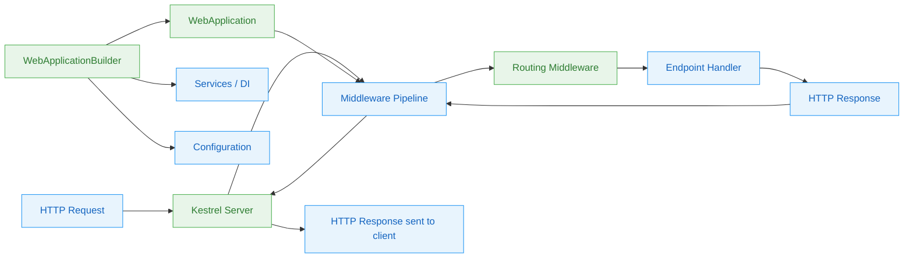

# Nivel 1: Fundamentos — ASP.NET Core

> 🌐 [English version](../en/01-foundations-aspnet-core.md)

> 🎯 **Perfil objetivo:** Desarrolladores nuevos en ASP.NET Core o que vienen de otro framework web
> ⏱️ **Esfuerzo estimado:** 12-15 horas
> 📋 **Requisitos previos:** Conocimiento básico de C# (variables, clases, sintaxis de async/await), comprensión básica de HTTP (qué es una URL, qué es una petición del navegador)

---

## OBJETIVOS DE APRENDIZAJE

Al completar este módulo, vas a ser capaz de:

1. **Explicar** el rol del servidor web (Kestrel), el middleware pipeline y el sistema de routing en el procesamiento de una petición HTTP
2. **Crear** una nueva aplicación ASP.NET Core usando `dotnet new web` e identificar el propósito de cada línea en `Program.cs`
3. **Describir** cómo los componentes de middleware forman un pipeline y cómo una petición lo recorre
4. **Asociar** una URL a un handler usando minimal API endpoints y routing básico
5. **Registrar** y resolver servicios usando dependency injection en `Program.cs`
6. **Configurar** los ajustes de la aplicación con `appsettings.json` y variables de entorno
7. **Ejecutar** y depurar una aplicación básica de ASP.NET Core usando `dotnet run` y `dotnet watch`

---

## MAPA CONCEPTUAL



**Cómo leer este diagrama:** Los nodos azules son conceptos que vas a aprender. Los nodos verdes enlazan a archivos reales del código fuente de este repositorio que implementan esos conceptos. Seguí las flechas para trazar cómo una petición HTTP viaja a través del sistema.

---

## PLAN DE ESTUDIOS

### Lección 1.1: HTTP — El lenguaje de la web

**Concepto:** Toda aplicación web, sin importar el framework, hace exactamente una cosa: recibe una petición HTTP y produce una respuesta HTTP. Antes de escribir cualquier código ASP.NET Core, asegurémonos de entender cómo se ve HTTP en la práctica.

Una petición HTTP tiene cuatro partes:
- **Método** — qué querés hacer (`GET`, `POST`, `PUT`, `DELETE`)
- **Ruta** — a qué recurso querés acceder (`/products`, `/users/42`)
- **Headers** — metadatos (tipo de contenido, autorización, cookies)
- **Body** — datos que estás enviando (en peticiones `POST`/`PUT`)

Una respuesta HTTP tiene tres partes:
- **Código de estado** — qué pasó (`200 OK`, `404 Not Found`, `500 Internal Server Error`)
- **Headers** — metadatos sobre la respuesta (tipo de contenido, cache)
- **Body** — los datos que se devuelven (HTML, JSON, etc.)

**📖 Conexión con el código fuente:**

Abrí [`src/Http/Http.Abstractions/src/HttpRequest.cs`](../../src/Http/Http.Abstractions/src/HttpRequest.cs) y mirá las propiedades abstractas. Vas a ver que ASP.NET Core modela una petición con exactamente las partes que acabamos de describir:

```csharp
// De src/Http/Http.Abstractions/src/HttpRequest.cs
public abstract class HttpRequest
{
    public abstract string Method { get; set; }
    public abstract PathString Path { get; set; }
    public abstract IHeaderDictionary Headers { get; }
    public abstract Stream Body { get; set; }
    // ... y más como QueryString, ContentType, Cookies
}
```

Cada vez que tu código se ejecuta dentro de ASP.NET Core, está trabajando con un objeto `HttpRequest` que tiene estas propiedades pobladas a partir de los bytes crudos que llegaron por la red.

Del mismo modo, abrí [`src/Http/Http.Abstractions/src/HttpResponse.cs`](../../src/Http/Http.Abstractions/src/HttpResponse.cs):

```csharp
// De src/Http/Http.Abstractions/src/HttpResponse.cs
public abstract class HttpResponse
{
    public abstract int StatusCode { get; set; }
    public abstract IHeaderDictionary Headers { get; }
    public abstract Stream Body { get; set; }
}
```

Tu trabajo como desarrollador es leer de la petición y escribir en la respuesta.

**🛠️ Ejercicio: Inspeccioná tráfico HTTP real**

1. Abrí una terminal y ejecutá:
   ```bash
   curl -v https://httpbin.org/get
   ```
2. Observá las líneas que empiezan con `>` (lo que enviaste) y `<` (lo que recibiste).
3. Identificá el método, la ruta, los headers, el código de estado y el body de la respuesta.
4. Probá con distintas opciones:
   ```bash
   curl -v -X POST https://httpbin.org/post -H "Content-Type: application/json" -d '{"name":"learner"}'
   ```

También podés abrir las Herramientas de Desarrollo del navegador (F12), ir a la pestaña **Red** (Network), visitar cualquier sitio web y hacer clic en una petición para ver la misma información.

**💡 Conclusión clave:** Todo framework web consiste, en última instancia, en recibir peticiones HTTP y producir respuestas HTTP. ASP.NET Core simplemente te da una forma estructurada y potente de hacerlo.

---

### Lección 1.2: Tu primera aplicación ASP.NET Core

**Concepto:** Vamos a crear una aplicación ASP.NET Core y entender cada línea. La plantilla `dotnet new web` genera la aplicación web más pequeña posible — apenas unas pocas líneas de C# en `Program.cs`.

**Lo que crea `dotnet new web`:**

```csharp
// Program.cs — la aplicación completa
var builder = WebApplication.CreateBuilder(args);  // 1. Crear el builder
var app = builder.Build();                          // 2. Construir la app

app.MapGet("/", () => "Hello World!");              // 3. Definir un endpoint

app.Run();                                          // 4. Empezar a escuchar
```

Desglosemos lo que hace cada línea:

| Línea | Qué hace | Para qué |
|-------|----------|----------|
| `WebApplication.CreateBuilder(args)` | Crea un builder con configuración por defecto, logging, contenedor de DI | Prepara toda la "plomería" que tu app necesita |
| `builder.Build()` | Finaliza la configuración y crea el `WebApplication` | Fija los registros de servicios y la configuración |
| `app.MapGet("/", ...)` | Registra un handler para peticiones `GET /` | Le dice al sistema de routing qué código ejecutar para esta URL |
| `app.Run()` | Inicia el servidor web Kestrel y comienza a escuchar | Tu app ya está aceptando peticiones HTTP |

**📖 Conexión con el código fuente:**

Abrí [`src/DefaultBuilder/src/WebApplicationBuilder.cs`](../../src/DefaultBuilder/src/WebApplicationBuilder.cs) — esta es la clase que devuelve `WebApplication.CreateBuilder()`. Mirá su constructor para ver todo lo que configura por vos: configuración, logging, dependency injection y más. No tenés que configurar nada de esto para una app básica, pero todo está ahí cuando lo necesites.

Abrí [`src/DefaultBuilder/src/WebApplication.cs`](../../src/DefaultBuilder/src/WebApplication.cs) — esto es lo que devuelve `builder.Build()`. Observá que implementa varias interfaces:

```csharp
// De src/DefaultBuilder/src/WebApplication.cs
public sealed class WebApplication : IHost, IApplicationBuilder, IEndpointRouteBuilder, IAsyncDisposable
```

Por eso podés llamar a `app.MapGet()` (de `IEndpointRouteBuilder`), `app.Use()` (de `IApplicationBuilder`) y `app.Run()` (de `IHost`) — todo sobre el mismo objeto. La clase `WebApplication` conecta todo el framework.

**🛠️ Ejercicio: Creá y modificá tu primera app**

1. Creá un nuevo proyecto:
   ```bash
   dotnet new web -o MyFirstApp
   cd MyFirstApp
   ```
2. Ejecutalo:
   ```bash
   dotnet run
   ```
3. Visitá `http://localhost:5000` en tu navegador (revisá la salida de consola para el puerto exacto).
4. Ahora modificá `Program.cs` para devolver JSON:
   ```csharp
   var builder = WebApplication.CreateBuilder(args);
   var app = builder.Build();

   app.MapGet("/", () => new { Message = "Hello World!", Timestamp = DateTime.UtcNow });

   app.Run();
   ```
5. Ejecutá de nuevo y observá que el navegador ahora muestra JSON con el header `Content-Type: application/json` correcto. ASP.NET Core serializó tu objeto anónimo automáticamente.

**💡 Conclusión clave:** `Program.cs` es donde configurás los servicios (lo que tu app necesita) y el middleware (cómo se procesan las peticiones). Es el punto de entrada único que conecta todo.

**⚠️ Concepto erróneo común:** *"Program.cs reemplazó a Startup.cs"* — En realidad, el patrón builder de .NET 6+ fusionó los dos conceptos. El viejo `Startup.cs` tenía `ConfigureServices()` y `Configure()` como métodos separados. Ahora, `builder.Services` es donde registrás servicios (el viejo `ConfigureServices`), y el código después de `builder.Build()` es donde configurás el middleware (el viejo `Configure`). Son las mismas dos fases, solo que en un archivo.

---

### Lección 1.3: El middleware pipeline

**Concepto:** El middleware es el corazón del procesamiento de peticiones en ASP.NET Core. Cada petición HTTP pasa por un pipeline de componentes de middleware. Cada middleware puede:

1. Hacer algo con la petición (registrarla, verificar autenticación, etc.)
2. Llamar al **siguiente** middleware en el pipeline
3. Hacer algo con la respuesta en el camino de vuelta

Pensalo como muñecas rusas (matrioshkas): cada middleware envuelve al siguiente:

```
Request  →  [Logging]  →  [Auth]  →  [Routing]  →  [Endpoint]
Response ←  [Logging]  ←  [Auth]  ←  [Routing]  ←  [Endpoint]
```

El tipo fundamental detrás de todo middleware es `RequestDelegate`:

```csharp
// Una función que recibe un HttpContext y devuelve un Task
public delegate Task RequestDelegate(HttpContext context);
```

Todo middleware es esencialmente: *"Dado un contexto HTTP y el siguiente delegado a llamar, hacé tu trabajo."*

**📖 Conexión con el código fuente:**

Abrí [`src/Http/Http.Abstractions/src/IApplicationBuilder.cs`](../../src/Http/Http.Abstractions/src/IApplicationBuilder.cs) y mirá el método `Use`:

```csharp
// De src/Http/Http.Abstractions/src/IApplicationBuilder.cs
public interface IApplicationBuilder
{
    IApplicationBuilder Use(Func<RequestDelegate, RequestDelegate> middleware);
    RequestDelegate Build();
    // ...
}
```

El método `Use` recibe una función que toma el *siguiente* middleware (`RequestDelegate`) y devuelve un *nuevo* middleware (`RequestDelegate`) que lo envuelve. El método `Build()` los encadena a todos en un único `RequestDelegate` — el pipeline compilado.

Para middleware inline más simple, mirá [`src/Http/Http.Abstractions/src/Extensions/UseExtensions.cs`](../../src/Http/Http.Abstractions/src/Extensions/UseExtensions.cs), que provee la sintaxis más amigable `app.Use(async (context, next) => { ... })`.

Para middleware basado en clases, consultá [`src/Http/Http.Abstractions/src/Extensions/UseMiddlewareExtensions.cs`](../../src/Http/Http.Abstractions/src/Extensions/UseMiddlewareExtensions.cs), que usa reflexión para conectar clases de middleware con el patrón convencional `InvokeAsync(HttpContext)`.

**🛠️ Ejercicio: Observá el pipeline en acción**

Creá una nueva app y agregá tres componentes de middleware inline para comprobar el orden:

```csharp
var builder = WebApplication.CreateBuilder(args);
var app = builder.Build();

app.Use(async (context, next) =>
{
    Console.WriteLine("Antes 1");
    await next(context);
    Console.WriteLine("Después 1");
});

app.Use(async (context, next) =>
{
    Console.WriteLine("Antes 2");
    await next(context);
    Console.WriteLine("Después 2");
});

app.Use(async (context, next) =>
{
    Console.WriteLine("Antes 3");
    await next(context);
    Console.WriteLine("Después 3");
});

app.MapGet("/", () => "Hello from the endpoint!");

app.Run();
```

Ejecutá la app y hacé una petición. Revisá la salida de consola:

```
Antes 1
Antes 2
Antes 3
Después 3
Después 2
Después 1
```

Notá cómo los mensajes "Antes" van en orden (1, 2, 3) pero los mensajes "Después" van en orden inverso (3, 2, 1). Esta es la anidación en acción — cada middleware envuelve al siguiente.

**💡 Conclusión clave:** El middleware se ejecuta en el orden en que fue registrado. Cada pieza puede modificar la petición, llamar al siguiente middleware y luego modificar la respuesta en el camino de vuelta. El orden en que agregás middleware importa enormemente.

---

### Lección 1.4: Routing — Asociar URLs a código

**Concepto:** El routing es el proceso de hacer coincidir la URL y el método HTTP de una petición entrante con un fragmento de código específico (llamado **endpoint**) que debe manejarla. En ASP.NET Core, el routing se implementa como middleware — se ubica en el pipeline como todo lo demás.

Las plantillas de ruta te permiten definir patrones con parámetros:

| Plantilla | Coincide con | Parámetros |
|-----------|-------------|------------|
| `/products` | `GET /products` | Ninguno |
| `/products/{id}` | `GET /products/42` | `id = "42"` |
| `/products/{id:int}` | `GET /products/42` pero no `/products/abc` | `id = 42` |
| `/files/{**path}` | `GET /files/docs/readme.md` | `path = "docs/readme.md"` |

Las Minimal APIs (`MapGet`, `MapPost`, etc.) son la forma más simple de definir endpoints:

```csharp
app.MapGet("/products/{id}", (int id) => $"Product {id}");
```

ASP.NET Core automáticamente parsea el `{id}` de la URL y lo pasa como el parámetro `int id`.

**📖 Conexión con el código fuente:**

Abrí [`src/Http/Routing/src/EndpointRoutingMiddleware.cs`](../../src/Http/Routing/src/EndpointRoutingMiddleware.cs) — este es el middleware que examina cada URL de petición entrante y selecciona el endpoint que mejor coincida. Se ejecuta temprano en el pipeline para que el middleware posterior (como autorización) sepa qué endpoint fue seleccionado.

Abrí [`src/Http/Routing/src/Builder/EndpointRouteBuilderExtensions.cs`](../../src/Http/Routing/src/Builder/EndpointRouteBuilderExtensions.cs) — aquí es donde se definen `MapGet()`, `MapPost()`, `MapPut()`, `MapDelete()` y `Map()`. Estos métodos de extensión crean registros de endpoint que el middleware de routing usa para hacer coincidir peticiones.

**🛠️ Ejercicio: Construí una mini REST API**

Creá una app con cinco endpoints para un recurso de productos:

```csharp
var builder = WebApplication.CreateBuilder(args);
var app = builder.Build();

var products = new List<string> { "Laptop", "Phone", "Tablet" };

// GET /products — listar todos los productos
app.MapGet("/products", () => products);

// GET /products/{id} — obtener un producto
app.MapGet("/products/{id:int}", (int id) =>
    id >= 0 && id < products.Count
        ? Results.Ok(products[id])
        : Results.NotFound(new { error = $"Product {id} not found" }));

// POST /products — agregar un producto
app.MapPost("/products", (string name) =>
{
    products.Add(name);
    return Results.Created($"/products/{products.Count - 1}", name);
});

// PUT /products/{id} — actualizar un producto
app.MapPut("/products/{id:int}", (int id, string name) =>
{
    if (id < 0 || id >= products.Count)
        return Results.NotFound();
    products[id] = name;
    return Results.Ok(products[id]);
});

// DELETE /products/{id} — eliminar un producto
app.MapDelete("/products/{id:int}", (int id) =>
{
    if (id < 0 || id >= products.Count)
        return Results.NotFound();
    products.RemoveAt(id);
    return Results.NoContent();
});

app.Run();
```

Probá con curl:

```bash
curl http://localhost:5000/products
curl http://localhost:5000/products/0
curl -X POST http://localhost:5000/products -H "Content-Type: application/json" -d '"Monitor"'
```

**💡 Conclusión clave:** El routing es simplemente middleware que examina la URL y selecciona qué handler ejecutar. Los métodos `MapGet`/`MapPost` son atajos convenientes para registrar endpoints con combinaciones específicas de método HTTP y plantilla de ruta.

---

### Lección 1.5: Dependency Injection — Servicios bajo demanda

**Concepto:** Dependency injection (DI) es un patrón donde tu código **pide las cosas que necesita** en lugar de crearlas por su cuenta. En vez de escribir `new EmailService()` dentro de tu handler, declarás que *necesitás* un `IEmailService`, y el framework te lo provee.

¿Por qué importa?
- **Testabilidad** — Podés reemplazar un servicio real de email por uno falso en los tests.
- **Flexibilidad** — Podés cambiar implementaciones sin modificar los consumidores.
- **Gestión de ciclo de vida** — El framework controla cuándo se crean y se liberan los objetos.

ASP.NET Core tiene DI integrado en su núcleo. Registrás servicios con `builder.Services` y el framework los inyecta donde sea necesario.

Los tres ciclos de vida de un servicio:

| Ciclo de vida | Se crea | Se comparte | Usalo cuando |
|---------------|---------|-------------|--------------|
| **Singleton** | Una vez | Entre todas las peticiones | Servicios sin estado, caches |
| **Scoped** | Una vez por petición | Dentro de una sola petición | Contextos de base de datos, estado por petición |
| **Transient** | Cada vez que se solicita | Nunca | Servicios livianos y sin estado |

**📖 Conexión con el código fuente:**

Abrí [`src/DefaultBuilder/src/WebApplicationBuilder.cs`](../../src/DefaultBuilder/src/WebApplicationBuilder.cs) y mirá la propiedad `Services`. Este es el `IServiceCollection` donde van todos los registros de servicios. Cuando escribís `builder.Services.AddSingleton<IMyService, MyService>()`, estás agregando una entrada a esta colección que le dice al contenedor de DI: *"Cada vez que alguien pida un `IMyService`, dale una instancia de `MyService`."*

El propio `WebApplicationBuilder` usa DI extensivamente — logging, configuración, routing y todos los servicios integrados se registran a través del mismo mecanismo que usás para tus propios servicios.

**🛠️ Ejercicio: Conectá tu primer servicio**

```csharp
var builder = WebApplication.CreateBuilder(args);

// 1. Definir una interfaz e implementación
// (En una app real, estarían en archivos separados)

builder.Services.AddSingleton<IGreetingService, GreetingService>();

var app = builder.Build();

// 3. Inyectar el servicio en un endpoint
app.MapGet("/greet/{name}", (string name, IGreetingService greeter) =>
    greeter.Greet(name));

app.Run();

// Definiciones de servicio (ponelas al final de Program.cs para este ejercicio)
public interface IGreetingService
{
    string Greet(string name);
}

public class GreetingService : IGreetingService
{
    public string Greet(string name) => $"Hello, {name}! Welcome to ASP.NET Core.";
}
```

Observá que el handler del endpoint declara `IGreetingService greeter` como parámetro. El contenedor de DI de ASP.NET Core lo detecta, busca el registro y provee una instancia automáticamente. Nunca escribís `new GreetingService()`.

**💡 Conclusión clave:** DI permite que tu código dependa de abstracciones (interfaces) en lugar de implementaciones concretas, haciéndolo más fácil de testear y modificar.

**⚠️ Concepto erróneo común:** *"DI es solo para testing"* — En realidad, DI es la columna vertebral de ASP.NET Core. El framework mismo usa DI para proveer logging, configuración, routing y prácticamente todos los demás servicios. Incluso en la app más simple, `ILogger`, `IConfiguration` y `IWebHostEnvironment` están todos disponibles a través de DI. Ya estás usando DI — quizás simplemente no te diste cuenta.

---

### Lección 1.6: Configuración y entornos

**Concepto:** Las aplicaciones reales necesitan ajustes — cadenas de conexión a bases de datos, claves de API, feature flags. El sistema de configuración de ASP.NET Core es **por capas**: podés definir ajustes en múltiples fuentes, y las fuentes posteriores sobrescriben a las anteriores.

Las fuentes de configuración por defecto (en orden de precedencia, de menor a mayor):

1. `appsettings.json` — ajustes base
2. `appsettings.{Environment}.json` — sobrescrituras específicas del entorno (ej., `appsettings.Development.json`)
3. Variables de entorno
4. Argumentos de línea de comandos

Esto significa que podés poner valores por defecto en `appsettings.json`, sobrescribirlos para desarrollo en `appsettings.Development.json`, y sobrescribir de nuevo con variables de entorno en producción — sin cambiar una línea de código.

La variable `ASPNETCORE_ENVIRONMENT` controla en qué entorno se ejecuta tu app. Valores comunes:
- `Development` — errores detallados, hot reload, herramientas de desarrollo
- `Staging` — similar a producción pero para pruebas
- `Production` — optimizado, mínimos detalles de error (el valor por defecto)

**📖 Conexión con el código fuente:**

Abrí [`src/DefaultBuilder/src/WebApplicationBuilder.cs`](../../src/DefaultBuilder/src/WebApplicationBuilder.cs) y observá cómo configura las fuentes de configuración. El builder agrega `appsettings.json`, `appsettings.{Environment}.json`, variables de entorno y argumentos de línea de comandos en un orden específico. Este es el sistema por capas en acción — cada fuente puede sobrescribir valores de fuentes previas.

La propiedad `Configuration` en `WebApplicationBuilder` te da acceso a todos los valores configurados a través de la interfaz `IConfiguration`.

**🛠️ Ejercicio: Capas de configuración en acción**

1. Creá `appsettings.json`:
   ```json
   {
     "AppSettings": {
       "Greeting": "Hello from appsettings.json",
       "MaxItems": 100
     }
   }
   ```

2. Creá `appsettings.Development.json`:
   ```json
   {
     "AppSettings": {
       "Greeting": "Hello from Development!"
     }
   }
   ```

3. Leé la configuración en `Program.cs`:
   ```csharp
   var builder = WebApplication.CreateBuilder(args);
   var app = builder.Build();

   app.MapGet("/config", (IConfiguration config) => new
   {
       Greeting = config["AppSettings:Greeting"],
       MaxItems = config["AppSettings:MaxItems"],
       Environment = app.Environment.EnvironmentName
   });

   app.Run();
   ```

4. Ejecutá la app (el entorno por defecto es `Development`):
   ```bash
   dotnet run
   ```
   Visitá `/config` — vas a ver `"Hello from Development!"` (sobrescrito) y `MaxItems: 100` (del archivo base).

5. Ahora sobrescribí con una variable de entorno:
   ```bash
   # Windows PowerShell
   $env:AppSettings__Greeting = "Hello from env var!"
   dotnet run
   ```
   Visitá `/config` de nuevo — la variable de entorno gana.

   > **Nota:** Las variables de entorno usan `__` (doble guion bajo) como separador de secciones en lugar de `:`.

**💡 Conclusión clave:** La configuración en ASP.NET Core es por capas — las fuentes posteriores sobrescriben a las anteriores, y las variables de entorno siempre ganan. Esto te permite mantener secretos fuera del código fuente y personalizar el comportamiento por entorno sin cambios de código.

---

## GUÍA DE LECTURA DEL CÓDIGO FUENTE

Leé estos archivos en orden para construir un modelo mental de cómo funciona ASP.NET Core. Empezá por las abstracciones más simples y avanzá hacia las implementaciones.

| Orden | Archivo | En qué enfocarte | Dificultad |
|-------|---------|-------------------|------------|
| 1 | [`src/Http/Http.Abstractions/src/HttpContext.cs`](../../src/Http/Http.Abstractions/src/HttpContext.cs) | Propiedades que modelan un intercambio HTTP — `Request`, `Response`, `Connection`, `User` | ⭐ |
| 2 | [`src/Http/Http.Abstractions/src/HttpRequest.cs`](../../src/Http/Http.Abstractions/src/HttpRequest.cs) | Cómo se representa una petición entrante — `Method`, `Path`, `Headers`, `Body` | ⭐ |
| 3 | [`src/Http/Http.Abstractions/src/HttpResponse.cs`](../../src/Http/Http.Abstractions/src/HttpResponse.cs) | Cómo se representa una respuesta saliente — `StatusCode`, `Headers`, `Body` | ⭐ |
| 4 | [`src/DefaultBuilder/src/WebApplication.cs`](../../src/DefaultBuilder/src/WebApplication.cs) | Cómo funcionan `Run()`, `MapGet()`, etc. — notá que implementa `IHost`, `IApplicationBuilder` e `IEndpointRouteBuilder` | ⭐⭐ |
| 5 | [`src/DefaultBuilder/src/WebApplicationBuilder.cs`](../../src/DefaultBuilder/src/WebApplicationBuilder.cs) | Cómo el builder configura servicios, configuración, logging — el punto de entrada `CreateBuilder()` | ⭐⭐ |
| 6 | [`src/Http/Http.Abstractions/src/IApplicationBuilder.cs`](../../src/Http/Http.Abstractions/src/IApplicationBuilder.cs) | El método `Use()` que agrega middleware al pipeline | ⭐⭐ |
| 7 | [`src/Http/Routing/src/Builder/EndpointRouteBuilderExtensions.cs`](../../src/Http/Routing/src/Builder/EndpointRouteBuilderExtensions.cs) | Donde se definen `MapGet()`, `MapPost()`, etc. | ⭐⭐ |

**Consejos de lectura:**
- No intentes entender cada línea. Enfocate en la *superficie pública* — las propiedades, métodos e interfaces.
- Usá "Ir a la definición" (F12) de tu IDE para saltar desde las clases abstractas a sus implementaciones cuando tengas curiosidad.
- Calificaciones de estrellas: ⭐ = leé los nombres de propiedades/métodos y los comentarios de documentación. ⭐⭐ = leé algunos detalles de implementación.

---

## Herramientas de diagnóstico y comandos

Estas son las herramientas que vas a usar a diario cuando desarrolles aplicaciones ASP.NET Core:

| Comando / Herramienta | Qué hace | Cuándo usarlo |
|------------------------|----------|---------------|
| `dotnet new web` | Genera un proyecto ASP.NET Core mínimo | Al iniciar un nuevo proyecto |
| `dotnet run` | Compila y ejecuta la aplicación | Para probar tus cambios después de editar código |
| `dotnet watch` | Ejecuta con hot reload — reinicia ante cambios en archivos | Desarrollo iterativo (editar → guardar → ver resultados) |
| `dotnet build` | Compila sin ejecutar | Para verificar errores de compilación |
| Herramientas de Desarrollo del navegador (F12) | Detalles de petición/respuesta, headers, tiempos, pestaña de red | Para entender intercambios HTTP, depurar respuestas |
| `curl -v http://localhost:5000/` | Petición/respuesta HTTP cruda en la terminal | Para ver exactamente qué headers/estado envía el servidor |

**Consejo pro:** Durante el desarrollo, usá `dotnet watch` en lugar de `dotnet run`. Vigila los cambios en archivos y automáticamente recompila y reinicia tu app:

```bash
dotnet watch --project MyFirstApp
```

---

## AUTOEVALUACIÓN

Poné a prueba tu comprensión de los fundamentos. Intentá responder cada pregunta antes de expandir la respuesta.

### Verificaciones de conocimiento

<details>
<summary>1. ¿Cuáles son las cuatro partes de una petición HTTP?</summary>

**Método**, **ruta**, **headers** y **body**. Podés ver estas modeladas como propiedades en [`src/Http/Http.Abstractions/src/HttpRequest.cs`](../../src/Http/Http.Abstractions/src/HttpRequest.cs): `Method`, `Path`, `Headers` y `Body`.

</details>

<details>
<summary>2. ¿Cuál es la diferencia entre <code>builder.Services</code> y el código después de <code>builder.Build()</code>?</summary>

`builder.Services` es donde **registrás servicios** en el contenedor de dependency injection (el viejo `ConfigureServices`). El código después de `builder.Build()` es donde **configurás el middleware pipeline** — el orden en que se procesan las peticiones (el viejo `Configure`). Podés ver la propiedad `Services` en [`src/DefaultBuilder/src/WebApplicationBuilder.cs`](../../src/DefaultBuilder/src/WebApplicationBuilder.cs).

</details>

<details>
<summary>3. Si agregás tres componentes de middleware A, B y C (en ese orden), ¿cuál es el orden de ejecución para una petición?</summary>

**Petición:** A → B → C → Endpoint
**Respuesta:** Endpoint → C → B → A

Cada middleware llama a `next()` para pasar el control hacia adelante, y el código después de `await next()` se ejecuta en el camino de vuelta. Este es el patrón de "muñeca rusa". El método `Use()` en [`src/Http/Http.Abstractions/src/IApplicationBuilder.cs`](../../src/Http/Http.Abstractions/src/IApplicationBuilder.cs) es lo que los encadena.

</details>

<details>
<summary>4. ¿Qué significa la plantilla de ruta <code>/products/{id:int}</code>?</summary>

Coincide con URLs como `/products/42` donde `{id}` es un parámetro de ruta de tipo entero. El `:int` es una **restricción de ruta** (route constraint) que rechaza valores no enteros (ej., `/products/abc` devolvería 404). La coincidencia de rutas la realiza [`EndpointRoutingMiddleware`](../../src/Http/Routing/src/EndpointRoutingMiddleware.cs).

</details>

<details>
<summary>5. ¿Cuál es la diferencia entre los ciclos de vida Singleton, Scoped y Transient?</summary>

- **Singleton** — una instancia para toda la vida de la aplicación (compartida entre todas las peticiones)
- **Scoped** — una instancia por petición HTTP (compartida dentro de esa petición, liberada al final)
- **Transient** — una instancia nueva cada vez que se solicita del contenedor

Un error común es registrar un servicio Scoped pero inyectarlo en un Singleton — el servicio Scoped se convierte efectivamente en un Singleton, lo que puede causar bugs con estado compartido. ASP.NET Core valida esto en Development y lanza una `InvalidOperationException`.

</details>

<details>
<summary>6. ¿Por qué las variables de entorno usan <code>__</code> (doble guion bajo) en vez de <code>:</code> como separador de secciones?</summary>

Porque los dos puntos `:` no son un carácter válido en nombres de variables de entorno en algunos sistemas operativos (notablemente Linux). El doble guion bajo `__` es una convención multiplataforma que el sistema de configuración de ASP.NET Core convierte automáticamente a `:` al leer los valores. Así, `AppSettings__Greeting` se mapea a `AppSettings:Greeting` en la configuración.

</details>

### Desafío práctico (30-60 minutos)

**Construí una API de "Frase del día"**

Creá una aplicación ASP.NET Core con Minimal API que:

1. Tenga un `QuoteService` registrado con DI que devuelva frases aleatorias de una lista hardcodeada
2. Tenga un endpoint `/quote` que devuelva una frase aleatoria como JSON
3. Tenga un endpoint `/quotes` que devuelva todas las frases
4. Tenga un endpoint `/quote/{id}` que devuelva una frase específica por índice
5. Lea el nombre de la aplicación desde `appsettings.json` y lo incluya en cada respuesta
6. Tenga un middleware personalizado que registre en consola el método y la ruta de cada petición

**Criterios de éxito:**
- `curl http://localhost:5000/quote` devuelve una frase aleatoria como JSON
- `curl http://localhost:5000/quotes` devuelve todas las frases
- `curl http://localhost:5000/quote/0` devuelve la primera frase
- Cada petición imprime una línea de log en la consola

---

## Conexiones

| Dirección | Enlace |
|-----------|--------|
| ⬆️ **Siguiente** | **Nivel 2: Practicante** — Construcción de aplicaciones reales con controllers, autenticación/autorización, Entity Framework Core y patrones de diseño de APIs |
| ↔️ **Relacionado** | Módulos de Nivel 1 en la ruta de aprendizaje de dotnet/runtime para fundamentos de C# y .NET (async/await, LINQ, colecciones) |

---

## GLOSARIO

| Término (ES) | Term (EN) | Definición |
|--------------|-----------|------------|
| **Middleware** | Middleware | Un componente en el pipeline de peticiones que procesa peticiones y respuestas HTTP. Cada middleware puede inspeccionar, modificar o cortocircuitar la petición antes de pasarla al siguiente componente. |
| **Canalización (Pipeline)** | Pipeline | La secuencia ordenada de componentes de middleware por la que pasa cada petición HTTP. Se define por el orden de las llamadas `app.Use()` / `app.Map*()` en `Program.cs`. |
| **Enrutamiento (Routing)** | Routing | El proceso de hacer coincidir la URL y el método HTTP de una petición entrante con un handler de endpoint específico. Implementado por `EndpointRoutingMiddleware`. |
| **Punto de conexión (Endpoint)** | Endpoint | Una unidad de lógica de manejo de peticiones asociada a un patrón de URL y un método HTTP. Se crea con `MapGet()`, `MapPost()`, etc. |
| **Inyección de dependencias (DI)** | Dependency Injection (DI) | Un patrón de diseño donde los objetos reciben sus dependencias de una fuente externa (el contenedor de DI) en lugar de crearlas internamente. Central en la arquitectura de ASP.NET Core. |
| **Ciclo de vida del servicio** | Service Lifetime | Controla cuánto tiempo vive una instancia de servicio registrada en DI: Singleton (vida de la app), Scoped (por petición) o Transient (por resolución). |
| **Kestrel** | Kestrel | El servidor HTTP multiplataforma integrado en ASP.NET Core. Es lo que escucha conexiones de red y convierte bytes crudos en objetos `HttpContext`. |
| **HttpContext** | HttpContext | El objeto que encapsula toda la información sobre una petición HTTP individual y su respuesta. Se pasa a través del middleware pipeline. Ver `src/Http/Http.Abstractions/src/HttpContext.cs`. |
| **RequestDelegate** | RequestDelegate | Una firma de función (`Func<HttpContext, Task>`) que representa un componente de middleware o el middleware pipeline compilado. |
| **WebApplicationBuilder** | WebApplicationBuilder | El objeto builder que configura servicios, fuentes de configuración y logging antes de crear el `WebApplication`. Ver `src/DefaultBuilder/src/WebApplicationBuilder.cs`. |

---

## REFERENCIAS

| Recurso | Tipo | Por qué es útil |
|---------|------|-----------------|
| [Fundamentos de ASP.NET Core](https://learn.microsoft.com/aspnet/core/fundamentals/) | Documentación | Descripción oficial de middleware, routing, DI, configuración y hosting |
| [Tutorial: Crear una Minimal API](https://learn.microsoft.com/aspnet/core/tutorials/min-web-api) | Tutorial | Guía paso a paso para construir una Minimal API con ASP.NET Core |
| [Middleware en ASP.NET Core](https://learn.microsoft.com/aspnet/core/fundamentals/middleware/) | Documentación | Inmersión profunda en cómo funciona el middleware pipeline |
| [Dependency Injection en ASP.NET Core](https://learn.microsoft.com/aspnet/core/fundamentals/dependency-injection) | Documentación | Guía completa del contenedor de DI integrado |
| [Configuración en ASP.NET Core](https://learn.microsoft.com/aspnet/core/fundamentals/configuration/) | Documentación | Cómo funcionan las fuentes de configuración, proveedores y el patrón de opciones |
| [Ejemplos de Minimal API de David Fowler](https://github.com/davidfowl/CommunityStandUpMinimalAPI) | Ejemplos de código | Ejemplos prácticos de uno de los arquitectos de ASP.NET Core |
| [Repositorio dotnet/aspnetcore](https://github.com/dotnet/aspnetcore) | Código fuente | El código fuente que estuviste leyendo a lo largo de este módulo |
