# Nivel 2: Practicante — ASP.NET Core

> 🌐 [English version](../en/02-practitioner-aspnet-core.md)

> 🎯 **Perfil objetivo:** Desarrolladores que construyen aplicaciones ASP.NET Core a diario pero quieren ir más allá de los tutoriales
> ⏱️ **Esfuerzo estimado:** 15–18 horas
> 📋 **Prerrequisitos:** Nivel 1 Fundamentos, familiaridad con async/await en C#, conocimiento básico de HTTP

---

## OBJETIVOS DE APRENDIZAJE

Al completar este módulo, vas a ser capaz de:

1. **Comparar Controllers vs Minimal APIs** y elegir el modelo adecuado para un escenario dado basándote en ventajas y desventajas concretas, no en opiniones.
2. **Implementar model binding** desde query strings, valores de ruta, headers y el cuerpo de la solicitud, y aplicar atributos de validation para rechazar datos inválidos automáticamente.
3. **Escribir una clase de middleware personalizada** que maneje preocupaciones transversales (medición de tiempo, headers personalizados, logging de solicitudes) usando el patrón `InvokeAsync`.
4. **Configurar autenticación JWT Bearer** y autorización basada en políticas para endpoints de API.
5. **Implementar manejo de errores apropiado** usando middleware de excepciones, `ProblemDetails` y páginas de código de estado.
6. **Integrar Entity Framework Core** con gestión correcta de tiempos de vida de servicios (`DbContext` Scoped).
7. **Escribir pruebas unitarias** para controllers y middleware usando dependency injection y mocking.
8. **Usar logging de forma efectiva** con logging estructurado, niveles de log y log scopes para diagnóstico en producción.

---

## MAPA CONCEPTUAL

```mermaid
graph LR
    WAB["WebApplicationBuilder<br/>(configure services)"]
    SVC["Services / DI Container"]
    MW["Middleware Pipeline"]
    AUTH["AuthN Middleware"]
    ROUT["Routing Middleware"]
    AUTHZ["AuthZ Middleware"]
    EP["Endpoint Execution"]
    CTRL["Controller / Minimal API"]
    MB["Model Binding"]
    FILT["Action Filters"]
    RESP["HTTP Response"]

    WAB -->|registers| SVC
    WAB -->|builds| MW
    MW --> AUTH
    AUTH --> ROUT
    ROUT --> AUTHZ
    AUTHZ --> EP
    EP --> CTRL
    CTRL --> MB
    MB --> FILT
    FILT --> RESP

    classDef concept fill:#e0f0ff,stroke:#1a73e8,color:#000
    classDef source fill:#fff3e0,stroke:#e65100,color:#000
    classDef tool fill:#e8f5e9,stroke:#2e7d32,color:#000

    class WAB,SVC,MW source
    class AUTH,ROUT,AUTHZ,EP,CTRL,MB,FILT concept
    class RESP tool
```



**Cómo leer el mapa:** Una solicitud ingresa al middleware pipeline y fluye a través de Authentication, Routing y Authorization antes de llegar al endpoint seleccionado. Ya sea que ese endpoint sea una acción de controller o un handler de minimal API, el mismo sistema de routing lo despacha. Model binding y los filtros envuelven la ejecución.

---

## PLAN DE ESTUDIOS

### Lección 2.1: Controllers vs Minimal APIs — Dos caminos al mismo destino

**Concepto:** En el Nivel 1 aprendiste que cada solicitud pasa por un middleware pipeline y llega a un endpoint. ASP.NET Core ofrece dos modelos de programación para definir esos endpoints: **MVC controllers** (basados en convenciones, ricos en funcionalidades) y **minimal APIs** (explícitos, livianos). Entender cómo ambos se registran en el mismo sistema de routing te permite elegir la herramienta correcta en lugar de seguir consejos repetidos sin fundamento.

#### 📂 Conexión con el Código Fuente

| Archivo | Qué buscar |
|---|---|
| [`src/Mvc/Mvc.Core/src/Infrastructure/ControllerActionInvoker.cs`](../../src/Mvc/Mvc.Core/src/Infrastructure/ControllerActionInvoker.cs) | Cómo se invoca una acción de controller — seguí la cadena de `InvokeAsync` para ver model binding, filtros y ejecución de la acción |
| [`src/Http/Routing/src/Builder/EndpointRouteBuilderExtensions.cs`](../../src/Http/Routing/src/Builder/EndpointRouteBuilderExtensions.cs) | Cómo `MapGet`, `MapPost`, etc. registran objetos `RouteEndpoint` en la tabla de routing — la misma tabla que usan los controllers |
| [`src/Mvc/Mvc.Core/src/Infrastructure/ResourceInvoker.cs`](../../src/Mvc/Mvc.Core/src/Infrastructure/ResourceInvoker.cs) | El invoker base que `ControllerActionInvoker` extiende — contiene el pipeline de filtros (authorization, resource, action, result filters) |

#### 🛠️ Ejercicio: Construí la misma API dos veces

Construí una API CRUD simple de Productos **dos veces** — una con controllers, otra con minimal APIs:

**Versión con controller:**

```csharp
[ApiController]
[Route("api/[controller]")]
public class ProductsController : ControllerBase
{
    private static readonly List<Product> _products = [];

    [HttpGet]
    public IActionResult GetAll() => Ok(_products);

    [HttpGet("{id:int}")]
    public IActionResult GetById(int id)
    {
        var product = _products.FirstOrDefault(p => p.Id == id);
        return product is null ? NotFound() : Ok(product);
    }

    [HttpPost]
    public IActionResult Create(Product product)
    {
        _products.Add(product);
        return CreatedAtAction(nameof(GetById), new { id = product.Id }, product);
    }
}
```

**Versión con minimal API:**

```csharp
var products = new List<Product>();

app.MapGet("/api/products", () => Results.Ok(products));

app.MapGet("/api/products/{id:int}", (int id) =>
{
    var product = products.FirstOrDefault(p => p.Id == id);
    return product is null ? Results.NotFound() : Results.Ok(product);
});

app.MapPost("/api/products", (Product product) =>
{
    products.Add(product);
    return Results.Created($"/api/products/{product.Id}", product);
});
```

Probá ambas con las mismas solicitudes HTTP. Las respuestas son idénticas — porque ambos modelos producen endpoints en el mismo sistema de routing.

#### 💡 Conclusión Clave

Tanto controllers como minimal APIs registran endpoints en la **misma tabla de routing**. Los controllers agregan convenciones automáticamente (model binding, filtros, negociación de contenido); las minimal APIs te dan control explícito sobre cada comportamiento. La elección es convención vs configuración explícita, no aplicación grande vs aplicación chica.

> 🚫 **Concepto erróneo común:** "Las minimal APIs son solo para aplicaciones chicas." — Las minimal APIs están listas para producción y se usan en microservicios de alto rendimiento. Soportan filtros, validation, metadatos OpenAPI y DI. La diferencia está en cuánto hace el framework por convención vs cuánto conectás vos explícitamente.

---

### Lección 2.2: Model Binding y Validation — De datos HTTP a objetos C#

**Concepto:** Cada solicitud HTTP lleva datos en diferentes lugares — segmentos de ruta, query strings, headers, cookies y el cuerpo. **Model binding** es la funcionalidad de ASP.NET Core que lee estas fuentes y mapea los valores a los parámetros de tus métodos automáticamente. **Validation** luego verifica esos valores contra reglas antes de que tu código se ejecute.

#### 📂 Conexión con el Código Fuente

| Archivo | Qué buscar |
|---|---|
| [`src/Mvc/Mvc.Core/src/Infrastructure/ControllerActionInvoker.cs`](../../src/Mvc/Mvc.Core/src/Infrastructure/ControllerActionInvoker.cs) | Buscá `BindArgumentsAsync` — aquí es donde model binding se ejecuta en el pipeline del controller, antes de que tu método de acción se ejecute |
| [`src/Http/Http.Abstractions/src/HttpContext.cs`](../../src/Http/Http.Abstractions/src/HttpContext.cs) | El `HttpContext` que lleva `Request.Query`, `Request.RouteValues`, `Request.Headers` y `Request.Body` — todas las fuentes de las que lee model binding |

#### Atributos de fuente de binding

```csharp
[HttpGet("search")]
public IActionResult Search(
    [FromQuery] string term,          // ?term=laptop
    [FromHeader] string acceptLanguage, // Header Accept-Language
    [FromRoute] int categoryId)        // /categories/{categoryId}/search
{
    // Todos los parámetros se llenan automáticamente desde diferentes fuentes HTTP
}

[HttpPost]
public IActionResult Create(
    [FromBody] CreateProductRequest request)  // Cuerpo JSON → objeto C#
{
    // request.Name, request.Price, etc. se deserializan del cuerpo
}
```

#### Agregando validation

```csharp
public class CreateProductRequest
{
    [Required]
    [StringLength(100, MinimumLength = 1)]
    public string Name { get; set; } = string.Empty;

    [Range(0.01, 99999.99)]
    public decimal Price { get; set; }

    [Url]
    public string? ImageUrl { get; set; }
}
```

Cuando se aplica `[ApiController]`, ASP.NET Core devuelve automáticamente un `400 Bad Request` con detalles de errores de validation si el modelo es inválido — tu método de acción nunca se ejecuta.

#### 🛠️ Ejercicio: Validá todo

Creá un endpoint que acepte un `CreateOrderRequest` con objetos anidados y validation:

1. Agregá atributos `[Required]`, `[Range]`, `[StringLength]` y `[EmailAddress]`
2. Enviá datos válidos — verificá una respuesta `201`
3. Enviá datos inválidos — observá la respuesta automática `400` con mensajes de error por campo
4. Intentá enviar datos en la fuente incorrecta (datos del body en la query string) — entendé por qué falla

#### 💡 Conclusión Clave

Model binding te ahorra tener que parsear datos HTTP manualmente. El framework lee la fuente correcta basándose en convenciones (body para tipos complejos, route/query para tipos simples) y atributos (`[FromBody]`, `[FromQuery]`). Validation se ejecuta **antes** de tu código, así que podés confiar en que los parámetros cumplen tus reglas.

---

### Lección 2.3: Escribiendo Middleware Personalizado

**Concepto:** En el Nivel 1 aprendiste que el middleware se ejecuta en orden, formando un pipeline. Ahora vamos a escribir el nuestro. Una **clase de middleware** recibe dependency injection en su constructor y procesa cada solicitud en su método `InvokeAsync`. Entender este patrón — y sus implicaciones de tiempo de vida — es esencial para agregar preocupaciones transversales como medición de tiempos, logging o headers personalizados.

#### 📂 Conexión con el Código Fuente

| Archivo | Qué buscar |
|---|---|
| [`src/Http/Http.Abstractions/src/Extensions/UseMiddlewareExtensions.cs`](../../src/Http/Http.Abstractions/src/Extensions/UseMiddlewareExtensions.cs) | Cómo `UseMiddleware<T>()` descubre tu clase — busca un método `InvokeAsync` o `Invoke`, lo envuelve en un `RequestDelegate` y lo inserta en el pipeline |
| [`src/Middleware/HttpsPolicy/src/HttpsRedirectionMiddleware.cs`](../../src/Middleware/HttpsPolicy/src/HttpsRedirectionMiddleware.cs) | Una clase de middleware real de producción — observá que el constructor toma `RequestDelegate next` e `IOptions<T>`, mientras que `Invoke` toma `HttpContext` |
| [`src/Middleware/StaticFiles/src/StaticFileMiddleware.cs`](../../src/Middleware/StaticFiles/src/StaticFileMiddleware.cs) | Un middleware más complejo que puede cortocircuitar el pipeline (sirve un archivo y se saltea `_next`) |

#### El patrón de clase middleware

```csharp
public class RequestTimingMiddleware
{
    private readonly RequestDelegate _next;
    private readonly ILogger<RequestTimingMiddleware> _logger;

    // Constructor: se ejecuta UNA VEZ cuando se registra el middleware (similar a singleton)
    public RequestTimingMiddleware(RequestDelegate next, ILogger<RequestTimingMiddleware> logger)
    {
        _next = next;
        _logger = logger;
    }

    // InvokeAsync: se ejecuta en CADA solicitud
    public async Task InvokeAsync(HttpContext context)
    {
        var stopwatch = Stopwatch.StartNew();

        // Agregar un header de respuesta antes de llamar a next
        context.Response.OnStarting(() =>
        {
            context.Response.Headers["X-Response-Time-Ms"] = stopwatch.ElapsedMilliseconds.ToString();
            return Task.CompletedTask;
        });

        await _next(context);  // Llamar al siguiente middleware

        stopwatch.Stop();
        _logger.LogInformation(
            "Request {Method} {Path} completed in {ElapsedMs}ms with status {StatusCode}",
            context.Request.Method,
            context.Request.Path,
            stopwatch.ElapsedMilliseconds,
            context.Response.StatusCode);
    }
}
```

Registralo en `Program.cs`:

```csharp
app.UseMiddleware<RequestTimingMiddleware>();
// O creá un método de extensión:
// app.UseRequestTiming();
```

#### 🛠️ Ejercicio: Construí `RequestTimingMiddleware`

1. Creá la clase de middleware mostrada arriba
2. Registrala **antes** de `UseRouting()` para que envuelva todo el pipeline
3. Enviá solicitudes y verificá el header de respuesta `X-Response-Time-Ms`
4. Agregá un endpoint lento (`await Task.Delay(500)`) y verificá que la medición de tiempo sea precisa
5. Poné un breakpoint en el constructor y en `InvokeAsync` — confirmá que el constructor se ejecuta una vez, `InvokeAsync` se ejecuta por solicitud

#### 💡 Conclusión Clave

Las clases de middleware reciben DI en el constructor (similar a singleton) y datos por solicitud a través de los parámetros de `InvokeAsync`. Si necesitás servicios scoped (como `DbContext`) dentro del middleware, inyectalos como parámetros de `InvokeAsync`, no como parámetros del constructor.

> 🚫 **Concepto erróneo común:** "Los constructores de middleware se ejecutan por solicitud." — ¡No! La instancia de middleware se crea **una sola vez** cuando se construye el pipeline (como un singleton). Solo `InvokeAsync` se ejecuta por solicitud. Esto importa para los tiempos de vida de servicios — si inyectás un servicio scoped en el constructor, vas a tener un bug de dependencia cautiva.

Abrí `UseMiddlewareExtensions.cs` y buscá dónde crea la instancia de middleware — vas a ver que usa `ActivatorUtilities.CreateInstance`, que se ejecuta una sola vez durante el inicio.

---

### Lección 2.4: Fundamentos de Authentication y Authorization

**Concepto:** **Authentication (AuthN)** responde "¿quién sos?" — establece `HttpContext.User`. **Authorization (AuthZ)** responde "¿tenés permiso?" — verifica los claims del usuario contra los requisitos. Estos son middleware separados que se ejecutan en diferentes puntos del pipeline, y entender su orden es crítico.

#### 📂 Conexión con el Código Fuente

| Archivo | Qué buscar |
|---|---|
| [`src/Security/Authentication/Core/src/AuthenticationMiddleware.cs`](../../src/Security/Authentication/Core/src/AuthenticationMiddleware.cs) | El método `Invoke` llama a `context.AuthenticateAsync()` para establecer `HttpContext.User` — esto se ejecuta **antes** de que routing seleccione un endpoint |
| [`src/Security/Authentication/Core/src/AuthenticationHandler.cs`](../../src/Security/Authentication/Core/src/AuthenticationHandler.cs) | Clase base para handlers de esquemas de autenticación (JWT, Cookie, etc.) — mirá `AuthenticateAsync` y `HandleChallengeAsync` |
| [`src/Security/Authorization/Core/src/DefaultAuthorizationService.cs`](../../src/Security/Authorization/Core/src/DefaultAuthorizationService.cs) | El método `AuthorizeAsync` evalúa políticas contra los claims del usuario actual — esto se ejecuta **después** de routing |
| [`src/Security/Authorization/Core/src/AuthorizationHandler.cs`](../../src/Security/Authorization/Core/src/AuthorizationHandler.cs) | Clase base para escribir handlers de autorización personalizados que verifican requisitos específicos |

#### El orden del pipeline importa

```
Request → AuthN Middleware → Routing → AuthZ Middleware → Endpoint
               │                                │
               ▼                                ▼
          Establece HttpContext.User       Verifica políticas de [Authorize]
          (¿quién sos?)                   (¿tenés permiso?)
```

#### Configurando autenticación JWT

```csharp
// En Program.cs — registro de servicios
builder.Services.AddAuthentication(JwtBearerDefaults.AuthenticationScheme)
    .AddJwtBearer(options =>
    {
        options.TokenValidationParameters = new TokenValidationParameters
        {
            ValidateIssuer = true,
            ValidateAudience = true,
            ValidateLifetime = true,
            ValidateIssuerSigningKey = true,
            ValidIssuer = builder.Configuration["Jwt:Issuer"],
            ValidAudience = builder.Configuration["Jwt:Audience"],
            IssuerSigningKey = new SymmetricSecurityKey(
                Encoding.UTF8.GetBytes(builder.Configuration["Jwt:Key"]!))
        };
    });

builder.Services.AddAuthorization(options =>
{
    options.AddPolicy("AdminOnly", policy =>
        policy.RequireClaim("role", "admin"));
});

// En Program.cs — middleware pipeline (EL ORDEN IMPORTA)
app.UseAuthentication();  // Debe ir antes de UseAuthorization
app.UseAuthorization();
```

#### Protegiendo endpoints

```csharp
// Controller
[Authorize]
[ApiController]
[Route("api/[controller]")]
public class OrdersController : ControllerBase
{
    [HttpGet]
    public IActionResult GetOrders() => Ok(/* ... */);

    [Authorize(Policy = "AdminOnly")]
    [HttpDelete("{id}")]
    public IActionResult Delete(int id) => NoContent();
}

// Minimal API
app.MapGet("/api/orders", () => Results.Ok(/* ... */))
    .RequireAuthorization();

app.MapDelete("/api/orders/{id}", (int id) => Results.NoContent())
    .RequireAuthorization("AdminOnly");
```

#### 🛠️ Ejercicio: Asegurá tu API

1. Agregá autenticación JWT Bearer a tu API de Productos de la Lección 2.1
2. Creá un endpoint `/api/auth/login` que valide credenciales y devuelva un token JWT con claims
3. Protegé los endpoints `GET` con `[Authorize]`
4. Creá una política `"AdminOnly"` y protegé el endpoint `DELETE` con ella
5. Probá sin token (esperá `401`), con un token de usuario regular en DELETE (esperá `403`), y con un token de admin (esperá `200`)

#### 💡 Conclusión Clave

El middleware de authentication se ejecuta temprano en el pipeline para establecer la identidad del usuario (`HttpContext.User`). Authorization se ejecuta después, **luego de que routing** haya seleccionado un endpoint, para verificar si el usuario cumple con los requisitos del endpoint. Invertir este orden rompe la autorización porque routing todavía no seleccionó un endpoint.

---

### Lección 2.5: Manejo de Errores y Logging

**Concepto:** Las APIs en producción necesitan respuestas de error estructuradas, no stack traces. ASP.NET Core provee **middleware de manejo de excepciones** que envuelve todo el pipeline y convierte excepciones no manejadas en respuestas HTTP apropiadas. Combinado con **`ProblemDetails`** (RFC 9457), obtenés respuestas de error estandarizadas y legibles por máquinas. El **logging estructurado** con `ILogger<T>` completa el panorama haciendo que los errores sean diagnosticables en producción.

#### 📂 Conexión con el Código Fuente

| Archivo | Qué buscar |
|---|---|
| [`src/Middleware/Diagnostics/src/ExceptionHandler/ExceptionHandlerMiddleware.cs`](../../src/Middleware/Diagnostics/src/ExceptionHandler/ExceptionHandlerMiddleware.cs) | Cómo se capturan las excepciones no manejadas — el método `Invoke` envuelve `_next(context)` en un try/catch y re-ejecuta el pipeline con una ruta de manejo de errores |
| [`src/Http/Http.Abstractions/src/ProblemDetails/ProblemDetails.cs`](../../src/Http/Http.Abstractions/src/ProblemDetails/ProblemDetails.cs) | La clase de respuesta de error estandarizada — propiedades `Status`, `Title`, `Detail`, `Type` y `Extensions` |

#### Configurando manejo global de errores

```csharp
// En Program.cs
builder.Services.AddProblemDetails();

var app = builder.Build();

if (!app.Environment.IsDevelopment())
{
    app.UseExceptionHandler();  // Captura excepciones no manejadas
}

app.UseStatusCodePages();  // Maneja errores sin excepción como los 404
```

#### Respuestas ProblemDetails personalizadas

```csharp
builder.Services.AddProblemDetails(options =>
{
    options.CustomizeProblemDetails = context =>
    {
        context.ProblemDetails.Instance = context.HttpContext.Request.Path;
        context.ProblemDetails.Extensions["traceId"] =
            context.HttpContext.TraceIdentifier;
    };
});
```

#### Logging estructurado

```csharp
public class OrderService
{
    private readonly ILogger<OrderService> _logger;

    public OrderService(ILogger<OrderService> logger)
    {
        _logger = logger;
    }

    public async Task<Order?> GetOrderAsync(int orderId)
    {
        _logger.LogInformation("Retrieving order {OrderId}", orderId);

        // Usar log scopes para información contextual
        using (_logger.BeginScope("OrderProcessing: {OrderId}", orderId))
        {
            var order = await FindOrderAsync(orderId);

            if (order is null)
            {
                _logger.LogWarning("Order {OrderId} not found", orderId);
                return null;
            }

            _logger.LogDebug("Order {OrderId} has {ItemCount} items",
                orderId, order.Items.Count);

            return order;
        }
    }
}
```

> ⚠️ **Importante:** Usá siempre placeholders de logging estructurado (`{OrderId}`) en lugar de interpolación de strings (`$"{orderId}"`). Los placeholders crean campos buscables e indexables en sistemas de agregación de logs. La interpolación de strings crea cadenas únicas que no se pueden agrupar ni consultar.

#### 🛠️ Ejercicio: Manejo global de errores

1. Configurá `AddProblemDetails()` y `UseExceptionHandler()` en tu API
2. Creá un endpoint que intencionalmente lance una excepción
3. Verificá que la respuesta sea un objeto JSON `ProblemDetails` (no un stack trace)
4. Agregá logging estructurado a tus operaciones CRUD de la Lección 2.1
5. Configurá diferentes niveles de log (`Information`, `Warning`, `Error`) y configuralos en `appsettings.json` para filtrarlos:

```json
{
  "Logging": {
    "LogLevel": {
      "Default": "Information",
      "Microsoft.AspNetCore": "Warning",
      "YourApp.Services": "Debug"
    }
  }
}
```

#### 💡 Conclusión Clave

Nunca dejes que excepciones crudas lleguen a los clientes. El middleware de manejo de excepciones envuelve todo el pipeline y convierte excepciones no manejadas en respuestas HTTP apropiadas. Usá `ProblemDetails` para errores de API estandarizados y logging estructurado para hacer esos errores diagnosticables en producción.

---

### Lección 2.6: Integración con Entity Framework Core

**Concepto:** Entity Framework Core (EF Core) es la capa de acceso a datos más común en aplicaciones ASP.NET Core. Integrarlo correctamente implica entender los **tiempos de vida de servicios** — específicamente por qué `DbContext` debe ser **Scoped** (una instancia por solicitud), no Singleton. Esta lección conecta EF Core con los conceptos de DI del Nivel 1 y el request pipeline de lecciones anteriores.

#### 📂 Conexión con el Código Fuente

| Archivo | Qué buscar |
|---|---|
| [`src/DefaultBuilder/src/WebApplicationBuilder.cs`](../../src/DefaultBuilder/src/WebApplicationBuilder.cs) | Cómo `WebApplicationBuilder` expone `Services` (el `IServiceCollection`) donde registrás `DbContext` y otros servicios |

#### Registrando un DbContext

```csharp
// En Program.cs
builder.Services.AddDbContext<ProductDbContext>(options =>
    options.UseSqlite(builder.Configuration.GetConnectionString("Products")));
```

Esta única línea registra `ProductDbContext` como un servicio **Scoped**. Cada solicitud HTTP obtiene su propia instancia de `DbContext` — una unidad de trabajo limpia con seguimiento de cambios fresco.

#### La clase DbContext

```csharp
public class ProductDbContext : DbContext
{
    public ProductDbContext(DbContextOptions<ProductDbContext> options)
        : base(options)
    {
    }

    public DbSet<Product> Products => Set<Product>();

    protected override void OnModelCreating(ModelBuilder modelBuilder)
    {
        modelBuilder.Entity<Product>(entity =>
        {
            entity.HasKey(e => e.Id);
            entity.Property(e => e.Name).IsRequired().HasMaxLength(100);
            entity.Property(e => e.Price).HasPrecision(18, 2);
        });
    }
}
```

#### Usando DbContext en un controller

```csharp
[ApiController]
[Route("api/[controller]")]
public class ProductsController : ControllerBase
{
    private readonly ProductDbContext _context;

    public ProductsController(ProductDbContext context)
    {
        _context = context;  // Scoped: instancia nueva por solicitud
    }

    [HttpGet]
    public async Task<IActionResult> GetAll()
    {
        var products = await _context.Products.ToListAsync();
        return Ok(products);
    }

    [HttpPost]
    public async Task<IActionResult> Create(Product product)
    {
        _context.Products.Add(product);
        await _context.SaveChangesAsync();
        return CreatedAtAction(nameof(GetAll), new { id = product.Id }, product);
    }
}
```

#### ¿Por qué Scoped y no Singleton?

```
Solicitud A  ──────────────────────────────────────>
  DbContext #1: rastrea cambios solo de la Solicitud A
  SaveChanges() confirma los cambios de la Solicitud A
  Se dispone al final de la Solicitud A

Solicitud B  ──────────────────────────────────────>
  DbContext #2: tabla limpia, sin datos obsoletos
  SaveChanges() confirma los cambios de la Solicitud B
  Se dispone al final de la Solicitud B
```

Si `DbContext` fuera Singleton, **todas las solicitudes compartirían una sola instancia**:
- El seguimiento de cambios acumularía entidades de todas las solicitudes (fuga de memoria)
- Las solicitudes concurrentes causarían excepciones de seguridad de hilos (`DbContext` no es thread-safe)
- Los cambios guardados de una solicitud podrían incluir modificaciones accidentales de otra

#### 🛠️ Ejercicio: CRUD con datos reales

1. Agregá un `ProductDbContext` usando el proveedor de base de datos en memoria (`UseInMemoryDatabase("Products")`)
2. Inyectalo en tu controller o endpoints de minimal API de la Lección 2.1
3. Implementá CRUD completo con `SaveChangesAsync()`
4. Agregá `ILogger<T>` al constructor de tu `DbContext` y logueá cuando se cree — verificá que veas una creación por solicitud
5. Intentá inyectar `DbContext` en un servicio singleton — observá el error en tiempo de ejecución explicando la dependencia cautiva

#### 💡 Conclusión Clave

`DbContext` se registra como Scoped porque representa una **unidad de trabajo** vinculada a una única solicitud. Cada solicitud obtiene un contexto limpio con seguimiento de cambios fresco. Nunca lo inyectes en un servicio Singleton — vas a obtener una dependencia cautiva que causa corrupción de datos y bugs de concurrencia.

> 🚫 **Concepto erróneo común:** "Debería hacer DbContext singleton por rendimiento." — Es exactamente lo contrario. Las instancias Scoped de `DbContext` son livianas de crear (el connection pooling maneja la parte costosa), y el modelo de tabla-limpia-por-solicitud previene los bugs de concurrencia más difíciles de depurar.

---

## GUÍA DE LECTURA DEL CÓDIGO FUENTE

Leé estos archivos para profundizar tu comprensión. Empezá con los archivos ⭐⭐ (más cortos, más enfocados) antes de abordar los ⭐⭐⭐ (más largos, más complejos).

| # | Archivo | Por qué leerlo | Dificultad |
|---|---|---|---|
| 1 | [`src/Http/Http.Abstractions/src/Extensions/UseMiddlewareExtensions.cs`](../../src/Http/Http.Abstractions/src/Extensions/UseMiddlewareExtensions.cs) | Entendé cómo `UseMiddleware<T>()` descubre tu clase de middleware, la crea vía DI y la envuelve en el pipeline | ⭐⭐ |
| 2 | [`src/Middleware/HttpsPolicy/src/HttpsRedirectionMiddleware.cs`](../../src/Middleware/HttpsPolicy/src/HttpsRedirectionMiddleware.cs) | Un middleware limpio de producción — estudiá el patrón constructor/Invoke y cómo cortocircuita el pipeline | ⭐⭐ |
| 3 | [`src/Security/Authentication/Core/src/AuthenticationMiddleware.cs`](../../src/Security/Authentication/Core/src/AuthenticationMiddleware.cs) | Mirá cómo el middleware de authentication llama a `AuthenticateAsync` y establece `HttpContext.User` para los middleware posteriores | ⭐⭐ |
| 4 | [`src/Http/Routing/src/Builder/EndpointRouteBuilderExtensions.cs`](../../src/Http/Routing/src/Builder/EndpointRouteBuilderExtensions.cs) | Cómo `MapGet`/`MapPost` registran objetos `RouteEndpoint` — la misma tabla que pueblan los controllers | ⭐⭐ |
| 5 | [`src/Security/Authorization/Core/src/DefaultAuthorizationService.cs`](../../src/Security/Authorization/Core/src/DefaultAuthorizationService.cs) | El motor de decisiones de autorización — seguí `AuthorizeAsync` para ver cómo interactúan las políticas, requisitos y handlers | ⭐⭐⭐ |
| 6 | [`src/Mvc/Mvc.Core/src/Infrastructure/ControllerActionInvoker.cs`](../../src/Mvc/Mvc.Core/src/Infrastructure/ControllerActionInvoker.cs) | El pipeline completo de ejecución de controllers — model binding, filtros, invocación de acción, ejecución de resultado | ⭐⭐⭐ |

**Estrategia de lectura:** Para cada archivo, empezá buscando el método principal `Invoke`/`InvokeAsync`. Ese es el punto de entrada. Después rastreá lo que llama. No intentes entender cada línea — enfocate en el **flujo**.

---

## Herramientas de Diagnóstico

| Herramienta | Qué hace | Cuándo usarla |
|---|---|---|
| `dotnet user-secrets` | Gestiona secretos por desarrollador fuera del control de versiones | Para almacenar connection strings, API keys y claves de firma JWT durante el desarrollo — nunca los hardcodees |
| Swagger / OpenAPI (`AddEndpointsApiExplorer` + Swashbuckle) | Genera documentación interactiva de la API | Para probar endpoints de API manualmente, compartir contratos de API con equipos de frontend |
| Breakpoints de Visual Studio en middleware | Avanzá paso a paso por el pipeline solicitud por solicitud | Para entender el orden de ejecución, depurar por qué un middleware cortocircuita |
| `ILogger<T>` con logging estructurado | Escribe entradas de log estructuradas y buscables | Para depurar problemas en producción correlacionando logs entre solicitudes usando `traceId` |
| `dotnet ef migrations` | Genera archivos de migración de esquema de base de datos a partir de cambios en el modelo | Para evolucionar el esquema de tu base de datos a medida que tus modelos cambian — `dotnet ef migrations add <Nombre>` y después `dotnet ef database update` |

---

## AUTOEVALUACIÓN

Poné a prueba tu comprensión antes de avanzar al Nivel 3. Intentá responder antes de expandir la solución.

### Verificaciones de conocimiento

**1. ¿Cuál es la diferencia clave entre cómo los controllers y las minimal APIs definen endpoints?**

<details>
<summary>Mostrar respuesta</summary>

Los controllers usan **convenciones** — rutas por atributos, comportamiento de `[ApiController]`, model binding automático y filtros se aplican por el framework basándose en la estructura de la clase. Las minimal APIs usan **configuración explícita** — llamás a `MapGet()`, encadenás `.RequireAuthorization()` y pasás parámetros directamente. Ambos modelos registran endpoints en la misma tabla `EndpointDataSource` de routing. La diferencia es convención vs configuración explícita, no capacidad.
</details>

**2. ¿Dónde ocurre model binding en el pipeline del controller, y qué dispara la validation automática?**

<details>
<summary>Mostrar respuesta</summary>

Model binding ocurre en `ControllerActionInvoker.BindArgumentsAsync()`, **antes** de que el método de acción se ejecute. El atributo `[ApiController]` habilita la validation automática del estado del modelo — si `ModelState.IsValid` es `false`, el framework devuelve un `400 Bad Request` con una respuesta `ValidationProblemDetails` sin llamar a tu método de acción. Sin `[ApiController]`, tenés que verificar `ModelState.IsValid` manualmente.
</details>

**3. ¿Por qué la inyección en el constructor del middleware actúa como singleton, y cómo usás servicios scoped en middleware de forma segura?**

<details>
<summary>Mostrar respuesta</summary>

`UseMiddleware<T>()` crea la instancia del middleware **una sola vez** durante la construcción del pipeline usando `ActivatorUtilities.CreateInstance`. La instancia se reutiliza para cada solicitud, por lo que los servicios inyectados en el constructor tienen el mismo tiempo de vida que el middleware (efectivamente singleton). Para usar servicios scoped como `DbContext`, inyectalos como **parámetros de `InvokeAsync`** — ASP.NET Core los resuelve desde el scope de servicio por solicitud.

```csharp
// Seguro: DbContext resuelto por solicitud
public async Task InvokeAsync(HttpContext context, MyDbContext db)
```
</details>

**4. ¿Por qué `UseAuthentication()` debe ir antes de `UseAuthorization()` en el pipeline?**

<details>
<summary>Mostrar respuesta</summary>

`UseAuthentication()` establece `HttpContext.User` ejecutando el handler de autenticación configurado (por ejemplo, validación de JWT Bearer). `UseAuthorization()` lee `HttpContext.User` para verificar si el usuario cumple con los requisitos de `[Authorize]` del endpoint. Si authorization se ejecuta primero, `HttpContext.User` es anónimo, y todos los endpoints autenticados van a ser denegados — incluso con tokens válidos.
</details>

**5. ¿Cuál es la diferencia entre la interpolación de strings y los placeholders de logging estructurado, y por qué importa?**

<details>
<summary>Mostrar respuesta</summary>

La interpolación de strings (`$"Order {orderId} not found"`) crea una cadena única para cada llamada. Los placeholders de logging estructurado (`"Order {OrderId} not found", orderId`) crean un **template de mensaje** con propiedades nombradas. Los sistemas de agregación de logs (Seq, Application Insights, ELK) pueden:
- Agrupar todos los mensajes "Order not found" independientemente del ID de la orden
- Consultar por propiedad: `OrderId = 42`
- Crear alertas basadas en templates de mensajes

Con interpolación, cada entrada de log es una cadena única, haciendo imposible agrupar o consultar.
</details>

**6. ¿Qué pasa si registrás `DbContext` como Singleton en lugar de Scoped?**

<details>
<summary>Mostrar respuesta</summary>

Ocurren tres problemas:
1. **Violaciones de seguridad de hilos** — `DbContext` no es thread-safe, así que las solicitudes concurrentes causan excepciones o corrupción de datos.
2. **Fugas de memoria** — El seguimiento de cambios acumula entidades de todas las solicitudes y nunca las limpia.
3. **Datos obsoletos** — Las entidades cacheadas de solicitudes anteriores no reflejan los cambios de la base de datos.

`AddDbContext<T>()` registra como Scoped por defecto, dándole a cada solicitud una unidad de trabajo limpia y aislada.
</details>

### 🏗️ Desafío Práctico

Construí una **API de Gestión de Tareas** que combine todos los conceptos de este nivel:

1. **Dos estilos de endpoint** — Implementá CRUD de tareas con un controller (`/api/tasks`) y minimal API (`/api/v2/tasks`)
2. **Model binding y validation** — `CreateTaskRequest` con título `[Required]`, prioridad `[Range]` (1–5), descripción opcional con `[StringLength]`
3. **Middleware personalizado** — `RequestTimingMiddleware` que loguee la duración de la solicitud y agregue el header `X-Response-Time-Ms`
4. **Authentication** — Autenticación JWT Bearer con un endpoint de login
5. **Authorization** — Política `"AdminOnly"` en los endpoints DELETE
6. **Manejo de errores** — Handler global de excepciones que devuelva `ProblemDetails`
7. **EF Core** — `TaskDbContext` con base de datos en memoria
8. **Logging estructurado** — Logueá todas las operaciones CRUD con IDs de tareas y claims del usuario

Al completarlo, deberías poder:
- Registrarte, iniciar sesión y recibir un token JWT
- Crear, leer, actualizar y eliminar tareas (con autenticación apropiada)
- Ver headers de tiempo en cada respuesta
- Obtener JSON `ProblemDetails` cuando ocurran errores
- Ver logs estructurados correlacionando solicitudes con operaciones

---

## Conexiones

| Dirección | Nivel | Enfoque |
|---|---|---|
| ⬇️ Anterior | [Nivel 1: Fundamentos](01-foundations-aspnet-core.md) | Conceptos básicos de DI, concepto de middleware pipeline, inicio de `WebApplication` |
| ⬆️ Siguiente | [Nivel 3: Avanzado](03-advanced-aspnet-core.md) | Casos extremos de ordenamiento de middleware, internos de routing, validación de scope de DI, optimización de rendimiento, handlers de autorización personalizados |
| ↔️ Relacionado | [Documentación de Entity Framework Core](https://learn.microsoft.com/ef/core/) | Profundización en migraciones, relaciones y optimización de consultas de EF Core |
| ↔️ Relacionado | [Documentación de seguridad de ASP.NET Core](https://learn.microsoft.com/aspnet/core/security/) | OAuth 2.0, OpenID Connect, Identity, protección de datos |

---

## GLOSARIO

| Término (ES) | Term (EN) | Definición |
|---|---|---|
| **Controller** | **Controller** | Una clase que hereda de `ControllerBase` y agrupa métodos de acción relacionados bajo un prefijo de ruta. Usa convenciones para model binding, filtros y negociación de contenido. |
| **Minimal API** | **Minimal API** | Un patrón para definir endpoints directamente en `Program.cs` usando `MapGet()`, `MapPost()`, etc. — sin controllers. Explícito y liviano. |
| **Model Binding** | **Model Binding** | El proceso de leer datos de la solicitud HTTP (ruta, query, headers, cuerpo) y mapearlos a parámetros u objetos de métodos C#. |
| **Validation** | **Validation** | La verificación de datos ligados por model binding contra reglas (`[Required]`, `[Range]`, etc.) antes de que el método de acción se ejecute. |
| **Claims** | **Claims** | Pares clave-valor adjuntos a una identidad (por ejemplo, `role=admin`, `email=user@example.com`). Usados por authorization para tomar decisiones de acceso. |
| **Token JWT** | **JWT (JSON Web Token)** | Un formato de token compacto y seguro para URLs que lleva claims como un payload JSON firmado. Usado para autenticación sin estado en APIs. |
| **Bearer token** | **Bearer Token** | Un esquema de autenticación HTTP donde el cliente envía un token en el header `Authorization: Bearer <token>`. |
| **Política de autorización** | **Authorization Policy** | Un conjunto nombrado de requisitos (por ejemplo, "debe tener rol de admin") que los endpoints pueden referenciar vía `[Authorize(Policy = "...")]`. |
| **ProblemDetails** | **ProblemDetails** | Un formato de respuesta de error JSON estandarizado (RFC 9457) con campos `status`, `title`, `detail` y `type`. |
| **DbContext** | **DbContext** | La clase de EF Core que representa una sesión con la base de datos — rastrea cambios, gestiona conexiones y provee `DbSet<T>` para consultas. |
| **Servicio Scoped** | **Scoped Service** | Un servicio creado una vez por solicitud (o por scope de DI). `DbContext` es el ejemplo canónico — cada solicitud obtiene una instancia limpia. |
| **Logging estructurado** | **Structured Logging** | Logging con templates de mensaje y propiedades nombradas (`{OrderId}`) en lugar de strings interpolados, habilitando la agregación y consulta de logs. |

---

## REFERENCIAS

- [Tutorial: Crear una web API basada en controllers](https://learn.microsoft.com/aspnet/core/tutorials/first-web-api) — Microsoft Learn
- [Descripción general de minimal APIs](https://learn.microsoft.com/aspnet/core/fundamentals/minimal-apis/overview) — Microsoft Learn
- [Model binding en ASP.NET Core](https://learn.microsoft.com/aspnet/core/mvc/models/model-binding) — Microsoft Learn
- [Middleware en ASP.NET Core](https://learn.microsoft.com/aspnet/core/fundamentals/middleware/) — Microsoft Learn
- [Authentication y Authorization en ASP.NET Core](https://learn.microsoft.com/aspnet/core/security/) — Microsoft Learn
- [Manejo de errores en ASP.NET Core](https://learn.microsoft.com/aspnet/core/fundamentals/error-handling) — Microsoft Learn
- [Entity Framework Core con ASP.NET Core](https://learn.microsoft.com/aspnet/core/data/ef-rp/intro) — Microsoft Learn
- [Logging en .NET Core y ASP.NET Core](https://learn.microsoft.com/aspnet/core/fundamentals/logging/) — Microsoft Learn
- [Andrew Lock — .NET Escapades](https://andrewlock.net/) — Blog detallado sobre ASP.NET Core que cubre middleware, configuración y patrones de DI
- [RFC 9457 — Problem Details for HTTP APIs](https://www.rfc-editor.org/rfc/rfc9457) — El estándar detrás de `ProblemDetails`
