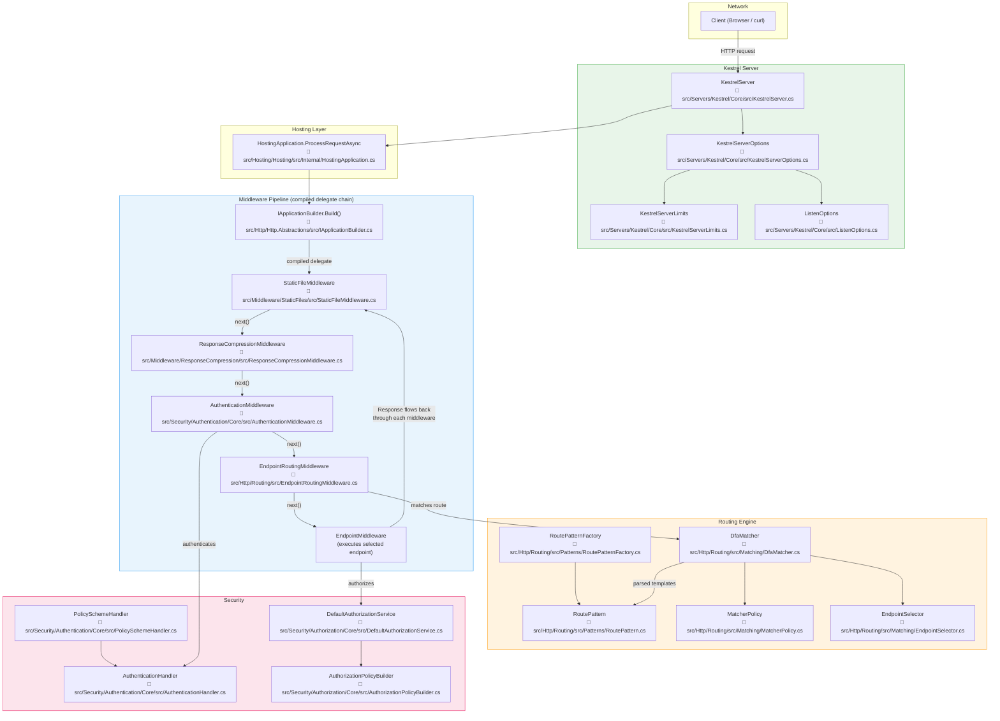

# Nivel 3: Avanzado — ASP.NET Core

> 🌐 [English version](../en/03-advanced-aspnet-core.md)

> 🎯 **Perfil objetivo:** Desarrolladores que quieren optimizar, depurar problemas profundos y entender qué hace el framework internamente
> ⏱️ **Esfuerzo estimado:** 15–18 horas
> 📋 **Requisitos previos:** Nivel 2 (Practicante), experiencia construyendo aplicaciones ASP.NET Core en producción, comodidad leyendo código fuente en C#

---

## Objetivos de Aprendizaje

Al completar este módulo vas a poder:

1. **Diagnosticar errores de ordenamiento de middleware** rastreando el flujo de la solicitud a través del pipeline
2. **Explicar cómo el motor de routing** parsea plantillas de ruta en objetos `RoutePattern` y los compara contra URLs entrantes
3. **Identificar y corregir incompatibilidades de ciclo de vida de servicios** (el problema de la dependencia cautiva) y explicar por qué inyectar un servicio Scoped en uno Singleton falla
4. **Configurar los límites del servidor Kestrel**, HTTPS y protocolos para despliegues en producción
5. **Perfilar el rendimiento de solicitudes** usando `dotnet-trace` e identificar rutas críticas en el pipeline de middleware
6. **Implementar patrones avanzados de autenticación** incluyendo autenticación multi-esquema y transformación de claims
7. **Usar middleware con short-circuit de forma efectiva** y explicar sus implicaciones de rendimiento

---

## Mapa Conceptual

Este diagrama traza una solicitud desde la red a través del pipeline compilado de middleware, hacia el routing, la selección de endpoint y de vuelta por la ruta de respuesta. Cada nodo enlaza a código fuente real en este repositorio.



> **Cómo leer este diagrama:** Seguí las flechas de arriba hacia abajo para la ruta de la solicitud. Cada middleware llama a `next()` para pasar el control al siguiente. En el camino de vuelta (ruta de respuesta), cada middleware tiene la oportunidad de modificar la respuesta. Este es el patrón de "muñecas rusas" que viste en el Nivel 1 — ahora podés ver exactamente qué clases lo implementan.

---

## Currículo

### Lección 3.1: Profundización en el Pipeline de Middleware

**Pregunta guía:** *¿Cómo es que el orden del middleware genera comportamientos diferentes — y cómo depuro cuando algo sale mal?*

**Esfuerzo estimado:** 3 horas

#### Conceptos

En el Nivel 2, escribiste middleware como una clase que implementa `IMiddleware` y lo registraste con `app.UseMiddleware<T>()`. Ahora entendamos qué pasa cuando llamás a `app.Build()` y cómo el orden de tus llamadas `Use*()` queda grabado a fuego.

El pipeline de middleware se construye al iniciar la aplicación mediante `IApplicationBuilder.Build()`. Este método recorre cada delegado de middleware registrado en orden inverso y los compone en un único `RequestDelegate` — una sola función anidada que maneja cada solicitud. Una vez construida, esta cadena es inmutable. No podés agregar, quitar ni reordenar middleware por solicitud.

**Comportamientos clave a entender:**

- **El orden importa porque cada middleware envuelve al siguiente.** `UseAuthentication()` debe ir antes de `UseAuthorization()` porque la autorización depende de la identidad que la autenticación establece. Si los invertís, la autorización se ejecuta contra un usuario no autenticado — cada solicitud falla.

- **El short-circuit** ocurre cuando un middleware *no* llama a `next()`. `UseStaticFiles()` hace short-circuit cuando encuentra un archivo que coincide — escribe la respuesta y nunca llama al siguiente middleware. Esto significa que cualquier middleware registrado *después* de `UseStaticFiles()` no se ejecuta para solicitudes de archivos estáticos.

- **La ramificación** con `Map()`, `MapWhen()` y `UseWhen()` crea ramas separadas del pipeline. `Map("/api")` crea un pipeline completamente nuevo para solicitudes que empiezan con `/api`. `UseWhen()` agrega middleware condicionalmente pero se reincorpora al pipeline principal.

#### 📄 Código Fuente

| Archivo | Qué buscar |
|---------|-----------|
| [`src/Http/Http.Abstractions/src/IApplicationBuilder.cs`](../../src/Http/Http.Abstractions/src/IApplicationBuilder.cs) | El método `Build()` que compila todo el middleware registrado en un único `RequestDelegate`. Observá cómo itera en orden inverso. |
| [`src/Hosting/Hosting/src/Internal/HostingApplication.cs`](../../src/Hosting/Hosting/src/Internal/HostingApplication.cs) | `ProcessRequestAsync` — donde Kestrel entrega cada solicitud entrante al delegado compilado de middleware. Este es el punto de entrada de cada solicitud HTTP. |
| [`src/Http/Http.Abstractions/src/Extensions/UseMiddlewareExtensions.cs`](../../src/Http/Http.Abstractions/src/Extensions/UseMiddlewareExtensions.cs) | Cómo `UseMiddleware<T>()` descubre el método `InvokeAsync` de tu middleware por reflexión y lo conecta al pipeline. |
| [`src/Http/Http.Abstractions/src/Extensions/UseExtensions.cs`](../../src/Http/Http.Abstractions/src/Extensions/UseExtensions.cs) | El registro más simple en línea: `app.Use(async (context, next) => { ... })`. |
| [`src/Middleware/StaticFiles/src/StaticFileMiddleware.cs`](../../src/Middleware/StaticFiles/src/StaticFileMiddleware.cs) | Un middleware real que hace short-circuit — buscá dónde retorna *sin* llamar a `_next(context)`. |

#### 🏋️ Ejercicio

1. Creá una nueva aplicación ASP.NET Core con este pipeline:

   ```csharp
   app.UseStaticFiles();
   app.UseRouting();
   app.MapGet("/", () => "Hello!");
   ```

   Agregá un archivo estático en `wwwroot/hello.txt`. Solicitá `/hello.txt` — observá que `UseRouting` nunca se ejecuta. Ahora mové `UseStaticFiles()` *después* de `UseRouting()`. Solicitá `/hello.txt` de nuevo — ¿qué cambia?

2. Agregá una rama con `Map`:

   ```csharp
   app.Map("/api", apiApp =>
   {
       apiApp.UseMiddleware<ApiLoggingMiddleware>();
       apiApp.UseRouting();
       apiApp.UseEndpoints(endpoints =>
       {
           endpoints.MapGet("/status", () => "API OK");
       });
   });
   ```

   Verificá que `ApiLoggingMiddleware` solo se ejecuta para solicitudes a `/api/*`.

3. Escribí un middleware que haga short-circuit y devuelva `403 Forbidden` para cualquier solicitud que contenga `X-Block: true` en los encabezados. Ubicalo en diferentes posiciones del pipeline y observá qué middleware sigue ejecutándose.

#### 💡 Conclusión Clave

El pipeline de middleware se compila en una cadena de delegados al iniciar la aplicación. El orden en que llamás a `app.Use*()` es el orden en que se ejecutan — queda fijo y no puede cambiar por solicitud. El short-circuit (no llamar a `next()`) detiene la cadena. Una vez que internalizás esto, los errores de ordenamiento de middleware se vuelven fáciles de diagnosticar.

#### ⚠️ Concepto Erróneo Común

**"El middleware se ejecuta en paralelo."** No. El pipeline es secuencial. Cada middleware hace `await` del siguiente. Todo el pipeline es una cadena anidada de llamadas async a funciones — como muñecas rusas. La concurrencia ocurre *entre* solicitudes (Kestrel procesa muchas solicitudes simultáneamente), pero dentro de una sola solicitud, el middleware se ejecuta en orden estricto.

---

### Lección 3.2: Internos del Motor de Routing

**Pregunta guía:** *¿Cómo hace ASP.NET Core para emparejar URLs con endpoints de forma eficiente — incluso con cientos de rutas?*

**Esfuerzo estimado:** 3 horas

#### Conceptos

En el Nivel 1, aprendiste que routing mapea URLs a código. Ahora entendamos *cómo* lo hace de manera tan eficiente.

Cuando tu aplicación arranca, el sistema de routing parsea cada plantilla de ruta (como `"/users/{id:int}"`) en un objeto `RoutePattern`. Un `RoutePattern` es la representación completamente parseada y estructurada de una ruta — conoce los segmentos literales, parámetros, restricciones, valores por defecto y políticas. El `RoutePatternFactory` es el responsable de crear estos objetos.

La verdadera magia está en el `DfaMatcher`. Al iniciar, toma todos los objetos `RoutePattern` registrados y los compila en un **Autómata Finito Determinista (DFA)** — una máquina de estados. Cuando llega una solicitud, el matcher recorre la URL segmento por segmento, transitando entre estados. El costo del emparejamiento es **O(cantidad de segmentos de ruta)**, no O(cantidad de rutas). Esto significa que agregar 1.000 rutas no ralentiza el matching — siempre es proporcional a la longitud de la URL.

Después de que el DFA identifica los endpoints candidatos, las implementaciones de `MatcherPolicy` (como `HttpMethodMatcherPolicy`) reducen la lista basándose en metadatos (método HTTP, host, etc.). Finalmente, el `EndpointSelector` elige la mejor coincidencia.

#### 📄 Código Fuente

| Archivo | Qué buscar |
|---------|-----------|
| [`src/Http/Routing/src/Patterns/RoutePattern.cs`](../../src/Http/Routing/src/Patterns/RoutePattern.cs) | La representación parseada de una plantilla de ruta. Mirá `PathSegments`, `Parameters` y cómo se almacenan las restricciones. |
| [`src/Http/Routing/src/Patterns/RoutePatternFactory.cs`](../../src/Http/Routing/src/Patterns/RoutePatternFactory.cs) | Cómo las cadenas de plantillas de ruta se convierten en objetos `RoutePattern`. |
| [`src/Http/Routing/src/EndpointRoutingMiddleware.cs`](../../src/Http/Routing/src/EndpointRoutingMiddleware.cs) | Donde ocurre el emparejamiento de rutas por solicitud. Observá cómo `SetEndpoint` almacena el endpoint coincidente en `HttpContext`. |
| [`src/Http/Routing/src/Matching/DfaMatcher.cs`](../../src/Http/Routing/src/Matching/DfaMatcher.cs) | ⚠️ **Código complejo.** La lógica de construcción y recorrido del DFA. Enfocate primero en `MatchAsync` — ese es el camino crítico por solicitud. La lógica de construcción del DFA (`BuildDfa`) solo se ejecuta al inicio y es muy densa. |
| [`src/Http/Routing/src/Matching/MatcherPolicy.cs`](../../src/Http/Routing/src/Matching/MatcherPolicy.cs) | La clase base para políticas que filtran endpoints después del matching del DFA. |
| [`src/Http/Routing/src/Matching/EndpointSelector.cs`](../../src/Http/Routing/src/Matching/EndpointSelector.cs) | Cómo se selecciona el endpoint final entre los candidatos. |

#### 🏋️ Ejercicio

1. Registrá 20+ rutas con patrones superpuestos:

   ```csharp
   app.MapGet("/products", () => "all products");
   app.MapGet("/products/{id:int}", (int id) => $"product {id}");
   app.MapGet("/products/{slug}", (string slug) => $"product by slug: {slug}");
   app.MapGet("/products/{id:int}/reviews", (int id) => $"reviews for {id}");
   app.MapGet("/products/featured", () => "featured products");
   // ... agregá más patrones superpuestos
   ```

2. Habilitá el logging de routing:

   ```csharp
   builder.Logging.AddFilter("Microsoft.AspNetCore.Routing", LogLevel.Debug);
   ```

3. Hacé solicitudes a diferentes URLs y leé los logs. Observá:
   - Qué rutas se consideran como candidatas
   - Cómo las restricciones (`{id:int}`) desambiguan las coincidencias
   - Qué pasa cuando dos rutas coinciden de igual manera (intentá crear una coincidencia ambigua)

4. Probá solicitar `/products/featured` — ¿coincide con la ruta literal o con `{slug}`? Leé los logs de `DfaMatcher` para entender por qué.

#### 💡 Conclusión Clave

ASP.NET Core compila todas las rutas en un DFA al iniciar, por lo que el matching es O(cantidad de segmentos de ruta), no O(cantidad de rutas). Por eso agregar más rutas no ralentiza el emparejamiento. El DFA es una de las optimizaciones de rendimiento más sofisticadas del framework.

#### ⚠️ Concepto Erróneo Común

**"El matching de rutas funciona con 'la primera que coincida gana'."** No, ya no, desde que se introdujo endpoint routing en ASP.NET Core 3.0. Todos los endpoints coincidentes se evalúan, y luego las políticas y metadatos determinan la mejor coincidencia. Los segmentos literales ganan a los parámetros, las plantillas más específicas ganan a las menos específicas. Si hay ambigüedad genuina (dos rutas puntúan igual), obtenés una `AmbiguousMatchException` en lugar de un comportamiento silenciosamente incorrecto.

---

### Lección 3.3: Scopes de DI y Ciclo de Vida de Servicios

**Pregunta guía:** *¿Por qué las incompatibilidades de ciclo de vida causan errores, y cómo los corrijo?*

**Esfuerzo estimado:** 2 horas

#### Conceptos

En el Nivel 1, aprendiste sobre los ciclos de vida `Transient`, `Scoped` y `Singleton`. En el Nivel 2, registraste servicios y usaste dependency injection en controladores y middleware. Ahora hablemos del error sutil que atrapa a casi todos los equipos al menos una vez: **el problema de la dependencia cautiva**.

Una **dependencia cautiva** ocurre cuando un servicio de mayor duración captura uno de menor duración. El caso más común: un servicio `Singleton` recibe un servicio `Scoped` a través de su constructor. El servicio Scoped estaba diseñado para vivir durante una sola solicitud, pero el Singleton lo retiene para siempre. Ahora cada solicitud comparte la misma instancia de `DbContext`, la misma unidad de trabajo, el mismo estado. Los datos se filtran entre solicitudes. Es no determinístico — a veces funciona, a veces obtenés datos obsoletos, a veces obtenés `ObjectDisposedException`.

ASP.NET Core tiene una red de seguridad: la **validación de scopes**. Cuando `ASPNETCORE_ENVIRONMENT` es `Development`, el contenedor de DI verifica las dependencias cautivas al momento de resolver y lanza una `InvalidOperationException` en lugar de crear el error silenciosamente. Por eso es fundamental hacer pruebas siempre en modo Development.

La solución: si un `Singleton` necesita acceder a un servicio `Scoped`, inyectá `IServiceScopeFactory` en su lugar y creá un scope manualmente:

```csharp
public class MySingleton(IServiceScopeFactory scopeFactory)
{
    public async Task DoWork()
    {
        using var scope = scopeFactory.CreateScope();
        var dbContext = scope.ServiceProvider.GetRequiredService<MyDbContext>();
        // dbContext tiene alcance limitado a este bloque, no al ciclo de vida del singleton
    }
}
```

#### 📄 Código Fuente

| Archivo | Qué buscar |
|---------|-----------|
| [`src/DefaultBuilder/src/WebApplicationBuilder.cs`](../../src/DefaultBuilder/src/WebApplicationBuilder.cs) | Donde se configuran `ValidateScopes` y `ValidateOnBuild`. Buscá `ServiceProviderOptions`. En Development, la validación de scopes está habilitada por defecto. |

#### 🏋️ Ejercicio

1. **Creá una dependencia cautiva:**

   ```csharp
   builder.Services.AddScoped<MyScopedService>();
   builder.Services.AddSingleton<MySingletonService>();

   // MySingletonService recibe MyScopedService en su constructor
   ```

   Ejecutá en modo Development. Observá la excepción. Leé el mensaje de la excepción con atención — te dice exactamente qué está mal.

2. **Corregilo con `IServiceScopeFactory`:**

   Refactorizá `MySingletonService` para que acepte `IServiceScopeFactory` y cree un scope en sus métodos en lugar de capturar el servicio Scoped directamente.

3. **Demostrá la consecuencia real:** Deshabilitá la validación de scopes temporalmente. Registrá un servicio `Scoped` que incremente un contador. Inyectalo en un `Singleton`. Hacé 10 solicitudes. Observá que el contador sigue incrementándose entre solicitudes (debería reiniciarse a 0 en cada solicitud).

4. **Explorá los servicios con clave (.NET 8+):**

   ```csharp
   builder.Services.AddKeyedScoped<ICache, RedisCache>("redis");
   builder.Services.AddKeyedScoped<ICache, MemoryCache>("memory");
   ```

   Inyectá con `[FromKeyedServices("redis")] ICache cache`. Entendé cómo los servicios con clave interactúan con el alcance del ciclo de vida.

#### 💡 Conclusión Clave

Los scopes de servicios existen para dar a ciertos servicios un ciclo de vida acotado — como un `DbContext` por solicitud. La validación de scopes detecta incompatibilidades de ciclo de vida al iniciar en Development, no en tiempo de ejecución cuando causarían errores sutiles y difíciles de reproducir. Ejecutá siempre con validación de scopes habilitada durante el desarrollo.

#### ⚠️ Concepto Erróneo Común

**"Scoped significa una instancia por solicitud."** Casi — pero no exactamente. Scoped significa una instancia por *scope*. Una solicitud crea un scope, pero podés crear scopes adicionales manualmente con `IServiceScopeFactory`. Los servicios en segundo plano, por ejemplo, no tienen scope de solicitud y deben crear el propio. Si te olvidás, estás resolviendo desde el scope raíz, que se comporta como Singleton.

---

### Lección 3.4: Configuración del Servidor Kestrel

**Pregunta guía:** *¿Cómo configuro el servidor web para producción?*

**Esfuerzo estimado:** 2 horas

#### Conceptos

En el Nivel 2, usaste Kestrel implícitamente — `dotnet run` lo inicia con valores predeterminados. Ahora configurémoslo explícitamente para producción.

Kestrel es el servidor HTTP predeterminado, multiplataforma y de alto rendimiento de ASP.NET Core. No es solo una conveniencia para desarrollo — está diseñado para uso en producción. Netflix, Stack Overflow y la propia Microsoft ejecutan Kestrel en producción. Pero los valores predeterminados son intencionalmente conservadores. Para producción, vas a querer ajustar:

- **Endpoints de escucha:** Qué direcciones y puertos enlazar, incluyendo sockets Unix
- **HTTPS:** Selección de certificado, protocolos TLS, suites de cifrado
- **Límites de solicitud:** Tamaño máximo del cuerpo de solicitud (predeterminado 30 MB), cantidad de encabezados, cantidad de conexiones, timeout de encabezados de solicitud
- **Protocolos:** HTTP/1.1, HTTP/2, HTTP/3 (QUIC)

Estas configuraciones viven en `KestrelServerOptions`, que delega a `KestrelServerLimits` para las restricciones numéricas y a `ListenOptions` para la configuración por endpoint.

#### 📄 Código Fuente

| Archivo | Qué buscar |
|---------|-----------|
| [`src/Servers/Kestrel/Core/src/KestrelServer.cs`](../../src/Servers/Kestrel/Core/src/KestrelServer.cs) | La clase principal del servidor. Mirá `StartAsync` para ver cómo se enlaza a los endpoints configurados. |
| [`src/Servers/Kestrel/Core/src/KestrelServerOptions.cs`](../../src/Servers/Kestrel/Core/src/KestrelServerOptions.cs) | La API de configuración completa. `Listen()`, `ListenAnyIP()`, `ConfigureEndpointDefaults()`, `ConfigureHttpsDefaults()`. |
| [`src/Servers/Kestrel/Core/src/KestrelServerLimits.cs`](../../src/Servers/Kestrel/Core/src/KestrelServerLimits.cs) | Cada límite que Kestrel aplica: `MaxRequestBodySize`, `MaxRequestHeaderCount`, `MaxConcurrentConnections`, `RequestHeadersTimeout` y más. Leé los comentarios XML — explican los valores predeterminados y las compensaciones. |
| [`src/Servers/Kestrel/Core/src/ListenOptions.cs`](../../src/Servers/Kestrel/Core/src/ListenOptions.cs) | Configuración por endpoint: protocolos, opciones HTTPS, middleware de conexión. |

#### 🏋️ Ejercicio

1. **Configurá endpoints de escucha explícitos:**

   ```csharp
   builder.WebHost.ConfigureKestrel(options =>
   {
       options.ListenLocalhost(5000); // HTTP
       options.ListenLocalhost(5001, listenOptions =>
       {
           listenOptions.UseHttps(); // HTTPS con certificado de desarrollo
       });
   });
   ```

2. **Establecé límites de solicitud y probalos:**

   ```csharp
   builder.WebHost.ConfigureKestrel(options =>
   {
       options.Limits.MaxRequestBodySize = 1024; // 1 KB máximo de cuerpo
       options.Limits.MaxRequestHeaderCount = 10;
   });
   ```

   Intentá enviar una solicitud con un cuerpo mayor a 1 KB usando `curl`:
   ```bash
   curl -X POST -d @largefile.txt http://localhost:5000/upload
   ```
   Observá la respuesta `413 Payload Too Large`.

3. **Habilitá HTTP/2:**

   ```csharp
   options.ListenLocalhost(5001, listenOptions =>
   {
       listenOptions.Protocols = HttpProtocols.Http1AndHttp2;
       listenOptions.UseHttps();
   });
   ```

   Verificá con `curl --http2 https://localhost:5001/`.

4. **Habilitá el logging de conexiones** para ver eventos de conexión a bajo nivel:

   ```csharp
   builder.WebHost.ConfigureKestrel(options =>
   {
       options.ConfigureEndpointDefaults(listenOptions =>
       {
           // El logging a nivel de conexión requiere Microsoft.AspNetCore.Server.Kestrel
           // en nivel Debug
       });
   });
   builder.Logging.AddFilter("Microsoft.AspNetCore.Server.Kestrel", LogLevel.Debug);
   ```

#### 💡 Conclusión Clave

Kestrel no es solo un servidor de desarrollo — está listo para producción y es altamente configurable. Entender sus límites previene sorpresas en producción como cargas rechazadas (cuerpo demasiado grande), conexiones caídas (límites de conexiones concurrentes) o incompatibilidades de protocolo (HTTP/2 requiere HTTPS en la mayoría de escenarios). Revisá `KestrelServerLimits.cs` — cada propiedad es una perilla que podés ajustar.

#### ⚠️ Concepto Erróneo Común

**"Necesitás IIS o nginx delante de Kestrel en producción."** No necesariamente. Kestrel puede funcionar directamente como servidor de borde. Un proxy reverso agrega funcionalidades como balanceo de carga, reescritura de URLs y descarga de TLS — pero Kestrel maneja HTTPS, HTTP/2 y limitación de tasa por su cuenta. Elegí en base a tus necesidades de arquitectura, no por creer que Kestrel "no está listo para producción".

---

### Lección 3.5: Optimización de Rendimiento

**Pregunta guía:** *¿Dónde están las rutas críticas y cómo las optimizo?*

**Esfuerzo estimado:** 3 horas

#### Conceptos

La optimización de rendimiento empieza con la **medición**, no con la intuición. ASP.NET Core provee herramientas de diagnóstico que te permiten ver exactamente dónde se gasta el tiempo:

- **`dotnet-counters`** — Métricas en vivo y tiempo real: solicitudes/segundo, conexiones activas, largo de cola, recolecciones del GC. Útil para dashboards y alertas.
- **`dotnet-trace`** — Captura trazas detalladas que podés analizar en SpeedScope o PerfView. Te muestra qué métodos toman más tiempo.
- **`dotnet-dump`** — Captura snapshots del heap para analizar fugas de memoria y retención de objetos.

El framework también provee **middleware de rendimiento integrado:**

- **Response Caching Middleware** — Cache a nivel HTTP basado en encabezados `Cache-Control`. El servidor almacena respuestas y las sirve directamente para solicitudes que coincidan.
- **Output Caching (.NET 7+)** — Cache del lado del servidor que no depende de encabezados de cache del cliente. Mayor control, mayor flexibilidad.
- **Response Compression Middleware** — Compresión gzip/Brotli de las respuestas. Reduce el ancho de banda pero agrega carga de CPU — perfilá para verificar que el beneficio neto sea positivo.

La mayoría de los problemas de rendimiento en aplicaciones ASP.NET Core están en el **código de la aplicación**, no en el framework. Consultas a la base de datos, serialización JSON de objetos grandes, I/O sincrónico bloqueando hilos del thread pool — estos son los culpables habituales. Las rutas críticas propias del framework (routing, despacho de middleware, I/O de Kestrel) ya están fuertemente optimizadas.

#### 📄 Código Fuente

| Archivo | Qué buscar |
|---------|-----------|
| [`src/Middleware/ResponseCompression/src/ResponseCompressionMiddleware.cs`](../../src/Middleware/ResponseCompression/src/ResponseCompressionMiddleware.cs) | Un middleware de rendimiento real. Observá cómo envuelve el stream de respuesta para comprimir sobre la marcha. Mirá cómo verifica `Content-Type` y `Content-Encoding` para decidir si comprimir. |

#### 🏋️ Ejercicio

1. **Perfilá un endpoint lento:**

   Creá un endpoint que simule una consulta lenta a la base de datos:
   ```csharp
   app.MapGet("/slow", async () =>
   {
       await Task.Delay(500); // Consulta lenta simulada
       return Results.Ok(new { data = Enumerable.Range(1, 1000).ToList() });
   });
   ```

2. **Recolectá una traza:**
   ```bash
   dotnet-counters monitor --process-id <PID> --counters Microsoft.AspNetCore.Hosting
   dotnet-trace collect --process-id <PID> --providers Microsoft-AspNetCore-Server-Kestrel
   ```

3. **Analizá la traza** en [SpeedScope](https://www.speedscope.app/) — subí el archivo `.nettrace` e identificá la ruta crítica.

4. **Aplicá output caching:**
   ```csharp
   builder.Services.AddOutputCache();
   app.UseOutputCache();

   app.MapGet("/slow", async () =>
   {
       await Task.Delay(500);
       return Results.Ok(new { data = Enumerable.Range(1, 1000).ToList() });
   }).CacheOutput(p => p.Expire(TimeSpan.FromSeconds(30)));
   ```

   Medí la diferencia: la primera solicitud tarda 500 ms, las siguientes son casi instantáneas.

5. **Agregá compresión de respuesta:**
   ```csharp
   builder.Services.AddResponseCompression(options =>
   {
       options.EnableForHttps = true;
   });
   app.UseResponseCompression();
   ```

   Compará los tamaños de respuesta con y sin compresión usando `curl -H "Accept-Encoding: gzip" -v`.

#### 💡 Conclusión Clave

Perfilá antes de optimizar. La mayoría de los problemas de rendimiento están en el código de la aplicación (consultas a la base de datos, serialización, bloqueo sincrónico), no en el framework. Las rutas críticas del framework ya están fuertemente optimizadas. Usá `dotnet-counters` para monitoreo en vivo, `dotnet-trace` para perfilado profundo, y el middleware integrado de cache/compresión para las victorias comunes.

#### ⚠️ Concepto Erróneo Común

**"Async hace que mi código sea más rápido."** Async hace que tu código sea *más escalable*, no más rápido. Una consulta async a la base de datos tarda el mismo tiempo real que una sincrónica. La diferencia es que async libera el hilo del thread pool para manejar otras solicitudes mientras espera el I/O, en lugar de bloquearlo. Si tenés baja concurrencia, async agrega overhead sin beneficio. Si tenés alta concurrencia, async previene el agotamiento del thread pool.

---

### Lección 3.6: Patrones Avanzados de Autenticación

**Pregunta guía:** *¿Cómo funcionan los policy schemes, la transformación de claims y la autenticación multi-esquema?*

**Esfuerzo estimado:** 2 horas

#### Conceptos

En el Nivel 2, configuraste autenticación básica con cookies o JWT. Ahora manejemos los patrones del mundo real que las aplicaciones en producción necesitan.

**Autenticación multi-esquema:** Muchas aplicaciones necesitan soportar tanto cookies (para usuarios del navegador) como tokens JWT (para clientes API). ASP.NET Core permite registrar múltiples esquemas de autenticación y elegir entre ellos por solicitud.

**Policy schemes:** Un `PolicySchemeHandler` es un meta-esquema que delega a otros esquemas según la solicitud. Por ejemplo: "Si la solicitud tiene un encabezado `Authorization: Bearer`, usá JWT. Si no, usá cookies". Esto evita duplicar atributos `[Authorize]` con nombres de esquema explícitos en cada endpoint.

**Transformación de claims:** Después de que la autenticación establece una identidad, frecuentemente necesitás enriquecerla. `IClaimsTransformation` se ejecuta después de la autenticación y puede agregar claims desde tu base de datos — roles, permisos, IDs de tenant — antes de que la autorización los evalúe. Esto mantiene tus tokens JWT pequeños mientras tenés datos de autorización ricos.

#### 📄 Código Fuente

| Archivo | Qué buscar |
|---------|-----------|
| [`src/Security/Authentication/Core/src/AuthenticationMiddleware.cs`](../../src/Security/Authentication/Core/src/AuthenticationMiddleware.cs) | Cómo se resuelve el esquema predeterminado y se llama a `AuthenticateAsync`. Esto se ejecuta antes de la autorización. |
| [`src/Security/Authentication/Core/src/AuthenticationHandler.cs`](../../src/Security/Authentication/Core/src/AuthenticationHandler.cs) | La clase base para todos los handlers de autenticación. Mirá `AuthenticateAsync`, `ChallengeAsync` y `ForbidAsync`. |
| [`src/Security/Authentication/Core/src/PolicySchemeHandler.cs`](../../src/Security/Authentication/Core/src/PolicySchemeHandler.cs) | Cómo los policy schemes delegan a otros esquemas. Observá cómo lee `PolicySchemeOptions` para decidir a qué esquema reenviar. Esta es la clave de la autenticación multi-esquema. |
| [`src/Security/Authorization/Core/src/DefaultAuthorizationService.cs`](../../src/Security/Authorization/Core/src/DefaultAuthorizationService.cs) | Cómo la autorización evalúa políticas contra el usuario autenticado. |
| [`src/Security/Authorization/Core/src/AuthorizationPolicyBuilder.cs`](../../src/Security/Authorization/Core/src/AuthorizationPolicyBuilder.cs) | Construcción de políticas complejas con `RequireClaim`, `RequireRole`, `AddRequirements` y combinación de múltiples requisitos. |

#### 🏋️ Ejercicio

1. **Configurá autenticación multi-esquema:**

   ```csharp
   builder.Services.AddAuthentication("MultiScheme")
       .AddCookie("Cookies", options => { /* configuración de cookies */ })
       .AddJwtBearer("Bearer", options => { /* configuración de JWT */ })
       .AddPolicyScheme("MultiScheme", "Cookie or JWT", options =>
       {
           options.ForwardDefaultSelector = context =>
           {
               var authHeader = context.Request.Headers.Authorization.FirstOrDefault();
               return authHeader?.StartsWith("Bearer ") == true ? "Bearer" : "Cookies";
           };
       });
   ```

2. **Probá ambos caminos:** Enviá una solicitud con un token JWT (`Authorization: Bearer <token>`) y verificá que la autenticación JWT se ejecute. Enviá una solicitud con una cookie y verificá que la autenticación por cookie se ejecute.

3. **Implementá transformación de claims:**

   ```csharp
   public class DatabaseClaimsTransformation(IServiceScopeFactory scopeFactory)
       : IClaimsTransformation
   {
       public async Task<ClaimsPrincipal> TransformAsync(ClaimsPrincipal principal)
       {
           using var scope = scopeFactory.CreateScope();
           // Buscá roles/permisos del usuario en la base de datos
           // Agregalos como claims al principal
           var identity = (ClaimsIdentity)principal.Identity!;
           identity.AddClaim(new Claim("tenant", "acme-corp"));
           return principal;
       }
   }

   builder.Services.AddTransient<IClaimsTransformation, DatabaseClaimsTransformation>();
   ```

4. **Construí un requisito de autorización personalizado:**

   ```csharp
   public class MinimumAgeRequirement(int minimumAge) : IAuthorizationRequirement
   {
       public int MinimumAge => minimumAge;
   }

   public class MinimumAgeHandler : AuthorizationHandler<MinimumAgeRequirement>
   {
       protected override Task HandleRequirementAsync(
           AuthorizationHandlerContext context,
           MinimumAgeRequirement requirement)
       {
           var birthDateClaim = context.User.FindFirst("birthdate");
           // ... validá la edad contra requirement.MinimumAge
       }
   }
   ```

#### 💡 Conclusión Clave

Los esquemas de autenticación son componibles. Los policy schemes te permiten elegir el esquema correcto por solicitud sin esparcir nombres de esquema por todo tu código. La transformación de claims te permite enriquecer los datos de identidad después de la autenticación pero antes de que la autorización se ejecute — manteniendo los tokens pequeños y los datos de autorización frescos desde tu base de datos.

#### ⚠️ Concepto Erróneo Común

**"Debería poner todos los permisos en el token JWT."** Esto hace que los tokens sean grandes, imposibles de revocar a mitad de sesión y obsoletos (los permisos del usuario pueden cambiar después de que se emitió el token). Usá el JWT para identidad (quién sos) y usá transformación de claims o un enfoque basado en políticas para cargar permisos en tiempo de solicitud desde tu base de datos.

---

## Guía de Lectura de Código Fuente

Estos archivos están ordenados de más accesibles a más complejos. Empezá por arriba y avanzá hacia abajo. La puntuación de estrellas refleja la complejidad del código, no su importancia.

| # | Archivo | Qué vas a aprender | Complejidad |
|---|---------|-------------------|:-----------:|
| 1 | [`src/Http/Http.Abstractions/src/IApplicationBuilder.cs`](../../src/Http/Http.Abstractions/src/IApplicationBuilder.cs) | Cómo `Build()` compila el pipeline de middleware en un único delegado | ⭐⭐ |
| 2 | [`src/Hosting/Hosting/src/Internal/HostingApplication.cs`](../../src/Hosting/Hosting/src/Internal/HostingApplication.cs) | El punto de entrada de cada solicitud HTTP — `ProcessRequestAsync` | ⭐⭐⭐ |
| 3 | [`src/Http/Routing/src/Patterns/RoutePattern.cs`](../../src/Http/Routing/src/Patterns/RoutePattern.cs) | La representación estructurada de plantillas de ruta parseadas | ⭐⭐⭐ |
| 4 | [`src/Http/Routing/src/EndpointRoutingMiddleware.cs`](../../src/Http/Routing/src/EndpointRoutingMiddleware.cs) | Emparejamiento de rutas por solicitud — donde ocurre el routing en el pipeline | ⭐⭐⭐ |
| 5 | [`src/Http/Routing/src/Matching/DfaMatcher.cs`](../../src/Http/Routing/src/Matching/DfaMatcher.cs) | La máquina de estados DFA para emparejamiento de rutas de alto rendimiento | ⭐⭐⭐⭐ |
| 6 | [`src/Servers/Kestrel/Core/src/KestrelServerOptions.cs`](../../src/Servers/Kestrel/Core/src/KestrelServerOptions.cs) | La API completa de configuración de Kestrel — cada perilla que podés ajustar | ⭐⭐ |
| 7 | [`src/Security/Authentication/Core/src/PolicySchemeHandler.cs`](../../src/Security/Authentication/Core/src/PolicySchemeHandler.cs) | Cómo los policy schemes delegan la autenticación a otros esquemas | ⭐⭐⭐ |

> **Consejo:** No intentes leer `DfaMatcher.cs` línea por línea en tu primera pasada. Empezá con `MatchAsync` (el método por solicitud), entendé el flujo, y después explorá `BuildDfa` (la construcción en tiempo de inicio) después. Este es uno de los archivos más complejos del repositorio.

---

## Herramientas de Diagnóstico

| Herramienta | Comando | Qué muestra | Cuándo usarla |
|-------------|---------|-------------|---------------|
| `dotnet-counters` | `dotnet-counters monitor --process-id <PID> --counters Microsoft.AspNetCore.Hosting` | Tasa de solicitudes en vivo, conexiones activas, largo de cola, estadísticas del GC | Monitoreo de rendimiento en tiempo real en producción o pruebas de carga |
| `dotnet-trace` | `dotnet-trace collect --process-id <PID> --providers Microsoft-AspNetCore` | Trazas detalladas por solicitud con tiempos | Perfilado de pipelines de solicitudes, detección de middleware o handlers lentos |
| `dotnet-dump` | `dotnet-dump collect --process-id <PID>` y después `dotnet-dump analyze <dump>` | Estado del heap, retención de objetos, raíces del GC | Diagnóstico de fugas de memoria o asignaciones excesivas |
| Logging de conexiones de Kestrel | `builder.Logging.AddFilter("Microsoft.AspNetCore.Server.Kestrel", LogLevel.Debug)` | Eventos del ciclo de vida de conexiones, negociación de protocolos | Depuración de problemas HTTPS/TLS, incompatibilidades de protocolo |
| Logging de depuración de routing | `builder.Logging.AddFilter("Microsoft.AspNetCore.Routing", LogLevel.Debug)` | Rutas coincidentes/rechazadas, evaluación de restricciones, ambigüedad | Depuración de rutas que no coinciden y 404 inesperados |

> **Instalá las herramientas de diagnóstico** si aún no lo hiciste:
> ```bash
> dotnet tool install --global dotnet-counters
> dotnet tool install --global dotnet-trace
> dotnet tool install --global dotnet-dump
> ```

---

## Autoevaluación

### Verificaciones de Conocimiento

Probá tu comprensión antes de avanzar. Si no podés responder con confianza, revisitá la lección correspondiente.

**1. Orden de middleware:** Tenés `UseAuthentication()`, `UseAuthorization()` y `UseStaticFiles()` en tu pipeline. Un usuario solicita `/logo.png` (un archivo estático). ¿En qué orden debés ubicar estas tres llamadas de middleware para que los archivos estáticos se sirvan *sin* requerir autenticación? ¿Qué pasa si ponés `UseStaticFiles()` al final?

<details>
<summary>Verificá tu respuesta</summary>

Ubicá `UseStaticFiles()` antes de `UseAuthentication()` y `UseAuthorization()`. De esta forma, las solicitudes de archivos estáticos hacen short-circuit antes de que la autenticación se ejecute. Si `UseStaticFiles()` está al final, cada solicitud de archivo estático pasa por autenticación y autorización primero — fallando para usuarios no autenticados o agregando overhead innecesario para usuarios autenticados.
</details>

**2. Routing:** Registrás estas dos rutas:
```csharp
app.MapGet("/users/{id}", (string id) => $"User: {id}");
app.MapGet("/users/me", () => "Current user");
```
Llega una solicitud para `/users/me`. ¿Qué ruta coincide y por qué?

<details>
<summary>Verificá tu respuesta</summary>

`/users/me` coincide. El DFA matcher considera los segmentos literales más específicos que los segmentos de parámetro. El literal "me" en la segunda ruta tiene precedencia sobre el parámetro `{id}` de la primera. Esto no es "la primera que coincida gana" — el motor de routing evalúa ambas y elige la coincidencia más específica.
</details>

**3. Ciclos de vida de DI:** Un servicio `Singleton` tiene un constructor que acepta un `DbContext` `Scoped`. ¿Qué pasa en modo Development? ¿Qué pasa en modo Production? ¿Cuál es más peligroso?

<details>
<summary>Verificá tu respuesta</summary>

En modo Development, la validación de scopes lanza una `InvalidOperationException` al momento de resolución — la aplicación se cae con un mensaje de error claro. En modo Production, la validación de scopes está deshabilitada por defecto, por lo que el `DbContext` es silenciosamente capturado por el Singleton y compartido entre todas las solicitudes. Production es más peligroso porque el error es silencioso y se manifiesta como datos obsoletos, condiciones de carrera o `ObjectDisposedException` bajo carga.
</details>

**4. Kestrel:** ¿Cuál es el tamaño máximo predeterminado del cuerpo de solicitud en Kestrel? ¿Cómo lo aumentarías a 100 MB para un endpoint de subida de archivos sin cambiar el límite global?

<details>
<summary>Verificá tu respuesta</summary>

El predeterminado es ~30 MB (`30_000_000` bytes). Para aumentarlo para un solo endpoint sin cambiar el límite global, usá el atributo `[RequestSizeLimit(104857600)]` en una acción de controlador, o `[DisableRequestSizeLimit]` para remover el límite por completo. Para minimal APIs: `.WithMetadata(new RequestSizeLimitAttribute(104857600))`.
</details>

**5. Rendimiento:** Ejecutás `dotnet-counters` y ves que `gen-0-gc-count` es muy alto (cientos por segundo) pero `requests-per-second` es bajo. ¿Qué sugiere esto y cuál es tu primer paso de depuración?

<details>
<summary>Verificá tu respuesta</summary>

Un GC Gen 0 alto con bajo throughput de solicitudes sugiere asignaciones excesivas de objetos de corta duración — la aplicación está creando muchos objetos pequeños que mueren rápido, causando presión de recolección de basura. Primer paso: capturar un `dotnet-trace` con el proveedor `GC` y analizar qué métodos están asignando más. Culpables comunes: concatenación de strings en bucles, asignaciones de LINQ, boxing de tipos de valor o colecciones temporales grandes.
</details>

### Desafío Práctico

**Construí un pipeline de middleware listo para producción con diagnósticos:**

1. Creá una aplicación ASP.NET Core con:
   - Archivos estáticos servidos sin autenticación (short-circuit)
   - Autenticación JWT y cookie vía un policy scheme
   - Output caching en endpoints GET
   - Compresión de respuesta
   - Middleware personalizado de temporización de solicitudes que registre cuánto tarda cada solicitud
   - Kestrel configurado con límites explícitos (1 MB de cuerpo, HTTP/2 habilitado)

2. Escribí una prueba de carga (incluso un simple bucle `for` con `HttpClient`) y usá `dotnet-counters` para monitorear throughput de solicitudes, presión del GC y conexiones activas.

3. Introducí intencionalmente una dependencia cautiva. Verificá que la validación de scopes la detecte. Corregila.

4. Habilitá el logging de depuración de routing, solicitá varias rutas superpuestas y explicá las decisiones del matcher.

**Criterios de éxito:** Podés explicar *por qué* cada middleware está en su posición, *qué* se rompería si los reordenaras, y *cómo* diagnosticarías cualquier problema usando las herramientas de diagnóstico cubiertas en este módulo.

---

## Conexiones

| Dirección | Enlace | Descripción |
|-----------|--------|-------------|
| ⬇️ Anterior | [Nivel 2 — Practicante](02-practitioner-aspnet-core.md) | Construcción de APIs, escritura de middleware, autenticación básica y DI |
| ⬆️ Siguiente | [Nivel 4 — Internos](04-internals-aspnet-core.md) | Profundización en la compilación de `IApplicationBuilder`, máquina de estados del DFA matcher, pipeline de filtros de `ResourceInvoker` |
| ↔️ Relacionado | [Documentación de Kestrel](https://learn.microsoft.com/aspnet/core/fundamentals/servers/kestrel) | Referencia oficial de configuración de Kestrel |
| ↔️ Relacionado | [Herramientas de diagnóstico de .NET](https://learn.microsoft.com/dotnet/core/diagnostics/) | Guías de `dotnet-trace`, `dotnet-counters`, `dotnet-dump` |
| ↔️ Relacionado | [Mejores prácticas de rendimiento de ASP.NET Core](https://learn.microsoft.com/aspnet/core/performance/overview) | Guía oficial de rendimiento |

---

## Glosario

| Término (ES) | Term (EN) | Definición |
|--------------|-----------|-----------|
| **DFA Matcher** | **DFA Matcher** | Autómata Finito Determinista — una máquina de estados que el motor de routing construye al iniciar a partir de todos los patrones de ruta registrados. Permite emparejamiento en O(segmentos de ruta) independientemente de la cantidad de rutas. Ver [`DfaMatcher.cs`](../../src/Http/Routing/src/Matching/DfaMatcher.cs). |
| **Patrón de ruta** | **RoutePattern** | La representación parseada y estructurada de una cadena de plantilla de ruta (ej., `"/users/{id:int}"`). Contiene segmentos, parámetros, restricciones y valores predeterminados. Ver [`RoutePattern.cs`](../../src/Http/Routing/src/Patterns/RoutePattern.cs). |
| **Metadatos de endpoint** | **Endpoint Metadata** | Datos arbitrarios adjuntos a un endpoint (como `[Authorize]`, `[HttpGet]` o atributos personalizados). Usados por implementaciones de `MatcherPolicy` y el sistema de autorización para tomar decisiones sobre cómo manejar las solicitudes. |
| **Dependencia cautiva** | **Captive Dependency** | Un error donde un servicio de larga duración (ej., Singleton) captura un servicio de corta duración (ej., Scoped) a través de su constructor. El servicio de corta duración ahora vive tanto como el de larga duración, rompiendo su ciclo de vida previsto. |
| **Validación de scopes** | **Scope Validation** | Una característica del contenedor de DI que detecta dependencias cautivas al momento de resolución. Habilitada por defecto en modo Development. Lanza `InvalidOperationException` en lugar de crear el error silenciosamente. |
| **Short-circuit** | **Short-Circuit** | Cuando un middleware maneja la solicitud y devuelve una respuesta *sin* llamar a `next()`, previniendo la ejecución de todo el middleware posterior. `UseStaticFiles()` hace short-circuit cuando encuentra un archivo que coincide. |
| **Esquema de política** | **Policy Scheme** | Un esquema de autenticación que no autentica directamente sino que delega a otros esquemas según las propiedades de la solicitud. Habilita autenticación multi-esquema (ej., "usar JWT si hay encabezado Bearer presente, sino usar cookies"). Ver [`PolicySchemeHandler.cs`](../../src/Security/Authentication/Core/src/PolicySchemeHandler.cs). |
| **Transformación de claims** | **Claims Transformation** | El proceso de enriquecer un `ClaimsPrincipal` después de la autenticación pero antes de la autorización. Implementado a través de `IClaimsTransformation`. Útil para agregar claims provenientes de la base de datos (roles, permisos) sin inflar los tokens. |
| **Output caching** | **Output Caching** | Cache de respuestas del lado del servidor, introducido en .NET 7. A diferencia del Response Caching (que respeta encabezados HTTP `Cache-Control`), el Output Caching le da al servidor control total sobre qué se almacena en cache y por cuánto tiempo. |
| **Compresión de respuesta** | **Response Compression** | Middleware que comprime respuestas HTTP usando gzip o Brotli. Reduce el ancho de banda a costa de CPU. Se configura a través de `ResponseCompressionMiddleware`. Ver [`ResponseCompressionMiddleware.cs`](../../src/Middleware/ResponseCompression/src/ResponseCompressionMiddleware.cs). |

---

## Referencias

### Código Fuente (en este repositorio)

- [`src/Http/Http.Abstractions/src/IApplicationBuilder.cs`](../../src/Http/Http.Abstractions/src/IApplicationBuilder.cs) — Interfaz del constructor del pipeline
- [`src/Http/Http.Abstractions/src/Extensions/UseMiddlewareExtensions.cs`](../../src/Http/Http.Abstractions/src/Extensions/UseMiddlewareExtensions.cs) — Internos del registro de middleware
- [`src/Http/Http.Abstractions/src/Extensions/UseExtensions.cs`](../../src/Http/Http.Abstractions/src/Extensions/UseExtensions.cs) — Middleware en línea
- [`src/Hosting/Hosting/src/Internal/HostingApplication.cs`](../../src/Hosting/Hosting/src/Internal/HostingApplication.cs) — Punto de entrada principal de la aplicación HTTP
- [`src/Middleware/StaticFiles/src/StaticFileMiddleware.cs`](../../src/Middleware/StaticFiles/src/StaticFileMiddleware.cs) — Middleware de archivos estáticos
- [`src/Middleware/ResponseCompression/src/ResponseCompressionMiddleware.cs`](../../src/Middleware/ResponseCompression/src/ResponseCompressionMiddleware.cs) — Middleware de compresión de respuesta
- [`src/Http/Routing/src/Patterns/RoutePattern.cs`](../../src/Http/Routing/src/Patterns/RoutePattern.cs) — Representación parseada de plantilla de ruta
- [`src/Http/Routing/src/Patterns/RoutePatternFactory.cs`](../../src/Http/Routing/src/Patterns/RoutePatternFactory.cs) — Creación de patrones de ruta
- [`src/Http/Routing/src/EndpointRoutingMiddleware.cs`](../../src/Http/Routing/src/EndpointRoutingMiddleware.cs) — Middleware de emparejamiento de rutas
- [`src/Http/Routing/src/Matching/DfaMatcher.cs`](../../src/Http/Routing/src/Matching/DfaMatcher.cs) — Matcher de rutas basado en DFA
- [`src/Http/Routing/src/Matching/MatcherPolicy.cs`](../../src/Http/Routing/src/Matching/MatcherPolicy.cs) — Políticas de emparejamiento de endpoints
- [`src/Http/Routing/src/Matching/EndpointSelector.cs`](../../src/Http/Routing/src/Matching/EndpointSelector.cs) — Selección final de endpoint
- [`src/DefaultBuilder/src/WebApplicationBuilder.cs`](../../src/DefaultBuilder/src/WebApplicationBuilder.cs) — Configuración predeterminada de servicios
- [`src/Security/Authentication/Core/src/AuthenticationMiddleware.cs`](../../src/Security/Authentication/Core/src/AuthenticationMiddleware.cs) — Pipeline de autenticación
- [`src/Security/Authentication/Core/src/AuthenticationHandler.cs`](../../src/Security/Authentication/Core/src/AuthenticationHandler.cs) — Clase base de handler de autenticación
- [`src/Security/Authentication/Core/src/PolicySchemeHandler.cs`](../../src/Security/Authentication/Core/src/PolicySchemeHandler.cs) — Delegación de policy scheme
- [`src/Security/Authorization/Core/src/DefaultAuthorizationService.cs`](../../src/Security/Authorization/Core/src/DefaultAuthorizationService.cs) — Motor de autorización
- [`src/Security/Authorization/Core/src/AuthorizationPolicyBuilder.cs`](../../src/Security/Authorization/Core/src/AuthorizationPolicyBuilder.cs) — Constructor de políticas de autorización
- [`src/Servers/Kestrel/Core/src/KestrelServer.cs`](../../src/Servers/Kestrel/Core/src/KestrelServer.cs) — Servidor Kestrel
- [`src/Servers/Kestrel/Core/src/KestrelServerOptions.cs`](../../src/Servers/Kestrel/Core/src/KestrelServerOptions.cs) — Configuración del servidor
- [`src/Servers/Kestrel/Core/src/KestrelServerLimits.cs`](../../src/Servers/Kestrel/Core/src/KestrelServerLimits.cs) — Límites del servidor
- [`src/Servers/Kestrel/Core/src/ListenOptions.cs`](../../src/Servers/Kestrel/Core/src/ListenOptions.cs) — Configuración de endpoints

### Documentación Oficial

- [Middleware en ASP.NET Core](https://learn.microsoft.com/aspnet/core/fundamentals/middleware/) — Guía oficial de middleware
- [Routing en ASP.NET Core](https://learn.microsoft.com/aspnet/core/fundamentals/routing) — Conceptos y configuración de routing
- [Dependency Injection en ASP.NET Core](https://learn.microsoft.com/aspnet/core/fundamentals/dependency-injection) — Ciclos de vida de DI y mejores prácticas
- [Servidor web Kestrel](https://learn.microsoft.com/aspnet/core/fundamentals/servers/kestrel) — Referencia de configuración de Kestrel
- [Mejores Prácticas de Rendimiento de ASP.NET Core](https://learn.microsoft.com/aspnet/core/performance/overview) — Guía de rendimiento
- [Autenticación en ASP.NET Core](https://learn.microsoft.com/aspnet/core/security/authentication/) — Esquemas y handlers de autenticación
- [Autorización basada en políticas](https://learn.microsoft.com/aspnet/core/security/authorization/policies) — Requisitos de autorización personalizados
- [Herramientas de Diagnóstico de .NET](https://learn.microsoft.com/dotnet/core/diagnostics/) — Guías de `dotnet-trace`, `dotnet-counters`, `dotnet-dump`
- [Middleware de Output Caching](https://learn.microsoft.com/aspnet/core/performance/caching/output) — Cache del lado del servidor (.NET 7+)
