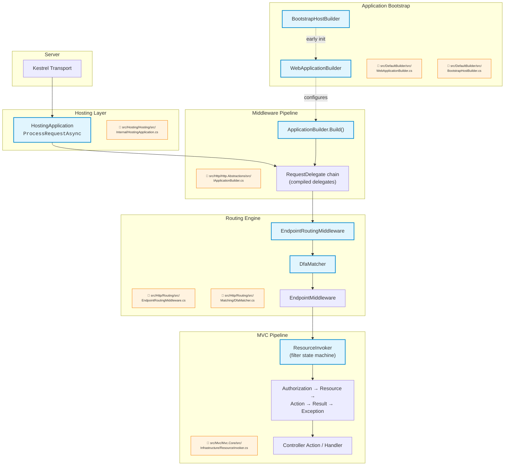

# Nivel 4: Internos — ASP.NET Core

> 🌐 [English version](../en/04-internals-aspnet-core.md)

> 🎯 **Perfil objetivo:** Desarrolladores que quieren entender la mecánica del framework a nivel de código fuente
> ⏱️ **Esfuerzo estimado:** 20–25 horas
> 📋 **Prerrequisitos:** Nivel 3 Avanzado, comodidad leyendo código C# complejo, familiaridad con patrones de diseño (decorator, strategy, factory)

---

## Objetivos de Aprendizaje

Al completar este módulo, vas a ser capaz de:

1. **Rastrear cómo `IApplicationBuilder.Build()` compila los delegados de middleware** en una sola cadena `RequestDelegate` — y explicar por qué el orden de construcción se invierte.
2. **Explicar cómo el DFA matcher construye una máquina de estados** a partir de los patrones de ruta en el arranque y la recorre por cada request en tiempo O(segmentos-de-ruta).
3. **Recorrer el pipeline completo de filtros de `ResourceInvoker`** — autorización, recurso, acción, excepción y resultado — y describir la máquina de estados que lo impulsa.
4. **Describir cómo `ServiceProvider` resuelve un grafo de servicios** incluyendo los ciclos de vida scoped, transient y singleton, y por qué la primera resolución es más lenta que las siguientes.
5. **Explicar el features pattern** y cómo `HttpContext` abstrae distintas implementaciones de servidor a través de `IFeatureCollection`.
6. **Rastrear un request de punta a punta** desde que Kestrel lo acepta, pasando por `HostingApplication.ProcessRequestAsync`, hasta la ejecución del endpoint y la respuesta.
7. **Identificar cómo `WebApplicationBuilder` compone** hosting, DI, configuración y setup de middleware — y qué valores por defecto conecta automáticamente.

---

## Mapa Conceptual

El siguiente diagrama muestra cómo un request fluye a través de la arquitectura interna de ASP.NET Core, desde el servidor hasta tu código. Cada nodo referencia el archivo fuente donde vive la lógica.



---

## Currículo

### Lección 4.1: IApplicationBuilder y la Construcción del Pipeline

**Esfuerzo est.: 3 horas**

> En el Nivel 1 aprendiste que el middleware forma un pipeline. En el Nivel 2 escribiste tu propio middleware. En el Nivel 3 estudiaste el orden y las ramificaciones. Ahora vamos a abrir el capó y ver cómo el pipeline se **compila** realmente.

#### Conceptos centrales

El middleware pipeline no es una lista que se itera en tiempo de ejecución — es un **artefacto de compilación**. Cuando se invoca `IApplicationBuilder.Build()` durante el arranque, toma cada registro de middleware y los pliega en un único `RequestDelegate` anidado. Comprender esta construcción es clave para entender por qué el orden del middleware importa y por qué el pipeline es tan rápido.

**Cómo funciona `Use()`:** Cada llamada a `Use()` agrega un `Func<RequestDelegate, RequestDelegate>` a una lista interna. Esta es una función que toma "el resto del pipeline" y retorna "el resto del pipeline con mi lógica envuelta alrededor." Es el patrón decorator en acción.

**Cómo `Build()` compila la cadena:** `Build()` itera la lista de middleware **en orden inverso**, enlazando cada `RequestDelegate` a través de la siguiente fábrica. El resultado es un único delegado donde el primer middleware registrado envuelve la capa más externa:

```csharp
// Versión simplificada de lo que Build() hace internamente
// (mirá IApplicationBuilder.cs para la implementación real)
RequestDelegate pipeline = context =>
{
    context.Response.StatusCode = 404;
    return Task.CompletedTask;
};

// Recorre los middleware registrados en orden inverso
for (var i = _components.Count - 1; i >= 0; i--)
{
    pipeline = _components[i](pipeline);
}

return pipeline;
```

El middleware terminal (la capa más interna) retorna 404 — si ningún middleware escribe una respuesta, obtenés un 404. Por eso a veces aparecen 404 inesperados cuando el middleware no llama a `next()`.

**Cómo `UseMiddleware<T>()` descubre `InvokeAsync`:** `UseMiddlewareExtensions` usa reflexión para encontrar el método `Invoke` o `InvokeAsync` en tu clase de middleware. Si el método acepta parámetros más allá de `HttpContext`, construye un **árbol de expresiones** que resuelve esos parámetros desde DI en tiempo de request. Por eso el middleware basado en convención soporta inyectar servicios directamente en `InvokeAsync` — cada llamada obtiene un conjunto fresco de servicios scoped.

#### Archivos fuente para leer

| Archivo | Qué buscar |
|---------|-----------|
| [`src/Http/Http.Abstractions/src/IApplicationBuilder.cs`](../../src/Http/Http.Abstractions/src/IApplicationBuilder.cs) | La firma del método `Use()` y el método `Build()` que compila el pipeline |
| [`src/Http/Http.Abstractions/src/Extensions/UseMiddlewareExtensions.cs`](../../src/Http/Http.Abstractions/src/Extensions/UseMiddlewareExtensions.cs) | Descubrimiento de middleware basado en reflexión, el árbol de expresiones compilado para inyección de parámetros y los requisitos de la firma de `InvokeAsync` |
| [`src/Hosting/Hosting/src/Builder/ApplicationBuilderFactory.cs`](../../src/Hosting/Hosting/src/Builder/ApplicationBuilderFactory.cs) | Cómo se crea la instancia de `ApplicationBuilder` desde el contenedor de DI |

#### Ejercicio

1. Abrí `UseMiddlewareExtensions.cs` y rastreá la ruta lógica para una clase de middleware que tiene una firma `InvokeAsync(HttpContext, ILogger)`. ¿Cómo descubre el método de extensión `InvokeAsync`? ¿Cómo crea un delegado fábrica que resuelve `ILogger` desde el service provider del request?
2. Escribí una clase de middleware con dos parámetros inyectados en `InvokeAsync`. Poné un breakpoint en `UseMiddlewareExtensions` y recorré paso a paso para ver cómo se construye el árbol de expresiones.
3. Mirá el método `Build()`. Explicale a vos mismo (o a un colega) por qué iterar en orden inverso produce el orden de ejecución correcto.

#### Conclusión clave

> El middleware pipeline es un **artefacto de compilación**. `Build()` crea una cadena de delegados donde cada uno envuelve al siguiente. El orden se invierte durante la construcción — el último middleware registrado se envuelve primero, pero se ejecuta último. Después de que `Build()` completa, no hay lista, no hay iteración, no hay búsqueda en diccionario — solo un delegado único para invocar por request.

---

### Lección 4.2: DFA Matcher y Selección de Endpoints

**Esfuerzo est.: 4 horas**

> En el Nivel 3 aprendiste que `EndpointRoutingMiddleware` y `EndpointMiddleware` cooperan para hacer match y ejecutar endpoints. Ahora vamos a mirar *cómo* funciona realmente el matching — y es uno de los algoritmos más sofisticados de todo el framework.

#### Conceptos centrales

El motor de routing de ASP.NET Core usa un **Autómata Finito Determinista (DFA)** para hacer match de las rutas URL entrantes contra los patrones de ruta registrados. Esto no es un simple "recorrer todas las rutas y verificar cada una" — es una máquina de estados compilada que procesa cada segmento de ruta exactamente una vez, sin importar cuántas rutas estén registradas.

**¿Qué es un DFA en este contexto?** Pensalo como un árbol de estados. Cada estado representa "ya consumí esta cantidad de segmentos de ruta y estas rutas siguen siendo candidatas." Las transiciones entre estados corresponden a segmentos de ruta — ya sea coincidencias literales, capturas de parámetros o catch-alls. El DFA se construye en el arranque y se recorre en tiempo de request.

**¿Por qué un DFA?** Una implementación ingenua de routing sería O(n × m) — para cada una de las n rutas registradas, verificar m segmentos de ruta. El DFA transforma esto en O(m) — recorrés m segmentos a través de la máquina de estados y el conjunto de candidatos que coinciden cae al final. Por eso ASP.NET Core maneja cientos de rutas sin overhead medible de routing.

**Cómo `MatcherPolicy` extiende el matching:** Después de que el DFA reduce los candidatos, las implementaciones de `MatcherPolicy` pueden filtrarlos o reordenarlos. Por ejemplo, `HttpMethodMatcherPolicy` filtra por verbo HTTP, y `HostMatcherPolicy` filtra por header de host. Este es el patrón strategy — el matcher delega decisiones específicas de política a componentes pluggables.

**Cómo `EndpointSelector` maneja la ambigüedad:** Si múltiples endpoints coinciden con un request, `EndpointSelector` decide qué hacer. La implementación por defecto lanza una `AmbiguousMatchException` — no va a elegir uno silenciosamente. Podés reemplazarlo con un selector personalizado si necesitás un comportamiento diferente.

#### Archivos fuente para leer

| Archivo | Qué buscar |
|---------|-----------|
| [`src/Http/Routing/src/Matching/DfaMatcher.cs`](../../src/Http/Routing/src/Matching/DfaMatcher.cs) | El método `MatchAsync` — seguí el recorrido de la máquina de estados. Buscá cómo maneja segmentos literales, parámetros y catch-alls. |
| [`src/Http/Routing/src/Matching/MatcherPolicy.cs`](../../src/Http/Routing/src/Matching/MatcherPolicy.cs) | La base abstracta para políticas de matching — `AppliesToEndpoints`, `ApplyAsync` |
| [`src/Http/Routing/src/Matching/EndpointSelector.cs`](../../src/Http/Routing/src/Matching/EndpointSelector.cs) | La estrategia de selección por defecto y el manejo de ambigüedad |
| [`src/Http/Routing/src/Patterns/RoutePatternMatcher.cs`](../../src/Http/Routing/src/Patterns/RoutePatternMatcher.cs) | Matching de patrones individuales — cómo un único patrón de ruta se valida contra un path |
| [`src/Http/Routing/src/EndpointRoutingMiddleware.cs`](../../src/Http/Routing/src/EndpointRoutingMiddleware.cs) | Cómo el middleware invoca al matcher y almacena el resultado en `HttpContext` |

> ⚠️ **Advertencia honesta de dificultad:** `DfaMatcher.cs` es uno de los archivos más complejos del repositorio. No intentes entender cada línea en tu primera lectura. Enfocate en el método `MatchAsync` y rastreá las transiciones de estado. La lógica de construcción (cómo se arma el DFA a partir de patrones de ruta) es una pieza separada, aún más compleja — guardala para una segunda pasada.

#### Ejercicio

1. Registrá 5+ rutas con patrones superpuestos (ej., `/products/{id}`, `/products/featured`, `/products/{category}/{id}`). Agregá middleware de logging antes del routing y después de la ejecución del endpoint. Rastreá `DfaMatcher.MatchAsync` mentalmente o con un debugger para entender qué estados del DFA se visitan para `/products/featured`.
2. Registrá dos rutas que entren en conflicto (ej., `/items/{id}` y `/items/{name}`). Observá la `AmbiguousMatchException`. Luego creá un `MatcherPolicy` personalizado que resuelva la ambigüedad basándose en si el segmento es numérico.
3. Mirá cómo `EndpointRoutingMiddleware` almacena el endpoint que hizo match. ¿Qué feature de `HttpContext` usa? ¿Cómo lo recupera `EndpointMiddleware`?

#### Conclusión clave

> El DFA matcher es uno de los algoritmos más sofisticados de ASP.NET Core. Transforma un problema O(n × m) (n rutas × m segmentos) en un recorrido O(m). Entenderlo explica por qué el routing "simplemente funciona" incluso con cientos de rutas — y por qué nunca deberías intentar implementar tu propia lógica de matching de URLs cuando el sistema integrado casi con certeza la va a superar en rendimiento.

---

### Lección 4.3: Pipeline de Ejecución de Acciones MVC (ResourceInvoker)

**Esfuerzo est.: 4 horas**

> En el Nivel 2 aprendiste a usar filtros como `[Authorize]` y `IActionFilter`. En el Nivel 3 estudiaste cómo funciona el ordenamiento de filtros. Ahora miremos la maquinaria que realmente los ejecuta — y no es un simple loop.

#### Conceptos centrales

Cuando un endpoint MVC es seleccionado por el routing, el request entra al pipeline de filtros de MVC. La clase `ResourceInvoker` orquesta este pipeline como una **máquina de estados** — no como una secuencia lineal de llamadas. Comprender por qué es una máquina de estados (en lugar de un simple foreach sobre los filtros) revela cómo ASP.NET Core maneja escenarios complejos como cortocircuito, manejo de excepciones y sobreescritura de resultados.

**El orden de ejecución de filtros:**
1. **Filtros de autorización** — se ejecutan primero, pueden cortocircuitar todo el pipeline
2. **Filtros de recurso** — envuelven todo lo demás, útiles para caching
3. **Model binding** — ocurre entre los filtros de recurso y los filtros de acción
4. **Filtros de acción** — se ejecutan inmediatamente antes y después del método de acción
5. **El método de acción en sí** — tu código del controlador
6. **Filtros de resultado** — se ejecutan antes y después de que el resultado de la acción se ejecuta
7. **Filtros de excepción** — capturan excepciones de la ejecución de la acción

**¿Por qué una máquina de estados?** Cada tipo de filtro tiene semánticas de cortocircuito diferentes. Los filtros de autorización pueden rechazar un request antes de que ocurra el model binding. Los filtros de recurso pueden retornar un resultado cacheado sin jamás llamar a la acción. Los filtros de excepción necesitan capturar errores de la ejecución de la acción pero no de la ejecución del resultado. Un simple loop no puede expresar estas relaciones limpiamente — una máquina de estados sí.

**Cómo funciona el cache:** `ControllerActionInvokerCache` construye el pipeline de filtros una sola vez por acción y lo cachea. Los requests subsiguientes para la misma acción se saltan completamente la construcción del pipeline. El cache almacena la lista ordenada de filtros y el delegado invoker compilado.

#### Archivos fuente para leer

| Archivo | Qué buscar |
|---------|-----------|
| [`src/Mvc/Mvc.Core/src/Infrastructure/ResourceInvoker.cs`](../../src/Mvc/Mvc.Core/src/Infrastructure/ResourceInvoker.cs) | El punto de entrada `InvokeAsync`, `InvokeFilterPipelineAsync`, el enum `State` y el método `Next` que impulsa la máquina de estados. Este es el corazón de la ejecución de MVC. |
| [`src/Mvc/Mvc.Core/src/Infrastructure/ControllerActionInvoker.cs`](../../src/Mvc/Mvc.Core/src/Infrastructure/ControllerActionInvoker.cs) | Extensión específica del controlador de `ResourceInvoker` — cómo invoca el método de acción y maneja `IActionResult` |
| [`src/Mvc/Mvc.Core/src/Infrastructure/ControllerActionInvokerCache.cs`](../../src/Mvc/Mvc.Core/src/Infrastructure/ControllerActionInvokerCache.cs) | Cómo el pipeline de filtros se cachea por acción para evitar reconstruirlo en cada request |

> ⚠️ **Advertencia honesta de dificultad:** `ResourceInvoker.cs` es grande y denso. La máquina de estados usa un enum `State` y un método `Next` con un switch que implementa las transiciones. No es intuitivo en la primera lectura. Empezá mapeando los valores del enum `State` a las etapas del pipeline de filtros listadas arriba, luego rastreá un request de happy-path a través del método `Next`.

#### Ejercicio

1. Abrí `ResourceInvoker.cs`. Encontrá el enum `State` y listá todos los estados. Mapeá cada estado a la etapa del pipeline de filtros que representa (autorización, recurso, model binding, acción, resultado, excepción).
2. Rastreá el método `InvokeFilterPipelineAsync` para un request con un atributo `[Authorize]` y un `IActionFilter`. Anotá cada transición de `State`.
3. Ahora rastreá qué pasa cuando un `IAuthorizationFilter` cortocircuita (establece un resultado sin llamar a `next`). ¿Qué estados se saltan?
4. Mirá `ControllerActionInvokerCache`. ¿Cómo determina la clave del cache? ¿Qué pasa cuando se encuentra una nueva acción por primera vez?

#### Conclusión clave

> `ResourceInvoker` es una máquina de estados, no un pipeline lineal simple. Este diseño le permite manejar interacciones complejas de filtros — cortocircuito, manejo de excepciones, sobreescritura de resultados — mientras mantiene un orden de ejecución claro y determinista. El cache asegura que este pipeline complejo se construye una vez y se reutiliza, haciendo que el overhead por request sea mínimo.

---

### Lección 4.4: Mecánica de Resolución del ServiceProvider

**Esfuerzo est.: 3 horas**

> En el Nivel 1 aprendiste qué es DI. En el Nivel 2 registraste servicios. En el Nivel 3 depuraste problemas de ciclos de vida. Ahora entendamos cómo el contenedor realmente resuelve un servicio — qué pasa dentro de esa caja negra.

#### Conceptos centrales

El contenedor de DI por defecto en .NET (`Microsoft.Extensions.DependencyInjection`) es más sofisticado de lo que la mayoría de los desarrolladores creen. No simplemente instancia objetos con `new` — construye un **árbol de call sites**, lo compila y cachea el resultado. Entender esto explica varios comportamientos observables: por qué el primer request es más lento, por qué ciertos patrones de registro son más rápidos y por qué las dependencias cautivas son peligrosas.

**La cadena de call sites:** Cuando resolvés un servicio por primera vez, el contenedor recorre sus registros para construir un árbol de "call sites" — nodos que describen cómo crear cada servicio en el grafo de dependencias. Un call site para `MyService` podría referenciar call sites para `ILogger<MyService>` e `IRepository`, cada uno de los cuales referencia sus propias dependencias, y así sucesivamente. Este árbol captura la estrategia completa de resolución.

**Resolución compilada vs. interpretada:** En la primera resolución, el contenedor interpreta el árbol de call sites para crear el servicio. Para servicios que se resolverán frecuentemente (singletons, resoluciones scoped repetidas), luego **compila el árbol a IL** — lenguaje intermedio de .NET real que evita la reflexión en las llamadas subsiguientes. Por eso la primera resolución de un grafo complejo es notablemente más lenta.

**Resolución scoped:** `IServiceScopeFactory.CreateScope()` crea un nuevo scope que comparte la raíz de singletons pero tiene su propio cache de instancias para servicios scoped. En ASP.NET Core, cada request HTTP obtiene su propio scope — por eso los servicios scoped son por request. El scope se crea en `HostingApplication.ProcessRequestAsync` antes de que tu middleware se ejecute.

**Dónde vive el código:** La implementación de `ServiceProvider` en sí vive en `dotnet/runtime` (bajo `src/libraries/Microsoft.Extensions.DependencyInjection/`), no en este repositorio. Sin embargo, `WebApplicationBuilder` lo configura, y entender cómo ASP.NET Core interactúa con el contenedor es esencial.

#### Archivos fuente para leer

| Archivo | Qué buscar |
|---------|-----------|
| [`src/DefaultBuilder/src/WebApplicationBuilder.cs`](../../src/DefaultBuilder/src/WebApplicationBuilder.cs) | Cómo se expone `Services` (el `IServiceCollection`) y cómo se construye el contenedor durante `Build()` |
| [`src/Hosting/Hosting/src/Internal/HostingApplication.cs`](../../src/Hosting/Hosting/src/Internal/HostingApplication.cs) | Cómo `ProcessRequestAsync` crea el scope del request — buscá el uso de `IServiceScopeFactory` |
| **Externo:** [`dotnet/runtime` — `ServiceProvider.cs`](https://github.com/dotnet/runtime/tree/main/src/libraries/Microsoft.Extensions.DependencyInjection) | El motor de resolución real — visitors de call sites, compilación a IL, gestión de scopes |

#### Ejercicio

1. Habilitá el logging de diagnóstico de DI llamando a `services.AddLogging()` y configurando `Microsoft.Extensions.DependencyInjection` a nivel `Debug`. Registrá un grafo de servicios con 3+ niveles de anidamiento (ej., `Controller → Service → Repository → DbContext`) con ciclos de vida mixtos. Observá la salida del log de resolución.
2. En `HostingApplication.cs`, encontrá dónde se crea el scope del request. ¿Qué pasa con los servicios scoped cuando el request termina? ¿Cómo funciona el dispose?
3. Registrá la misma interfaz con una implementación singleton y una scoped. Resolvé `IEnumerable<IMyService>` y observá qué instancias obtenés. Luego resolvé la interfaz directamente — ¿qué registro gana?
4. Leé el código fuente de `dotnet/runtime` para `CallSiteFactory` — rastreá cómo construye el árbol de call sites para un servicio con tres dependencias.

#### Conclusión clave

> El contenedor de DI construye un árbol de "call sites" en el momento de la primera resolución, luego lo compila a IL para las llamadas subsiguientes. Entender esto explica por qué el primer request es más lento (construcción del árbol + interpretación), por qué algunos patrones de DI son más performantes que otros (los grafos planos compilan mejor), y por qué el contenedor es lo suficientemente rápido como para que casi nunca necesites preocuparte por el overhead de DI en producción.

---

### Lección 4.5: HttpContext y el Features Pattern

**Esfuerzo est.: 3 horas**

> En el Nivel 1 usaste `HttpContext.Request` y `HttpContext.Response` sin pensar mucho en de dónde vienen. En el Nivel 3 configuraste Kestrel. Ahora entendamos cómo `HttpContext` funciona como capa de abstracción sobre distintos servidores — y por qué el features pattern es central en ese diseño.

#### Conceptos centrales

`HttpContext` no es una clase concreta que posee directamente los datos del request/response. Es una **capa de abstracción** que delega a una colección de **features** — interfaces que cada implementación de servidor provee. Este diseño permite que ASP.NET Core corra sobre Kestrel, IIS (vía el ASP.NET Core Module), TestServer o cualquier servidor personalizado sin acoplar el middleware pipeline a una implementación específica.

**El features pattern:** `IFeatureCollection` es una bolsa de propiedades indexada por tipo de interfaz. Un servidor como Kestrel la llena con implementaciones de `IHttpRequestFeature`, `IHttpResponseFeature`, `IHttpConnectionFeature` y otras. `HttpContext` luego envuelve estas features con una API amigable para el desarrollador. Cuando leés `HttpContext.Request.Path`, en realidad estás leyendo del `IHttpRequestFeature` que Kestrel colocó en la colección.

**¿Por qué features en vez de una abstracción más simple?** Porque distintos servidores soportan distintas capacidades. Kestrel soporta HTTP/2 server push (vía `IHttpResponseBodyFeature`), IIS soporta Windows Authentication (vía `IHttpAuthenticationFeature`), y TestServer soporta comunicación directa en memoria. La colección de features le permite a cada servidor exponer exactamente lo que soporta, y el middleware puede consultar features específicas en tiempo de ejecución.

**Pooling de HttpContext:** Las instancias de `DefaultHttpContext` se reutilizan mediante pooling entre requests. La clase `DefaultHttpContext` (en este repositorio) resetea su estado entre requests en vez de asignar una nueva instancia cada vez. Esta es una optimización de rendimiento significativa para escenarios de alto throughput.

> **Nota:** `IFeatureCollection` y `DefaultHttpContextFactory` se movieron a `dotnet/runtime`. Las *interfaces* de features permanecen en `src/Http/Http.Features/src/`, y la implementación de `DefaultHttpContext` está en `src/Http/Http/src/DefaultHttpContext.cs`.

#### Archivos fuente para leer

| Archivo | Qué buscar |
|---------|-----------|
| [`src/Http/Http.Abstractions/src/HttpContext.cs`](../../src/Http/Http.Abstractions/src/HttpContext.cs) | La clase base abstracta — notá cómo `Request`, `Response`, `Features` son abstractos. Es pura abstracción, sin implementación. |
| [`src/Http/Http/src/DefaultHttpContext.cs`](../../src/Http/Http/src/DefaultHttpContext.cs) | La implementación concreta — rastreá cómo envuelve interfaces de features para implementar `Request`, `Response` y otras propiedades |
| [`src/Http/Http.Features/src/IHttpRequestFeature.cs`](../../src/Http/Http.Features/src/IHttpRequestFeature.cs) | Una interfaz de feature típica — los datos crudos del request HTTP que un servidor provee |
| [`src/Http/Http.Features/src/IHttpConnectionFeature.cs`](../../src/Http/Http.Features/src/IHttpConnectionFeature.cs) | Detalles a nivel de conexión — direcciones IP, puertos, ID de conexión |
| [`src/Http/Http/src/Features/RequestServicesFeature.cs`](../../src/Http/Http/src/Features/RequestServicesFeature.cs) | Cómo el scope de DI del request se expone como una feature |

#### Ejercicio

1. Escribí middleware que acceda a features de bajo nivel directamente:
   ```csharp
   app.Use(async (context, next) =>
   {
       var connectionFeature = context.Features.Get<IHttpConnectionFeature>();
       if (connectionFeature is not null)
       {
           Console.WriteLine($"IP remota: {connectionFeature.RemoteIpAddress}");
           Console.WriteLine($"Puerto local: {connectionFeature.LocalPort}");
       }
       await next(context);
   });
   ```
2. Abrí `DefaultHttpContext.cs` y rastreá cómo se implementa `Request.Path`. Seguí la cadena desde el getter de la propiedad hasta la interfaz de feature subyacente.
3. Usá `TestServer` de `Microsoft.AspNetCore.TestHost` y compará qué features están disponibles versus un servidor Kestrel real. ¿Qué features faltan? ¿Cuáles están simuladas?
4. Encontrá `RequestServicesFeature.cs` — ¿cómo crea de manera lazy el `IServiceProvider` del scope del request? ¿Qué pasa cuando la feature se dispone?

#### Conclusión clave

> El features pattern le permite a ASP.NET Core trabajar con cualquier servidor sin acoplarse a una implementación específica. `HttpContext` es un wrapper de conveniencia — el verdadero poder está en la colección de features. Cuando necesitás acceso a capacidades específicas del servidor (detalles de conexión, features de HTTP/2, WebSockets), accedés directamente a través de `Features.Get<T>()`. Esta arquitectura es lo que hace a ASP.NET Core genuinamente agnóstico del servidor.

---

### Lección 4.6: Internos de WebApplicationBuilder

**Esfuerzo est.: 3 horas**

> En el Nivel 1 llamaste a `WebApplication.CreateBuilder(args)` sin pensarlo demasiado. En el Nivel 3 personalizaste Kestrel y el logging. Ahora leamos el builder en sí — cada valor por defecto que configura, cada sub-builder que compone, y cómo `Build()` crea la aplicación final.

#### Conceptos centrales

`WebApplicationBuilder` es una **raíz de composición** — no hace mucho trabajo por sí mismo sino que orquesta múltiples sub-builders que cada uno maneja una parte del setup de la aplicación. Entender esta composición revela cada valor por defecto que ASP.NET Core configura y cómo sobreescribir cualquiera de ellos.

**La jerarquía de builders:**

1. **`BootstrapHostBuilder`** — se ejecuta primero durante `CreateBuilder()`. Captura las acciones iniciales de configuración (logging, configuración del host) para poder reproducirlas después. Existe porque `WebApplicationBuilder` necesita leer configuración (como los settings de Kestrel) antes de que el host esté completamente construido.

2. **`ConfigureHostBuilder`** — expuesto como `builder.Host`. Te permite configurar concerns a nivel de host (tiempo de vida, entorno). Las acciones registradas acá son diferidas — se ejecutan durante `Build()`, no cuando las llamás.

3. **`ConfigureWebHostBuilder`** — expuesto como `builder.WebHost`. Te permite configurar concerns específicos de web (Kestrel, URLs del servidor). También diferido.

4. **`WebApplicationBuilder` mismo** — expone `Services`, `Configuration`, `Logging` y `Environment` directamente. Estas son las APIs "inmediatas" — modifican el estado del builder de inmediato.

**Qué configura `CreateBuilder()` por defecto:**
- Configuración desde `appsettings.json`, variables de entorno, argumentos de línea de comandos y user secrets (en Development)
- Logging a consola, debug y event source
- Kestrel como servidor por defecto
- Servicios de routing
- La infraestructura del generic host

**Qué hace `Build()`:**
- Reproduce todas las acciones de configuración diferidas
- Construye el `IServiceProvider` a partir de los registros de servicios acumulados
- Crea el `IHost` y lo envuelve en un `WebApplication`
- El `WebApplication` en sí implementa `IApplicationBuilder`, `IEndpointRouteBuilder` e `IHost` — es un composite que unifica todas estas responsabilidades

#### Archivos fuente para leer

| Archivo | Qué buscar |
|---------|-----------|
| [`src/DefaultBuilder/src/WebApplicationBuilder.cs`](../../src/DefaultBuilder/src/WebApplicationBuilder.cs) | El constructor (qué valores por defecto se configuran), el método `Build()` (cómo se ensambla el host) y las propiedades `Services`, `Configuration`, `Logging` |
| [`src/DefaultBuilder/src/BootstrapHostBuilder.cs`](../../src/DefaultBuilder/src/BootstrapHostBuilder.cs) | Cómo se captura y difiere la configuración de etapa temprana — buscá las listas de `Action<>` que se reproducen después |
| [`src/DefaultBuilder/src/ConfigureHostBuilder.cs`](../../src/DefaultBuilder/src/ConfigureHostBuilder.cs) | La API `builder.Host` — cómo las acciones a nivel de host se recolectan pero aún no se aplican |
| [`src/DefaultBuilder/src/WebApplication.cs`](../../src/DefaultBuilder/src/WebApplication.cs) | La clase `WebApplication` — rastreá cómo implementa `IApplicationBuilder`, `IEndpointRouteBuilder` e `IHost`. Entendé los métodos `Run()` y `RunAsync()`. |
| [`src/Hosting/Hosting/src/GenericHost/GenericWebHostBuilder.cs`](../../src/Hosting/Hosting/src/GenericHost/GenericWebHostBuilder.cs) | La integración subyacente con el generic host — cómo Kestrel, routing y otros servicios se conectan al host |

#### Ejercicio

1. Leé `WebApplicationBuilder.cs` de arriba a abajo. Listá cada servicio y fuente de configuración que `CreateBuilder(args)` registra por defecto. Contalos — la lista es más larga de lo que la mayoría de desarrolladores esperan.
2. Rastreá qué pasa cuando escribís:
   ```csharp
   var builder = WebApplication.CreateBuilder(args);
   builder.Services.AddControllers();
   var app = builder.Build();
   ```
   ¿En qué momento `AddControllers()` realmente se ejecuta? ¿Cuándo están disponibles los servicios de MVC?
3. Abrí `BootstrapHostBuilder.cs`. ¿Por qué existe esta clase? ¿Qué problema resuelve que `ConfigureHostBuilder` solo no puede resolver?
4. Mirá `WebApplication.cs`. Encontrá dónde implementa `IApplicationBuilder.Build()`. ¿Cómo es que llamar `app.MapGet(...)` eventualmente se compila en el middleware pipeline?

#### Conclusión clave

> `WebApplicationBuilder` es una raíz de composición que conecta múltiples sub-builders. Entenderlo revela cada valor por defecto que ASP.NET Core configura — y cómo sobreescribir cualquiera de ellos. El patrón de acciones diferidas (`BootstrapHostBuilder`, `ConfigureHostBuilder`) existe para resolver un problema real de arranque: necesitás la configuración para configurar servicios, pero necesitás servicios para leer la configuración. La jerarquía de builders resuelve este problema del huevo y la gallina de manera elegante.

---

## Guía de Lectura de Código Fuente

Estos son los archivos internos más importantes para leer, en el orden sugerido. La calificación ⭐ indica complejidad, no importancia — un archivo ⭐⭐⭐ podría ser igual de crítico para entender que un archivo ⭐⭐⭐⭐, pero más fácil de leer.

| Orden | Archivo | Qué vas a aprender | Complejidad |
|:-----:|---------|-------------------|:-----------:|
| 1 | [`src/Http/Http.Abstractions/src/IApplicationBuilder.cs`](../../src/Http/Http.Abstractions/src/IApplicationBuilder.cs) | `Build()` compila el middleware pipeline | ⭐⭐⭐ |
| 2 | [`src/Http/Http.Abstractions/src/Extensions/UseMiddlewareExtensions.cs`](../../src/Http/Http.Abstractions/src/Extensions/UseMiddlewareExtensions.cs) | Reflexión, árboles de expresiones, integración con DI | ⭐⭐⭐⭐ |
| 3 | [`src/Hosting/Hosting/src/Internal/HostingApplication.cs`](../../src/Hosting/Hosting/src/Internal/HostingApplication.cs) | Punto de entrada del request, creación de scope, diagnósticos | ⭐⭐⭐⭐ |
| 4 | [`src/DefaultBuilder/src/WebApplicationBuilder.cs`](../../src/DefaultBuilder/src/WebApplicationBuilder.cs) | Composición del builder, valores por defecto, `Build()` | ⭐⭐⭐ |
| 5 | [`src/Http/Http/src/DefaultHttpContext.cs`](../../src/Http/Http/src/DefaultHttpContext.cs) | Mapeo HttpContext ↔ colección de features | ⭐⭐⭐ |
| 6 | [`src/Http/Routing/src/Matching/DfaMatcher.cs`](../../src/Http/Routing/src/Matching/DfaMatcher.cs) | Construcción y recorrido del DFA | ⭐⭐⭐⭐ |
| 7 | [`src/Mvc/Mvc.Core/src/Infrastructure/ResourceInvoker.cs`](../../src/Mvc/Mvc.Core/src/Infrastructure/ResourceInvoker.cs) | Máquina de estados de filtros, orquestación del pipeline | ⭐⭐⭐⭐ |

---

## Herramientas de Diagnóstico

Estas herramientas te ayudan a explorar y verificar los internos cubiertos en este módulo.

| Herramienta | Propósito | Cuándo usarla |
|-------------|-----------|--------------|
| **Source Link / descompilación** (JetBrains dotPeek, ILSpy) | Navegar el código fuente del framework con símbolos de depuración | Leyendo internos del framework que viven fuera de este repo (ej., código de DI en `dotnet/runtime`) |
| **Visual Studio "Go to Implementation"** (Ctrl+F12) | Saltar de una interfaz a la implementación concreta | Siguiendo cadenas de llamadas desde `IApplicationBuilder` hasta `ApplicationBuilder`, etc. |
| **`dotnet-trace`** con el provider `Microsoft-AspNetCore-Hosting` | Capturar eventos internos del framework | Rastreando tiempos de ejecución del pipeline, eventos del ciclo de vida del request |
| **BenchmarkDotNet** | Micro-benchmarks para hot paths del framework | Midiendo overhead de middleware, costo de routing, tiempo de resolución de DI |
| **Listeners de `DiagnosticSource`** | Suscribirse a eventos de diagnóstico del framework | Observando eventos internos como `Microsoft.AspNetCore.Hosting.BeginRequest` |
| **`ASPNETCORE_DETAILEDERRORS=true`** | Habilitar páginas de error detalladas con stack traces completos | Viendo stack traces del framework durante desarrollo para entender cadenas de llamadas |

**Ejemplo: rastreo de tiempos de request con `dotnet-trace`**

```bash
# Instalar la herramienta
dotnet tool install -g dotnet-trace

# Recolectar un trace con eventos de ASP.NET Core
dotnet-trace collect --process-id <PID> \
    --providers Microsoft-AspNetCore-Hosting

# Analizar el archivo .nettrace en PerfView o Visual Studio
```

---

## Autoevaluación

Usá estas verificaciones para comprobar tu comprensión. Si podés responder todas con confianza, internalizaste este módulo.

### Verificaciones de conocimiento

- [ ] **Compilación del pipeline:** ¿Podés explicar por qué `IApplicationBuilder.Build()` itera los middleware en orden inverso? ¿Qué pasaría si iterara hacia adelante?
- [ ] **Reflexión de UseMiddleware:** ¿Podés describir cómo `UseMiddlewareExtensions` descubre `InvokeAsync` y crea un delegado fábrica para inyección de parámetros por DI?
- [ ] **Matching con DFA:** ¿Podés dibujar (en papel o pizarra) los estados del DFA que se generarían para estas tres rutas: `/api/users`, `/api/users/{id}`, `/api/{controller}/{action}`?
- [ ] **Máquina de estados de filtros:** ¿Podés listar los estados de `ResourceInvoker` en orden y explicar qué tipos de filtros se ejecutan en cada estado?
- [ ] **Resolución de servicios:** ¿Podés explicar la diferencia entre que el árbol de call sites sea "interpretado" versus "compilado a IL" — y cuándo ocurre cada uno?
- [ ] **Features pattern:** ¿Podés explicar por qué `HttpContext.Request.Path` pasa por una interfaz de feature en vez de ser una propiedad directa?
- [ ] **Composición del builder:** ¿Podés explicar qué hace `BootstrapHostBuilder` que `ConfigureHostBuilder` no puede hacer?

### Desafío

**Rastreo completo de un request:** Empezando desde `HostingApplication.ProcessRequestAsync`, rastreá un request a `GET /api/products/42` a través de:
1. Creación del scope
2. Invocación del `RequestDelegate` (el pipeline compilado)
3. `EndpointRoutingMiddleware` → `DfaMatcher.MatchAsync`
4. `EndpointMiddleware` → `ResourceInvoker.InvokeAsync`
5. Filtros de autorización → filtros de recurso → model binding → filtros de acción → acción → filtros de resultado
6. Escritura de la respuesta y dispose del scope

Escribí el archivo fuente y el número de línea aproximado para cada transición. Este ejercicio une todo lo de este módulo.

---

## Conexiones

| Dirección | Enlace |
|-----------|--------|
| ⬇️ Anterior | [Nivel 3 — Avanzado](03-advanced-aspnet-core.md) — configuración de producción, rendimiento, patrones avanzados |
| ⬆️ Siguiente | [Nivel 5 — Experto / Contribuidor](05-expert-aspnet-core.md) — compilar desde el código fuente, contribuir, extender el framework |
| ↔️ Relacionado | [`dotnet/runtime` — Internos de DI](https://github.com/dotnet/runtime/tree/main/src/libraries/Microsoft.Extensions.DependencyInjection) — la implementación real de `ServiceProvider` |
| ↔️ Relacionado | [`dotnet/runtime` — Capa de transporte de Kestrel](https://github.com/dotnet/runtime) — el pipeline de I/O debajo de la capa de hosting |

---

## Glosario

| Término (ES) | Term (EN) | Definición |
|--------------|-----------|-----------|
| **Delegado de request** | **RequestDelegate** | Un delegado (`Func<HttpContext, Task>`) que representa una unidad de procesamiento HTTP. El middleware pipeline compilado es un único `RequestDelegate`. |
| **Autómata Finito Determinista** | **DFA (Deterministic Finite Automaton)** | Una máquina de estados donde cada estado tiene exactamente una transición por símbolo de entrada. En el routing de ASP.NET Core, los "símbolos de entrada" son segmentos de ruta URL y los estados representan conjuntos de endpoints candidatos. |
| **Política de matching** | **MatcherPolicy** | Una clase abstracta que permite extender el matcher de routing con lógica personalizada. Las implementaciones pueden filtrar, ordenar o rechazar candidatos de endpoints después de que el DFA reduce el conjunto inicial. |
| **Invocador de recursos** | **ResourceInvoker** | La clase de MVC que orquesta el pipeline de filtros como máquina de estados. Gestiona la ejecución de filtros de autorización, recurso, acción, resultado y excepción. |
| **Sitio de llamada** | **Call Site** | Un concepto interno de DI que representa un nodo en el árbol de resolución de servicios. Cada call site describe cómo crear un servicio, referenciando call sites hijos para sus dependencias. |
| **Patrón de features** | **Features Pattern** | Un patrón arquitectónico donde las capacidades se exponen como interfaces en una bolsa de propiedades (`IFeatureCollection`), permitiendo que distintas implementaciones provean distintas capacidades sin una clase base común. |
| **Colección de features** | **IFeatureCollection** | Una colección indexada por `Type` que contiene interfaces de features. Cada implementación de servidor la llena con sus propios objetos de features. Definida en `dotnet/runtime`. |
| **Builder de arranque** | **BootstrapHostBuilder** | Un builder interno que captura acciones de configuración del host durante la construcción de `WebApplicationBuilder`. Existe para resolver el problema de arranque de necesitar configuración antes de que el host esté construido. |
| **Compilación del pipeline** | **Pipeline Compilation** | El proceso por el cual `IApplicationBuilder.Build()` pliega los registros de middleware en un único `RequestDelegate` anidado. Después de la compilación, no hay lista ni diccionario — solo una cadena de delegados. |

---

## Referencias

### Código fuente de ASP.NET Core (este repositorio)
- [`src/Http/Http.Abstractions/src/IApplicationBuilder.cs`](../../src/Http/Http.Abstractions/src/IApplicationBuilder.cs)
- [`src/Http/Http.Abstractions/src/Extensions/UseMiddlewareExtensions.cs`](../../src/Http/Http.Abstractions/src/Extensions/UseMiddlewareExtensions.cs)
- [`src/Http/Routing/src/Matching/DfaMatcher.cs`](../../src/Http/Routing/src/Matching/DfaMatcher.cs)
- [`src/Mvc/Mvc.Core/src/Infrastructure/ResourceInvoker.cs`](../../src/Mvc/Mvc.Core/src/Infrastructure/ResourceInvoker.cs)
- [`src/DefaultBuilder/src/WebApplicationBuilder.cs`](../../src/DefaultBuilder/src/WebApplicationBuilder.cs)
- [`src/Hosting/Hosting/src/Internal/HostingApplication.cs`](../../src/Hosting/Hosting/src/Internal/HostingApplication.cs)
- [`src/Http/Http/src/DefaultHttpContext.cs`](../../src/Http/Http/src/DefaultHttpContext.cs)

### Código fuente de .NET runtime (externo)
- [Microsoft.Extensions.DependencyInjection — `dotnet/runtime`](https://github.com/dotnet/runtime/tree/main/src/libraries/Microsoft.Extensions.DependencyInjection)

### Documentación oficial
- [ASP.NET Core Middleware](https://learn.microsoft.com/aspnet/core/fundamentals/middleware/)
- [Routing en ASP.NET Core](https://learn.microsoft.com/aspnet/core/fundamentals/routing)
- [Filtros en ASP.NET Core](https://learn.microsoft.com/aspnet/core/mvc/controllers/filters)
- [Inyección de dependencias en ASP.NET Core](https://learn.microsoft.com/aspnet/core/fundamentals/dependency-injection)
- [Features de request en ASP.NET Core](https://learn.microsoft.com/aspnet/core/fundamentals/request-features)

### Artículos de profundización
- [Andrew Lock — Behind the scenes of minimal APIs](https://andrewlock.net/series/behind-the-scenes-of-minimal-apis/)
- [Steve Gordon — ASP.NET Core Anatomy](https://www.stevejgordon.co.uk/aspnet-core-anatomy-how-does-usestartup-work)
- [David Fowler — ASP.NET Core Architecture](https://github.com/davidfowl/AspNetCoreDiagnosticScenarios)
