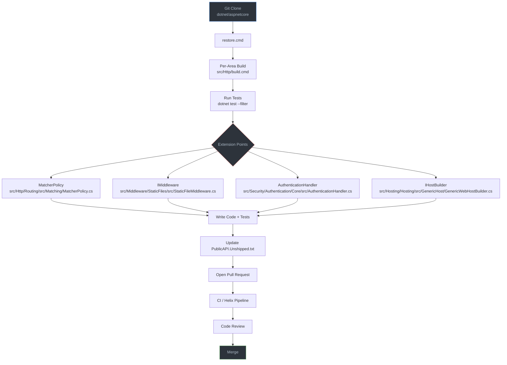

# Nivel 5: Experto / Contributor — ASP.NET Core

> 🌐 [English version](../en/05-expert-aspnet-core.md)

> 🎯 **Perfil objetivo:** Desarrolladores que quieren contribuir al framework, extender su núcleo o construir soluciones de hosting personalizadas
> ⏱️ **Esfuerzo estimado:** 20–25 horas
> 📋 **Prerrequisitos:** Nivel 4 (Internals), experiencia con bases de código grandes en C#, familiaridad con sistemas de build y flujos de trabajo con git

---

## Objetivos de Aprendizaje

Al completar este módulo, vas a ser capaz de:

1. Clonar, compilar y ejecutar la suite de tests de ASP.NET Core desde el código fuente
2. Navegar la estructura del monorepo y localizar el código relevante para cualquier funcionalidad del framework
3. Implementar un `MatcherPolicy` personalizado que agregue nuevas capacidades de routing
4. Escribir middleware con calidad de framework siguiendo las convenciones internas (inyección por constructor, testabilidad, patrón de opciones)
5. Implementar un handler de autenticación personalizado completo con semántica de challenge/forbid
6. Enviar un pull request a `dotnet/aspnetcore` siguiendo el flujo de contribución
7. Actualizar `PublicAPI.Unshipped.txt` y comprender las convenciones de seguimiento de API pública
8. Diseñar un modelo de hosting personalizado para escenarios no-HTTP usando el generic host

---

## Mapa Conceptual



---

## Currículum

### Lección 5.1: Compilar ASP.NET Core desde el Código Fuente

**Tiempo estimado: 4 horas**

> **Pregunta guía:** ¿Cómo clono, compilo y ejecuto los tests del framework localmente?

#### Conceptos

El repositorio de ASP.NET Core es un monorepo — cada componente del framework vive en un único repositorio Git bajo `src/`. Suena intimidante, pero está organizado alrededor de una idea clave: **nunca compilás todo**. Cada área (`src/Http/`, `src/Mvc/`, `src/Security/`, etc.) es autocontenida con su propio script de build. El Arcade SDK de `dotnet/arcade` provee la infraestructura de build compartida que conecta todo.

El sistema de build tiene varias capas que necesitás entender:

- **`global.json`** fija la versión exacta del SDK de .NET que el repo espera. El repo incluye su propio SDK instalado localmente — lo activás con `activate.ps1` (Windows) o `source activate.sh` (Linux/Mac) antes de ejecutar cualquier comando `dotnet`.
- **`Directory.Build.props`** y **`Directory.Build.targets`** definen propiedades y targets globales de MSBuild que aplican a todos los proyectos del repo.
- **`eng/Versions.props`** centraliza todas las versiones de paquetes. Nunca especificás una versión en un `.csproj` — viene de acá.
- **`eng/Dependencies.props`** lista cada referencia a paquete permitida. Si no está en este archivo, no la podés referenciar.
- **`eng/targets/ResolveReferences.targets`** es donde ocurre la magia — resuelve los elementos `<Reference>` al `<ProjectReference>` o `<PackageReference>` correcto automáticamente. Por eso la mayoría de los archivos `.csproj` del repo usan `<Reference>` en lugar de `<ProjectReference>`.

Entender este sistema de build por capas es prerrequisito para todo lo demás en este nivel. Si no sabés cómo funciona el build, no podés contribuir de manera efectiva.

#### Archivos Fuente

| Archivo | Propósito |
|---------|-----------|
| [`eng/build.cmd`](../../eng/build.cmd) | Script de build principal (repo completo, rara vez necesario) |
| [`eng/Versions.props`](../../eng/Versions.props) | Gestión centralizada de versiones |
| [`eng/Dependencies.props`](../../eng/Dependencies.props) | Referencias de paquetes permitidas |
| [`eng/targets/ResolveReferences.targets`](../../eng/targets/ResolveReferences.targets) | Lógica de resolución de referencias |
| [`Directory.Build.props`](../../Directory.Build.props) | Propiedades globales de MSBuild |
| [`Directory.Build.targets`](../../Directory.Build.targets) | Targets globales de MSBuild |
| [`global.json`](../../global.json) | Fijación de la versión del SDK |
| [`CONTRIBUTING.md`](../../CONTRIBUTING.md) | Guía oficial de contribución |

#### Ejercicio 5.1: Tu Primer Build desde el Código Fuente

Cloná el repositorio y compilá el área HTTP:

```bash
# Clonar el repositorio
git clone https://github.com/dotnet/aspnetcore.git
cd aspnetcore

# Restaurar dependencias (necesario antes del primer build)
./restore.cmd                          # Windows
./restore.sh                           # Linux/Mac

# Activar el SDK de .NET local
. ./activate.ps1                       # Windows PowerShell
source ./activate.sh                   # Linux/Mac

# Compilar solo el área Http
./src/Http/build.cmd                   # Windows
./src/Http/build.sh                    # Linux/Mac

# Ejecutar tests específicos de routing
dotnet test src/Http/Routing/test/UnitTests/Microsoft.AspNetCore.Routing.Tests.csproj \
  --filter "FullyQualifiedName~DfaMatcherTest"
```

Después de que el build sea exitoso, explorá lo que pasó:

1. Abrí `eng/Versions.props` y encontrá tres versiones de paquetes — observá cómo están declaradas como propiedades de MSBuild.
2. Abrí cualquier `.csproj` bajo `src/Http/Routing/src/` y notá los elementos `<Reference>` (no `<ProjectReference>`).
3. Abrí `eng/targets/ResolveReferences.targets` y trazá cómo se resuelven esos elementos `<Reference>`. Este es el truco central del sistema de build.

#### Conclusión Clave

El repo compila por área, no como un monolito. Cada `src/<Area>/` tiene su propio script de build. Empezá por ahí. El paso de `restore.cmd` solo necesita ejecutarse una vez (o después de cambiar dependencias). Después de eso, los builds por área son rápidos.

#### Error Común

> *"Necesito compilar el repo entero para trabajar en una funcionalidad."*

Nunca hagas eso. Compilar el repo entero toma muchísimo tiempo y rara vez es necesario. Incluso el pipeline de CI compila por área. Ejecutá `src/<Area>/build.cmd` para el área que estás modificando, y usá `dotnet test` con `--filter` para correr solo los tests que te importan.

---

### Lección 5.2: Extender el Sistema de Routing

**Tiempo estimado: 4 horas**

> **Pregunta guía:** ¿Cómo escribo un `MatcherPolicy` personalizado que agregue nuevas capacidades de routing?

#### Conceptos

En el Nivel 4, trazaste cómo `DfaMatcher` construye una máquina de estados y la recorre para seleccionar endpoints. Ahora vas a extender ese sistema. El punto de extensión principal es `MatcherPolicy` — una clase abstracta que te permite participar en la selección de endpoints sin reemplazar el motor de routing.

Un `MatcherPolicy` puede hacer tres cosas:

1. **Filtrar endpoints** después de que el DFA reduce los candidatos — implementá `IEndpointSelectorPolicy` para inspeccionar metadata y rechazar endpoints que no cumplan con tus criterios personalizados.
2. **Ordenar endpoints** — sobreescribí `GetComparer()` para definir el orden entre endpoints que comparten el mismo template de ruta.
3. **Integrarse con el DFA** — implementá `INodeBuilderPolicy` para agregar ramas personalizadas en la máquina de estados DFA (avanzado).

La idea clave es que el routing es un pipeline. El DFA se encarga del matching de URL, luego las policies se ejecutan en orden (controlado por `Order`) para reducir aún más el conjunto de candidatos. `EndpointSelector` elige al ganador final de los candidatos que quedan.

También podés extender el routing con:

- **`IRouteConstraint`** — restricciones de parámetros personalizadas (ej: `{id:myconstraint}`)
- **`IOutboundParameterTransformer`** — transformar valores de ruta durante la generación de links (ej: `PascalCase` → `kebab-case`)

#### Archivos Fuente

| Archivo | Propósito |
|---------|-----------|
| [`src/Http/Routing/src/Matching/MatcherPolicy.cs`](../../src/Http/Routing/src/Matching/MatcherPolicy.cs) | Clase base y punto de extensión |
| [`src/Http/Routing/src/Matching/DfaMatcher.cs`](../../src/Http/Routing/src/Matching/DfaMatcher.cs) | Cómo las policies se integran con el DFA |
| [`src/Http/Routing/src/Matching/EndpointSelector.cs`](../../src/Http/Routing/src/Matching/EndpointSelector.cs) | Selección de endpoint por defecto |
| [`src/Http/Routing/src/Builder/EndpointRouteBuilderExtensions.cs`](../../src/Http/Routing/src/Builder/EndpointRouteBuilderExtensions.cs) | Extensiones del route builder |

#### Ejercicio 5.2: Selección de Endpoint Basada en Versión

Implementá un `VersionMatcherPolicy` que seleccione endpoints según un header `api-version`:

```csharp
// Paso 1: Definir un atributo de metadata para endpoints
[AttributeUsage(AttributeTargets.Method | AttributeTargets.Class)]
public class ApiVersionAttribute : Attribute, IApiVersionMetadata
{
    public ApiVersionAttribute(string version) => Version = version;
    public string Version { get; }
}

public interface IApiVersionMetadata
{
    string Version { get; }
}

// Paso 2: Implementar el MatcherPolicy
public class VersionMatcherPolicy : MatcherPolicy, IEndpointSelectorPolicy
{
    public override int Order => 100; // Ejecutar después de las policies nativas

    public bool AppliesToEndpoints(IReadOnlyList<Endpoint> endpoints)
    {
        // Solo ejecutar si al menos un endpoint tiene metadata de versión
        return endpoints.Any(e => e.Metadata.GetMetadata<IApiVersionMetadata>() is not null);
    }

    public Task ApplyAsync(
        HttpContext httpContext,
        CandidateSet candidates)
    {
        var requestedVersion = httpContext.Request.Headers["api-version"].FirstOrDefault();

        for (var i = 0; i < candidates.Count; i++)
        {
            if (!candidates.IsValidCandidate(i))
            {
                continue;
            }

            var metadata = candidates[i].Endpoint
                .Metadata.GetMetadata<IApiVersionMetadata>();

            if (metadata is not null &&
                !string.Equals(metadata.Version, requestedVersion, StringComparison.OrdinalIgnoreCase))
            {
                candidates.SetValidity(i, false);
            }
        }

        return Task.CompletedTask;
    }
}

// Paso 3: Registrar y usar
builder.Services.AddSingleton<MatcherPolicy, VersionMatcherPolicy>();

app.MapGet("/api/products", [ApiVersion("1.0")] () => "v1 products");
app.MapGet("/api/products", [ApiVersion("2.0")] () => "v2 products");
```

Escribí tests usando `TestServer` para verificar:
- Un request con `api-version: 1.0` llega al endpoint v1
- Un request con `api-version: 2.0` llega al endpoint v2
- Un request sin header devuelve 404 o el comportamiento por defecto que hayas definido

#### Conclusión Clave

`MatcherPolicy` es el punto de extensión principal para routing. Te permite agregar lógica de selección personalizada — versionado de API, feature flags, A/B testing — sin reemplazar el motor de routing. Las propias policies de HTTP method y CORS del framework usan este mismo mecanismo.

#### Conexión con el Nivel 4

En el Nivel 4, Lección 4.2, trazaste cómo `DfaMatcher` construye jump tables y recorre el DFA para producir un `CandidateSet`. Ahora estás escribiendo código que recibe ese candidate set y toma decisiones. Estás participando en el mismo pipeline sobre el que leíste — solo que desde el lado de extensión.

---

### Lección 5.3: Escribir Middleware con Calidad de Framework

**Tiempo estimado: 3 horas**

> **Pregunta guía:** ¿Qué patrones usa internamente el framework para su middleware?

#### Conceptos

Ya escribiste middleware antes. Pero el middleware a nivel de framework sigue convenciones más estrictas porque necesita funcionar en todas las aplicaciones ASP.NET Core del planeta. Leer el middleware propio del framework revela patrones que no vas a encontrar en tutoriales:

**Inyección por constructor, no closures con `app.Use()`.** El middleware del framework usa el patrón basado en clases con dependencias inyectadas en el constructor. El constructor recibe `RequestDelegate next` más cualquier servicio. Esto hace que el middleware sea testeable y permite que DI gestione los ciclos de vida.

**El patrón de opciones.** La configuración llega a través de `IOptions<TOptions>`, nunca a través de parámetros del constructor o estado estático. Esto se integra con el sistema de configuración y permite opciones con nombre, validación y post-configuración.

**Detección de funcionalidades.** El buen middleware verifica las capacidades del servidor a través de `HttpContext.Features` en lugar de asumir que existen. Mirá `ResponseCompressionMiddleware` como ejemplo — verifica `IHttpResponseBodyFeature` antes de intentar comprimir.

**Mínimas alocaciones en el hot path.** El middleware del framework evita alocar memoria en cada request. Observá cómo `StaticFileMiddleware` reutiliza comparaciones de `PathString` y hace short-circuit temprano. El método `Invoke` se llama en cada request — cada alocación ahí se multiplica por millones.

**Manejo de excepciones que no traga errores.** El middleware del framework captura excepciones específicas que sabe manejar y deja que todo lo demás se propague. Nunca captura `Exception` de forma amplia a menos que esté específicamente diseñado para manejo de errores (como `ExceptionHandlerMiddleware`).

#### Archivos Fuente

| Archivo | Propósito |
|---------|-----------|
| [`src/Middleware/StaticFiles/src/StaticFileMiddleware.cs`](../../src/Middleware/StaticFiles/src/StaticFileMiddleware.cs) | Middleware bien estructurado y completo |
| [`src/Middleware/ResponseCompression/src/ResponseCompressionMiddleware.cs`](../../src/Middleware/ResponseCompression/src/ResponseCompressionMiddleware.cs) | Detección de funcionalidades, wrapping de streams |
| [`src/Middleware/HttpsPolicy/src/HttpsRedirectionMiddleware.cs`](../../src/Middleware/HttpsPolicy/src/HttpsRedirectionMiddleware.cs) | Ejemplo simple pero completo |

#### Ejercicio 5.3: Middleware de Rate-Limiting (Estilo Framework)

Construí un `RequestThrottlingMiddleware` siguiendo las convenciones del framework:

```csharp
// Clase de opciones con validación
public class RequestThrottlingOptions
{
    /// <summary>
    /// Número máximo de requests concurrentes permitidos.
    /// </summary>
    public int MaxConcurrentRequests { get; set; } = 100;

    /// <summary>
    /// Código de estado a devolver cuando se excede el límite.
    /// </summary>
    public int RejectionStatusCode { get; set; } = StatusCodes.Status503ServiceUnavailable;
}

// Middleware siguiendo las convenciones del framework
public class RequestThrottlingMiddleware
{
    private readonly RequestDelegate _next;
    private readonly ILogger<RequestThrottlingMiddleware> _logger;
    private readonly RequestThrottlingOptions _options;
    private readonly SemaphoreSlim _semaphore;

    public RequestThrottlingMiddleware(
        RequestDelegate next,
        ILoggerFactory loggerFactory,
        IOptions<RequestThrottlingOptions> options)
    {
        ArgumentNullException.ThrowIfNull(next);
        ArgumentNullException.ThrowIfNull(loggerFactory);
        ArgumentNullException.ThrowIfNull(options);

        _next = next;
        _logger = loggerFactory.CreateLogger<RequestThrottlingMiddleware>();
        _options = options.Value;

        if (_options.MaxConcurrentRequests <= 0)
        {
            throw new ArgumentOutOfRangeException(
                nameof(options),
                _options.MaxConcurrentRequests,
                "MaxConcurrentRequests must be a positive number.");
        }

        _semaphore = new SemaphoreSlim(_options.MaxConcurrentRequests);
    }

    public async Task Invoke(HttpContext context)
    {
        if (!_semaphore.Wait(0))
        {
            _logger.LogWarning(
                "Max concurrent request limit of {Limit} reached. Rejecting request.",
                _options.MaxConcurrentRequests);

            context.Response.StatusCode = _options.RejectionStatusCode;
            return;
        }

        try
        {
            await _next(context);
        }
        finally
        {
            _semaphore.Release();
        }
    }
}

// Método de extensión siguiendo la convención Add/Use
public static class RequestThrottlingExtensions
{
    public static IServiceCollection AddRequestThrottling(
        this IServiceCollection services,
        Action<RequestThrottlingOptions> configureOptions)
    {
        ArgumentNullException.ThrowIfNull(services);
        ArgumentNullException.ThrowIfNull(configureOptions);

        services.Configure(configureOptions);
        return services;
    }

    public static IApplicationBuilder UseRequestThrottling(
        this IApplicationBuilder app)
    {
        ArgumentNullException.ThrowIfNull(app);
        return app.UseMiddleware<RequestThrottlingMiddleware>();
    }
}
```

Escribí tests usando `TestServer`:

```csharp
[Fact]
public async Task RejectsRequestsOverLimit()
{
    using var host = new HostBuilder()
        .ConfigureWebHost(webBuilder =>
        {
            webBuilder.UseTestServer()
                .ConfigureServices(services =>
                {
                    services.AddRequestThrottling(options =>
                    {
                        options.MaxConcurrentRequests = 1;
                        options.RejectionStatusCode = 503;
                    });
                })
                .Configure(app =>
                {
                    app.UseRequestThrottling();
                    app.Run(async context =>
                    {
                        await Task.Delay(1000); // Simular trabajo lento
                        await context.Response.WriteAsync("OK");
                    });
                });
        }).Build();

    await host.StartAsync();
    var client = host.GetTestClient();

    // Enviar dos requests concurrentes — solo uno debería tener éxito
    var tasks = new[] { client.GetAsync("/"), client.GetAsync("/") };
    var responses = await Task.WhenAll(tasks);

    Assert.Contains(responses, r => r.StatusCode == System.Net.HttpStatusCode.OK);
    Assert.Contains(responses, r => r.StatusCode == System.Net.HttpStatusCode.ServiceUnavailable);
}
```

Compará tu implementación contra `StaticFileMiddleware`. Observá los patrones: validación en el constructor, `ILoggerFactory` (no `ILogger<T>` directamente), retornos tempranos y la gestión de recursos con `try/finally`.

#### Conclusión Clave

El middleware del framework está escrito para reuso extremo — maneja casos borde, usa el patrón de opciones para configuración y siempre es testeable de forma aislada. Las convenciones (`RequestDelegate` en el constructor, `ILoggerFactory`, `IOptions<T>`, métodos de extensión) no son arbitrarias — habilitan la integración con DI, configuración con nombre y testing limpio basado en `TestServer`.

#### Conexión con el Nivel 2

En el Nivel 2, Lección 2.3, escribiste tu primer middleware usando `app.Use()` y la interfaz `IMiddleware`. Esos patrones funcionan bien para código de aplicación. Pero el middleware del framework va más allá — el patrón de opciones, la inyección de logger factory y la validación de argumentos reflejan la barra más alta del código que llega a millones de desarrolladores.

---

### Lección 5.4: Handlers de Autenticación Personalizados

**Tiempo estimado: 3 horas**

> **Pregunta guía:** ¿Cómo implemento un esquema de autenticación personalizado desde cero?

#### Conceptos

El sistema de autenticación de ASP.NET Core está diseñado alrededor del concepto de *esquemas*. Cada esquema tiene un handler que sabe cómo autenticar, desafiar (challenge) y prohibir (forbid). El framework incluye handlers para cookies, JWT, OAuth y OpenID Connect — pero el sistema está construido para que puedas conectar el tuyo propio.

La clase clave es `AuthenticationHandler<TOptions>`. Cuando la extendés, implementás tres operaciones lógicas:

- **`HandleAuthenticateAsync()`** — inspeccioná el request, determiná si el llamador está autenticado y devolvé un `AuthenticateResult` con un `ClaimsPrincipal` en caso de éxito.
- **`HandleChallengeAsync()`** — respondé cuando un llamador no autenticado intenta acceder a un recurso protegido. Para APIs, esto típicamente significa devolver un `401`. Para aplicaciones web, podría redirigir a una página de login.
- **`HandleForbidAsync()`** — respondé cuando un llamador autenticado no tiene los permisos requeridos. Usualmente un `403`.

El handler trabaja en conjunto con:

- **`AuthenticationSchemeOptions`** (o tu subclase) — configuración fuertemente tipada para el esquema.
- **`AuthenticationBuilder`** — la API fluida para registrar esquemas en `Program.cs`.
- **Métodos de extensión** — el método `Add<TuEsquema>()` que envuelve el registro.

Para autenticación remota (OAuth, OIDC), existe `RemoteAuthenticationHandler<TOptions>` que agrega flujos basados en redirección. Para este ejercicio, nos enfocamos en autenticación local (inspeccionar el request directamente), que es la clase base correcta para autenticación por API key, certificado o token personalizado.

#### Archivos Fuente

| Archivo | Propósito |
|---------|-----------|
| [`src/Security/Authentication/Core/src/AuthenticationHandler.cs`](../../src/Security/Authentication/Core/src/AuthenticationHandler.cs) | Clase base — la que vas a extender |
| [`src/Security/Authentication/Core/src/RemoteAuthenticationHandler.cs`](../../src/Security/Authentication/Core/src/RemoteAuthenticationHandler.cs) | Base para auth remota (OAuth, OIDC) |
| [`src/Security/Authentication/Core/src/AuthenticationBuilder.cs`](../../src/Security/Authentication/Core/src/AuthenticationBuilder.cs) | Builder de registro de esquemas |

#### Ejercicio 5.4: Handler de Autenticación por API Key

Implementá un esquema completo de autenticación por API key:

```csharp
// Opciones
public class ApiKeyAuthenticationOptions : AuthenticationSchemeOptions
{
    /// <summary>
    /// Nombre del header donde buscar la API key.
    /// </summary>
    public string HeaderName { get; set; } = "X-API-Key";

    /// <summary>
    /// Conjunto de API keys válidas mapeadas a sus identidades propietarias.
    /// En producción, esto vendría de una base de datos o un almacén de secretos.
    /// </summary>
    public IDictionary<string, string> ApiKeys { get; set; }
        = new Dictionary<string, string>();
}

// Handler
public class ApiKeyAuthenticationHandler
    : AuthenticationHandler<ApiKeyAuthenticationOptions>
{
    public ApiKeyAuthenticationHandler(
        IOptionsMonitor<ApiKeyAuthenticationOptions> options,
        ILoggerFactory logger,
        UrlEncoder encoder)
        : base(options, logger, encoder) { }

    protected override Task<AuthenticateResult> HandleAuthenticateAsync()
    {
        if (!Request.Headers.TryGetValue(Options.HeaderName, out var headerValue))
        {
            return Task.FromResult(AuthenticateResult.NoResult());
        }

        var apiKey = headerValue.ToString();

        if (!Options.ApiKeys.TryGetValue(apiKey, out var ownerName))
        {
            return Task.FromResult(
                AuthenticateResult.Fail("Invalid API key."));
        }

        var claims = new[]
        {
            new Claim(ClaimTypes.Name, ownerName),
            new Claim("api-key", apiKey),
        };

        var identity = new ClaimsIdentity(claims, Scheme.Name);
        var principal = new ClaimsPrincipal(identity);
        var ticket = new AuthenticationTicket(principal, Scheme.Name);

        return Task.FromResult(AuthenticateResult.Success(ticket));
    }

    protected override Task HandleChallengeAsync(
        AuthenticationProperties properties)
    {
        Response.StatusCode = StatusCodes.Status401Unauthorized;
        Response.Headers.Append("WWW-Authenticate", $"ApiKey header=\"{Options.HeaderName}\"");
        return Task.CompletedTask;
    }

    protected override Task HandleForbidAsync(
        AuthenticationProperties properties)
    {
        Response.StatusCode = StatusCodes.Status403Forbidden;
        return Task.CompletedTask;
    }
}

// Método de extensión para el builder
public static class ApiKeyAuthenticationExtensions
{
    public const string DefaultScheme = "ApiKey";

    public static AuthenticationBuilder AddApiKey(
        this AuthenticationBuilder builder,
        Action<ApiKeyAuthenticationOptions> configureOptions)
    {
        return builder.AddApiKey(DefaultScheme, configureOptions);
    }

    public static AuthenticationBuilder AddApiKey(
        this AuthenticationBuilder builder,
        string authenticationScheme,
        Action<ApiKeyAuthenticationOptions> configureOptions)
    {
        return builder.AddScheme<ApiKeyAuthenticationOptions,
            ApiKeyAuthenticationHandler>(authenticationScheme, configureOptions);
    }
}
```

Registro:

```csharp
builder.Services.AddAuthentication(ApiKeyAuthenticationExtensions.DefaultScheme)
    .AddApiKey(options =>
    {
        options.HeaderName = "X-API-Key";
        options.ApiKeys["secret-key-1"] = "Service A";
        options.ApiKeys["secret-key-2"] = "Service B";
    });

builder.Services.AddAuthorization();

app.UseAuthentication();
app.UseAuthorization();

app.MapGet("/secure", () => "Protected resource")
    .RequireAuthorization();
```

Escribí tests:

```csharp
[Fact]
public async Task ValidApiKey_ReturnsOk()
{
    using var host = CreateHost();
    await host.StartAsync();
    var client = host.GetTestClient();

    client.DefaultRequestHeaders.Add("X-API-Key", "test-key");
    var response = await client.GetAsync("/secure");

    Assert.Equal(HttpStatusCode.OK, response.StatusCode);
}

[Fact]
public async Task MissingApiKey_Returns401WithWwwAuthenticate()
{
    using var host = CreateHost();
    await host.StartAsync();
    var client = host.GetTestClient();

    var response = await client.GetAsync("/secure");

    Assert.Equal(HttpStatusCode.Unauthorized, response.StatusCode);
    Assert.Contains("ApiKey", response.Headers.WwwAuthenticate.ToString());
}
```

#### Conclusión Clave

Los handlers de autenticación son el mecanismo para agregar nuevos métodos de autenticación a ASP.NET Core. Los handlers de JWT, Cookie y OAuth del framework siguen este mismo patrón — clase de opciones, handler que implementa authenticate/challenge/forbid, y un método de extensión del builder. Una vez que entendés el patrón, podés implementar autenticación para cualquier protocolo.

#### Conexión con el Nivel 3

En el Nivel 3, Lección 3.6, trabajaste con policy schemes, transformación de claims y auth multi-esquema. Esas funcionalidades se componen encima de los handlers. Ahora estás construyendo los handlers en sí — la capa que hace posible `[Authorize]`, las policies y las transformaciones de claims.

---

### Lección 5.5: Contribuir a dotnet/aspnetcore

**Tiempo estimado: 3 horas**

> **Pregunta guía:** ¿Cuál es el flujo de contribución, la infraestructura de tests y el proceso de review?

#### Conceptos

Contribuir a un framework usado por millones requiere disciplina. El equipo de ASP.NET Core ha construido procesos para mantener la calidad a escala. Entender estos procesos es tan importante como escribir buen código.

**El flujo de trabajo:**

1. **Encontrá un issue.** Buscá issues etiquetados con [`good first issue`](https://github.com/dotnet/aspnetcore/labels/good%20first%20issue) o [`help wanted`](https://github.com/dotnet/aspnetcore/labels/help%20wanted). Comentá en el issue para indicar que estás trabajando en él.
2. **Fork y branch.** Hacé un fork del repo, creá una rama de funcionalidad desde `main`.
3. **Hacé tu cambio.** Compilá y testeá el área específica que estás modificando (`src/<Area>/build.cmd -test`).
4. **Actualizá el seguimiento de API pública.** Si agregaste o cambiaste APIs públicas, actualizá `PublicAPI.Unshipped.txt` en el proyecto afectado. El build va a fallar si te olvidás.
5. **Ejecutá tests.** Usá `dotnet test` con `--filter` para iteración rápida, después ejecutá el build completo del área con `-test` antes de hacer push.
6. **Abrí un PR.** Escribí una descripción clara. Referenciá el número de issue. Explicá el *por qué*, no solo el *qué*.
7. **Pipeline de CI.** El CI corre en Azure DevOps y Helix. Compila para todas las plataformas y ejecuta tests en múltiples sistemas operativos. Esperá que tome un rato.
8. **Code review.** Un miembro del equipo va a revisar tu PR. Puede que pidan cambios. Esto es normal y esperado.

**Seguimiento de API pública:**

Cada proyecto que se publica como parte del shared framework tiene dos archivos:

- `PublicAPI.Shipped.txt` — APIs que ya fueron publicadas. **Nunca edites este archivo.**
- `PublicAPI.Unshipped.txt` — APIs agregadas desde el último release. **Agregá tus APIs nuevas acá.**

El formato es una firma de API por línea. El build exige que toda API pública esté registrada. Si agregás un método público y no lo agregás a `PublicAPI.Unshipped.txt`, el build va a fallar con un diagnóstico que te dice exactamente qué agregar.

**Agregar nuevos proyectos:**

Si creás un nuevo proyecto, ejecutá `eng/scripts/GenerateProjectList.ps1` para regenerar `eng/ProjectReferences.props`, `eng/SharedFramework.Local.props` y `eng/TrimmableProjects.props`. Si el proyecto es parte del shared framework, configurá `<IsAspNetCoreApp>true</IsAspNetCoreApp>` en el `.csproj` antes de ejecutar el script.

**Infraestructura de tests:**

- Los tests usan xUnit SDK v3.
- Los proyectos de test se identifican por convención de nombre — nombres que terminan en `Tests`, `.Test` o `.FunctionalTest`.
- Usá `<ProjectReference>` (no `<Reference>`) en proyectos de test.
- Los tests de integración frecuentemente usan `TestServer` de `Microsoft.AspNetCore.TestHost`.
- El CI corre en Helix, un sistema distribuido de ejecución de tests. Los tests se ejecutan en Windows, Linux y macOS.

#### Archivos Fuente

| Archivo | Propósito |
|---------|-----------|
| [`CONTRIBUTING.md`](../../CONTRIBUTING.md) | Guía oficial de contribución |
| `PublicAPI.Shipped.txt` / `PublicAPI.Unshipped.txt` | Seguimiento de API (en cada proyecto que se publica) |
| [`eng/scripts/GenerateProjectList.ps1`](../../eng/scripts/GenerateProjectList.ps1) | Regenerar referencias de proyectos |
| [`eng/Versions.props`](../../eng/Versions.props) | Gestión de versiones para nuevas dependencias |
| [`eng/Dependencies.props`](../../eng/Dependencies.props) | Referencias de paquetes permitidas |

#### Ejercicio 5.5: Preparar una Contribución

Este ejercicio recorre el flujo completo de contribución sin requerir que envíes un PR (aunque te alentamos a hacerlo):

1. **Encontrá un "good first issue"** en [github.com/dotnet/aspnetcore/issues](https://github.com/dotnet/aspnetcore/issues?q=is%3Aopen+label%3A%22good+first+issue%22).
2. **Cloná y configurá el repo:**
   ```bash
   git clone https://github.com/dotnet/aspnetcore.git
   cd aspnetcore
   ./restore.cmd
   . ./activate.ps1
   ```
3. **Identificá el área.** Mirá las etiquetas del issue — generalmente indican el área (ej: `area-mvc`, `area-networking`).
4. **Compilá el área y ejecutá sus tests:**
   ```bash
   ./src/<Area>/build.cmd -test
   ```
5. **Hacé tu cambio.** Seguí los estándares de codificación en `.editorconfig`.
6. **Verificá cambios de API pública.** Si agregaste o cambiaste APIs públicas, agregá entradas a `PublicAPI.Unshipped.txt`:
   ```
   MyNamespace.MyClass.MyNewMethod(string param) -> void
   ```
7. **Ejecutá los tests del área otra vez** para confirmar que tu cambio no rompe nada.
8. **Escribí una descripción de PR** que incluya:
   - Una referencia al issue (ej: `Fixes #12345`)
   - Un resumen de lo que cambiaste y por qué
   - Cualquier decisión de diseño que hayas tomado

#### Conclusión Clave

Contribuir a un framework importante es tanto sobre proceso como sobre código. Entender las convenciones — seguimiento de API, patrones de test, builds por área, el sistema de `<Reference>` — hace que tu PR tenga muchas más chances de ser aceptado. La barra es alta, pero el equipo ha construido herramientas para ayudarte a alcanzarla.

---

### Lección 5.6: Diseñar Modelos de Hosting Personalizados

**Tiempo estimado: 3 horas**

> **Pregunta guía:** ¿Cómo creo hosts especializados para escenarios no-HTTP?

#### Conceptos

Un secreto sobre ASP.NET Core: el servidor web es simplemente un hosted service más. La verdadera base es el **generic host** (`IHostBuilder` / `IHost`), que provee:

- Inyección de dependencias
- Configuración
- Logging
- Gestión de ciclo de vida (`IHostApplicationLifetime`)
- Hosted services (`IHostedService`)

`WebApplicationBuilder` y `GenericWebHostBuilder` se montan *sobre* el generic host y agregan servicios específicos de web (Kestrel, routing, middleware). Pero podés usar el generic host directamente para cualquier proceso de larga duración: procesadores de colas, servidores gRPC, schedulers en segundo plano, o aplicaciones híbridas que combinen APIs web con trabajo en background.

La abstracción clave es `IHostedService`:

```csharp
public interface IHostedService
{
    Task StartAsync(CancellationToken cancellationToken);
    Task StopAsync(CancellationToken cancellationToken);
}
```

Para trabajo en background de larga duración, extendé `BackgroundService` en su lugar — envuelve `IHostedService` con un método `ExecuteAsync` más simple que se ejecuta hasta la cancelación.

El poder de este modelo es la composición. Un único `IHost` puede ejecutar múltiples hosted services compartiendo el mismo contenedor de DI, configuración y logging. Tu API web y tu procesador en background pueden compartir servicios, acceder al mismo contexto de base de datos y apagarse graciosamente juntos.

#### Archivos Fuente

| Archivo | Propósito |
|---------|-----------|
| [`src/Hosting/Hosting/src/GenericHost/GenericWebHostBuilder.cs`](../../src/Hosting/Hosting/src/GenericHost/GenericWebHostBuilder.cs) | Cómo el web hosting se compone sobre el generic hosting |
| [`src/DefaultBuilder/src/WebApplicationBuilder.cs`](../../src/DefaultBuilder/src/WebApplicationBuilder.cs) | Cómo `WebApplicationBuilder` ensambla el host |

#### Ejercicio 5.6: Host Híbrido Web + Background

Creá una aplicación que ejecute tanto una API web como un procesador de colas en background en un único host:

```csharp
// Servicio compartido — usado tanto por la API como por el procesador en background
public class WorkQueue
{
    private readonly Channel<WorkItem> _channel =
        Channel.CreateBounded<WorkItem>(capacity: 100);

    public ValueTask EnqueueAsync(WorkItem item, CancellationToken ct = default)
        => _channel.Writer.WriteAsync(item, ct);

    public IAsyncEnumerable<WorkItem> DequeueAllAsync(CancellationToken ct)
        => _channel.Reader.ReadAllAsync(ct);
}

public record WorkItem(string Id, string Payload, DateTimeOffset CreatedAt);

// Procesador en background
public class QueueProcessorService : BackgroundService
{
    private readonly WorkQueue _queue;
    private readonly ILogger<QueueProcessorService> _logger;

    public QueueProcessorService(WorkQueue queue, ILogger<QueueProcessorService> logger)
    {
        _queue = queue;
        _logger = logger;
    }

    protected override async Task ExecuteAsync(CancellationToken stoppingToken)
    {
        _logger.LogInformation("Procesador de colas iniciado.");

        await foreach (var item in _queue.DequeueAllAsync(stoppingToken))
        {
            _logger.LogInformation(
                "Procesando elemento de trabajo {Id}: {Payload}",
                item.Id, item.Payload);

            // Simular procesamiento
            await Task.Delay(100, stoppingToken);

            _logger.LogInformation("Elemento de trabajo {Id} completado.", item.Id);
        }
    }
}

// Program.cs — componer el host híbrido
var builder = WebApplication.CreateBuilder(args);

// Servicio compartido: singleton porque tanto la API como el procesador lo usan
builder.Services.AddSingleton<WorkQueue>();

// Registrar el procesador en background
builder.Services.AddHostedService<QueueProcessorService>();

var app = builder.Build();

// Endpoint de la API web que encola trabajo
app.MapPost("/work", async (WorkQueue queue) =>
{
    var item = new WorkItem(
        Guid.NewGuid().ToString("N"),
        $"Work created at {DateTimeOffset.UtcNow}",
        DateTimeOffset.UtcNow);

    await queue.EnqueueAsync(item);

    return Results.Accepted($"/work/{item.Id}", item);
});

app.Run();
```

Verificá que:
- La API web y el procesador en background arrancan juntos
- Hacer un POST a `/work` encola un elemento que el procesador levanta
- El apagado gracioso (`Ctrl+C`) detiene tanto el servidor web como el procesador

Después leé `GenericWebHostBuilder.cs` para entender cómo Kestrel se registra como un hosted service, confirmando que tu procesador de colas y Kestrel son pares en el mismo modelo de hosting.

#### Conclusión Clave

El servidor web de ASP.NET Core es simplemente un hosted service más. El generic host es la verdadera base, y podés componer múltiples servicios — web, background, gRPC — en una sola aplicación compartiendo el mismo contenedor de DI, configuración y gestión de ciclo de vida.

#### Conexión con el Nivel 4

En el Nivel 4, Lección 4.6, leíste `WebApplicationBuilder` para entender cómo compone el host. Ahora estás componiendo tus propios hosts. El patrón del builder que trazaste — configurar servicios, construir el host, ejecutar hosted services — es el mismo patrón que estás usando acá, solo que con tus propios servicios junto a (o en lugar de) Kestrel.

---

## Guía de Lectura de Código Fuente

Leé estos archivos en orden. La calificación de dificultad (⭐) indica cuánto contexto necesitás para entender el código.

| # | Archivo | Por Qué Leerlo | Dificultad |
|---|---------|----------------|:----------:|
| 1 | [`CONTRIBUTING.md`](../../CONTRIBUTING.md) | Proceso de contribución y expectativas | ⭐ |
| 2 | [`eng/Versions.props`](../../eng/Versions.props) | Cómo se centralizan las versiones de paquetes | ⭐⭐ |
| 3 | [`eng/targets/ResolveReferences.targets`](../../eng/targets/ResolveReferences.targets) | La magia de resolución de referencias del sistema de build | ⭐⭐⭐ |
| 4 | [`src/Http/Routing/src/Matching/MatcherPolicy.cs`](../../src/Http/Routing/src/Matching/MatcherPolicy.cs) | Punto de extensión principal del routing | ⭐⭐⭐ |
| 5 | [`src/Security/Authentication/Core/src/AuthenticationHandler.cs`](../../src/Security/Authentication/Core/src/AuthenticationHandler.cs) | Clase base de handlers de autenticación | ⭐⭐⭐ |
| 6 | [`src/Middleware/StaticFiles/src/StaticFileMiddleware.cs`](../../src/Middleware/StaticFiles/src/StaticFileMiddleware.cs) | Convenciones de middleware del framework | ⭐⭐⭐ |
| 7 | [`src/Hosting/Hosting/src/GenericHost/GenericWebHostBuilder.cs`](../../src/Hosting/Hosting/src/GenericHost/GenericWebHostBuilder.cs) | Cómo el web hosting se compone sobre el generic host | ⭐⭐⭐⭐ |

**Estrategia de lectura:** Empezá con `CONTRIBUTING.md` — es el único archivo que no es código acá y te orienta sobre las expectativas del proyecto. Después recorré los archivos del sistema de build para entender *cómo* está estructurado el repo. Finalmente, leé los tres archivos de puntos de extensión (`MatcherPolicy`, `AuthenticationHandler`, `StaticFileMiddleware`) — estos son los patrones que vas a seguir cuando extiendas el framework.

---

## Herramientas de Diagnóstico

| Herramienta / Comando | Propósito | Cuándo Usarla |
|------------------------|-----------|---------------|
| `git log --oneline src/Http/Routing/` | Historial de cambios del área | Entender cómo evolucionó un componente a lo largo del tiempo |
| `dotnet test --filter "FullyQualifiedName~ClassName"` | Ejecutar tests específicos | Iteración rápida mientras desarrollás cambios |
| `src/<Area>/build.cmd -test` | Build + test por área | Validación local de CI antes de hacer push |
| GitHub Actions / Helix | Pipeline de CI | Entender la infraestructura de tests y diagnosticar fallos de CI |
| `eng/scripts/GenerateProjectList.ps1` | Regenerar listas de proyectos | Después de agregar nuevos proyectos al repo |
| `git diff --name-only HEAD~1` | Cambios recientes en archivos | Identificar qué tocó un commit reciente |
| `grep -r "PublicAPI" --include="*.txt"` | Encontrar archivos de seguimiento de API | Localizar `PublicAPI.Unshipped.txt` en un proyecto |

---

## Autoevaluación

### Verificaciones de Conocimiento

**Verificación 1:** Agregaste un nuevo método público a una clase en `src/Http/Routing/src/`. El build falla con un diagnóstico sobre una API no registrada. ¿Qué archivo necesitás actualizar y qué formato tiene la entrada?

<details>
<summary>Respuesta</summary>

Actualizá `PublicAPI.Unshipped.txt` en el directorio del proyecto. Agregá una línea por API con el formato: `Namespace.ClassName.MethodName(ParamType param) -> ReturnType`. Nunca edites `PublicAPI.Shipped.txt` — ese archivo registra las APIs que ya fueron publicadas.
</details>

**Verificación 2:** Querés agregar una dependencia de paquete NuGet a un proyecto. ¿Qué tres archivos podrías necesitar actualizar?

<details>
<summary>Respuesta</summary>

1. `eng/Dependencies.props` — agregá una entrada `<LatestPackageReference>` para habilitar el paquete.
2. `eng/Versions.props` — agregá una propiedad de versión para el paquete.
3. El archivo `.csproj` — agregá un elemento `<Reference>` (no `<PackageReference>` — el sistema de build lo resuelve).

Para paquetes de equipos asociados que necesitan actualizaciones automáticas, también agregá una entrada a `eng/Version.Details.xml`.
</details>

**Verificación 3:** Explicá la diferencia entre `AuthenticateResult.NoResult()`, `AuthenticateResult.Fail()` y `AuthenticateResult.Success()`. ¿Cuándo devolverías cada uno desde `HandleAuthenticateAsync()`?

<details>
<summary>Respuesta</summary>

- **`NoResult()`** — el handler no tiene suficiente información para tomar una decisión (ej: el header esperado no está presente). Otros esquemas podrían aún autenticar el request.
- **`Fail(message)`** — el handler encontró credenciales pero son inválidas (ej: una API key que no coincide). La autenticación falla para este esquema.
- **`Success(ticket)`** — el handler autenticó exitosamente al llamador. El `AuthenticationTicket` contiene el `ClaimsPrincipal` con la identidad del llamador.
</details>

**Verificación 4:** ¿Por qué el middleware del framework inyecta `ILoggerFactory` en el constructor en vez de `ILogger<T>` directamente?

<details>
<summary>Respuesta</summary>

El middleware del framework se instancia una sola vez (lifetime singleton) y debe crear su logger durante la construcción. Usar `ILoggerFactory` permite al middleware crear un logger con el nombre de categoría correcto. Algunos middleware del framework crean múltiples loggers para distintos sub-componentes. Este patrón también evita potenciales problemas con desajustes de lifetime de DI — el registro de `ILogger<T>` podría variar, pero `ILoggerFactory` siempre es singleton.
</details>

**Verificación 5:** Creaste un nuevo proyecto bajo `src/Security/`. ¿Qué comando necesitás ejecutar y qué archivos actualiza?

<details>
<summary>Respuesta</summary>

Ejecutá `eng/scripts/GenerateProjectList.ps1`. Actualiza:
- `eng/ProjectReferences.props` — la lista de todos los proyectos para resolución de referencias
- `eng/SharedFramework.Local.props` — proyectos incluidos en el shared framework
- `eng/TrimmableProjects.props` — proyectos que soportan trimming

Si el proyecto debería ser parte del shared framework, configurá `<IsAspNetCoreApp>true</IsAspNetCoreApp>` en el `.csproj` antes de ejecutar el script.
</details>

### Desafío Práctico: Contribuir al Framework

Este es el proyecto final de todo el learning path. No es una simulación — es lo real.

1. Explorá los [issues de dotnet/aspnetcore](https://github.com/dotnet/aspnetcore/issues?q=is%3Aopen+label%3A%22good+first+issue%22) y encontrá un `good first issue` que te interese.
2. Comentá en el issue para reclamarlo.
3. Hacé un fork del repo, creá una rama e implementá el fix.
4. Seguí las convenciones de este módulo: builds por área, cobertura de tests, seguimiento de API pública.
5. Abrí un pull request con una descripción clara que referencie el issue.
6. Respondé al feedback del code review.

Trazaste el código en el Nivel 4. Construiste extensiones en las Lecciones 5.2–5.4. Entendés el sistema de build de la Lección 5.1 y el proceso de la Lección 5.5. Estás listo.

---

## Conexiones

| Dirección | Enlace | Relación |
|-----------|--------|----------|
| ⬇️ Anterior | Nivel 4 — Internals | La base de conocimiento para contribuir. El Nivel 4 te enseñó a leer el código; el Nivel 5 te enseña a escribirlo. |
| ↔️ Relacionado | [Guía de contribución de dotnet/runtime](https://github.com/dotnet/runtime/blob/main/CONTRIBUTING.md) | El repo del runtime sigue convenciones similares. Muchas habilidades se transfieren. |
| ↔️ Relacionado | [Documentación del Arcade SDK](https://github.com/dotnet/arcade/blob/main/Documentation/Overview.md) | Inmersión profunda en el sistema de build usado por todos los repos de dotnet. |
| ↔️ Relacionado | [Docs de ASP.NET Core: Escribir middleware personalizado](https://learn.microsoft.com/aspnet/core/fundamentals/middleware/write) | Documentación oficial para autoría de middleware. |
| ↔️ Relacionado | [Docs de ASP.NET Core: Autenticación personalizada](https://learn.microsoft.com/aspnet/core/security/authentication/custom) | Documentación oficial para handlers de autenticación personalizados. |

---

## Glosario

| Término (ES) | Term (EN) | Definición |
|--------------|-----------|------------|
| **Arcade SDK** | Arcade SDK | La infraestructura de build compartida usada por todos los repositorios `dotnet/*`. Provee targets estándar, versionado, firma e integración de CI. Mirá `eng/` en cualquier repo de dotnet. |
| **Seguimiento de API pública** | PublicAPI tracking | Una convención que usa archivos `PublicAPI.Shipped.txt` y `PublicAPI.Unshipped.txt` para registrar la superficie de API pública de cada ensamblado que se publica. El build exige que no haya cambios accidentales de API. |
| **MatcherPolicy** | MatcherPolicy | Una clase abstracta en el sistema de routing (`src/Http/Routing/src/Matching/MatcherPolicy.cs`) que te permite agregar lógica personalizada de selección de endpoints. Implementá `IEndpointSelectorPolicy` o `INodeBuilderPolicy` para participar en decisiones de routing. |
| **Handler de autenticación** | AuthenticationHandler | La clase base para todos los esquemas de autenticación (`src/Security/Authentication/Core/src/AuthenticationHandler.cs`). Define el contrato de authenticate/challenge/forbid que cada esquema implementa. |
| **IHostedService** | IHostedService | Una interfaz para servicios gestionados por el generic host. `StartAsync` se ejecuta al arrancar; `StopAsync` se ejecuta al apagar. Servidores web, procesadores en background y health checks implementan esto. |
| **Generic host** | Generic Host | La abstracción fundacional de hosting (`IHostBuilder` / `IHost`) que provee DI, configuración, logging y gestión de ciclo de vida. El web host se construye encima de él. |
| **Helix** | Helix | El sistema distribuido de ejecución de tests de Microsoft usado para CI. Los tests se ejecutan en Windows, Linux y macOS en hardware dedicado. |
| **TestServer** | TestServer | Una utilidad de testing de `Microsoft.AspNetCore.TestHost` que aloja una aplicación ASP.NET Core en proceso para tests de integración sin overhead de red. |
| **Monorepo** | Monorepo | Una estructura de repositorio donde múltiples proyectos relacionados viven en un único repositorio Git. `dotnet/aspnetcore` contiene todo ASP.NET Core en un solo repo. |
| **Build por área** | Area build | Compilar un único directorio `src/<Area>/` usando su script de build local (ej: `src/Http/build.cmd`). Mucho más rápido que compilar el repo entero y el flujo de trabajo estándar para contributors. |

---

## Referencias

1. **[CONTRIBUTING.md](../../CONTRIBUTING.md)** — Guía oficial de contribución para dotnet/aspnetcore
2. **[Good First Issues](https://github.com/dotnet/aspnetcore/labels/good%20first%20issue)** — Issues de GitHub etiquetados para nuevos contributors
3. **[Help Wanted Issues](https://github.com/dotnet/aspnetcore/labels/help%20wanted)** — Issues de GitHub donde se aceptan contribuciones de la comunidad
4. **[Documentación del Arcade SDK](https://github.com/dotnet/arcade/blob/main/Documentation/Overview.md)** — Documentación del sistema de build
5. **[Wiki de dotnet/aspnetcore](https://github.com/dotnet/aspnetcore/wiki)** — Wiki del proyecto con recursos adicionales para contributors
6. **[Documentación de ASP.NET Core](https://learn.microsoft.com/aspnet/core/)** — Documentación oficial de Microsoft
7. **[Escribir middleware personalizado de ASP.NET Core](https://learn.microsoft.com/aspnet/core/fundamentals/middleware/write)** — Guía de autoría de middleware
8. **[Descripción general de la autenticación en ASP.NET Core](https://learn.microsoft.com/aspnet/core/security/authentication/)** — Documentación del sistema de autenticación
9. **[.NET Generic Host](https://learn.microsoft.com/dotnet/core/extensions/generic-host)** — Documentación del generic host
